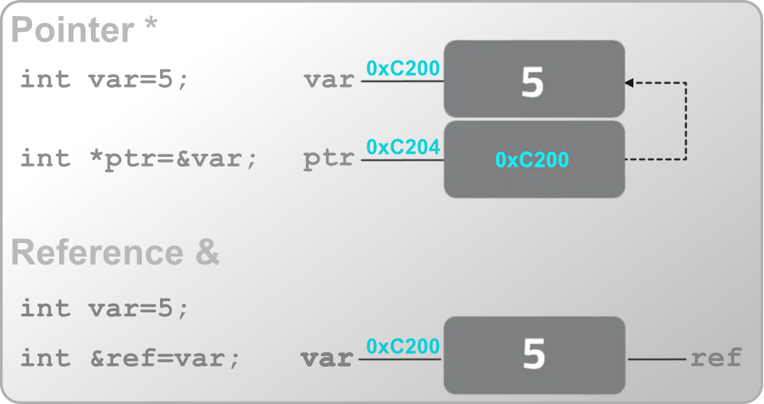

<!--
Audience: experienced systems programmers, same as the C++ and Rust chapters.
This is a LANGUAGE chapter, not an embedded/DSP chapter. Embedded material now
lives in the Applied DSP notebook; where embedded C genuinely diverges, mark it
with a brief callout and do NOT elaborate. Mirror cpp.qmd's presentation order
and level of detail (Overview -> history -> philosophy -> concepts in dependency
order), anchoring to what the reader knows and contrasting with C++/Rust where
the comparison illuminates.
-->
## Overview
{width=2in style="float: left; padding: 0 2em 0 1em"}

<br/>**C** is a small, procedural systems language designed to be a portable alternative to assembly. It has no objects, no generics, no exceptions, no garbage collector, and no string type, and this poverty is the entire point: every construct in C maps to a handful of machine instructions you can predict without reading the generated code. That predictability is why C became the substrate the rest of computing is built on. Operating system kernels, language runtimes (CPython and the original Rust compiler among them), device drivers, and embedded firmware are overwhelmingly C, and a great many languages define their foreign function interface as "whatever C does."

C was written by Dennis Ritchie at Bell Labs between 1972 and 1973, for the purpose of rewriting Unix in something other than PDP-11 assembly. That origin explains most of the language. C is not a design that anticipated general-purpose programming; it is a tool that had one job, was good enough at it that Unix went with it, and inherited a universe by accident. Nearly every wart in the language, and nearly every strength, traces back to that: a small team solving an immediate problem on a machine with 64KB of memory, with no reason to believe the result would outlive the hardware.

::: {style="clear: both"}

:::

::: {.callout-note title="C is not C++"}
It is tempting to think of C as "C++ without the classes," but the two are distinct languages with distinct philosophies. C is small, procedural, and deliberately close to the machine: what you write is roughly what the hardware does. C++ layers on classes, templates, RAII, exceptions, and a large standard library, trading C's transparency for expressive power. Much valid C is also valid C++, but the reverse is far from true, and idiomatic code in each language looks nothing like the other. This chapter is strictly about C; C++ warrants [its own treatment](cpp.qmd).
:::

### A Short History of the Standard
C is old, and it has evolved. Code you encounter in the wild may target any one of several standards, and knowing which is which explains why some features are present in one codebase and absent in another. Each revision was largely additive and backward-compatible, so newer compilers still happily compile decades-old code. This is a sharp contrast with C++, which had a genuine inflection at C++11 that split the language into "classic" and "modern" dialects. C never had such a break; C89 code is still idiomatic C today, for better and for worse.

| Standard         | Year | Common name | What it introduced                                                                                                                                                             |
|:-----------------|:----:|:-----------:|:-------------------------------------------------------------------------------------------------------------------------------------------------------------------------------|
| K&R C            | 1978 | "K&R"       | The original language from Kernighan & Ritchie's book. No function prototypes; loose typing.                                                                                   |
| ANSI C / ISO C90 | 1989 | C89 / C90   | The first standard. Function prototypes, the standard library, `void`, `const`, `volatile`. The lowest common denominator; still the baseline many embedded toolchains assume. |
| C99              | 1999 | C99         | `//` line comments, `stdint.h` fixed-width types, `bool` (`stdbool.h`), `inline`, designated initializers, variable-length arrays, mixed declarations and code, `long long`.   |
| C11              | 2011 | C11         | `_Static_assert`, `_Generic`, atomics (`stdatomic.h`), threads (`threads.h`), anonymous structs/unions.                                                                        |
| C17 / C18        | 2017 | C17         | A bug-fix release. No new features; clarifications only.                                                                                                                       |
| C23              | 2023 | C23         | `true`/`false`/`bool` as keywords, `nullptr`, `constexpr`, binary literals (`0b1010`), `#embed`, `typeof`.                                                                     |

::: {.callout-note title="You are probably writing C99 already"}
Several conveniences this chapter uses are C99 features, not original C: the fixed-width types `int16_t`/`uint8_t` (from `<stdint.h>`), `//` comments, declaring a loop variable inside `for`, and declaring variables partway through a function rather than only at the top of a block. If a codebase forbids these, it is targeting C89, which is still common in conservative or safety-critical work. Compilers select a standard with a flag such as `-std=c99` or `-std=c11`.
:::

### The C Philosophy
::: {.subheading}
Trust the programmer
:::

C's design commitments were codified after the fact, in the rationale document accompanying the C89 standard. They read less like a language philosophy than a set of refusals:

> **Trust the programmer.** Don't prevent the programmer from doing what needs to be done. Keep the language small and simple. Provide only one way to do an operation. Make it fast, even if it is not guaranteed to be portable.

The first of these defines the language, and it is the one that has aged worst. C does not check array bounds, does not track object lifetimes, does not distinguish a pointer to one object from a pointer to an array of them, and will let you read uninitialized memory without comment. Every one of those omissions is a deliberate decision to skip a runtime check that would cost cycles. The result is a language with no runtime overhead and no safety net, which was a defensible trade in 1973 on a machine with 64KB of memory, and which is the direct cause of a large fraction of the memory-safety vulnerabilities of the last four decades. Microsoft and Google have each reported that roughly 70% of their severe security bugs are memory-safety issues in C and C++. This is not a knock on the language so much as the bill arriving for a choice made when the threat model was "the other person with an account on this PDP-11."

"Keep the language small" C genuinely honored. There are 32 keywords in C89 and only a handful more since, against roughly 90 in C++. The grammar fits on a few pages; the standard library fits in an afternoon. What does *not* fit in an afternoon is **undefined behavior**, which is the price of the other commitments. Where a safer language would define a wrong answer, C declines to define anything at all, which frees the compiler to assume the situation never arises and optimize on that assumption. This is simultaneously the source of C's speed and of its most surprising bugs, and it gets [its own section](#undefined-behavior) below.

The last commitment, one way to do an operation, is why C feels sparse next to its descendants. There is no overloading, so `abs`, `labs`, and `fabs` are three separate functions. There are no generics, so a generic container is a `void*` and an element size. There are no namespaces, so library authors prefix every public symbol by hand, which is why you see `pthread_mutex_lock` and `png_read_info`. C++ and Rust each grew, in part, from a judgment that these particular economies cost more than they saved.

::: {.callout-note title="The virtue of a language you can hold in your head"}
It is easy to read the list above as a catalogue of deficiencies, and much of it is. But the same smallness is why C remains the lingua franca. A language with no runtime, no name mangling, and a trivial calling convention is one that every other language can call into and every platform can host. C is the interoperability layer of computing precisely because there is so little of it to disagree about.
:::

### The 32 Keywords
The original ANSI C standard defined **32 keywords**. These are reserved words that cannot be used as identifiers. They form the skeleton of the language:

| Data Types | Control Flow                | Storage Classes | Other      |
|:-----------|:----------------------------|:----------------|:-----------|
| `char`     | `if`, `else`                | `auto`          | `const`    |
| `int`      | `switch`, `case`, `default` | `extern`        | `volatile` |
| `short`    | `for`, `do`, `while`        | `register`      | `void`     |
| `long`     | `break`, `continue`         | `static`        | `sizeof`   |
| `float`    | `goto`                      | `typedef`       | `enum`     |
| `double`   | `return`                    |                 | `struct`   |
| `signed`   |                             |                 | `union`    |
| `unsigned` |                             |                 |            |

Later standards added a few more, nearly all spelled with a leading underscore and capital letter so they could not collide with existing identifiers: `_Bool`, `inline`, and `restrict` (C99); `_Static_assert`, `_Generic`, `_Atomic`, `_Noreturn`, `_Alignas`, and `_Alignof` (C11). C23 finally promoted several to ordinary spellings, making `bool`, `true`, `false`, `static_assert`, and `constexpr` keywords in their own right.

Two of the original 32 are effectively dead. `auto` meant "automatic storage duration," which is the default for every local variable, so no one ever wrote it; C++11 recycled the keyword for type deduction, and C23 followed. `register` was a hint to keep a variable in a CPU register, and modern optimizers make far better allocation decisions than a human annotation can, so compilers now ignore it. Its one surviving effect is that you cannot take the address of a `register` variable.

## Types and Declarations
C's types are a thin veneer over what the hardware provides. There are no classes, no strings as a first-class type, and no built-in containers: just numbers, characters (which *are* small numbers), and aggregates you build yourself.

### The Arithmetic Types
The integer types are defined by *minimum* width, not exact width. The standard guarantees a lower bound; the actual size is implementation-defined and depends on the target architecture.

| Type        | Typical size | Guaranteed minimum | Notes                                                                              |
|:------------|:-------------|:-------------------|:-----------------------------------------------------------------------------------|
| `char`      | 1 byte       | 1 byte             | Signedness is implementation-defined; may be signed or unsigned.                   |
| `short`     | 2 bytes      | 16 bits            |                                                                                    |
| `int`       | 2 or 4 bytes | 16 bits            | The "natural" word size; 16-bit on some embedded targets, 32-bit on most desktops. |
| `long`      | 4 or 8 bytes | 32 bits            |                                                                                    |
| `long long` | 8 bytes      | 64 bits            | C99.                                                                               |
| `float`     | 4 bytes      | (n/a)              | Single-precision [floating point](glossary.qmd#floating-point-numbers).            |
| `double`    | 8 bytes      | (n/a)              | Double-precision.                                                                  |

Each integer type has a `signed` (default) and `unsigned` variant. This portability of *minimums* rather than *exact sizes* is exactly why C99 introduced fixed-width types.

### Fixed-Width Types
::: {.subheading}
`<stdint.h>`
:::

When you need to know precisely how wide an integer is (essential when a value maps to a hardware register or a wire format), reach for the fixed-width types. These are the types this chapter uses throughout.

```c
#include <stdint.h>

int8_t   a;   // exactly 8 bits, signed
uint8_t  b;   // exactly 8 bits, unsigned
int16_t  c;   // exactly 16 bits, signed
uint32_t d;   // exactly 32 bits, unsigned

// Also available:
//   int_least16_t  : smallest type with at least 16 bits
//   int_fast16_t   : fastest type with at least 16 bits
//   intptr_t       : an integer wide enough to hold a pointer
```

Prefer `int16_t` over `short` and `uint8_t` over `unsigned char` whenever the exact width matters. The intent is explicit and the code behaves identically across targets.

### `sizeof`
`sizeof` yields the size of a type or object in bytes, evaluated at *compile time*. It is an operator, not a function, and its result has type `size_t` (an unsigned type wide enough to describe any object's size).

```c
sizeof(int)         // e.g. 4
sizeof(uint16_t)    // 2
int16_t buf[64];
sizeof(buf)         // 128 (64 elements at 2 bytes), NOT the pointer size
sizeof(buf) / sizeof(buf[0])   // 64: the idiom for array length
```

That last idiom is the canonical way to compute an array's element count. Note it only works on a true array in scope, not on a pointer (a distinction developed in [Arrays and Pointers](#arrays-and-pointers)).

### `bool`
C had no Boolean type until C99, which added `bool`, `true`, and `false` via `<stdbool.h>`. Before that, and still in much older code, any integer serves: zero is false, any non-zero value is true.

```c
#include <stdbool.h>

bool ready = true;
if (ready) { /* ... */ }

// Pre-C99 style, still valid and common:
int flag = 1;
if (flag) { /* ... */ }
```

C23 finally makes `bool`, `true`, and `false` proper keywords, so the `<stdbool.h>` include becomes unnecessary.

### `enum` {#enum}
An `enum` defines a set of named integer constants. By default they count up from zero, but any member may be assigned explicitly.

```c
typedef enum {
    STATE_IDLE,        // 0
    STATE_RUNNING,     // 1
    STATE_ERROR = 10,  // 10 (explicit)
    STATE_HALTED       // 11 (continues from previous)
} State_t;
```

Unlike C++'s `enum class`, C enums are not type-safe: they are interchangeable with `int`, and nothing stops you assigning `STATE_IDLE` to an unrelated integer variable. They exist chiefly to give names to magic numbers and to make `switch` statements self-documenting.

### `typedef`
`typedef` creates an alias for an existing type. It introduces no new type, only a new name, but that name can dramatically improve readability, particularly for structs and function pointers.

```c
typedef unsigned char byte;      // 'byte' now means 'unsigned char'
typedef struct Point Point;      // avoid writing 'struct Point' everywhere
typedef int (*Comparator)(int, int);  // a name for a function-pointer type
```

The `_t` suffix (as in `int16_t`, `size_t`, `State_t`) is a widespread convention marking a type name. Strictly, POSIX reserves `_t` for future additions to its own headers, so a name you invent today could in principle collide with a standard one tomorrow. In practice the convention is near-universal and the risk is small; this chapter uses it throughout. Projects that care about strict portability sidestep it with a project prefix instead, such as `dsp_state_t` or `AudioState`.

### Reading Declarations
C's declaration syntax is famously puzzling, and the reason is a single design principle: *"declaration mirrors use."* A declaration is written to look like the expression that retrieves a value of the base type. `int *p` declares `p` such that the expression `*p` is an `int`; `int a[10]` declares `a` such that `a[0]` is an `int`. Most languages instead name the type first and the identifier second (`int[10] a`), which reads more easily but does not compose the way C's form does.

One consequence of that design bites immediately. **The `*` binds to the name, not to the type.** In a declaration of several names, each pointer needs its own `*`:

```c
int* a, b;   // MISLEADING: a is a pointer, but b is a plain int
int *a, *b;  // both are pointers
```

This is why C programmers conventionally write the `*` against the name rather than against the type, even though `int* a;` and `int *a;` are identical to the compiler. The second spelling makes the binding visible and the trap above unlikely.

The principle scales to genuinely hairy declarations involving pointers, arrays, and functions in combination, which is a topic that needs pointers first. It resumes under [Pointer Declarations and Qualifiers](#pointer-declarations).

### Type Qualifiers
A *type qualifier* constrains how a type may be used without changing its size or representation. C has three, and they answer three unrelated questions. It helps to keep them mentally distinct from the outset, because they are otherwise easy to lump together as "extra keywords near the type."

| Qualifier  | Question it answers                         | Meaning                                                                                 | Developed under                                              |
|:-----------|:--------------------------------------------|:----------------------------------------------------------------------------------------|:-------------------------------------------------------------|
| `const`    | *May I change this?*                        | The object must not be modified through this name after initialization.                 | here, and [with pointers](#pointer-declarations)             |
| `volatile` | *May the compiler assume this is stable?*   | The object may change outside the program's control; every access must actually happen. | [Optimization Levels](#optimization-levels)                  |
| `restrict` | *Might two pointers touch the same memory?* | A promise that this pointer is the only route to the data it points at.                 | [Pointer Declarations and Qualifiers](#pointer-declarations) |

Only `const` applies meaningfully to an ordinary value, so it is the only one this section develops. `volatile` is best understood as a barrier against specific optimizations, and `restrict` applies to pointers exclusively; both wait for the sections above.

#### `const`
`const` is a promise about a *name*, not a guarantee about *storage*. It tells the compiler that the object must not be modified through this particular identifier, which lets the compiler both diagnose violations and optimize on the assumption that no such violation occurs.

```c
const int sample_rate = 48000;
sample_rate = 44100;              // error: assignment of read-only variable
```

The payoff is small on a lone value like this one and large on interfaces, where `const` documents the direction of data flow and the compiler enforces it. That use involves pointers, so it is developed [with them](#pointer-declarations).

::: {.callout-warning title="`const` is not `constexpr`"}
A `const` object is *read-only*, not a *compile-time constant*. In C, `const int n = 10;` does not produce a constant expression, so `int arr[n];` declares a variable-length array (C99) rather than a fixed-size one, and the same declaration is invalid outright at file scope. This differs from C++, where `const int n = 10;` *is* usable as a constant expression. For genuine compile-time constants, C offers `#define`, the enum trick (`enum { Size = 10 };`), or, as of C23, `constexpr`.
:::

Casting away `const` and then writing through the result is undefined behavior if the underlying object was itself declared `const`. The cast compiles, the write may even appear to work, and the compiler remains free to have cached the old value or placed the object in genuinely read-only memory. If a function needs to write, do not lie about it in the signature.

::: {.callout-note title="`const` and read-only memory"}
`const` is what *permits* a toolchain to place data in read-only storage, not a guarantee that it will. On hosted systems, `const` file-scope data typically lands in a read-only segment (`.rodata`) that the OS marks non-writable. On embedded targets the placement rules are toolchain-specific and usually require explicit attributes or pragmas. The Applied DSP notes cover the specifics for that toolchain.
:::

## Expressions and Control Flow
C's control flow is the ancestor of the C-family syntax found in C++, Java, JavaScript, and beyond. Little here will surprise a C++ reader; the notes below flag the C-specific edges.

### Operators and Precedence
::: {.subheading}
One symbol per operation, and the order they bind in
:::

C has a large operator set for a small language, and the reason is the "one way to do an operation" commitment. With no overloading, every distinct operation needs its own symbol: three different absolute-value functions, and separate operators for logical and bitwise AND. What follows is not a tour of the obvious ones; addition and comparison work as you expect. It is the handful of places where C's operators behave differently from the intuition a reader brings from elsewhere.

The families are conventional: **arithmetic** (`+ - * / %`), **relational** (`< <= > >= == !=`), **logical** (`&& || !`), **bitwise** (`& | ^ ~ << >>`), and **assignment** (`=` and its compound forms). Four operators sit outside those groups: `sizeof`, the cast `(type)`, the ternary `?:`, and the comma.

#### Logical vs. Bitwise
The most consequential distinction in the section, and the one that produces the quietest bugs. `&&` and `||` are **logical**: they treat operands as true/false and produce `0` or `1`. `&` and `|` are **bitwise**: they combine operands bit by bit and produce a full-width integer.

They frequently agree by accident. With operands that are already `0` or `1`, `a && b` and `a & b` give the same answer, which lets a substitution survive testing. They diverge as soon as the operands are arbitrary integers: `2 && 1` is `1`, while `2 & 1` is `0`.

The deeper difference is not the result but the **evaluation**. `&&` and `||` *short-circuit*: if the left operand settles the answer, the right operand is never evaluated at all. This is a guarantee in the standard, not an optimization, which is what makes the null-check idiom safe:

```c
if (p != NULL && p->length > 0) { /* ... */ }
```

If `p` is null, `p->length` is never evaluated and the dereference never happens. Write `&` there instead and both sides are always evaluated, so a null `p` is dereferenced and the program has undefined behavior. The same guarantee underpins the guard-then-use pattern generally:

```c
if (index < count && data[index] != 0) { /* ... */ }   // bounds check first
if (denominator == 0 || total / denominator > 1) { /* ... */ }  // no divide by zero
```

Because short-circuiting suppresses evaluation, an operand with side effects may simply not happen. `if (ready() && start())` does not call `start` when `ready` returns false, which is usually the point, and occasionally a surprise when someone relied on the call.

#### Compound Assignment
`x += 1` is shorthand for `x = x + 1`, and every binary arithmetic and bitwise operator has a compound form (`-= *= /= %= &= |= ^= <<= >>=`). The shorthand is not purely cosmetic: the standard guarantees the left operand is evaluated **exactly once**. That matters the moment the target is anything more complicated than a variable:

```c
arr[next_index()] += 1;              // next_index() is called once
arr[next_index()] = arr[next_index()] + 1;   // called twice, on possibly different slots
```

The two lines are not equivalent, and the second is a bug waiting for `next_index` to acquire a side effect.

#### The Comma Operator
The comma evaluates its left operand, discards the result, then evaluates and yields its right. It is the lowest-precedence operator in C and is genuinely rare in practice, appearing mostly where the grammar allows one expression but you want two: the header of a `for` loop, or a macro that must do two things in a single expression.

```c
for (int i = 0, j = n - 1; i < j; i++, j--) { /* ... */ }
```

Note that the `int i = 0, j = n - 1` part is *not* the comma operator; that is the declaration syntax separating two declarators. Only `i++, j--` is the operator. This ambiguity of the same punctuation meaning different things in different contexts is one more reason the comma operator stays uncommon.

#### Integer Division and Modulo
Integer division truncates toward zero, and `%` takes its sign from the *dividend*:

```c
 7 / 2   //  3
-7 / 2   // -3   (truncated toward zero, not floored to -4)
 7 % 2   //  1
-7 % 2   // -1   (sign follows the left operand)
```

C99 pinned this down; before it, the rounding direction for negative operands was implementation-defined. Readers coming from Python should note the difference carefully: Python floors, so `-7 // 2` is `-4` and `-7 % 2` is `1`. Code that computes a wrapping index with `%` on a possibly-negative value therefore behaves differently in the two languages, and in C can produce a negative subscript.

#### The Precedence Table
Precedence decides which operator claims an operand when two compete; associativity decides the grouping when operators of equal precedence sit side by side. The table below is the full ordering, tightest binding first.

::: {.highlight}
| Precedence | Operator      | Description                                       | Associativity |
|:----------:|:-------------:|---------------------------------------------------|---------------|
| 1          | `()`          | Parentheses (function call)                       | Left-to-Right |
|            | `[]`          | Array Subscript (Square Brackets)                 | Left-to-Right |
|            | `.`           | Dot Operator                                      | Left-to-Right |
|            | `->`          | Structure Pointer Operator                        | Left-to-Right |
|            | `++` , `--`   | Postfix increment, decrement                      | Left-to-Right |
| 2          | `++`, `--`    | Prefix increment, decrement                       | Right-to-Left |
|            | `+`, `-`      | Unary plus, minus                                 | Right-to-Left |
|            | `!` , `~`     | Logical NOT,  Bitwise complement                  | Right-to-Left |
|            | `(type)`      | Cast Operator                                     | Right-to-Left |
|            | `*`           | Dereference Operator                              | Right-to-Left |
|            | `&`           | Address-of Operator                               | Right-to-Left |
|            | `sizeof`      | Determine size in bytes                           | Right-to-Left |
| 3          | `*`, `/`, `%` | Multiplication, division, modulus                 | Left-to-Right |
| 4          | `+`, `-`      | Addition, subtraction                             | Left-to-Right |
| 5          | `<<`, `>>`    | Bitwise shift left, Bitwise shift right           | Left-to-Right |
| 6          | `<`, `<=`     | Relational less than, less than or equal to       | Left-to-Right |
|            | `>` , `>=`    | Relational greater than, greater than or equal to | Left-to-Right |
| 7          | `==`, `!=`    | Relational is equal to, is not equal to           | Left-to-Right |
| 8          | `&`           | Bitwise AND                                       | Left-to-Right |
| 9          | `^`           | Bitwise exclusive OR                              | Left-to-Right |
| 10         | `|`           | Bitwise inclusive OR                              | Left-to-Right |
| 11         | `&&`          | Logical AND                                       | Left-to-Right |
| 12         | `||`          | Logical OR                                        | Left-to-Right |
| 13         | `?:`          | Ternary conditional                               | Right-to-Left |
| 14         | `=`           | Assignment                                        | Right-to-Left |
|            | `+=`, `-=`    | Addition, subtraction assignment                  | Right-to-Left |
|            | `*=`, `/=`    | Multiplication, division assignment               | Right-to-Left |
|            | `%=`, `&=`    | Modulus, bitwise AND assignment                   | Right-to-Left |
|            | `^=`, `|=`    | Bitwise exclusive, inclusive OR assignment        | Right-to-Left |
|            | `<<=`, `>>=`  | Bitwise shift left, right assignment              | Right-to-Left |
| 15         | `,`           | comma (expression separator)                      | Left-to-Right |
:::

Two rows in that table are worth committing to memory, because they are where the ordering violates intuition.

1. The bitwise operators (8, 9, 10) bind more loosely than the comparisons (6, 7), so `flags & MASK == ENABLED` parses as `flags & (MASK == ENABLED)`, which is almost never the intent.
2. The shifts (5) bind more loosely than arithmetic (3, 4), so `1 << n + 1` is `1 << (n + 1)`.

Ritchie later acknowledged the bitwise precedence as a mistake, kept only because code already depended on it. Parenthesize both cases; see [Operator Precedence Surprises](#operator-precedence-surprises) for the practical fallout.

::: {.callout-warning title="Precedence is not evaluation order"}
The table says how an expression *groups*, not the sequence in which its parts run. In `f() + g()`, precedence guarantees the addition happens last, and says nothing about whether `f` or `g` is called first; the compiler may choose either. This is why an expression that both reads and modifies the same object without an intervening **sequence point** is undefined behavior, not merely unpredictable:

```c
i = i++ + 1;      // undefined behavior
f(i, i++);        // undefined behavior: unsequenced read and modification
arr[i] = i++;     // undefined behavior
```

`&&`, `||`, `?:`, and the comma operator *do* impose sequencing, which is exactly why the short-circuit idioms above are safe. Everything else, including function arguments, does not. See [Undefined Behavior](#undefined-behavior) for why "it seems to work" is not evidence here.
:::

What the bitwise operators actually compute, along with the set/clear/toggle idioms built from them, is covered under [Bitwise Operations](#bitwise-operations) once pointers and memory layout are on the table.

### Conditionals
```c
if (x > 0) {
    positive();
} else if (x < 0) {
    negative();
} else {
    zero();
}
```

C has no dedicated Boolean context: the condition is simply an integer expression, and any non-zero value is "true." This is why `if (ptr)` (is the pointer non-null?) and `if (count)` (is the count non-zero?) are idiomatic.

The ternary operator `?:` is an expression, useful where a full `if` would be clumsy:

```c
int max = (a > b) ? a : b;
```

### Loops
The three loop forms:

```c
for (int i = 0; i < n; i++) { /* ... */ }   // declaring i here is C99

while (condition) { /* ... */ }

do {
    /* runs at least once */
} while (condition);
```

`break` exits the enclosing loop; `continue` skips to the next iteration. Both act only on the innermost loop.

### `switch`
`switch` selects among integer cases. Its defining and dangerous characteristic is *fall-through*: without a `break`, control flows into the next case.

```c
switch (state) {
    case STATE_IDLE:
        start();
        break;              // without this, execution falls into STATE_RUNNING
    case STATE_RUNNING:
        process();
        break;
    default:
        handle_unknown();
        break;
}
```

Fall-through is occasionally useful (letting several cases share code), but far more often it is an accidental missing `break`. This footgun is revisited in [Common Pitfalls](#undefined-behavior).

### `goto` {#goto}
C retains `goto`, and although structured programming rightly discourages it, one use is genuinely idiomatic in C: unwinding on error in a function with several acquisition steps. Since C has no destructors or `finally`, `goto` provides a single, orderly cleanup path.

```c
int setup(void) {
    if (acquire_a() != 0) goto fail_a;
    if (acquire_b() != 0) goto fail_b;
    if (acquire_c() != 0) goto fail_c;

    return 0;  // success

fail_c: release_b();
fail_b: release_a();
fail_a:
    return -1;
}
```

This "cleanup ladder" is common in systems code (the Linux kernel uses it heavily). Outside error handling, prefer structured control flow.

## Functions
A function in C has a *declaration* (its prototype, announcing name, return type, and parameter types) and a *definition* (the body). Declarations typically live in header files; definitions live in `.c` files. Callers need only the declaration to generate a correct call.

```c
// Declaration (prototype), usually in a .h file
int add(int a, int b);

// Definition, in a .c file
int add(int a, int b) {
    return a + b;
}
```

::: {.callout-warning title="Always write prototypes"}
A function used before the compiler has seen a declaration is, in old C, assumed to return `int` with unchecked arguments. This "implicit declaration" is a rich source of bugs and is an error in C99 and later. Declare every function before use, and write `void` explicitly for an empty parameter list: `int get_value(void)`. An empty `()` in C means "unspecified arguments," *not* "no arguments"; another trap C++ does not share.
:::

### Parameter Passing
**C is pass-by-value, always.** A function receives *copies* of its arguments. Assigning to a parameter changes only the local copy; the caller's variable is untouched.

```c
void increment(int x) {
    x++;  // modifies the local copy only
}

int n = 5;
increment(n);   // n is still 5
```

To let a function modify a caller's variable, you pass a *pointer* to it. This is C's only mechanism for "pass by reference", and it is explicit at both the call site (`&n`) and in the signature (`int *`):

```c
void increment(int *x) {
    (*x)++;   // dereference, then modify what it points to
}

int n = 5;
increment(&n);  // pass the address of n
// n is now 6
```

Arrays are the one apparent exception, but only apparent: an array argument *decays* to a pointer to its first element, so the function receives an address, not a copy of the array. This is why a function cannot know an array's length from the parameter alone, and why length is nearly always passed as a separate argument.

### Storage Class and Linkage {#static}
::: {.subheading}
Where data lives, and who can see it
:::

Where a type qualifier constrains *what may be done* with an object, a **storage-class specifier** governs its *lifetime* (how long the object exists) and its *linkage* (which translation units can refer to it by name). These are independent axes, and conflating them is a common source of confusion, particularly the overloaded `static`.

| Specifier  | Lifetime          | Linkage at file scope | Notes                                                      |
|:-----------|:------------------|:----------------------|:-----------------------------------------------------------|
| (none)     | Automatic (local) | External (global)     | The default. Locals die at scope exit; globals are shared. |
| `static`   | Whole program     | Internal (this file)  | Two distinct meanings, depending on scope. See below.      |
| `extern`   | Whole program     | External              | A *declaration* of something defined elsewhere.            |
| `auto`     | Automatic         | (n/a)                 | The default for locals; vestigial, never written.          |
| `register` | Automatic         | (n/a)                 | Ignored by modern compilers; blocks taking the address.    |

#### The Three Faces of `static`
`static` is the most overloaded keyword in C, meaning materially different things depending on where it appears.

**On a local variable, it changes lifetime.** The variable is initialized once, before `main` runs, and retains its value between calls. Its *scope* is still the function; only its lifetime changes.

```c
void count_calls(void) {
    static int count = 0;  // initialized once, at program start
    count++;
    printf("Called %d times\n", count);
}
```

**On a file-scope variable, it changes linkage.** The name becomes private to its translation unit, invisible to the linker and therefore to every other `.c` file.

```c
// audio.c
static int16_t internal_buffer[256];   // not visible outside audio.c
```

**On a function, it does the same.** The function becomes private to the file, which also lets the compiler inline or specialize it more aggressively, since it can see every call site.

```c
static void helper(void) { /* internal, not part of the public API */ }
```

The second and third uses are C's only form of encapsulation. With just two levels of visibility, private-to-file and global-to-program, every library must defensively prefix its public names, which is why C APIs are full of identifiers like `SDL_CreateWindow` and `pthread_mutex_lock`. C++ [namespaces](cpp.qmd#namespaces) exist to solve exactly this.

::: {.callout-warning title="`static` locals are not reentrant"}
A `static` local is shared by every invocation of the function, including recursive calls and calls from different threads or interrupt handlers. A function with `static` state is neither reentrant nor thread-safe, and the resulting bugs are timing-dependent and miserable to reproduce. This is the reason `strtok` has a `strtok_r` variant.
:::

#### `extern` and the Definition/Declaration Split
`extern` declares that a name exists somewhere else, letting the compiler type-check uses of it without allocating storage. The canonical pattern puts the declaration in a header and the definition in exactly one `.c` file:

```c
// config.h
extern int sample_rate;      // declaration: "this exists somewhere"

// config.c
int sample_rate = 48000;     // definition: allocates the storage
```

Putting the definition in the header instead means every file that includes it defines the same symbol, and the linker rejects the duplicates. This is C's version of the One Definition Rule, enforced by the linker rather than the language.

### Function Pointers
::: {.subheading}
Callbacks and dispatch tables
:::

**Function pointers** store the address of a function, enabling callbacks and runtime dispatch. They are C's only mechanism for polymorphism, and they are how `qsort` accepts a comparison, how a driver registers a handler, and how a virtual method table works underneath C++.

```c
// A name for the signature, which makes everything downstream readable
typedef void (*ProcessFunc_t)(int16_t *buffer, int length);

void echo_effect(int16_t *buf, int len)       { /* ... */ }
void reverb_effect(int16_t *buf, int len)     { /* ... */ }
void distortion_effect(int16_t *buf, int len) { /* ... */ }

ProcessFunc_t current_effect = echo_effect;

void process_block(int16_t *buffer, int length) {
    current_effect(buffer, length);   // call through the pointer
}
```

A **dispatch table** replaces a `switch` with an array lookup, which keeps the selection logic and the handler list in one place:

```c
static const ProcessFunc_t effect_table[] = {
    echo_effect,
    reverb_effect,
    distortion_effect
};

#define EFFECT_COUNT (sizeof(effect_table) / sizeof(effect_table[0]))

void set_effect(size_t n) {
    if (n < EFFECT_COUNT) {
        current_effect = effect_table[n];
    }
}
```

### Variadic Functions
::: {.subheading}
Accepting an unknown number of arguments, and the price of doing so
:::

A **variadic** function accepts a variable number of arguments, declared with `...` after at least one named parameter. `printf` is the one everybody has used; this section explains how it works, which retroactively explains why its first argument is a format string rather than a convenience.

#### The Mechanism
The machinery lives in `<stdarg.h>` and consists of one type and four macros: `va_list` holds the traversal state, `va_start` initializes it, `va_arg` retrieves the next argument, and `va_end` releases it.

```c
#include <stdarg.h>

int sum_ints(int count, ...) {
    va_list args;
    va_start(args, count);        // 'count' is the last *named* parameter

    int total = 0;
    for (int i = 0; i < count; i++) {
        total += va_arg(args, int);   // you must state the type
    }

    va_end(args);                 // required; may free resources on some ABIs
    return total;
}

sum_ints(3, 10, 20, 30);   // 60
```

Three obligations are visible in that code, and all three are on you rather than the compiler. `va_start` needs the last named parameter, which is why a variadic function cannot be *entirely* variadic. `va_arg` needs the type of each argument, because nothing in the call conveys it. And the loop needs to know when to stop, which is why `count` is passed explicitly.

That last point is the crux: **nothing about the variable arguments is available at run time.** Not their count, not their types. The values are placed in registers and on the stack according to the ABI, and the callee reads them back by asserting what it expects to find. Get the assertion wrong and you have not made a type error; you have misread raw memory.

A function needing to walk the list twice must copy it first, since a `va_list` may not be reusable after traversal:

```c
va_list copy;
va_copy(copy, args);   // C99
```

#### Why `printf` Takes a Format String
Now `printf`'s design reads as a consequence rather than a convention. The function receives some bytes and no description of them, so the caller must supply that description out-of-band. The format string *is* the type information, transmitted as data:

```c
printf("%s scored %d\n", name, score);
//      ^^        ^^ these tell printf to expect a char* then an int
```

Each conversion specifier tells `printf` which type to hand `va_arg` next. This is why a mismatch is dangerous rather than merely wrong. `printf("%s", 42)` instructs the function to interpret the integer `42` as a pointer and dereference it, which is a segfault at best and an information leak at worst. `printf("%d")` with no argument reads whatever happens to occupy the next argument slot. Neither is a diagnosable type error in the language; both are undefined behavior.

The specifiers themselves are catalogued with the rest of `<stdio.h>` under [Input and Output](#io).

#### Default Argument Promotions
Arguments passed through `...` undergo the **default argument promotions** before the callee sees them:

- `float` is promoted to `double`.
- Integer types narrower than `int` (`char`, `short`, `_Bool`) are promoted to `int`.

The consequence is that certain `va_arg` requests are always wrong, no matter what the caller wrote:

```c
va_arg(args, char)     // WRONG: a char argument arrived as an int
va_arg(args, float)    // WRONG: a float argument arrived as a double
va_arg(args, int)      // correct for char, short, and int alike
va_arg(args, double)   // correct for both float and double
```

This is also why `printf` has no separate specifier for `float`: `%f` handles both, because a `float` can never actually reach it. Conversely, types *wider* than `int` are not promoted, so `long` and `int64_t` need their own specifiers (`%ld`, and the macros in `<inttypes.h>` for fixed-width types).

#### Forwarding
::: {.subheading}
the `v` Variants
:::

Wrapping `printf` is a common need, and it cannot be done by passing `...` along, because there is no syntax for expanding it. The standard library therefore provides a `v`-prefixed variant of each formatted-output function (`vprintf`, `vfprintf`, `vsnprintf`) that takes an already-started `va_list` instead of `...`:

```c
void log_error(const char *fmt, ...) {
    va_list args;
    va_start(args, fmt);

    fprintf(stderr, "[ERROR] ");
    vfprintf(stderr, fmt, args);   // hand the list to the real formatter
    fprintf(stderr, "\n");

    va_end(args);
}
```

This is the standard shape for any logging or diagnostic wrapper, and `vsnprintf` is the bounded version to reach for when writing into a fixed buffer.

::: {.callout-warning title="Variadic functions defeat the type system"}
A variadic call is one of the few places where C performs no argument checking whatsoever. The compiler cannot verify count or types, because the contract lives in a string it is not obliged to read. The practical mitigation is the `format` attribute described under [Compiler Attributes](#compiler-attributes), which asks GCC and Clang to parse the format string and check the arguments against it:

```c
__attribute__((format(printf, 1, 2)))
void log_error(const char *fmt, ...);
```

With that in place, `log_error("%s", 42)` becomes a compile-time warning. Apply it to every `printf`-style wrapper you write; it costs one line and recovers most of the safety the mechanism gives up.

C++ and Rust solve this at the root rather than patching it. C++ [variadic templates](cpp.qmd#variadic-templates) and Rust's `format!` macro both know each argument's static type at the call site, so formatting is checked by the compiler with no annotation and no run-time type assertions.
:::

## Pointers and Memory
Pointers are the feature that defines C. They are what let a 1972 language address hardware directly, and they are the reason so much of the language's danger is concentrated in one place.

### Pointers {#pointers}
A **pointer** is a variable that stores the memory address of another object. Two operators connect a value to its address: `&` (address-of operator) takes the address of an object, and `*` (dereference operator) **dereferences** an address to reach the object. Declaring a pointer also uses `*`, which is the "declaration mirrors use" principle at work: `int *ptr` declares `ptr` such that the expression `*ptr` is an `int`.

::: {.definition}
**Dereference** is using the asterisk `*` operator to access or modify the actual value stored at the memory address that the pointer holds. For a pointer to a pointer one uses `**` to dereference the value.
:::

{width=48% style="float: right; padding-left: 12px"}

```c
int var = 5;
int *ptr = &var;
*ptr = 10;                      // writes value through the pointer
printf("%d, %d\n", var, *ptr);  // 10, 10
```

That last pair of lines is the whole idea. `ptr` is a separate object with its own address and its own storage, holding a number that happens to be where `var` lives. Dereferencing follows the number.

A pointer's *type* is not decoration. Every pointer holds an address of the same width, but the type determines how many bytes a dereference reads, how those bytes are interpreted, and how arithmetic on the pointer scales. `char *` and `double *` on the same address see one byte and eight bytes respectively.

::: {style="clear: both;"}

:::

A **pointer to a pointer** stores the address of another pointer:

```c
int **pptr = &ptr;   // pptr holds the address of ptr
**pptr = 30;         // two hops: to ptr, then to var
```

This is what a function needs when it must modify the caller's *pointer* rather than the thing pointed at, which is exactly the case for an allocating function or an insertion at the head of a linked list. Passing `int *` lets you change the pointee; passing `int **` lets you change the pointer itself.

```c
void allocate_buffer(int **out, size_t count) {
    *out = malloc(count * sizeof **out);
}

int *buffer = NULL;
allocate_buffer(&buffer, 256);   // buffer now points at the allocation
```

Pointers underpin four things C could not otherwise do: dynamic memory allocation, efficient array traversal, letting a function modify its caller's variables, and building linked data structures.

::: {.callout-note title="`NULL` is a value, not a safety feature"}
`NULL` is C's "points at nothing" sentinel, but nothing in the type system distinguishes a pointer that might be null from one that cannot be. Every dereference is an act of faith, and a null dereference is undefined behavior. Rust's [`Option<T>`](rust-ho.qmd#option-t) and C++'s references exist to make that distinction visible to the compiler.

A pointer that is merely *uninitialized* is worse than one that is null, because it holds a plausible-looking garbage address that may not fault. Initialize pointers at declaration, to `NULL` if you have nothing better.
:::

#### Pointer Arithmetic
Adding an integer to a pointer does not add bytes. It advances by that many **elements**, scaling automatically by the size of the pointed-to type:

```c
int32_t values[4];
int32_t *p = values;

p + 1;   // advances 4 bytes (one int32_t), not 1
p + 3;   // advances 12 bytes
```

This is why the pointer's type matters and why `void *` (below) cannot participate. The scaling is what makes `p[i]` and `*(p + i)` equivalent, and it is why array traversal by pointer reads so cleanly:

```c
for (int32_t *cursor = values; cursor < values + 4; cursor++) {
    *cursor = 0;
}
```

Subtracting two pointers into the same array yields the number of *elements* between them, with type `ptrdiff_t` (from `<stddef.h>`):

```c
ptrdiff_t distance = &values[3] - &values[0];   // 3, not 12
```

The operations C permits are deliberately few: add an integer, subtract an integer, subtract two pointers, and compare two pointers. There is no pointer multiplication, and adding two pointers is meaningless and illegal.

::: {.callout-note title="One past the end is legal to form, illegal to dereference"}
The standard specifically allows computing the address one element past the end of an array, which is what makes `cursor < values + 4` well defined in the loop above. Dereferencing that address is undefined behavior, as is computing an address *two* past the end, or anywhere before the start. Arithmetic that wanders outside an array (plus that one boundary position) is undefined even if you never dereference the result, which is why the descending loop `for (p = end - 1; p >= start; p--)` is technically UB on its final decrement. Iterate forward, or compare with `!=` against a valid boundary.
:::

#### `void *`
A `void *` is a pointer to *unspecified* type: an address with the type information deliberately erased. It is C's mechanism for generic code, and it is why `malloc` can serve every type in the language:

```c
void *malloc(size_t size);
int  *numbers = malloc(10 * sizeof *numbers);   // converts implicitly
```

In C, `void *` converts to and from any object pointer type without a cast, which is what makes that line work. (C++ requires an explicit cast, one of the [small but pervasive differences](cpp.qmd#small-but-pervasive-differences) between the languages.)

Because the type is erased, two operations are unavailable: you cannot dereference a `void *`, and you cannot do arithmetic on it. The compiler has no size to work with. Convert to a typed pointer first.

The other classic use is a generic callback interface. `qsort` sorts anything because it knows only addresses and an element size, deferring all type knowledge to a comparison function you supply:

```c
int compare_ints(const void *a, const void *b) {
    int left  = *(const int *)a;    // cast back to the real type
    int right = *(const int *)b;
    return (left > right) - (left < right);   // avoids overflow of left - right
}

qsort(numbers, 10, sizeof numbers[0], compare_ints);
```

That round trip, erase the type to cross the interface and cast it back on the other side, is the closest thing C has to generics. It is also entirely unchecked: pass `compare_ints` to an array of `double` and the compiler is satisfied, while the program is not. [Templates](cpp.qmd#templates) in C++ and generics in Rust exist to make the same abstraction type-safe.

### Pointer Declarations and Qualifiers {#pointer-declarations}
::: {.subheading}
Where the declaration syntax earns its reputation
:::

[Reading Declarations](#reading-declarations) introduced C's guiding principle, that a declaration mirrors the expression which uses the value. With pointers in hand, that principle can be applied to the declarations people actually find impenetrable, and the two qualifiers that only make sense alongside a `*` can finally be explained.

#### The Spiral Rule
Start at the identifier and work outward, alternating right and left, until the tokens run out:

```c
int *ptr;              // ptr is a pointer to int
int arr[10];           // arr is an array of 10 ints
int *arr[10];          // arr is an array of 10 pointers to int
int (*arr)[10];        // arr is a pointer to an array of 10 ints
int (*fp)(int, int);   // fp is a pointer to a function taking two ints, returning int
```

The parentheses carry the whole distinction. `[]` and `()` bind tighter than `*`, so `int *arr[10]` groups as an array first and `int (*arr)[10]` forces the pointer to be read first. The two types are unrelated and not interchangeable.

#### Declaring a Pointer to a Function
The last line above is worth unpacking, because function pointers are where the syntax defeats most people and where a `typedef` stops being a nicety:

```c
int  *fp(int, int);    // a FUNCTION returning int*   (probably not what you meant)
int (*fp)(int, int);   // a POINTER to a function returning int
```

Without the parentheses, `()` binds tighter than `*` and you have declared a function. The parentheses around `*fp` force the pointer reading first. Everything else follows from that one grouping.

Assignment and calling are more forgiving than the declaration suggests, because a function name decays to a pointer much as an array name does:

```c
int add(int a, int b) { return a + b; }

int (*operation)(int, int) = add;    // '&add' also works, and means the same
int result = operation(2, 3);        // '(*operation)(2, 3)' also works
```

Both spellings are legal for each step, and the short forms are conventional. The declaration is the only place the syntax is genuinely awkward, which is why a `typedef` earns its place the moment such a type appears more than once:

```c
typedef int (*BinaryOp)(int, int);   // the alias reads left to right

BinaryOp operation = add;
void apply_all(BinaryOp op, const int *data, size_t count);   // now legible in signatures
```

The payoff compounds in return types. A function returning a function pointer is `int (*get_handler(int kind))(int, int)` written out, and `BinaryOp get_handler(int kind)` with the alias. Their use in dispatch tables and callbacks is covered under [Function Pointers](#function-pointers).

#### `const` Placement
Where `const` sits relative to the `*` changes what it qualifies:

```c
const int *p;        // pointer to const int: *p is read-only, p can be reassigned
int const *p;        // identical to the above
int *const p;        // const pointer to int: p is fixed, *p is writable
const int *const p;  // const pointer to const int: neither can change
```

The rule: `const` applies to whatever is immediately to its left, unless nothing is there, in which case it applies to the right. The `*` is the boundary. In `const int *p` the qualifier has nothing to its left, so it grabs `int`; in `int const *p` it has `int` to its left, so it grabs `int` again. Same type, written two ways. Only when `const` crosses to the *right* of the `*` does it qualify the pointer itself, because now the thing on its left is the pointer.

`const int *p` is by far the most common form, and it is the foundation of **const correctness**: a function that promises not to modify the data behind a pointer parameter says so in its signature.

```c
size_t count_zeros(const int16_t *data, size_t length);
//                 ^^^^^ promises not to write through data
```

This costs nothing at run time and buys three things: the compiler rejects accidental writes, callers holding `const` data can pass it without a cast, and a reader knows the direction of data flow from the prototype alone. Adopt it by default on pointer parameters you do not intend to write through.

::: {.callout-warning title="A `typedef` changes what `const` qualifies"}
Given `typedef int *int_ptr;`, the declaration `const int_ptr p` is **not** a pointer to const int. It is `int *const p`, a const pointer to a writable int. The qualifier applies to the aliased type as a whole, and that type is already "pointer to int," so `const` has nowhere to go but the pointer. This surprises nearly everyone the first time, and it is a good reason to be wary of typedefs that hide a `*`.
:::

#### `restrict`
Introduced in C99, `restrict` applies only to pointers. It is a promise *from you to the compiler* that, for the lifetime of the pointer, the data it points to will be accessed *only* through that pointer, or through pointers derived from it. No other pointer aliases the same memory.

Why does this matter? Consider scaling one buffer into another:

```c
void scale(int16_t *out, const int16_t *in, int n, int16_t gain) {
    for (int i = 0; i < n; i++) {
        out[i] = in[i] * gain;
    }
}
```

The compiler cannot assume `out` and `in` are separate. If they overlapped, writing `out[i]` might change a later `in[j]`, so the compiler must conservatively re-read `in` on every iteration and cannot vectorize or reorder freely. Adding `restrict` lifts that doubt:

```c
void scale(int16_t *restrict out, const int16_t *restrict in, int n, int16_t gain) {
    for (int i = 0; i < n; i++) {
        out[i] = in[i] * gain;
    }
}
```

This is precisely the kind of tight loop where the optimization pays off, which is why `restrict` shows up in numerical code and in the prototypes of library functions like `memcpy`, whose whole contract is that source and destination must not overlap.

::: {.callout-warning title="`restrict` is a promise you must keep"}
The compiler does not verify your claim. If you pass overlapping pointers to a `restrict` parameter, the behavior is undefined: the program may produce wrong results that appear only under optimization. Use `restrict` only when you are certain the regions are disjoint. When overlap is possible, use `memmove` rather than `memcpy`.
:::

### Arrays and Pointers
::: {.subheading}
The duality
:::

One of C's most elegant and most confusing features is the relationship between arrays and pointers. Understanding it correctly resolves a large fraction of C's apparent inconsistencies.

#### The Fundamental Truth
In most contexts, an array name *decays* to a pointer to its first element:

```c
int buffer[256];
int *ptr = buffer;  // equivalent to: int *ptr = &buffer[0];
```

Array subscripting is *defined as* pointer arithmetic:

```c
buffer[i]  ==  *(buffer + i)  ==  *(ptr + i)  ==  ptr[i]
```

All four expressions compile to identical machine code. A curious consequence of the commutativity of addition is that `arr[3]` and `3[arr]` are both legal and identical, which is a fine piece of trivia and terrible style.

#### Where They Differ
Arrays and pointers are *not* the same type, and three contexts expose the difference:

```c
int16_t arr[10];
int16_t *ptr = arr;

sizeof(arr);  // 20 on any target: 10 elements at 2 bytes each
sizeof(ptr);  // the size of a pointer: 8 on a 64-bit desktop

&arr;  // type: int16_t (*)[10]  (pointer to array of 10 int16_t)
&ptr;  // type: int16_t **       (pointer to pointer to int16_t)
```

**Key distinction:** an array is a fixed-size block of memory whose name is not an lvalue. A pointer is a separate variable holding an address, which you can reassign.

The decay rule is also why array bounds vanish at function boundaries. A parameter written `int16_t data[10]` is silently rewritten to `int16_t *data`, the `10` is discarded, and no bounds information survives. This is the root of a great deal of C's memory unsafety, and the reason a length argument almost always accompanies an array argument.

#### Multidimensional Arrays
A 2D array in C is not an array of pointers. It is a single contiguous block, stored **row-major**, with the rightmost subscript varying fastest:

```c
int grid[3][4];      // 3 rows of 4 ints: 12 ints, contiguous
```

`grid[1][2]` is computed as `*(*(grid + 1) + 2)`, which reaches element `1 * 4 + 2 == 6`. The row width is baked into the address arithmetic, which is why the compiler must know it.

Decay applies here too, but only to the *outermost* dimension. `grid` decays to a pointer to its first element, and its first element is a *row*, meaning `int (*)[4]`, not `int *`:

```c
int (*row)[4] = grid;      // pointer to an array of 4 ints
int *flat     = grid[0];   // pointer to the first int, if you want the flat view
```

This is the pointer-to-array type the spiral rule raised earlier, and it is why a function taking a 2D array must name every dimension but the first:

```c
void clear(int rows, int cols, int grid[rows][cols]);   // C99 variably-modified type
void clear_fixed(int grid[][4], int rows);              // all but the first dimension
```

Without the column count, the compiler cannot compute where row `n` begins.

::: {.callout-warning title="`int **` is not a 2D array"}
A `int **` is a pointer to a pointer, typically the head of an array of separately allocated row pointers. That layout is also common and equally valid, but it is a *different thing*: two dereferences through scattered allocations instead of one block with computed offsets. They are not interchangeable, and passing `grid` where `int **` is expected does not compile. Choose the flat block for cache behavior and a single allocation; choose the pointer array when rows differ in length or must be reordered cheaply.
:::

### Strings {#strings}
C has no string type. A C string is simply an array of `char` terminated by a null byte (`'\0'`, the value zero). Every standard string function relies on that terminator to know where the string ends; forget it and you get buffer overruns and undefined behavior.

```c
char greeting[] = "hello";   // 6 bytes: 'h','e','l','l','o','\0'
```

The implication is that finding a string's length is an $O(n)$ scan for the terminator, not a constant-time field lookup as in C++'s `std::string` or Python's `str`.

#### String vs. Character Literals
Note the distinction, easy to conflate:

```c
'A'    // a character: a single int-valued constant (0x41)
"A"    // a string: two bytes, 'A' and '\0'
```

#### The Standard String Functions
Declared in `<string.h>`, operating on null-terminated arrays:

| Function               | Purpose                                                    |
|:-----------------------|:-----------------------------------------------------------|
| `strlen(s)`            | Length, not counting the terminator (scans for `\0`).      |
| `strcpy(dst, src)`     | Copy `src` into `dst`. No bounds checking.                 |
| `strncpy(dst, src, n)` | Copy at most `n` bytes. Safer, but may not null-terminate. |
| `strcmp(a, b)`         | Compare; returns 0 if equal.                               |
| `strcat(dst, src)`     | Append `src` to `dst`. No bounds checking.                 |
| `strchr(s, c)`         | Find first occurrence of character `c`.                    |

The `mem*` family (`memcpy`, `memset`, `memmove`, `memcmp`) does the same for raw bytes without caring about a terminator, and is what you use for binary data and buffers.

::: {.callout-warning title="The classic C vulnerability"}
`strcpy` and `strcat` write until they hit the source's terminator, with no regard for the destination's size. A source longer than the destination overruns the buffer, corrupting adjacent memory. This single design choice is behind a large fraction of security exploits in C's history. The [Common Pitfalls](#undefined-behavior) section shows the safe alternatives.
:::

#### Building Strings Safely
For assembling a string into a fixed buffer, `snprintf` is the tool to reach for. It always terminates, it bounds the write, and its return value reports the length the result *would* have needed, which is how you detect truncation:

```c
char path[64];
int needed = snprintf(path, sizeof path, "%s/%s.log", directory, name);
if (needed < 0 || (size_t)needed >= sizeof path) {
    /* truncated: handle it rather than proceeding with a half-built path */
}
```

Checking that return value is the step most code skips, and skipping it converts a loud overflow into a quiet wrong answer.

#### Copying and Splitting
`strdup` allocates a copy of a string and returns it, which saves the usual `malloc(strlen(s) + 1)` dance. It is POSIX rather than ISO C until C23, but is available essentially everywhere:

```c
char *copy = strdup(original);   // caller must free()
```

The `+ 1` for the terminator is the classic off-by-one in hand-rolled versions, which is reason enough to prefer the library function.

`strtok` splits a string on delimiters, and it comes with two significant caveats: it **modifies its input**, writing terminators over the delimiters, and it keeps its position in a `static` variable, which makes it neither reentrant nor thread-safe.

```c
char input[] = "alpha,beta,gamma";     // must be writable, not a literal
for (char *token = strtok(input, ","); token != NULL; token = strtok(NULL, ",")) {
    puts(token);
}
```

Passing `NULL` on subsequent calls is how it resumes. Because of the hidden state, two interleaved `strtok` loops will corrupt each other; use `strtok_r` (POSIX) or `strtok_s` (C11 Annex K) where that is a risk. This is the [reentrancy hazard](#static) that `static` locals introduce, in its most widely encountered form.

#### `char` vs. `int` from Input
A subtle but important convention: functions like `getchar` return an `int`, not a `char`. This is because they must return every possible byte value *and* a distinct end-of-input marker, `EOF` (typically -1). A `char` cannot hold that extra value, so storing the result in a `char` before testing for `EOF` is a genuine bug.

```c
int c;                          // int, not char!
while ((c = getchar()) != EOF) {
    putchar(c);
}
```

### Structures {#structures}
::: {.subheading}
Organizing related data
:::

A **structure** groups values of heterogeneous types into a single object. It is C's only aggregation mechanism, and combined with function pointers it is enough to build essentially every data structure and object system C programmers have devised.

```c
typedef struct {
    int16_t *buffer;      // pointer to the sample storage
    uint16_t size;        // capacity
    uint16_t head;        // write position
    uint16_t tail;        // read position
    uint8_t  overrun;     // error flag
} CircularBuffer_t;

// Designated initializers (C99) name the members explicitly
CircularBuffer_t audio_in = {
    .buffer = input_samples,
    .size = 512,
    .head = 0,
    .tail = 0,
    .overrun = 0
};

audio_in.buffer[audio_in.head++] = new_sample;
```

Designated initializers are worth adopting as a default. They are order-independent, they document each value at the point of assignment, and any member you omit is zero-initialized, so adding a field to the struct does not silently corrupt existing initializers the way positional initialization does.

**Why `typedef struct`?** In C, unlike C++, the struct tag lives in a separate namespace, so without a `typedef` you must write `struct CircularBuffer` at every use. The `typedef` collapses that to `CircularBuffer_t`.

Members are accessed with `.` on an object and `->` on a pointer to one; `p->size` is shorthand for `(*p).size`.

#### Structs Are Values
Unlike arrays, structs do **not** decay. A struct is a value: it can be assigned, passed to a function, and returned from one, and each of those copies every byte.

```c
CircularBuffer_t a = b;          // copies the whole struct
void configure(CircularBuffer_t cfg);      // receives a copy
CircularBuffer_t make_buffer(void);        // returns a copy
```

This asymmetry surprises people who expect arrays and structs to behave alike, and it has a practical consequence: a struct containing an array *does* copy that array, which is the standard trick for passing an array by value.

The copy is **shallow**. In the example above, `a.buffer` and `b.buffer` are two pointers holding the same address, so the two structs now share one sample buffer. Copying a struct duplicates its pointers, never what they point at. If each copy needs its own storage, you write that deep copy yourself; C has nothing like a C++ [copy constructor](cpp.qmd#copy) to do it for you.

Large structs are usually passed by pointer instead, both to avoid the copy and because `const Foo_t *` documents that the callee will not modify the original.

#### Padding, Alignment, and `offsetof`
The compiler inserts **padding** between members so each satisfies its alignment requirement, which means `sizeof` a struct is generally more than the sum of its members, and member order affects the total:

```c
struct Loose { char a; int b; char c; };   // often 12 bytes
struct Tight { int b; char a; char c; };   // often 8 bytes
```

Both hold the same data. `Loose` pads after each `char` to align the `int`; `Tight` groups the small members together. Ordering members from largest to smallest is a cheap habit that reduces padding on most targets.

When you need the actual offset of a member, `offsetof` from `<stddef.h>` reports it without guessing:

```c
#include <stddef.h>
offsetof(struct Tight, c);   // byte offset of member c
```

::: {.callout-warning title="Never assume a struct's layout"}
Because padding is implementation-defined, a struct is not a reliable description of a wire format, a file header, or a hardware register block. Read and write such formats field by field, or assert the layout with [static assertions](#static-assertions) so a mismatch fails the build rather than corrupting data in the field. `__attribute__((packed))` suppresses padding but slows member access, and on strict-alignment architectures it can produce unaligned accesses that fault outright.
:::

#### Flexible Array Members
A struct may end with an array of unspecified length, which C99 calls a **flexible array member**. It lets a header and its variable-length payload live in a single allocation:

```c
typedef struct {
    size_t  length;
    uint8_t data[];      // must be last, and cannot be the only member
} Packet_t;

Packet_t *packet = malloc(sizeof *packet + payload_size);
packet->length = payload_size;
memcpy(packet->data, payload, payload_size);
```

One `malloc` and one `free` instead of two, with the payload contiguous with its header. Note that `sizeof *packet` counts only the fixed part, which is exactly what makes the addition correct. The older workaround, declaring `data[1]` and over-allocating, is still visible in legacy headers and is technically undefined behavior; the flexible member is the sanctioned form.

### Unions
::: {.subheading}
Multiple views of the same memory
:::

A **union** stores any one of several types in the same memory, sized to its largest member. Only one member is valid at a time, and nothing in the language tracks which one, so a union is almost always paired with a separate tag field indicating the active member.

```c
typedef union {
    uint32_t word;
    struct {
        uint8_t byte0;
        uint8_t byte1;
        uint8_t byte2;
        uint8_t byte3;
    } bytes;
} Word32_t;

Word32_t data;
data.word = 0x12345678;
uint8_t high = data.bytes.byte3;   // byte order depends on endianness
```

The other common use is **type punning**, reinterpreting an object's bits as a different type:

```c
typedef union {
    float    f;
    uint32_t u;
} FloatBits_t;

FloatBits_t x = { .f = 3.14159f };
printf("Float bits: 0x%08X\n", x.u);
```

::: {.callout-note title="Union punning is legal in C, but not in C++"}
Reading from a union member other than the one last written is explicitly permitted in C99 and later, and is the standard-blessed way to reinterpret bits. The same code is undefined behavior in C++, where the sanctioned tool is `std::bit_cast` (C++20) or `memcpy`. Casting a pointer to a different type and dereferencing it is undefined in *both* languages; that is a strict-aliasing violation, and it is a different thing from union punning.
:::

### Bitwise Operations
Bitwise operators act on the binary representation of integers. They are how C manipulates hardware registers, packs flags, and implements the low-level half of nearly every protocol.

| Operator | Name        | Description                          | Example (`A=60`, `B=13`)          | Result              |
|:---------|:------------|:-------------------------------------|:----------------------------------|:--------------------|
| `&`      | AND         | Sets bit to 1 if both bits are 1     | `A & B` (`0011 1100 & 0000 1101`) | `12` (`0000 1100`)  |
| `|`      | OR          | Sets bit to 1 if one of bits is 1    | `A | B` (`0011 1100 | 0000 1101`) | `61` (`0011 1101`)  |
| `^`      | XOR         | Sets bit to 1 if only one is 1       | `A ^ B` (`0011 1100 ^ 0000 1101`) | `49` (`0011 0001`)  |
| `~`      | NOT         | Inverts all bits                     | `~A` (`~0011 1100`)               | `-61` (`1100 0011`) |
| `<<`     | Left Shift  | Shifts bits left (multiply by $2^n$) | `A << 2` (`0011 1100 << 2`)       | `240` (`1111 0000`) |
| `>>`     | Right Shift | Shifts bits right (divide by $2^n$)  | `A >> 2` (`0011 1100 >> 2`)       | `15` (`0000 1111`)  |

The four idioms worth memorizing, where `n` is a bit position:

```c
reg |=  (1u << n);   // set bit n
reg &= ~(1u << n);   // clear bit n
reg ^=  (1u << n);   // toggle bit n
if (reg & (1u << n))  { /* bit n is set */ }
```

::: {.callout-warning title="Shifts have sharp edges"}
Shifting by a count greater than or equal to the width of the promoted operand is undefined, as is shifting a *negative* value left. Right-shifting a negative signed value is implementation-defined (in practice, arithmetic shift). Prefer unsigned types for bit manipulation, and note the `1u` in the idioms above: `1 << 31` overflows a 32-bit signed `int`, while `1u << 31` is well defined.
:::

### Memory Management
C hands you the allocator and gets out of the way. There is no garbage collector, no ownership tracking, and no destructor; every allocation is a manual obligation to free exactly once, and both failures (never, or twice) are serious bugs.

#### Where Memory Lives
| Region                                                   | What lives there                                      | Lifetime                | Size known at                   |
|:---------------------------------------------------------|:------------------------------------------------------|:------------------------|:--------------------------------|
| **Stack**                                                | Local variables, function arguments, return addresses | Scope of the function   | Runtime (bounded by stack size) |
| **Heap**                                                 | `malloc`/`free` allocations                           | Until explicitly freed  | Runtime (unbounded)             |
| **Static / [BSS](glossary.qmd#block-started-by-symbol)** | Globals, `static` variables, `const` data             | Entire program lifetime | Compile time                    |

A frequent point of confusion: a fixed array at file scope, or one marked `static`, lives in the static region rather than the stack. It is allocated at compile time and exists for the whole run.

```c
int16_t audio_buffer[512];          // static region: exists for the program's life
static int16_t filter_state[8];     // same region, but private to this file

void process(void) {
    int16_t local_buf[16];          // stack: gone when process() returns
}
```

Returning a pointer to a local is therefore a use-after-return bug: the storage is reclaimed the moment the function exits. Objects that must outlive their creating function belong on the heap or in static storage.

#### The Allocation Functions
::: {.subheading}
`<stdlib.h>`
:::

- **`malloc(size)`**: allocates uninitialized memory; contents are garbage.
- **`calloc(n, size)`**: allocates `n * size` bytes and zeroes them.
- **`realloc(ptr, size)`**: resizes an allocation, possibly moving it.
- **`free(ptr)`**: releases an allocation. `free(NULL)` is safe and does nothing.

```c
int16_t *samples = malloc(count * sizeof *samples);
if (samples == NULL) {
    return -1;              // allocation can fail; check every time
}
/* ... use samples ... */
free(samples);
samples = NULL;             // avoids an accidental use-after-free
```

Two habits in that snippet are worth adopting. `sizeof *samples` rather than `sizeof(int16_t)` stays correct if the type ever changes. And the `malloc` result is not cast: in C the `void*` converts implicitly, and an explicit cast can mask a missing `<stdlib.h>` include. (This is one of the places C and C++ genuinely differ; C++ requires the cast, which is a hint that you should be using `new` or a container instead.)

::: {.callout-warning title="`realloc` can leak if you are careless"}
`realloc` returns `NULL` on failure *without* freeing the original block. Writing `p = realloc(p, n);` therefore leaks the original allocation whenever it fails. Assign to a temporary, check it, and only then overwrite `p`.
:::

The failure modes to know by name: **use-after-free** (dereferencing a freed pointer), **double free** (freeing twice), **memory leak** (never freeing), and **buffer overrun** (writing past the end). None are diagnosed by the language, all are undefined behavior, and all are what tools like AddressSanitizer and Valgrind exist to catch. Run them.

::: {.callout-note title="Dynamic allocation is often banned outright"}
In hard-real-time and safety-critical systems, `malloc` is frequently forbidden: allocation time is unbounded, and fragmentation can cause a failure hours into a run that testing never reproduced. Such systems allocate everything statically up front. The Applied DSP notes cover the pools-and-fixed-buffers approach in context.
:::

## The Preprocessor {#preprocessing}
Before the compiler proper sees your code, the **preprocessor** performs a purely textual transformation of it: pasting in headers, expanding macros, and selecting or discarding whole regions of source. It knows nothing of C's types, scopes, or syntax; it manipulates tokens. That ignorance is the source of both its power and every one of its hazards.

### Stages of Compilation
The build proceeds in four distinct stages:

1. **Preprocessing**: directives beginning with `#` are executed. Headers are pasted in, macros expanded, conditional regions resolved. The output is a single expanded translation unit.
2. **Compilation**: the translation unit is parsed, type-checked, optimized, and lowered to assembly for the target architecture.
3. **Assembly**: assembly becomes machine code in an **object file** (`.o`), with a symbol table and unresolved references.
4. **Linking**: object files and libraries are combined, symbols resolved, and a final executable produced.

Stages 2 and 3 are often collapsed and called "compilation," which is why some references describe three stages rather than four.

### Macros
<!-- Please include the unadorned #define X. I know what results to expect but don't know what it is when declared as #define X -->
`#define` introduces a macro, a name that the preprocessor replaces with a token sequence wherever it appears.

```c
#define BUFFER_SIZE 256                     // object-like
#define SQUARE(x) ((x) * (x))               // function-like
```

The parentheses in `SQUARE` are not optional decoration. Because expansion is textual, `#define SQUARE(x) x * x` turns `SQUARE(a + b)` into `a + b * a + b`, which is not what anyone meant. Wrap every parameter, and wrap the whole body.

Other directives round out the set: `#undef` removes a definition, `#error` aborts the build with a message (useful for catching an unsupported configuration), and `#pragma` issues implementation-specific instructions to the compiler.

::: {.callout-note title="Prefer the language to the preprocessor"}
Most historical uses of macros now have typed, scoped alternatives: `enum` or `const` for constants, `static inline` functions for small operations, and (as of C23) `constexpr`. A macro has no type, obeys no scope, ignores namespaces, and is invisible to the debugger, which sees only the expansion. Reach for a macro when you need something the language genuinely cannot express: conditional compilation, stringification, token pasting, or capturing `__FILE__` and `__LINE__` at the call site.
:::

#### Macro Side Effects {#macro-side-effects}
Because a macro expands its arguments textually, an argument that appears twice in the body is *evaluated* twice:

```c
#define MAX(a, b) ((a) > (b) ? (a) : (b))

int x = 5;
int result = MAX(x++, 10);   // x may be incremented twice
```

The comparison evaluates `x++`, then the selected branch evaluates it again. A function does not have this problem, because arguments are evaluated exactly once at the call:

```c
static inline int max_int(int a, int b) {
    return (a > b) ? a : b;
}
```

`static inline` gives the same performance as the macro with none of the hazards. Use it whenever the operation is monomorphic; this is precisely the gap that C++ [templates](cpp.qmd#templates) and Rust generics close properly.

### Conditional Compilation
`#if`, `#ifdef`, `#elif`, `#else`, and `#endif` include or discard regions of source before compilation. Discarded regions need not even be valid C, which is what makes this the tool for portability.

```c
#define DEBUG_LEVEL 2

#if DEBUG_LEVEL >= 2
    #define DEBUG_PRINT(fmt, ...) printf(fmt, ##__VA_ARGS__)
#elif DEBUG_LEVEL == 1
    #define DEBUG_PRINT(fmt, ...) printf(fmt "\n", ##__VA_ARGS__)
#else
    #define DEBUG_PRINT(fmt, ...) ((void)0)   // compiles to nothing
#endif
```

With `DEBUG_LEVEL` at 0, every call site vanishes: zero code size, zero run-time cost. This is the standard mechanism for debug instrumentation, feature flags, and platform variation.

### Stringification and Token Pasting
Two operators exist only inside macro bodies. **Stringification** (`#`) converts an argument into a string literal:

```c
#define STRINGIFY(x) #x
#define SHOW(expr) printf(#expr " = %d\n", expr)

SHOW(count * 2);   // printf("count * 2" " = %d\n", count * 2);
```

**Token pasting** (`##`) joins two tokens into one, which is how you generate families of related identifiers:

```c
#define DEFINE_ACCESSORS(type, name)                  \
    static type get_##name(void)      { return name; } \
    static void set_##name(type v)    { name = v; }

DEFINE_ACCESSORS(int, sample_rate)   // defines get_sample_rate / set_sample_rate
```

Token pasting is the closest thing C has to code generation, and it is how many container and registration macros work. It is also nearly unreadable in bulk, and errors surface as messages about the *expanded* text.

### Variadic Macros
A macro can accept a variable number of arguments with `...`, expanded via `__VA_ARGS__` (C99):

```c
#define LOG_ERROR(fmt, ...) \
    do { \
        fprintf(stderr, "[ERROR] %s:%d: " fmt "\n", __FILE__, __LINE__, ##__VA_ARGS__); \
    } while (0)

LOG_ERROR("Buffer overflow: size=%d, max=%d", size, max);
// [ERROR] audio.c:123: Buffer overflow: size=1024, max=512
```

This is the canonical example of a macro earning its place: a function cannot capture the caller's file and line, because by the time it runs, that information is gone.

The `##__VA_ARGS__` is a GCC extension that swallows the preceding comma when the variable arguments are empty, so `LOG_ERROR("failed")` still compiles. C23 standardizes this properly as `__VA_OPT__`.

::: {.callout-note title="The `do { ... } while (0)` wrapper"}
Wrapping a multi-statement macro body in `do { ... } while (0)` makes it a single statement that consumes a trailing semicolon correctly. Without it, an unbraced `if (x) LOG_ERROR("...") ; else ...` breaks, because the macro's second statement terminates the `if` and orphans the `else`. The wrapper costs nothing (every compiler removes it) and is the standard idiom.
:::

### Include Guards vs. `#pragma once`
Because `#include` is literal text insertion, a header included twice in one translation unit defines everything twice, which is an error. Both solutions make the second inclusion a no-op.

```c
// myheader.h  (traditional: guaranteed by the standard, portable everywhere)
#ifndef MYHEADER_H
#define MYHEADER_H

/* contents */

#endif  // MYHEADER_H
```

```c
// myheader.h  (modern: non-standard, but supported by every major compiler)
#pragma once

/* contents */
```

`#pragma once` is shorter and immune to the guard-name collisions that bite in large projects, but it relies on the compiler correctly identifying "the same file," which symlinks and network mounts can occasionally confuse. Include guards are guaranteed by the standard. Either is defensible; be consistent within a project.

### Predefined Macros and Compile-Time Constants
::: {.subheading}
What the implementation tells you about itself
:::

Every conforming C implementation predefines a set of macros describing the file being compiled, the standard being followed, and the features available. Together with the limits headers, they are how portable C interrogates its own build environment. They fall into four groups.

#### Standard Predefined Macros
These are mandated by the standard and available everywhere:

| Macro              | Expands to                                        | Typical use                              |
|:-------------------|:--------------------------------------------------|:-----------------------------------------|
| `__FILE__`         | The current source file name, as a string literal | Logging, assertions                      |
| `__LINE__`         | The current line number, as an integer constant   | Logging, assertions                      |
| `__DATE__`         | Compilation date, `"Mmm dd yyyy"`                 | Build stamps                             |
| `__TIME__`         | Compilation time, `"hh:mm:ss"`                    | Build stamps                             |
| `__func__`         | The enclosing function's name (C99)               | Logging, tracing                         |
| `__STDC__`         | `1` in a conforming implementation                | Detecting ancient/non-standard compilers |
| `__STDC_VERSION__` | The standard's version number                     | Feature gating by standard               |
| `__STDC_HOSTED__`  | `1` if hosted, `0` if freestanding                | Detecting a bare-metal target            |

`__STDC_VERSION__` is the one you will actually branch on. Its values are `199901L` for C99, `201112L` for C11, `201710L` for C17, and `202311L` for C23:

```c
#if defined(__STDC_VERSION__) && __STDC_VERSION__ >= 201112L
    #define ASSERT_STATIC(cond, msg) _Static_assert(cond, msg)
#else
    #define ASSERT_STATIC(cond, msg) /* unavailable before C11 */
#endif
```

::: {.callout-warning title="`__func__` is not a macro"}
`__func__` is a predefined *identifier*, declared as if by `static const char __func__[]` at the top of each function. It is not a preprocessor macro, so it will not participate in string-literal concatenation the way `__FILE__` does. `"in " __FILE__` compiles; `"in " __func__` does not. Pass it as a `%s` argument instead.
:::

#### Feature-Test Macros
C11 introduced a set of macros that a conforming implementation defines to say it *lacks* an otherwise-required feature. The inverted polarity is deliberate: absence is the exceptional case, so the macro is defined only when the feature is missing.

| Macro                 | Defined when the implementation lacks                                   |
|:----------------------|:------------------------------------------------------------------------|
| `__STDC_NO_VLA__`     | Variable-length arrays                                                  |
| `__STDC_NO_ATOMICS__` | `<stdatomic.h>` and `_Atomic`                                           |
| `__STDC_NO_THREADS__` | `<threads.h>`                                                           |
| `__STDC_NO_COMPLEX__` | `<complex.h>`                                                           |
| `__STDC_IEC_559__`    | (Inverted) *Defined* when floats **do** conform to IEC 60559 / IEEE 754 |

These matter most in freestanding environments, where a vendor legitimately omits large parts of the library:

```c
#ifdef __STDC_NO_THREADS__
    #include "portable_threads.h"   // fall back to a platform API
#else
    #include <threads.h>
#endif
```

#### Compiler and Target Identification
Not standardized, but universal in practice, and how real portable headers are written:

```c
#if defined(__clang__)
    #define COMPILER_NAME "clang"
#elif defined(__GNUC__)                     // also defined by clang and icc
    #define COMPILER_NAME "gcc"
#elif defined(_MSC_VER)
    #define COMPILER_NAME "msvc"
#endif

#if __BYTE_ORDER__ == __ORDER_LITTLE_ENDIAN__
    /* little-endian path */
#endif
```

Order matters here: Clang defines `__GNUC__` for compatibility, so a `__GNUC__` test placed first will match Clang too. Check for the most specific compiler before the most general. Architecture and OS macros (`__x86_64__`, `__aarch64__`, `__linux__`, `_WIN32`) follow the same pattern, and the authoritative catalogue is the compiler's own documentation.

#### Implementation Limits
Where the macros above describe the *toolchain*, the limits headers describe the *types*, as compile-time constant expressions usable in `#if`, array bounds, and static assertions.

| Header       | Provides                                                                |
|:-------------|:------------------------------------------------------------------------|
| `<limits.h>` | `CHAR_BIT`, `INT_MAX`, `INT_MIN`, `UINT_MAX`, `LONG_MAX`, `SIZE_MAX`, … |
| `<float.h>`  | `FLT_EPSILON`, `DBL_MAX`, `DBL_MIN`, `FLT_DIG`, …                       |
| `<stdint.h>` | `INT16_MAX`, `UINT32_MAX`, `INTPTR_MAX`, and the `_C` literal macros    |

`CHAR_BIT` is the one that surprises people: it is the number of bits in a byte, and the standard only guarantees it is *at least* 8. It is 8 on every platform you are likely to meet, but the constant exists because the standard declines to promise it.

### Static Assertions
`_Static_assert` (C11; spelled `static_assert` in C23 and via `<assert.h>`) checks a constant expression at compile time and fails the build with your message if it does not hold. Paired with the macros above, it turns silent portability assumptions into loud build errors:

```c
#include <assert.h>
#include <limits.h>
#include <stdint.h>

_Static_assert(CHAR_BIT == 8, "this code assumes 8-bit bytes");
_Static_assert(sizeof(int) >= 4, "16-bit int is not supported here");
_Static_assert(sizeof(Packet_t) == 32, "Packet_t must match the wire format");
```

That third assertion is the valuable one. Struct layout depends on padding rules you do not control, so a header describing a wire format or a hardware layout should assert its own size rather than trust that it came out right. The check costs nothing at run time and fails at the moment the mistake is introduced rather than in the field.

## The Standard Library
The [**C standard library**](https://cppreference.com/c/header){target="_blank" rel="noopener noreferrer"} (`libc`) is not one library but a loose federation of headers, each covering a self-contained domain: string handling, memory, math, time, I/O, and more. A C program includes only the headers it needs, and a conforming compiler need not provide all of them. Two corners of it have already appeared in context: [The Standard String Functions](#the-standard-string-functions) (`<string.h>`) and the allocation functions under [Memory Management](#memory-management).

Unlike higher-level languages, C has no built-in I/O statements. Input and output are ordinary library functions, which is a direct expression of the "keep the language small" commitment.

::: {.callout-note title="Hosted vs. Freestanding"}
The C standard distinguishes two kinds of implementation. A **hosted** implementation assumes an operating system underneath it and provides the full standard library, including file I/O, wide characters, and (on POSIX systems) regular expressions. A **freestanding** implementation, the kind an embedded toolchain targeting a bare-metal device provides, is only required to supply a minimal subset: `<stddef.h>`, `<stdint.h>`, `<stdbool.h>`, `<stdarg.h>`, `<float.h>`, `<limits.h>`, and `<iso646.h>`. Everything else is present only if the vendor chose to implement or retarget it. You can detect which you have with `__STDC_HOSTED__`.
:::

### `stdlib.h`
<!-- STUB: General utilities beyond allocation: atoi/strtol and why strtol is the
     correct choice (error reporting via endptr and errno), qsort and bsearch as
     the canonical function-pointer APIs, rand/srand and their weaknesses,
     abs/div, exit/atexit/abort, getenv. -->
### `stdio.h` {#io}
::: {.subheading}
Input and Output
:::

<!-- STUB: Streams and the FILE type. Buffered vs. unbuffered. The three standard
     streams. printf/scanf format specifiers as a reference table, and why scanf
     is hard to use safely. fopen/fclose/fread/fwrite/fseek. Error handling with
     ferror/feof/perror/errno. Keep the retargeting note as a brief callout only. -->
### `string.h`
<!-- STUB: Cross-reference the string function table above rather than repeating
     it. Cover the mem* family properly: memcpy vs. memmove and why the
     distinction is about restrict, memset's byte-fill semantics and the common
     mistake of using it to set a non-zero int value. -->
### Other Headers Worth Knowing
<!-- STUB: Brief tour with one-line orientation each: <math.h>, <time.h>,
     <ctype.h> (and the unsigned-char argument trap), <errno.h>, <assert.h>,
     <stdarg.h>, <stddef.h>. A table is probably the right form here. -->
## Compilation and the Build {#the-build}
The **build** converts a project's source files into an artifact you can run or load. For a hosted program that is an executable; for an embedded target it is typically a HEX or ELF image flashed into non-volatile memory, accompanied by a **map file** showing exactly where every function and object landed.

### The Translation Unit
The unit of compilation in C is the **translation unit**: one `.c` file after the preprocessor has finished with it, headers and all. The compiler sees exactly one at a time and knows nothing of the others, which explains nearly everything about how C projects are organized.

Because of that isolation, a call to a function defined elsewhere is compiled as an unresolved reference, and it is the linker that eventually connects it. A declaration is how you promise the compiler that the definition exists somewhere; get the declaration wrong and the compiler cannot tell, because it has no access to the definition to compare against. This is precisely what headers exist to prevent: both the caller and the definition include the same declaration, so any mismatch becomes a compile error rather than a runtime mystery.

### Declarations vs. Definitions Across Files
<!-- STUB: The header/source discipline in practice. What belongs in a header
     (declarations, types, inline functions, macros) vs. a .c file (definitions).
     Tentative definitions and the historical "common symbol" behavior, which
     -fno-common now rejects by default. Link errors and how to read them:
     "undefined reference" vs. "multiple definition", and what each tells you. -->
### Compiler Attributes
::: {.subheading}
`__attribute__((...))`
:::

`__attribute__` is **not** a preprocessor directive. It is a compiler extension, originating in GCC and supported by Clang and most vendor toolchains, that attaches metadata to a declaration for the *compiler* to act on. The preprocessor passes it through untouched.

[Declaring Attributes of Functions](https://gcc.gnu.org/onlinedocs/gcc/Function-Attributes.html){target="_blank" rel="noopener noreferrer"}:

> ...you can use function attributes to specify certain function properties that may help the compiler optimize calls or check code more carefully for correctness. For example, you can use attributes to specify that a function never returns (noreturn), returns a value depending only on the values of its arguments (const), or has printf-style arguments (format).

The doubled parentheses are part of the syntax, distinguishing an attribute from a function call:

```c
__attribute__((attribute-list))
```

A few that earn their keep in ordinary hosted code:

| Attribute              | Purpose                                                           |
|:-----------------------|:------------------------------------------------------------------|
| `noreturn`             | Function never returns; improves diagnostics and codegen.         |
| `format(printf, m, n)` | Type-check a wrapper's format string against its arguments.       |
| `warn_unused_result`   | Warn when a caller ignores the return value.                      |
| `deprecated("msg")`    | Warn at each use, with a migration note.                          |
| `aligned(N)`           | Force an object's alignment.                                      |
| `packed`               | Remove struct padding. Slows access; can fault on strict targets. |

The `format` attribute is the underrated one: it makes a `printf` wrapper as type-safe as `printf` itself.

```c
__attribute__((format(printf, 2, 3)))
void log_message(LogLevel_t level, const char *fmt, ...);
```

C23 finally standardizes an attribute syntax of its own, `[[noreturn]]` and `[[deprecated]]`, borrowed from C++.

::: {.callout-note title="Mnemonic: no hash, not preprocessor"}
Preprocessor directives start with `#`. `__attribute__` does not, so it is not a preprocessor feature; it is a note from you to the compiler saying "treat this declaration specially." Attributes describing target-specific memory placement and interrupt handlers are covered in the Applied DSP notes.
:::

### Optimization Levels
Optimization lets the compiler restructure code for speed or size, at the cost of build time and debuggability.

- `-O0`: no optimization. Code flow matches source lines exactly, which is what you want under a debugger.
- `-O1`: modest optimization, still reasonably debuggable.
- `-O2`: the usual release setting; aggressive but standard-conforming.
- `-O3`: adds aggressive inlining and vectorization. Not always faster; measure.
- `-Os`: optimize for size, which matters when program memory is the binding constraint.
- `-Og`: optimize but preserve debuggability. The right default during development.

::: {.callout-warning title="Optimization exposes undefined behavior"}
A bug that hides at `-O0` and appears at `-O2` is almost always [undefined behavior](#undefined-behavior) rather than a compiler bug. The optimizer assumes UB never happens and transforms code on that basis, so a latent violation becomes a visible failure only once optimization is enabled. Build with `-Wall -Wextra`, and run the sanitizers (`-fsanitize=address,undefined`) before blaming the compiler.
:::

#### The `volatile` Keyword
Optimization is also the context in which the third [type qualifier](#type-qualifiers) finally makes sense. Every transformation above rests on an assumption: that the compiler can see every way a value might change. When that assumption is false, the optimizer will happily produce a program that is faster and wrong.

`volatile` withdraws the assumption. It tells the compiler that an object may change outside the control of the program's visible flow, so every read and write appearing in the source must actually occur in the object code, in the order written. The optimizer may no longer cache the value in a register, hoist a load out of a loop, or delete a store it believes no one observes.

```c
// Without volatile, the compiler may load *status once, hoist it out of the
// loop, and generate an infinite loop that never re-reads the address.
volatile uint16_t *status = (volatile uint16_t *)0xFF00;
while (*status == 0) { /* wait for the hardware to set the flag */ }
```

The cast is required: assigning a bare integer to a pointer is a constraint violation that modern compilers reject outright. Note also the fixed-width `uint16_t` rather than `int`, since a hardware register has an exact width.

Three situations genuinely need `volatile`: memory-mapped hardware registers, variables shared between an interrupt handler and the main flow, and local variables that must survive a `longjmp`. Note also that `const` and `volatile` are not opposites and can coexist. `const volatile` describes a read-only hardware register: your code must not write it, yet the hardware may change it underneath you.

::: {.callout-warning title="`volatile` is not an atomicity or threading primitive"}
`volatile` guarantees that accesses happen, and that they are not reordered *with respect to other volatile accesses*. It guarantees nothing about atomicity, and nothing about ordering relative to ordinary memory operations on other cores. A `volatile` increment is still a read-modify-write that an interrupt can tear in the middle. For concurrency, use C11's `<stdatomic.h>` or the platform's synchronization primitives. C++ makes the same point rather more loudly, having deprecated most compound `volatile` operations in C++20.
:::

### The Toolchain
<!-- STUB: The pieces and their names: cc/gcc/clang as drivers, cpp, as, ld,
     ar for static libraries, plus the inspection tools (nm, objdump, readelf,
     size, strings). Common flags worth knowing: -c, -o, -I, -L, -l, -D, -g,
     -Wall -Wextra -Werror, -std=. Static vs. dynamic linking and where each
     matters. Cross-reference make.qmd for orchestration and cpp.qmd's
     cross-compilation section for the bare-metal variant. -->
Build orchestration itself belongs to a separate tool. Make tracks which outputs depend on which inputs and rebuilds only what changed, and it gets full treatment in [the Makefile chapter](make.qmd).

## Undefined Behavior and Common Pitfalls {#undefined-behavior}
C gives you enormous power and freedom, and with it the responsibility to avoid a catalogue of subtle bugs. Most of what follows traces back to one root cause, so it is worth naming that first.

### Undefined Behavior
::: {.subheading}
The worst kind of bug
:::

Some operations have **undefined behavior**: the standard places no requirements whatsoever on what happens. The program might work, crash, corrupt data silently, or behave differently under a different optimization level. Crucially, UB is not "the machine does whatever is natural." The compiler is entitled to *assume* undefined behavior never occurs and to optimize on that assumption, which means a single UB violation can delete a bounds check hundreds of lines away.

Common sources:

- **Signed integer overflow.** `INT_MAX + 1` is undefined. Unsigned overflow, by contrast, is well defined and wraps.
- **Null pointer dereference.** `*ptr` where `ptr == NULL`.
- **Use after free**, and dereferencing any dangling pointer.
- **Out-of-bounds access.** `arr[100]` where `arr` has 50 elements.
- **Reading an uninitialized variable.**
- **Strict aliasing violations.** Accessing an object through a pointer to an incompatible type.
- **Modifying a string literal.**
- **Shifting by more than the operand's width**, or shifting a negative value left.

::: {.callout-warning title="The optimizer is not being stupid"}
When a program works at `-O0` and breaks at `-O2`, the instinct is to blame the compiler. It is nearly always UB. The optimizer reasoned from an assumption your code violated, and the result is a transformation that looks insane and is entirely legal. Build with `-Wall -Wextra` and run `-fsanitize=undefined`; UBSan catches most of the list above at run time and prints exactly what was violated.
:::

### Integer Promotion and Implicit Conversions
Before arithmetic, any integer type narrower than `int` is promoted to `int` (the *integer promotions*). The arithmetic therefore happens at `int` width, not at the operands' declared width, and whether that saves you or burns you depends entirely on how wide `int` is on the target.

```c
int16_t a = 30000;
int16_t b = 30000;

int32_t result = a + b;
// 32-bit int: a and b promote to int, sum is 60000, correct.
// 16-bit int: promotion buys no headroom, so the sum overflows before assignment.
```

Casting one operand to a type at least as wide as the result forces the arithmetic to happen at that width:

```c
int32_t result = (int32_t)a + b;   // b converts too; the addition is 32-bit everywhere
```

The related trap is **signed/unsigned comparison**. When one operand is signed and the other unsigned of the same rank, the signed value converts to unsigned, so `-1 < 1u` is *false*. This is why `for (size_t i = n - 1; i >= 0; i--)` never terminates: an unsigned value is always `>= 0`. Enable `-Wsign-compare` (included in `-Wextra`).

### Operator Precedence Surprises
```c
if (flags & MASK == ENABLED)     // parsed as: flags & (MASK == ENABLED)
if ((flags & MASK) == ENABLED)   // what you meant
```

**Bitwise operators bind more loosely than comparison operators**, a decision Ritchie later called a mistake, retained because code already depended on it. The same ordering catches shifts: `1 << n + 1` shifts by `n + 1`.

Neither case produces a warning by default, because both are perfectly legal expressions that simply mean something other than what you wrote. Parenthesize any expression mixing bitwise operators with comparison or arithmetic, and consult the [precedence table](#operators-and-precedence) when in doubt.

### Assignment vs. Comparison
```c
if (x = 5)   // assignment, not comparison; always true
if (x == 5)  // comparison
```

Modern compilers warn about this when the assignment is not parenthesized, so `-Wall` catches most instances. Where an assignment in a condition is genuinely intended, wrap it in extra parentheses to say so: `while ((c = getchar()) != EOF)`.

### Buffer Overruns
The classic C vulnerability:

```c
char buffer[10];
strcpy(buffer, "This string is way too long");   // overruns the buffer

// Bounded, but silently truncates, and may not terminate
strncpy(buffer, "This string is way too long", sizeof(buffer) - 1);
buffer[sizeof(buffer) - 1] = '\0';
```

`snprintf` is usually the better tool:

```c
int n = snprintf(buffer, sizeof(buffer), "Value: %d", x);
if (n < 0 || (size_t)n >= sizeof(buffer)) {
    /* output was truncated */
}
```

::: {.callout-warning title="Truncation is a bug too"}
`strncpy` stops the overflow but replaces it with a quieter failure: the string is cut short and nothing tells you. If the value mattered (a path, a device identifier, a command), you now carry corrupted data forward instead of crashing. `snprintf` at least reports it: it returns the length the output *would* have needed, so comparing that against the buffer size detects truncation. Treat a bound as something to check, not merely something to impose.
:::

### Off-by-One Errors
```c
int array[10];
for (int i = 0; i <= 10; i++) {   // writes array[10]: out of bounds
    array[i] = 0;
}
```

A loop over `n` elements runs while the index is `< n`, never `<= n`. Counting down, start at `n - 1` and run while the index is `>= 0`, and keep the index *signed* so the termination test can actually fail.

### Pointer Arithmetic and `free`
```c
int16_t *p = malloc(10 * sizeof *p);
p++;              // now points at the second element
free(p);          // undefined behavior: not the pointer malloc returned
```

`free` must receive exactly the pointer the allocator returned. Keep the original and iterate with a separate cursor.

### Modifying String Literals
```c
char *str = "Hello";   // points into read-only storage
str[0] = 'h';          // undefined behavior; typically a segfault

char arr[] = "Hello";  // a modifiable copy on the stack
arr[0] = 'h';          // fine
```

Declare pointers to literals as `const char *` and let the compiler catch the write.

### Forgetting `break` in `switch`
```c
switch (state) {
    case STATE_IDLE:
        init_processing();
        // falls through to STATE_ACTIVE, almost certainly by accident
    case STATE_ACTIVE:
        process_data();
        break;
}
```

Deliberate fall-through should be announced, both for readers and for `-Wimplicit-fallthrough`:

```c
case STATE_WARNING:
    flash_led();
    /* fallthrough */
case STATE_ERROR:
    halt_system();
    break;
```

### Uninitialized Variables
Objects with static storage duration are zero-initialized before `main`. Locals are not; they hold whatever was on the stack, and reading one is undefined behavior. Initialize at the point of declaration, which C99's mixed declarations make easy.

## Key Differences from C++
<!-- STUB: Table plus prose. The reader has cpp.qmd available, so this should be
     oriented for someone moving C -> C++ and should not duplicate cpp.qmd's
     "Key Differences from C" table verbatim. Candidates: no classes/RAII, no
     overloading, no templates, no exceptions, no references, void* conversion,
     const semantics (linkage and constant expressions), union punning legality,
     designated initializers, struct tag namespace, VLAs. -->
## Key Differences from Rust
<!-- STUB: Table plus prose. Ownership and borrowing vs. manual malloc/free,
     Option<T> vs. NULL, Result vs. errno and sentinel returns, slices vs. the
     pointer+length convention, traits vs. function pointers, no UB in safe Rust
     and what unsafe actually opts into, cargo vs. make + headers. Link to
     rust-ho.qmd for ownership and rust-in.qmd for the basics. -->
## Where to Go Next
<!-- STUB: Annotated and subsectioned, following the rust-out.qmd / cpp.qmd
     model: Documentation and Standards; Tooling Worth Adopting Early
     (sanitizers, valgrind, clang-tidy, cppcheck, -Wall -Wextra -Werror);
     Books; Practice. -->
## Further Reading
- Brian Kernighan and Dennis Ritchie, *The C Programming Language*, 2nd ed. (Prentice Hall, 1988).
- Peter van der Linden, *Expert C Programming: Deep C Secrets* (Prentice Hall, 1994).
- ISO/IEC 9899:2018, *Programming languages: C* (C17).
- [cppreference: C language reference](https://en.cppreference.com/w/c/language){target="_blank" rel="noopener noreferrer"}
- [C Standard Library headers](https://cppreference.com/c/header){target="_blank" rel="noopener noreferrer"}
- Dennis Ritchie, ["The Development of the C Language"](https://www.bell-labs.com/usr/dmr/www/chist.html){target="_blank" rel="noopener noreferrer"} (HOPL-II, 1993).
