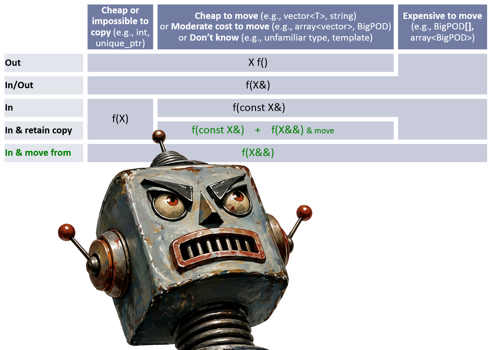
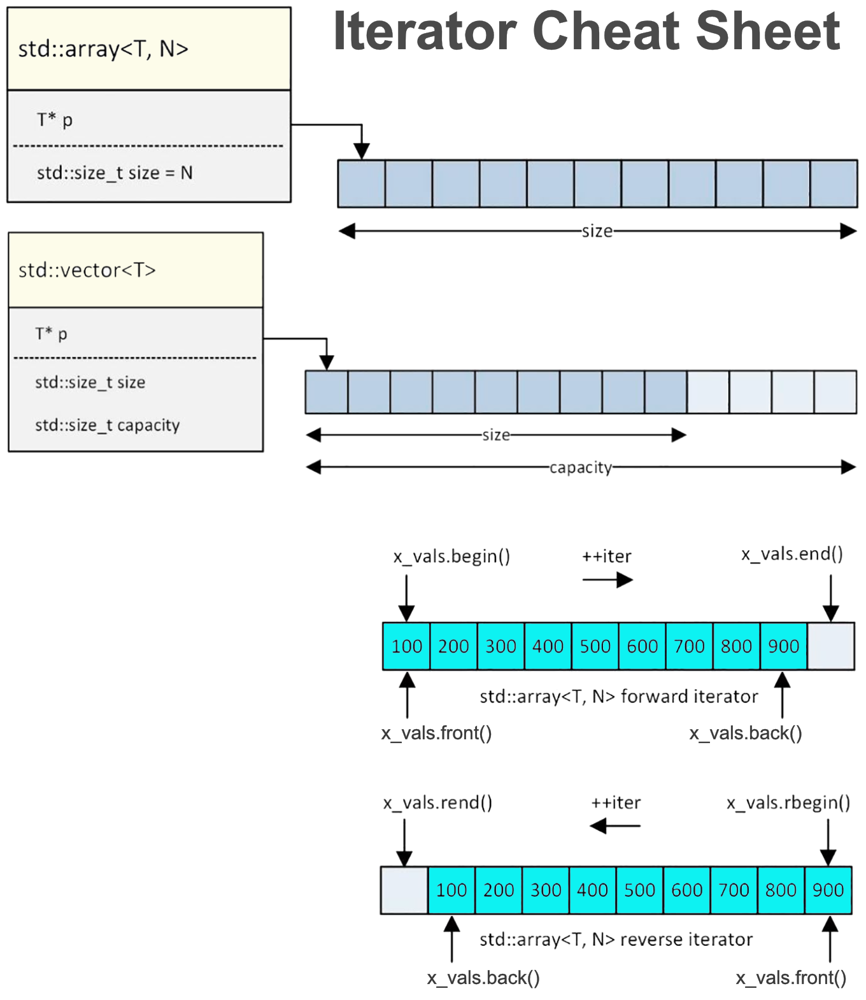

## Overview
{fig-alt="C++ logo" width=2in style="float: left; padding: 0 2em 0 1em"}

<br/>**C++** is a general-purpose, multi-paradigm systems language that grew out of C but is no longer the same language. It is tempting to read it as "C with classes plus a few extras," and its syntax invites the mistake, yet that framing badly undersells it. C++ supports procedural, object-oriented, generic, and functional styles, and the modern language leans on all four at once. What holds them together is a single organizing principle: *zero-overhead abstraction*. You do not pay for what you do not use, and the abstractions you do use should cost no more than the equivalent code you would have written by hand. This is what lets C++ compete with C on the metal while offering expressiveness closer to a high-level language.

The language began as **"C with Classes"**, written by Bjarne Stroustrup at Bell Labs in 1979 and renamed C++ in 1983. It was first standardized as **C++98**, but the version most people mean today is **modern C++**: the run of standards from C++11 onward that added move semantics, lambdas, smart pointers, and much else. Idiomatic modern C++ looks strikingly different from the C++98 of textbook lore, and this chapter targets that modern dialect throughout. If you have read the [C chapter](c.qmd), keep its ["C is not C++"](c.qmd#overview) callout in mind: the two languages share ancestry and much syntax, but their idioms and philosophies diverge sharply.

{width=9in}

::: {style="clear: both"}

:::

### A Short History of the Standard
Like C, C++ has evolved through a sequence of ISO standards, and the standard a codebase targets explains which features are available to it. Unlike C, whose revisions were mostly small and additive, C++ went through a genuine inflection at *C++11*, after which the language and its idioms changed enough that the community draws a line there and calls everything past it "modern C++." The revisions since have arrived on a steady three-year cadence, each one substantial.

| Standard       | Year | Common name  | What it introduced                                                                                                                                                                           |
|:---------------|:----:|:------------:|:---------------------------------------------------------------------------------------------------------------------------------------------------------------------------------------------|
| C with Classes | 1979 | (precursor)  | Stroustrup's Bell Labs research project: classes, member functions, and basic inheritance grafted onto C.                                                                                    |
| C++98          | 1998 | C++98        | The first ISO standard. Templates, the STL (containers, iterators, algorithms), exceptions, namespaces, and RTTI.                                                                            |
| C++03          | 2003 | C++03        | A defect-report release. No new features; wording fixes and clarifications only.                                                                                                             |
| C++11          | 2011 | "Modern C++" | The inflection point: `auto`, move semantics and rvalue references, lambdas, smart pointers (`unique_ptr`/`shared_ptr`), range-based `for`, `nullptr`, `enum class`, uniform initialization. |
| C++14          | 2014 | C++14        | A polish release for C++11: generic lambdas (`auto` parameters), lambda init-capture, relaxed `constexpr`, return-type deduction.                                                            |
| C++17          | 2017 | C++17        | Structured bindings, `std::optional`, `std::variant`, `if constexpr`, the `<filesystem>` library, guaranteed copy elision.                                                                   |
| C++20          | 2020 | C++20        | The largest revision since C++11: concepts, ranges, coroutines, and modules, plus the three-way comparison (`<=>`) operator.                                                                 |
| C++23          | 2023 | C++23        | `std::expected`, `std::print`, deducing `this`, and quality-of-life library additions.                                                                                                       |

::: {.callout-note title="\"Modern C++\" means C++11 and later"}
When practitioners say "modern C++," they mean C++11 onward. The difference is not cosmetic: idiomatic modern C++ favors `auto`, range-based loops, smart pointers over raw `new`/`delete`, and lambdas passed to standard algorithms, none of which existed in C++98. If a code sample here looks unfamiliar next to older C++ you have seen, this is usually why. Compilers select a standard with a flag such as `-std=c++17` or `-std=c++20`; there is rarely a reason to target anything below C++17 for new work.
:::

### The C++ Philosophy
::: {.subheading}
Zero-overhead abstraction
:::

Every language optimizes for something, and the choice shows up in a thousand small decisions. Python optimizes for programmer time and accepts a 50x performance cost to get it. Rust optimizes for safety and accepts a borrow checker that will argue with you. C++ optimizes for abstraction you do not pay for, and accepts the complexity that goal demands.

Stroustrup states it as two rules:

> **What you don't use, you don't pay for.** And what you do use, you couldn't hand-code any better.

The first rule explains the language's shape. Exceptions, RTTI, virtual dispatch, and the entire standard library are opt-in; a program that avoids them pays nothing for their existence, which is why C++ remains viable on a microcontroller with kilobytes of RAM. It is also why the language never acquired a garbage collector: mandatory runtime machinery would tax every program to benefit some.

The second rule is the more demanding one, and it is what makes C++ interesting. A `std::sort` call compiles to code as fast as a hand-written quicksort, faster than C's `qsort` in fact, because the comparison is inlined rather than called through a function pointer. A `unique_ptr` compiles to exactly the pointer it wraps, with the `delete` you would have written yourself. A range-based `for` over a `vector` produces the same loop as the index arithmetic. The abstraction exists in the source and evaporates in the object file, which is a promise most languages cannot make and C++ mostly keeps.

Three further commitments follow from those two:

- **Direct hardware access is preserved.** C's pointer model, memory layout, and arithmetic all survive intact. You can still cast an integer to a pointer and write a hardware register. C++ adds layers above C without hiding it.
- **Multi-paradigm, deliberately.** Procedural, object-oriented, generic, and functional styles are all first-class, and idiomatic modern C++ mixes them in a single function without apology. This was not indecision. Stroustrup's position is that no one paradigm fits every problem, and a systems language should not force the choice.
- **Static type safety, where it is free.** C++ prefers errors at compile time when catching them costs nothing at run time, which is the logic behind `enum class`, `constexpr`, concepts, and the `static_cast` family.

The cost of this design is the thing everyone complains about, and the complaint is fair. Refusing to break backward compatibility means every superseded approach is still in the language: `new` and `delete` sit alongside smart pointers, C arrays alongside `std::array`, macros alongside `constexpr`. Nothing was ever removed, so the language only grows, and a newcomer faces decades of accumulated strata with no signposts saying which layer is current. That is precisely the gap this chapter tries to fill.

## What C++ Adds to C
<!-- Orienting section: the reader knows C. Enumerate at a high level what C++
layers on, each expanded in its own section below. This is the "map." -->
- [References](#references) (`&`) vs. [pointers](c.qmd#pointers)
- [`class`](#classes-and-objects) / [access control](#access-control) / [member functions](#member-functions-this-and-const-methods)
- [Constructors](#constructors), [destructors](#destructors), and [RAII](#raii)
- Function and [operator overloading](#operator-overloading)
- [Templates](#templates) (generic programming)
- [The Standard Template Library](#the-standard-template-library)
- [Exceptions](#exceptions)
- [Namespaces](#namespaces)
- Stronger type safety (`nullptr`, `enum class`, `static_cast` family)

### Small but Pervasive Differences
::: {.subheading}
The papercuts that greet a C programmer on day one
:::

The features above are the headline additions, each with its own section below. But a C programmer's first hour with C++ is rarely spent on templates. It is spent on a scatter of small changes that make otherwise-valid C either fail to compile or, worse, compile into something subtly different. They are worth knowing up front because none of them are hard, and every one of them will happen to you.

| Concern               | C                                             | C++                                                                           |
|-----------------------|-----------------------------------------------|-------------------------------------------------------------------------------|
| Booleans              | `_Bool` (C99), or `int` with `#define TRUE 1` | `bool`, `true`, `false` are keywords                                          |
| Null pointer          | `NULL`, a macro for `0` or `((void*)0)`       | `nullptr`, with its own type `std::nullptr_t`                                 |
| `struct` names        | `struct Point p;` unless you `typedef`        | `Point p;` works directly                                                     |
| `void*` conversion    | Implicitly converts to any object pointer     | Requires an explicit cast                                                     |
| Casts                 | `(int)x`                                      | `static_cast<int>(x)` and friends preferred                                   |
| Character literals    | `'a'` has type `int`                          | `'a'` has type `char`                                                         |
| Empty parameter list  | `void f()` means "unspecified arguments"      | `void f()` means "takes no arguments", identical to `f(void)`                 |
| Function names        | One symbol per name                           | [Mangled](#name-mangling) with types; overloading is legal                    |
| `const` at file scope | External linkage                              | Internal linkage, so it may live in a header                                  |
| Initialization        | `= value` or `= { ... }`                      | Braces work everywhere; see [uniform initialization](#uniform-initialization) |

Three of these deserve a sentence more than the table gives them.

**`void*` no longer converts silently.** This is the one that breaks the most existing C code, and it is why the canonical C idiom `int *p = malloc(n * sizeof *p);` is a compile error in C++. C++ demands `static_cast<int*>(malloc(...))`, which is a good moment to notice that you should have been writing [`new`](#new-delete) or, better, a [container](#containers) instead. The stricter rule exists because C++ leans far harder on the type system than C does; a language with overloading, templates, and constructors cannot afford a pointer type that quietly becomes any other pointer type.

**`nullptr` is not just tidier than `NULL`.** Because `NULL` is typically the literal `0`, it is indistinguishable from an integer, and with overloading that ambiguity becomes a real bug. Given both `void log(int)` and `void log(char*)`, the call `log(NULL)` resolves to the *integer* overload. `nullptr` has a distinct type that converts to any pointer and to nothing else, so `log(nullptr)` picks the pointer overload as you intended.

**`void f()` changed meaning.** In C, an empty parameter list declares a function whose arguments are unspecified, which is a holdover from pre-ANSI C and defeats argument checking entirely; `f(void)` is how you actually say "no parameters." C++ fixed this by making the empty list mean exactly what it looks like. You can still write `f(void)` for compatibility, but there is no reason to.

::: {.callout-note title="`//` comments were C++'s first, though it hardly matters now"}
Single-line `//` comments came from C++ (by way of BCPL) and were only adopted into C with C99. If you have worked on a codebase pinned to C89, that difference is memorable. On any current compiler it is a non-issue, and it is mentioned here only so the historical direction of borrowing is clear: the flow of features between C and C++ has never been one-way.
:::

## Lambdas and Modern C++
::: {.subheading}
Anonymous functions and the C++11-and-later additions
:::

Several of the features that define modern C++ are additions layered on top of the C++98 core rather than replacements for it. This section houses the ones that change how everyday code *reads*. We start with [`auto`](#auto-and-type-deduction), since it underpins how the others look on the page, then move to the [lambda](#lambdas): an anonymous function you can write inline and pass around like a value. Last comes [structured bindings](#structured-bindings), which unpack a composite object into named pieces.

Two neighboring clusters live elsewhere because they belong to larger topics. The features that move work to build time (`constexpr` and its relatives, type traits, `<bit>`) are gathered under [Compile-Time Programming](#compile-time-programming), which follows immediately. The [concepts](#concepts) that constrain templates live under [Templates](#templates), since that is where they do their work.

### `auto` and Type Deduction
::: {.subheading}
Let the compiler name the type
:::

In C, every variable's type is spelled out at its declaration. C++11 introduced `auto`, which tells the compiler to deduce the type from the initializer. The value is still statically typed and the deduction happens entirely at compile time; `auto` is not dynamic typing, and there is zero runtime cost. It is a convenience for the programmer, not a change to the type system.

```cpp
auto count = 0;          // int
auto ratio = 3.14;       // double
auto name = "hello";     // const char*  (a C string literal, not std::string)
```

For simple scalars `auto` buys little, and spelling the type is often clearer. Its value shows up with the verbose types that pervade modern C++, above all iterator and template types, where the explicit spelling is long, brittle, and adds no information:

```cpp
std::map<std::string, std::vector<int>> table;

// Without auto: the type is a mouthful, and repeating it invites mistakes.
std::map<std::string, std::vector<int>>::iterator it = table.begin();

// With auto: identical meaning, and it survives a change to table's type.
auto it = table.begin();
```

#### Two Important Rules
Two rules are worth internalizing early.

1. Unadorned `auto` strips references and `const`: it deduces a value type, so `auto x = some_ref;` copies. To preserve them, say so explicitly with `const auto&`, which is the idiomatic way to name a cheap read-only alias:

```cpp
const std::string& first = names.front();   // explicit type
const auto& first = names.front();           // same thing, deduced
```

2. `auto` needs an initializer to deduce from; `auto x;` is an error. For the flip case, deducing the type *of an existing expression* without evaluating it, C++ provides `decltype`, mostly used in generic code where a type must track whatever the caller supplied:

```cpp
int a = 5;
decltype(a) b = 10;    // b is int, taken from a's declared type
```

#### Examples
With those rules in hand, here is a spread of deductions worth reading closely. The comment after each line names the type `auto` resolves to, and the surprises are exactly the cases where reference and `const` get stripped:

```cpp
std::vector<int> numbers{1, 2, 3};
const std::string label = "id";

auto x = numbers.size();      // std::size_t  (an unsigned type, not int)
auto y = numbers[0];          // int          (a copy; operator[] returns int&, but auto drops the &)
auto& z = numbers[0];         // int&         (a live reference into the vector)
auto s = label;               // std::string  (a copy; the top-level const is dropped)
const auto& r = label;        // const std::string&  (no copy; const and & preserved because you asked)

auto ptr = &numbers;          // std::vector<int>*
auto make = std::make_unique<std::string>("hi");   // std::unique_ptr<std::string>

for (auto n : numbers) { }    // n is int   (each element copied per iteration)
for (auto& n : numbers) { }   // n is int&  (mutate elements in place)
for (const auto& n : numbers) { }  // n is const int&  (read-only, no copy)
```

The pattern to carry away: bare `auto` gives you a fresh value with references and top-level `const` peeled off, and you add `&` or `const&` back when you want to bind to the original rather than copy it.

::: {.callout-note title="Use `auto` to remove noise, not information"}
`auto` is at its best when the type is obvious from the right-hand side or too verbose to be worth spelling (`auto widget = std::make_unique<Widget>();`, iterators, lambda results). It hurts when the type is the point and the initializer does not reveal it: `auto result = compute();` tells a reader nothing. The C++ Core Guidelines favor `auto` where it improves readability, which is a judgment call, not an always-or-never rule.
:::

### Lambdas
::: {.subheading}
Functions as values, written inline
:::

Before C++11, passing behavior into a function meant one of two awkward things: a free function referenced by pointer, or a hand-written **functor**, a class with an overloaded `operator()`. Both put the logic far from where it is used, and the functor approach is verbose boilerplate. A *lambda* collapses all of that into an expression you write exactly where you need it. C and Rust programmers already have a mental model for this: a lambda is C++'s answer to what Rust calls a [closure](rust-ho.qmd#closures) and Python calls a `lambda`.

Here is the anatomy:

```cpp
[captures](parameters) -> return_type { body }
```

The `[captures]` clause is what makes a lambda more than an anonymous function: it is the list of variables the lambda pulls in from the surrounding scope. The `-> return_type` is almost always omitted, since the compiler deduces it from the `return` statements. In practice most lambdas are short:

```cpp
auto square = [](int x) { return x * x; };
int nine = square(3);                        // 9
```

That reads like a function assigned to a variable, and it nearly is. The difference is the capture clause, which lets the lambda close over local state:

```cpp
int factor = 10;
auto scale = [factor](int x) { return x * factor; };  // captures factor by copy
int forty = scale(4);                                  // 40
```

#### Capture Modes
The capture clause is where C++ makes an explicit, per-variable decision that Rust infers for you and Python does not let you control at all. You state exactly what the lambda closes over and *how*.

| Capture      | Meaning                                                                                                                                                     |
|:-------------|:------------------------------------------------------------------------------------------------------------------------------------------------------------|
| `[]`         | Capture nothing. The lambda uses only its parameters and globals.                                                                                           |
| `[=]`        | Capture all used variables *by copy*. Each becomes a private snapshot.                                                                                      |
| `[&]`        | Capture all used variables *by reference*. The lambda sees live state.                                                                                      |
| `[x]`        | Capture `x` by copy; capture nothing else.                                                                                                                  |
| `[&x]`       | Capture `x` by reference; capture nothing else.                                                                                                             |
| `[=, &x]`    | Everything by copy, except `x` by reference.                                                                                                                |
| `[this]`     | Capture the enclosing object's `this` pointer (members become accessible).                                                                                  |
| `[*this]`    | Capture a copy of the enclosing object (C++17).                                                                                                             |
| `[y = expr]` | **Init-capture** (C++14): introduce a new lambda member `y` initialized to `expr`. The idiomatic way to move a value into a lambda: `[p = std::move(ptr)]`. |

By-copy capture takes a snapshot at the point the lambda is *created*, not when it is called. By-reference capture stores a reference to the original variable, so the lambda sees later changes, and, dangerously, outlives nothing on its own.

::: {.callout-warning title="Dangling reference captures are the classic footgun"}
A `[&]` (or `[&x]`) capture stores a reference, not a value. If the lambda outlives the variable it captured, that reference dangles and calling the lambda is undefined behavior. This bites hardest when a lambda is stored, returned, or handed to another thread, and the captured local goes out of scope before the lambda runs.

```cpp
auto make_counter() {
    int count = 0;
    return [&]() { return ++count; };   // BUG: count dies when make_counter returns
}
```

Capture by copy (`[count]` or `[=]`), or use init-capture to move ownership in, whenever the lambda might outlive the enclosing scope. Rust rejects this class of bug at compile time via the borrow checker; C++ trusts you to get it right.
:::

#### `mutable` and Generic Lambdas
A by-copy capture is `const` inside the lambda by default: the snapshot is read-only. Adding `mutable` lets the body modify its own copy, which persists across calls to the same lambda object:

```cpp
auto counter = [count = 0]() mutable { return ++count; };
counter();   // 1
counter();   // 2  -- the lambda's own copy of count survives between calls
```

Since C++14, a lambda parameter can be declared `auto`, making it a **generic lambda**. The compiler generates a templated `operator()`, so one lambda works across types, much like a function template written inline:

```cpp
auto add = [](auto a, auto b) { return a + b; };
add(3, 4);        // 7      (int)
add(1.5, 2.0);    // 3.5    (double)
add(std::string("foo"), std::string("bar"));  // "foobar"
```

#### Storing a Lambda
::: {.subheading}
`auto` vs `std::function`
:::

Every lambda has a **unique, unnamed type** the compiler invents just for it. Two lambdas with identical bodies still have different types. This matters when you store one:

```cpp
auto f = [](int x) { return x + 1; };   // zero-overhead: f's type is the lambda's own type
```

Using `auto` stores the lambda directly, and the call compiles down to a direct, inlinable invocation with no indirection. This is the zero-overhead-abstraction thesis made concrete: the lambda costs no more than the hand-written functor it replaced.

When you need a single named type that can hold *any* callable with a given signature, reach for `std::function`:

```cpp
#include <functional>
std::function<int(int)> g = [](int x) { return x + 1; };
```

`std::function` is type-erased: it can hold a lambda, a function pointer, or a functor interchangeably, at the cost of a virtual-dispatch-like indirection and, often, a heap allocation. Prefer `auto` for locals and template parameters; reserve `std::function` for when you genuinely need to store callables of differing concrete types behind one interface (for example, a `std::vector<std::function<...>>` of callbacks).

#### In Practice
::: {.subheading}
Lambdas and Algorithms
:::

Lambdas earn their keep as arguments to the standard algorithms, where the behavior belongs right at the call site:

```cpp
#include <algorithm>
#include <vector>

std::vector<int> values{5, 2, 8, 1, 9, 3};

// Sort descending: the comparison is written inline, not as a separate function.
std::sort(values.begin(), values.end(), [](int a, int b) { return a > b; });

// Find the first value above a runtime threshold, captured by copy.
int threshold = 4;
auto it = std::find_if(values.begin(), values.end(),
                       [threshold](int v) { return v > threshold; });
```

This is idiomatic modern C++, and it is the single most common place a newcomer meets lambdas.

#### Lambdas Across Languages
The same idea appears in Rust and Python, but each language makes different tradeoffs around *how capture works* and *what safety it guarantees*.

| Aspect          | C++ lambda                                          | Rust closure                                              | Python `lambda` / `def`                                                 |
|:----------------|:----------------------------------------------------|:----------------------------------------------------------|:------------------------------------------------------------------------|
| Capture control | **Explicit and per-variable** (`[=]`, `[&]`, `[x]`) | **Inferred**; encoded in the `Fn`/`FnMut`/`FnOnce` traits | Implicit; captures the enclosing scope by reference                     |
| Move semantics  | `[x = std::move(x)]` init-capture                   | `move \|\|` keyword forces ownership in                   | No moves; everything is a reference to a shared object                  |
| Safety          | Trusts you; dangling captures compile               | Borrow checker rejects dangling captures at compile time  | Captures late-bound; the late-binding closure trap is a common surprise |
| Storage type    | Unique unnamed type; `std::function` to erase       | Unique unnamed type; `Box<dyn Fn>` to erase               | Ordinary object; no distinction                                         |

The through-line: C++ hands you fine-grained, explicit control and expects you to wield it correctly; Rust encodes the same distinctions in the type system and checks them; Python hides them entirely. If you know Rust's closures, the [Closures section](rust-ho.qmd#closures) of the Rust chapter is worth rereading with this table in hand.

### Structured Bindings
::: {.subheading}
Unpacking an aggregate into named pieces
:::

A function that needs to return two things has always been awkward in C. You either return a `struct` and then reach into it by field name, or you return one value and write the other through an out-parameter pointer. C++ gained `std::pair` and `std::tuple` early, but using them was its own kind of ugly: the members are called `first` and `second`, names that tell you nothing about what they hold.

```cpp
std::map<std::string, int> scores{{"ada", 91}, {"grace", 97}};

auto result = scores.insert({"alan", 88});
if (result.second) {                              // .second? second what?
    std::cout << result.first->first << " added\n";  // and now .first->first
}
```

C++17's **structured bindings** let you name the pieces at the point of unpacking:

```cpp
auto [position, inserted] = scores.insert({"alan", 88});
if (inserted) {
    std::cout << position->first << " added\n";
}
```

The syntax is `auto [name1, name2, ...] = expression;`. The number of names must match the number of elements exactly; too few or too many is a compile error rather than a silent truncation. It works on three kinds of thing: `std::pair` and `std::tuple`, plain structs whose members are all public, and fixed-size arrays.

```cpp
struct Point { double x, y; };
Point origin_offset() { return {3.0, 4.0}; }

auto [x, y] = origin_offset();          // struct with public members
int  coords[2] = {10, 20};
auto [row, column] = coords;             // fixed-size array

for (const auto& [name, score] : scores) {   // the idiom you will use most
    std::cout << name << ": " << score << '\n';
}
```

That last loop is where structured bindings earn their keep. Iterating a `std::map` yields a `std::pair<const Key, Value>`, so the pre-C++17 version was a thicket of `it->first` and `it->second`. Naming them `[name, score]` makes the loop body read like the data it processes.

The declaration is `auto`, so the same [reference and `const` qualifiers](#auto-and-type-deduction) apply. `auto [a, b]` copies, `auto& [a, b]` binds references to the original members and lets you modify them, and `const auto& [a, b]` observes without copying, which is the right default for anything larger than a machine word.

```cpp
for (auto& [name, score] : scores) {
    score += 5;                          // modifies the map in place
}
```

::: {.callout-warning title="The names are not variables in the ordinary sense"}
A structured binding introduces *names for parts of one hidden object*, not independent variables. Two consequences follow. You cannot apply a storage specifier such as `static` to individual names, and you cannot capture a binding by name in a pre-C++20 [lambda](#lambdas) (C++20 relaxed this). If a lambda capture fails to compile on a binding, copy it into a normal local first.
:::

Before C++17, the closest approximation was `std::tie`, which builds a tuple of references so that assignment scatters values into existing variables. You still see it in older code, and it is still the tool when you want to assign into variables that already exist rather than declare new ones.

```cpp
std::map<std::string, int>::iterator position;
bool inserted;
std::tie(position, inserted) = scores.insert({"alan", 88});   // pre-C++17
```

The limitations are what motivated the language feature: `std::tie` requires the variables to be declared (and therefore default-constructible) beforehand, it cannot bind references into the original object, and it does not work on plain structs or arrays.

If you have read the other chapters, this is well-trodden ground. Python has had `name, score = pair` since the beginning and applies it in `for` loops the same way. Rust's [pattern matching](rust-ho.qmd#pattern-matching) is the most general of the three: `let (a, b) = pair;` and `let Point { x, y } = p;` are the direct analogues, but the same patterns work in `match` arms, nest arbitrarily, and can bind by reference or by move. C++ made a deliberately narrower choice. A structured binding is a *declaration* form only; it destructures, but it never tests, so there is no C++ equivalent of matching a struct against a pattern and taking a branch when it fails to fit. That capability lives in `std::visit` over a `std::variant`, and it is considerably less pleasant.

## Compile-Time Programming
::: {.subheading}
Work the compiler does so the program does not have to
:::

Every language draws a line between what is decided when the program is built and what is decided when it runs. C draws that line early and low: the preprocessor pastes text, the compiler folds a few obvious constants, and everything else waits for run time. C++ has spent two decades pushing the line in the other direction, and the cumulative result is that a startling amount of a modern C++ program is *finished* before `main` is ever entered. Lookup tables are computed and sitting in read-only memory. Type errors that other languages discover in a test suite have already failed the build. Branches that could never be taken were discarded before they were compiled.

There is no single official name for this body of features. **Metaprogramming** is the traditional word, but it has come to connote one specific and now largely superseded technique: recursive template instantiation, where you coax the type system into computing for you because nothing better existed. What replaced it is simply *ordinary code that happens to run at compile time*, which is why "compile-time programming" is the more honest label and the one this chapter uses.

Four strands make it up, and they developed somewhat independently:

| Strand                | Question it answers                                    | Principal tools                                        |
|:----------------------|:-------------------------------------------------------|:-------------------------------------------------------|
| Constant evaluation   | Can this *value* be computed now?                      | `constexpr`, `consteval`, `constinit`, `static_assert` |
| Type introspection    | What is true about this *type*?                        | `<type_traits>`, concepts                              |
| Compile-time dispatch | Which code should be generated at all?                 | `if constexpr`, templates, overload resolution         |
| Reflection            | What are this type's *parts*, and can I generate more? | C++26 `^^` and `[: :]`                                 |

The first three are mature and are what the rest of this section covers. The fourth arrives with C++26 and gets a short forward-looking treatment at the end.

### `constexpr` and `if constexpr`
::: {.subheading}
Moving work from run time to compile time
:::

`constexpr` is the keyword that lets you say "evaluate this during compilation." An expression marked `constexpr`, or built entirely from `constexpr` ingredients, is computed by the compiler, and its result is baked into the binary as a literal rather than calculated when the program runs. The payoff is twofold: work the machine would otherwise repeat on every execution is done exactly once, at build time, and a value known at compile time can be used in the places the language *requires* a compile-time constant, such as an array bound or a template argument.

A C programmer already reaches for compile-time constants, but only through blunt tools. A `#define BUFFER_SIZE 256` is a textual substitution handled by the [preprocessor](c.qmd#preprocessing): it has no type, obeys no scope, and is invisible to the debugger. The other classic trick, the "enum hack" (`enum { BufferSize = 256 };`), buys you a scoped, typed integer but works only for integers. `constexpr` subsumes both. It is a typed, scoped, general facility that extends to any type and to whole functions, all while remaining part of the language proper rather than a layer bolted on top of it.

#### `constexpr` Variables
The distinction between `constexpr` and `const` trips up nearly everyone, and it is worth stating sharply because the two are not synonyms. `const` is a promise about *mutability*: this name may not be modified through this handle. `constexpr` is a promise about *when the value is known*: it can be computed at compile time. A `const` value may well be a runtime value that simply happens to be read-only:

```cpp
const int runtime = std::rand();      // const, but NOT known until the program runs
constexpr int compile = 256;          // known at compile time; usable as a constant expression
```

The difference has teeth exactly where the language demands a constant expression. Array bounds, template arguments, `case` labels, and `static_assert` conditions all require a value the compiler can see, and only `constexpr` qualifies:

```cpp
constexpr int size = 16;
int buffer[size];                     // OK: size is a constant expression

const int n = read_config();          // a runtime const
int other[n];                         // error: n is not a constant expression (and this isn't even legal C++)
```

A `constexpr` variable is implicitly `const` as well, so the read-only guarantee comes along for free. The rule of thumb: if a value is knowable when you compile and you want it usable as a constant, mark it `constexpr`; reach for plain `const` when you only mean "do not let this be changed."

#### `constexpr` Functions
The feature becomes powerful when it extends from values to *functions*. A `constexpr` function is one the compiler is allowed to evaluate at compile time, provided you call it with arguments that are themselves constant expressions. Call it with runtime arguments instead and it degrades gracefully into an ordinary function executed at run time. One definition serves both worlds:

```cpp
constexpr int factorial(int n) {
    return n <= 1 ? 1 : n * factorial(n - 1);
}

constexpr int fac5 = factorial(5);    // computed at compile time -> the literal 120
int k = read_int();
int fack = factorial(k);              // same function, run at run time because k isn't constant
```

`factorial(5)` never executes at run time; the compiler folds it to `120` and stores that. `factorial(k)` cannot be, because `k` is not known until execution, so it compiles to an ordinary call. The programmer writes the logic once and the compiler picks the moment.

What a `constexpr` function may *contain* has loosened dramatically across the standards, and this history explains why older advice sounds so restrictive. In C++11 a `constexpr` function was limited to essentially a single `return` statement, which is why early examples all lean on the ternary-recursion trick above. C++14 relaxed the rules to allow loops, local variables, and ordinary branching, so you could finally write a `constexpr` function that reads like normal code. C++20 went further still, permitting things once unthinkable at compile time: `try`/`catch`, and even dynamic allocation, so that `std::vector` and `std::string` can now be used inside `constexpr` evaluation. The trend is unmistakable and ongoing: more of the language becomes available at compile time with each revision.

```cpp
constexpr int sum_to(int n) {         // legal since C++14: loop + local variable
    int total = 0;
    for (int i = 1; i <= n; ++i) total += i;
    return total;
}
static_assert(sum_to(100) == 5050);   // checked entirely at compile time
```

The `static_assert` on that last line is `constexpr`'s natural companion: it evaluates a constant expression at compile time and aborts the build if it is false, turning invariants you would otherwise test at run time into compile errors.

#### `if constexpr`
::: {.subheading}
Compile-time branch selection (C++17)
:::

An ordinary `if` chooses a branch at run time; both branches are compiled, and one is skipped during execution. `if constexpr`, introduced in C++17, chooses at *compile time*, and the branch not taken is not merely skipped but **discarded before it is compiled**. This distinction is what makes the feature indispensable inside templates: each branch may contain code that is valid only for *some* instantiations, and the compiler never checks the branch that does not apply.

Consider a function template that must behave differently for pointer and non-pointer types:

```cpp
template <typename T>
void describe(T value) {
    if constexpr (std::is_pointer_v<T>) {
        std::cout << "points at " << *value << '\n';   // only compiled when T is a pointer
    } else {
        std::cout << "value is " << value << '\n';      // only compiled when T is not
    }
}

describe(42);        // instantiates the else branch; the *value dereference is never seen
describe(&some_obj); // instantiates the if branch
```

With a plain `if`, the `*value` dereference would be compiled even for `describe(42)`, where `T` is `int`, and dereferencing an `int` is an error. `if constexpr` throws that branch away for the `int` instantiation, so it never has to type-check. Before C++17, achieving this meant reaching for **SFINAE** (writing multiple overloads gated on `std::enable_if`) or **tag dispatch** (dispatching to helper overloads on a dummy type argument), both of which are verbose, obscure, and notoriously hard to read. `if constexpr` replaces the bulk of that machinery with a construct that reads like ordinary code.

`if constexpr` decides *which code to compile*; the C++20 [Concepts](#concepts) feature decides *which types a template will accept at all*, and produces far clearer errors when a caller violates the constraint. The two are complementary tools for taming templates, and modern generic code uses both.

#### `consteval`, `constinit`, and `if consteval` {#consteval-and-constinit}
::: {.subheading}
The C++20 refinements, and a C++23 correction
:::

C++20 added two keywords that sharpen the picture. A `constexpr` function *may* run at compile time; sometimes you want to insist that it *must*. That is `consteval`, which marks an **immediate function**: every call is evaluated at compile time, and any call that cannot be is a compile error. It is the strict sibling of `constexpr`, useful when a function only makes sense as a compile-time computation and you want the compiler to enforce that.

```cpp
consteval int square(int n) { return n * n; }

constexpr int a = square(8);   // OK: 64, computed at compile time
int r = read_int();
int b = square(r);             // error: consteval call with a runtime argument
```

`constinit`, the other addition, addresses a different problem: the notorious **static initialization order fiasco**, where two global objects in different translation units depend on each other and the order they are initialized is unspecified. `constinit` guarantees that a static or thread-local variable is initialized at compile time, before any runtime code can observe it, eliminating that race. Crucially it does *not* imply `const`: the variable is initialized at compile time but may still be modified afterward.

Four keywords now cluster around this idea, and keeping them straight is half the battle:

| Keyword     | Guarantees                                                           | Implies `const`? |
|:------------|:---------------------------------------------------------------------|:----------------:|
| `const`     | Not modifiable through this name; value may be a runtime value.      | n/a              |
| `constexpr` | Usable as a constant expression; *may* be evaluated at compile time. | yes              |
| `consteval` | (Functions only) *must* be evaluated at compile time.                | no               |
| `constinit` | Static/thread-local variable is initialized at compile time.         | no               |

##### Asking Which World You Are In
A `constexpr` function runs in two worlds, and occasionally it wants to behave differently in each. The usual reason is that the fastest runtime implementation is unavailable at compile time: it calls a compiler intrinsic, inspects raw bytes, or uses hand-written assembly, none of which the constant evaluator can execute. What you want is one function that uses the fast path when it can and a portable path when the compiler is doing the work.

C++20 offered `std::is_constant_evaluated()`, and it came with a trap sharp enough that C++23 added a language feature to eliminate it. The function returns a `bool` reporting whether the current evaluation is happening at compile time, but it is an ordinary function call, not a keyword. Write it as the condition of an `if constexpr` and the compiler must evaluate that condition at compile time to decide the branch, which means the answer is *always* `true`:

```cpp
constexpr int compute(int n) {
    if constexpr (std::is_constant_evaluated()) {   // BUG: always true
        return slow_but_portable(n);                 // the runtime path is never generated
    } else {
        return fast_intrinsic(n);                    // discarded, unreachable
    }
}
```

The correct C++20 spelling uses a plain `if`, which reads like a runtime test but is folded away by the compiler in each context:

```cpp
constexpr int compute(int n) {
    if (std::is_constant_evaluated()) { ... }        // correct, if easy to get wrong
}
```

C++23's `if consteval` makes the mistake unwriteable by giving the question its own syntax. There is no condition to accidentally wrap, and as a bonus the true branch is an immediate-function context, so it may call `consteval` functions that a plain `if` could not:

```cpp
constexpr int compute(int n) {
    if consteval {
        return slow_but_portable(n);    // taken during constant evaluation
    } else {
        return fast_intrinsic(n);       // taken at run time
    }
}
```

This is a small feature, but it is a clean illustration of how the standard tends to evolve: a library function exposes a capability, real use reveals a footgun, and a later standard promotes the capability to syntax that cannot be misused.

::: {.callout-note title="Rust's `const fn` is the direct analog"}
If you have read the Rust chapters, `constexpr` functions map almost exactly onto Rust's [`const fn`](rust-ho.qmd), and Rust's `const` and `static` items play the role of `constexpr` variables. The parallel even extends to the history: like C++'s `constexpr`, Rust's `const fn` began tightly restricted and has steadily gained the ability to run more of the language at compile time across editions. The chief difference is emphasis. Rust evaluates const contexts eagerly and treats the const/runtime split as an ordinary part of the type system, whereas C++ exposes the finer gradations (`constexpr` vs. `consteval` vs. `constinit`) as distinct keywords you choose between. C, by contrast, has nothing comparable: its only compile-time constants come from the preprocessor's `#define` and the `enum` hack, neither of which is typed, scoped, or able to run a function.
:::

### Type Traits
::: {.subheading}
Asking questions about types at compile time
:::

`constexpr` computes with values. **Type traits** compute with *types*: they are compile-time functions whose arguments are types and whose results are either a constant or another type. They live in `<type_traits>`, and once you notice them you will see them everywhere in the standard library, because they are the mechanism by which generic code inspects what it has been handed.

You have already met one. The `if constexpr (std::is_pointer_v<T>)` example above asks a question about `T` and gets back a `bool` the compiler can branch on. That is the whole idea; the library simply supplies a large catalog of such questions.

#### The Two Flavors, and Their Suffixes
Traits come in two kinds, distinguished by a naming convention that is worth learning because it tells you what you are getting:

- **Predicates** end in `_v` and yield a `constexpr bool`: `std::is_integral_v<T>`, `std::is_pointer_v<T>`, `std::is_same_v<A, B>`.
- **Transformations** end in `_t` and yield a *type*: `std::remove_reference_t<T>`, `std::decay_t<T>`, `std::underlying_type_t<E>`.

```cpp
#include <type_traits>

static_assert(std::is_integral_v<int>);              // a bool, usable in static_assert
static_assert(!std::is_integral_v<double>);
static_assert(std::is_same_v<std::remove_reference_t<int&>, int>);   // a type

template <typename T>
void takes_anything(T&& value) {
    using Bare = std::decay_t<T>;    // strip references, const, and array-to-pointer decay
    static_assert(!std::is_same_v<Bare, void>);
}
```

The suffixes are shorthand. `std::is_integral_v<T>` is defined as `std::is_integral<T>::value`, and `std::remove_reference_t<T>` as `typename std::remove_reference<T>::type`. The underlying class templates are what existed in C++11; the `_v` and `_t` aliases arrived in C++17 and C++14 respectively, purely to spare you the `::value` and `typename ...::type` noise. Older code and older tutorials use the long forms, which is the only reason to know they exist.

#### The Ones You Actually Reach For
The catalog runs to well over a hundred entries. This is the working subset:

| Trait                                                  | Yields | Used for                                              |
|:-------------------------------------------------------|:-------|:------------------------------------------------------|
| `std::is_same_v<A, B>`                                 | `bool` | Exact type equality; the workhorse of `static_assert` |
| `std::is_integral_v<T>`, `std::is_floating_point_v<T>` | `bool` | Numeric category dispatch                             |
| `std::is_pointer_v<T>`, `std::is_reference_v<T>`       | `bool` | Indirection checks                                    |
| `std::is_const_v<T>`                                   | `bool` | Qualifier checks                                      |
| `std::is_base_of_v<Base, Derived>`                     | `bool` | Inheritance relationships                             |
| `std::is_trivially_copyable_v<T>`                      | `bool` | Deciding whether `memcpy` is legal                    |
| `std::is_nothrow_move_constructible_v<T>`              | `bool` | Whether a container may move on reallocation          |
| `std::remove_reference_t<T>`                           | type   | Stripping `&` / `&&`                                  |
| `std::remove_cv_t<T>`, `std::decay_t<T>`               | type   | Normalizing a deduced type                            |
| `std::underlying_type_t<E>`                            | type   | The integer type behind an `enum class`               |
| `std::conditional_t<B, A, C>`                          | type   | A compile-time ternary that selects a *type*          |
| `std::enable_if_t<B, T>`                               | type   | Legacy SFINAE; prefer concepts in new code            |

`std::conditional_t` deserves a second look, because it has no runtime counterpart at all. It is an `if`/`else` whose result is a type:

```cpp
// Pick the smallest index type that can address N elements.
template <std::size_t N>
using IndexType = std::conditional_t<(N <= 255), std::uint8_t,
                  std::conditional_t<(N <= 65535), std::uint16_t, std::uint32_t>>;

static_assert(std::is_same_v<IndexType<100>, std::uint8_t>);
static_assert(std::is_same_v<IndexType<1000>, std::uint16_t>);
```

On an 8-bit or 16-bit target that is a real saving, chosen by the compiler from a single definition.

#### Why This Matters
::: {.subheading}
The `memcpy` Optimization
:::

The payoff is easiest to see in a concrete case. Suppose you are writing a container that must relocate its elements when it grows. The correct general answer is to move-construct each element into the new storage one at a time. But for a type with no pointers, no virtual functions, and no user-defined copy constructor, that loop is doing by hand what `memcpy` does in a single vectorized call.

`std::is_trivially_copyable_v<T>` is exactly the question "may I `memcpy` this?", and `if constexpr` turns the answer into two different generated functions:

```cpp
template <typename T>
void relocate(T* destination, T* source, std::size_t count) {
    if constexpr (std::is_trivially_copyable_v<T>) {
        std::memcpy(destination, source, count * sizeof(T));   // one call, vectorized
    } else {
        for (std::size_t i = 0; i < count; ++i) {
            new (destination + i) T(std::move(source[i]));      // placement new, one at a time
            source[i].~T();
        }
    }
}
```

`relocate<int>` compiles to a `memcpy`. `relocate<std::string>` compiles to the loop, because a `std::string` owns a heap buffer and copying its bytes would produce two objects pointing at the same allocation. Neither instantiation contains a runtime test, and neither contains the other's code. This is not a hypothetical: it is very close to what your standard library actually does inside `std::vector`'s reallocation path, and it is why `std::vector<int>` grows at `memcpy` speed while `std::vector<std::string>` does not.

::: {.callout-note title="Traits are what concepts are made of"}
A [concept](#concepts) is a named compile-time predicate on types, and traits are the most common thing to build one from. `template <typename T> concept Integral = std::is_integral_v<T>;` is very nearly how `std::integral` is defined. The relationship is worth keeping straight: traits *ask* questions, concepts *impose* the answers as requirements on a template parameter. Where older code used `std::enable_if_t` to turn a trait into a constraint through SFINAE, new code names a concept and gets a readable error message for free.
:::

### Compile-Time Bit Manipulation
::: {.subheading}
`<bit>` and the end of union punning (C++20)
:::

Bit manipulation is the one area where C programmers have long been forced to choose between portability, defined behavior, and speed. C++20's `<bit>` header ends that compromise, and every operation in it is `constexpr`.

The centerpiece is `std::bit_cast`, which reinterprets an object's bits as another type of the same size. The C idiom for this is a union, or a `char*` cast, and the [strict-aliasing rules](c.qmd#undefined-behavior) make both of them formally undefined behavior even though they usually work:

```cpp
#include <bit>

// The classic: extract the raw bits of a float.
constexpr std::uint32_t bits = std::bit_cast<std::uint32_t>(1.0f);   // 0x3F800000
static_assert(bits == 0x3F800000);
```

Note that `static_assert`: this ran during compilation. The union version cannot, because reading an inactive union member is not permitted in a constant expression, and the `memcpy` version could not before C++20 either. `bit_cast` is defined behavior, compiles to nothing (the bits do not move; only their interpretation changes), and works at compile time.

The header also standardizes the bit-counting operations that were previously compiler intrinsics with names like `__builtin_popcount` or `_BitScanReverse`:

| Function                                     | Returns                         |
|:---------------------------------------------|:--------------------------------|
| `std::popcount(x)`                           | Number of set bits              |
| `std::countl_zero(x)`, `std::countr_zero(x)` | Leading / trailing zero count   |
| `std::countl_one(x)`, `std::countr_one(x)`   | Leading / trailing one count    |
| `std::bit_width(x)`                          | Bits needed to represent `x`    |
| `std::bit_ceil(x)`, `std::bit_floor(x)`      | Nearest power of two, up / down |
| `std::rotl(x, n)`, `std::rotr(x, n)`         | Bit rotation (not shifting)     |
| `std::has_single_bit(x)`                     | Whether `x` is a power of two   |

Each maps to a single instruction on hardware that has one (`POPCNT`, `LZCNT`, `ROL`) and to a correct fallback where it does not. `std::rotl` is quietly the most valuable of them: the obvious hand-written rotation, `(x << n) | (x >> (32 - n))`, is undefined behavior when `n` is zero, a bug that has shipped in a great many hash functions and cipher implementations.

```cpp
constexpr std::size_t round_up_to_power_of_two(std::size_t n) {
    return std::bit_ceil(n);        // computed at compile time when n is constant
}
static_assert(round_up_to_power_of_two(100) == 128);
```

For a hash table sizing its bucket array, or a ring buffer that wants a power-of-two capacity so it can mask instead of divide, this is the entire calculation, done at build time and correct on every target.

### Where It Is Heading: Reflection
::: {.subheading}
C++26, and a note on availability
:::

Everything so far shares a limitation: you can ask whether a type *is* something, but you cannot ask what it is *made of*. There is no standard way to enumerate a struct's members, recover an enumerator's name as a string, or generate a new type from an existing one's shape. Every serialization library, every ORM, and every logging framework works around this with macros, code generators, or elaborate template tricks, and the workarounds are the ugliest code in the C++ ecosystem.

**Static reflection**, voted into C++26, closes that gap. Two pieces of syntax carry it. The `^^` operator *reflects* an entity into a value of type `std::meta::info`, an opaque handle the compiler understands. The splice operator `[: :]` goes the other way, turning such a value back into the entity it denotes, in a position where real code is expected.

The canonical demonstration is the function every C++ programmer has hand-written a macro for:

```cpp
#include <meta>

template <typename E>
constexpr std::string_view enum_to_string(E value) {
    template for (constexpr auto entry : std::define_static_array(std::meta::enumerators_of(^^E))) {
        if (value == [:entry:]) {
            return std::meta::identifier_of(entry);
        }
    }
    return "<unknown>";
}

enum class Color { red, green, blue };
static_assert(enum_to_string(Color::green) == "green");
```

`enumerators_of(^^E)` hands back a sequence describing every enumerator of `E`. `template for` is C++26's expansion statement, which loops over that sequence at compile time, generating one iteration per element. `[:entry:]` splices an element back into an expression so it can be compared, and `identifier_of` recovers its name. The whole thing is a `constexpr` function over ordinary data, works for any enum, and needs no macro and no registration step.

::: {.callout-warning title="Do not write this in production yet"}
Reflection was voted into the C++26 working draft, and the standard is expected to be published this year, but compiler support is experimental: recent GCC and Clang builds implement portions of it behind flags, library support is incomplete, and details of the syntax have shifted more than once during standardization. Treat this subsection as a map of where the language is going, not as a technique to adopt. The stable tools for the problems reflection solves remain the ones above, plus code generation as an external build step.
:::

The direction, though, is unmistakable, and it is the same one the whole section has traced. C gave you a preprocessor that could paste text. C++11 gave you a compiler that could evaluate a single `return` statement. C++20 gave you one that could run loops, allocate memory, and construct a `std::vector`. C++26 gives you one that can inspect your program's own structure and write code from it. The line between build time and run time has moved a very long way, and it has not stopped.

## Types and Declarations
::: {.subheading}
The type system C++ layers over C's
:::

Three additions here change how C++ code reads at the smallest scale: references, which give you pass-by-reference without pointer syntax; scoped enumerations, which close the type holes in C's `enum`; and brace initialization, which unifies a half-dozen initialization syntaxes into one. None of them is difficult, but all three are pervasive, so they are worth getting exactly right before the class machinery arrives.

### References
::: {.subheading}
Aliases, not pointers
:::

A **reference** is another name for an existing object. `int& ref = value;` does not create storage or a pointer; it makes `ref` an alias, so from that point on `ref` *is* `value`, and every use of one is a use of the other.

```cpp
int value = 10;
int& ref  = value;    // ref is another name for value

ref = 20;             // no dereference operator needed
// value is now 20

int* ptr = &value;    // the C way, for contrast
*ptr = 30;            // explicit dereference required
```

Three rules define references, and each one removes a class of pointer bug:

1. **A reference must be initialized when declared.** `int& ref;` will not compile. A pointer may be left uninitialized and pointing at garbage.
2. **A reference cannot be reseated.** After `int& ref = value;`, writing `ref = other;` assigns *to* `value`; it does not repoint `ref`. A pointer may be reassigned at any time.
3. **A reference cannot be null.** There is no `nullref`. A pointer may be null, and forgetting to check is the most common crash in C.

Together these make a reference *guaranteed to refer to a valid object*, which is the whole point. Where a pointer parameter forces a caller and reader to ask "may this be null, and who owns it?", a reference parameter answers both questions in advance.

#### Pass by Reference
The visible payoff is in function parameters. C has only pass-by-value, so modifying a caller's variable means passing its address and dereferencing throughout:

```c
void increment(int* value) { (*value)++; }   // C: pointer, and * everywhere

int count = 0;
increment(&count);                            // caller must remember the &
```

```cpp
void increment(int& value) { value++; }      // C++: reads like a plain variable

int count = 0;
increment(count);                             // no & at the call site
```

The C++ version has no `*`, no `&` at the call site, and no possibility of a null argument. That last clause is the reason to prefer it, but the missing `&` at the call site has a cost worth naming: **you cannot tell from the call whether `count` will be modified.** In C, `increment(&count)` announces itself. This is the standing tradeoff of references, and it is why the convention below matters so much.

#### `const&`
::: {.subheading}
The Default for Parameters
:::

The most common use of references is not to modify anything. Passing a large object by value copies it; passing it by `const` reference passes an alias and forbids modification through it:

```cpp
void print(const std::string& text);   // no copy, and cannot modify: the default
void modify(std::string& text);        // no copy, may modify: rarer, and deliberate
void consume(std::string text);        // copies (or moves): only when you need your own
```

Read those three signatures as a vocabulary, because experienced C++ programmers read them exactly that way. The convention is: **pass by `const&` for anything bigger than a machine word that you only need to read.** For small types (`int`, `double`, a pointer) pass by value, since a copy is cheaper than the indirection a reference introduces.

A `const&` has one further property that surprises people: it may bind to a temporary, and doing so extends that temporary's lifetime to match the reference. This is what lets `print("literal")` work, constructing a temporary `std::string` that survives the call.

::: {.callout-note title="References are usually pointers underneath"}
The abstraction is not magic. Compilers typically implement a reference as a pointer that is automatically dereferenced on every use. The difference is entirely in what the *language* permits: the compiler enforces initialization, forbids reseating, and assumes non-null, which in turn lets it optimize more aggressively than it could around a pointer. You get pointer performance with a restricted, safer interface.

The parallel to Rust is close enough to be worth stating: C++'s `T&` and `const T&` correspond to Rust's `&mut T` and `&T`. Rust's spelling makes mutability the marked case (`&T` is the read-only default), while C++ makes it the unmarked one (`T&` is mutable, `const T&` is not), which is a small design decision with large consequences for which one people reach for by habit. The deeper difference is that Rust's borrow checker verifies that no reference outlives what it points at. C++ does not check this, so a reference to a destroyed object is a dangling reference, and every bit as undefined as a dangling pointer:

```cpp
const std::string& dangling() {
    std::string local = "gone";
    return local;              // local dies here; the reference is garbage
}
```
:::

### `enum class`
::: {.subheading}
Enumerations that are actually types
:::

C's `enum`, as the [C chapter](c.qmd#enum) noted, is little more than a naming convention for integers. C++ inherited it unchanged, along with all three of its defects, and then added a fixed version in C++11.

The unscoped enum you know from C leaks in three ways:

```cpp
enum Color  { RED, GREEN, BLUE };            // C-style, still legal C++
enum Status { OK, ERROR, RED };              // ERROR: RED already declared!

Color color = RED;
int  number = color;                         // implicit conversion to int: allowed
if (color == 2) { }                          // comparing to an int: allowed
if (color == OK) { }                         // comparing across enums: allowed!
```

1. **The names leak into the enclosing scope.** `RED` is not `Color::RED`, it is just `RED`, which is why C code is full of `COLOR_RED` prefixes to avoid collisions.
2. **They implicitly convert to `int`.** So an enum is interchangeable with any integer, and the type carries no guarantee.
3. **They compare freely with other enums and integers**, so a whole category of nonsense compiles silently.

`enum class` (equivalently `enum struct`) fixes all three:

```cpp
enum class Color  { Red, Green, Blue };
enum class Status { Ok, Error, Red };        // fine: no collision, different scopes

Color color = Color::Red;                    // scope qualification required
// int number = color;                       // ERROR: no implicit conversion
// if (color == 2) { }                       // ERROR: no comparison with int
// if (color == Status::Red) { }             // ERROR: different types

int number = static_cast<int>(color);        // explicit conversion still available
```

The names are now scoped, so the `COLOR_` prefixes disappear. There is no implicit conversion, so an enum value can only be used as what it is. And the type is distinct, so mixing two enumerations is a compile error rather than a silent bug. You may still get an integer out with `static_cast`, which is the C++ philosophy in miniature: the conversion is available, but you have to say so.

Both forms let you specify the underlying type, which matters for hardware registers, serialization, and forward declaration:

```cpp
enum class Opcode : std::uint8_t { Read = 0x01, Write = 0x02, Reset = 0xFF };
enum class State  : std::uint16_t;           // forward declaration, size known
```

The guidance is simple: **use `enum class` by default.** Reach for a plain `enum` only when you specifically want the implicit integer conversion, which in practice means bit-flag sets and interfacing with C headers.

#### But Rust's Enums Are Something Else Entirely
Here is where your instinct is correct, and it is worth being precise about *why*, because the two languages use the same word for two genuinely different features.

`enum class` fixes C's enum. It does not do what [Rust's enum](rust-ho.qmd#rust-enums) does. A C++ enumeration, scoped or not, is still *a name for one of several integer values*. A Rust enum is a **sum type** (an *algebraic data type*, or *tagged union*): each variant may carry its own payload of its own type, and the compiler tracks which variant is active.

```rust
enum Shape {                          // Rust
    Circle(f64),
    Rectangle(f64, f64),
    Triangle { base: f64, height: f64 },
}
```

There is no C++ enumeration that expresses this. The idea is older than Rust, going back to ML in the 1970s and inherited through Haskell and OCaml, but Rust was the language that brought it into the systems world, and it is the single feature most C++ programmers envy after using it. C++ has two answers, neither as good.

**The C answer, which C++ inherits: a hand-rolled tagged union.** You write the tag and the payload separately, and you maintain the invariant between them yourself:

```cpp
struct Shape {
    enum class Kind { Circle, Rectangle, Triangle } kind;
    union {
        struct { double radius; }                circle;
        struct { double width, height; }         rectangle;
        struct { double base, height; }          triangle;
    };
};

Shape s;
s.kind = Shape::Kind::Circle;
s.circle.radius = 5.0;
double wrong = s.rectangle.width;   // compiles fine; reads garbage
```

The union stores one member at a time in overlapping memory, and the enum records which. Everything about the correspondence is on you: nothing stops you setting `kind` to `Circle` and then reading `rectangle`, nothing forces your `switch` to handle every case, and if a member has a constructor or destructor (a `std::string`, say) you must invoke them by hand with placement `new`. This is the C idiom, it is everywhere in real code, and it is exactly the failure mode Rust's design eliminates.

**The C++17 answer: `std::variant`.** A library type that does the bookkeeping for you, type-safely:

```cpp
#include <variant>

struct Circle    { double radius; };
struct Rectangle { double width, height; };
struct Triangle  { double base, height; };

using Shape = std::variant<Circle, Rectangle, Triangle>;

Shape shape = Circle{5.0};

double area(const Shape& shape) {
    if (const auto* circle = std::get_if<Circle>(&shape))
        return std::numbers::pi * circle->radius * circle->radius;
    if (const auto* rect = std::get_if<Rectangle>(&shape))
        return rect->width * rect->height;
    // ...
}
```

`std::variant` is a genuine sum type: it knows which alternative it holds, it throws `std::bad_variant_access` if you ask for the wrong one, and it runs the correct destructor. `std::visit` will even dispatch over the alternatives and fail to compile if you miss one, which recovers the exhaustiveness checking:

```cpp
// The helper the standard library does not provide: bundles several lambdas
// into one object with an overloaded operator().
template <typename... Ts>
struct overloaded : Ts... { using Ts::operator()...; };

double area(const Shape& shape) {
    return std::visit(overloaded {
        [](const Circle& c)    { return std::numbers::pi * c.radius * c.radius; },
        [](const Rectangle& r) { return r.width * r.height; },
        [](const Triangle& t)  { return 0.5 * t.base * t.height; }
    }, shape);
}
```

That four-line helper, incidentally, is a small tour of the [variadic templates](#variadic-templates) you just covered: it inherits from every lambda passed to it and pulls each one's `operator()` into scope with a pack expansion.

So C++ *can* do it. But compare that to the Rust version and the difference in ergonomics is stark: the alternatives must be separately declared types, they are identified by type rather than by name (so `variant<double, double>` is ambiguous and must be indexed positionally), `overloaded` is not in the standard library and you have to write the helper yourself, and none of it participates in pattern matching because C++ has no pattern matching. The capability is bolted on as a library; in Rust it is the grain of the language, which is why `Option` and `Result` feel natural there and `std::optional` and `std::expected` feel like utilities in C++.

::: {.callout-note title="Has C advanced here? Essentially no."}
Since you asked directly: **C has not moved toward this, and shows no sign of doing so.** C23, the most recent standard, made only modest repairs in this area:

- Enumerations may now specify an underlying type (`enum Color : unsigned char { ... }`), matching what C++11 offered.
- Enumerators may exceed the range of `int`.
- `bool`, `true`, `false`, and `nullptr` became real keywords rather than macros, which is C catching up to C++98.

That is the extent of it. A C enum is still a set of `int` constants, still leaks its names into the enclosing scope, and still converts implicitly to any integer. C has no `enum class`, no `std::variant`, no sum type of any kind, and no pattern matching. Tagged unions in C are what they were in 1978: a `struct` holding an `enum` and a `union`, with the correspondence maintained by discipline.

This is not an oversight so much as a statement of purpose. C's committee is deliberately conservative, prioritizing stability, a tiny specification, and the ability to compile the language on anything. Sum types would require the compiler to track variant state and enforce exhaustiveness, which is the kind of type-system machinery C has consistently declined to take on. The practical consequence for you: [the tagged-union idiom in the C chapter is not a legacy pattern to be replaced, it is still the state of the art in C]{.hl-default-l}. If you want compiler-enforced sum types in a systems language, C++ gives you an awkward library approximation and Rust gives you the real thing.
:::

### Uniform Initialization
::: {.subheading}
One syntax to replace several
:::

C++ accumulated an embarrassing number of ways to initialize a variable: parentheses for constructors, `=` for copy-initialization, braces for aggregates and arrays, and nothing at all for members. C++11 introduced **brace initialization** (also called *uniform initialization* or *list initialization*) to work everywhere:

```cpp
int         value  {42};
double      ratio  {3.14};
std::string name   {"Curtis"};
Point       point  {3, 4};                    // calls Point(int, int)
int         array[]{1, 2, 3};
std::vector<int> numbers {1, 2, 3, 4, 5};     // initializer list
std::map<std::string, int> ages {{"a", 1}, {"b", 2}};

int   zero  {};                               // value-initialized: 0
Point origin{};                               // default constructor
```

Beyond consistency, braces buy two concrete safety properties.

**They forbid narrowing conversions.** The silent truncations C permits become compile errors:

```cpp
int    truncated = 3.99;    // legal C and C++: silently becomes 3
int    rejected  {3.99};    // ERROR: narrowing conversion
char   overflow  {300};     // ERROR: 300 does not fit in a char
```

**They defeat the most vexing parse.** This is C++'s most notorious syntactic trap: anything that *can* be parsed as a function declaration *is*.

```cpp
Widget a();       // NOT a Widget. This declares a function taking nothing,
                  // returning Widget. Calling a.method() then fails bizarrely.
Widget b{};       // unambiguously a default-constructed Widget
```

The trap gets worse with arguments (`Widget w(Gadget());` declares a function taking a function pointer), and braces eliminate the entire category.

::: {.callout-warning title="The `initializer_list` gotcha"}
Uniform initialization is not perfectly uniform, and this is the one place it bites. If a type has a constructor taking `std::initializer_list`, that constructor **wins over every other overload** when you use braces:

```cpp
std::vector<int> a(5, 10);   // parens: 5 elements, each with value 10
std::vector<int> b{5, 10};   // braces: 2 elements, values 5 and 10
std::vector<int> c(5);       // parens: 5 elements, each 0
std::vector<int> d{5};       // braces: 1 element, value 5
```

These are entirely different vectors from nearly identical syntax. The rule to remember: **use braces by default, but use parentheses when you mean to call a constructor whose arguments are counts or sizes rather than contents.**
:::

The recommended habit, and the one the C++ Core Guidelines endorse: prefer `{}` everywhere, falling back to `()` for the sizing case above. It gives you narrowing protection and immunity to the vexing parse at no cost.

## Classes and Objects
### From `struct` to `class`
::: {.subheading}
One keyword, one default, and a change of intent
:::

Start with the fact that surprises people: in C++, `struct` and `class` are **the same feature**. There is exactly one difference between them, and it is the default access level.

```cpp
struct Point { int x; int y; };     // members public by default
class  Point { int x; int y; };     // members private by default

struct Widget {                     // a struct may have everything a class has:
    Widget() {}                     // constructors
    ~Widget() {}                    // destructors
    virtual void draw();            // virtual functions
private:                            // and explicit access control
    int state_;
};
```

Anything you can write in a `class` you can write in a `struct`, including constructors, destructors, member functions, inheritance, and `virtual`. The keywords are interchangeable, and even the inheritance default follows the same rule (`struct` inherits publicly, `class` privately).

Since the compiler barely distinguishes them, the distinction that survives is one of **convention**, and it is a strong one:

- Use `struct` for a passive aggregate: public data, no invariant to maintain, no behavior beyond maybe a constructor. A `Point`, a configuration bundle, a return value carrying two fields.
- Use `class` when the type maintains an **invariant**, something that must always be true of its data, which it enforces by keeping that data private and exposing only operations that preserve it.

That word *invariant* is the real dividing line, and it is the whole reason C++ has access control at all. A `std::vector` must always satisfy `size <= capacity` and `data` must point at a block of at least `capacity` elements. If those members were public, any code anywhere could break them, and no amount of care inside the vector's own functions would help. Making them private means the invariant can only be violated by the class's own code, which is a small, reviewable amount of code.

#### What This Adds to C
The C idiom is a `struct` plus a family of free functions that operate on it, which the [C chapter](c.qmd#structures) covers:

```c
typedef struct { int balance; } Account;

void account_deposit(Account* acct, int amount);
int  account_balance(const Account* acct);
```

This works, and large C systems are built this way. What it cannot do is *enforce* anything. Nothing stops a caller writing `acct.balance = -500;` directly, bypassing every rule `account_deposit` might apply. The convention that you go through the functions is real, but it is documentation, not a guarantee. C++ turns that convention into a compiler-checked rule: make `balance` private and the direct write does not compile.

So the progression from C is not mainly about syntax (`acct.deposit(100)` instead of `account_deposit(&acct, 100)`) but about who is responsible for correctness. In C, every caller shares that responsibility. In C++, the class holds it alone.

#### Three Kinds of Class
Stroustrup organizes classes into three kinds in *A Tour of C++*, and the taxonomy is worth adopting early because it tells you which C++ features a given type should use. Most classes you write should be the first kind.

**Concrete types** behave like built-in types. Their representation is part of their definition, so they can be placed on the stack, copied and moved as values, and manipulated without indirection. `std::vector`, `std::string`, a `Point`, a `complex` number: you create one, use it, and it is destroyed at the end of scope. There is no inheritance, no `virtual`, and therefore no per-object or per-call overhead. [Concrete types are the default, and the great majority of well-designed C++ classes are concrete]{.hl-default-l}. Everything covered so far in this chapter, constructors, RAII, the Rule of Zero, move semantics, is the machinery of building good concrete types.

**Abstract types** decouple the interface from the implementation. The class declares *what* operations exist without specifying how they are carried out or how the object is laid out, so callers work through a pointer or reference and the actual type is chosen at run time. This is what C++ means by object-oriented programming, and it requires the `virtual` machinery.

**Class hierarchies** arrange related types into an inheritance tree, where a base expresses what the family has in common and derived classes extend or specialize it. The classic example is a GUI toolkit or a shape hierarchy.

The second and third kinds both rest on inheritance and virtual functions, which are the subject of [Inheritance and Polymorphism](#inheritance-and-polymorphism) below. The ordering here is deliberate and matches modern practice: concrete types first, because that is what you will mostly write, and the hierarchy machinery afterward, because it is the specialist tool.

::: {.callout-note title="Coming from 1990s C++ or Java, this ordering may look backwards"}
The C++ of your era taught inheritance as the point of the language: you learned classes in order to learn hierarchies, and "object-oriented" was treated as a synonym for "good design." Java, arriving in the same period, hard-wired that view by making every class part of one tree rooted at `Object`.

Modern C++ has moved away from this decisively. Inheritance is now understood as one tool for one job (run-time polymorphism, when you genuinely do not know the type until run time), and it is the wrong tool for code reuse, which composition and templates handle better without the coupling. Compile-time polymorphism through [templates](#templates) covers many cases that would once have called for a base class, and at no run-time cost. If you internalized "prefer inheritance" in the 1990s, the modern guidance is closer to **prefer concrete types; use inheritance when you need a run-time-varying interface, not to share code.**
:::

### Member Functions, `this`, and `const` Methods
::: {.subheading}
Functions that belong to an object
:::

In C, a "method" is a free function you pass the struct to by hand: `account_deposit(&acct, 100)`. C++ folds that pointer into the language. A **member function** is declared inside the class and called on an instance with the dot operator, and the object it was called on is passed to it invisibly, as a hidden pointer named `this`:

```cpp
class Account {
public:
    void deposit(int amount) {
        balance_ += amount;      // balance_ is this->balance_
    }

private:
    int balance_ = 0;
};

Account acct;
acct.deposit(100);               // acct is bound to `this` inside deposit
```

`this` is a pointer to the object the member function was invoked on. `acct.deposit(100)` is, under the hood, close to the C call `Account_deposit(&acct, 100)`, with `this == &acct`. Everything member functions add over C's free-function style flows from having that pointer supplied automatically.

#### Implicit Member Access
Here is the mechanism you noticed. Inside a member function, when you write an unqualified name like `balance_`, the compiler looks it up in the enclosing class scope; if it finds a member of that name, it silently rewrites the access as `this->balance_`. The two forms are exactly equivalent:

```cpp
void deposit(int amount) {
    balance_       += amount;    // implicit: relies on name lookup finding the member
    this->balance_ += amount;    // explicit: the same thing, spelled out
}
```

This has no formal one-word name in the standard; it is simply **name lookup** finding a member and applying the implicit `this->`. And it is not a Modern C++ addition: it has worked since the earliest days of the language, C++98 and before. If 1990s code you read leaned on explicit `this->` everywhere, that was either house style or a way to sidestep exactly the shadowing case below, not a limitation of the compiler.

Crucially, and this answers the other half of your question, **the same rule applies to member functions**. Calling `helper()` inside a method is implicitly `this->helper()`:

```cpp
class Parser {
public:
    void run() { advance(); }        // implicitly this->advance()
private:
    void advance() { /* ... */ }
};
```

#### When Names Collide
::: {.subheading}
Shadowing
:::

The one case where the implicit form and the explicit form *diverge* is shadowing, when a local variable or parameter has the same name as a member. Name lookup always prefers the nearest scope, so the unqualified name resolves to the **local**, and the member is hidden. This is precisely why the trailing-underscore convention exists:

```cpp
class Point {
public:
    void set_x(int x) {
        x = x;            // BUG: assigns the parameter to itself; the member is untouched
    }
private:
    int x;                // shadowed by the parameter `x`
};
```

Here `x` resolves to the parameter in both positions, so the member never changes. There are two idiomatic fixes, and both are worth knowing:

```cpp
void set_x(int x) { this->x = x; }     // 1. qualify the member explicitly with this->
```

```cpp
class Point {
public:
    void set_x(int x) { x_ = x; }      // 2. name the member so it never collides
private:
    int x_;                             // trailing underscore: the member is x_, the param is x
};
```

The `member_` convention (a trailing underscore, sometimes a leading `m_`) is the more common answer in modern codebases because it removes the ambiguity everywhere at once, rather than requiring `this->` at each site. This is a *naming discipline*, not a language feature: the compiler attaches no meaning to the underscore. It simply guarantees the member and any local never share a spelling, so unqualified `x_` is always the member and you never have to think about shadowing. When you saw `var_` used with no local `var_` in sight, that was the convention doing its job: `var_` was a member, resolved by ordinary name lookup to `this->var_`.

::: {.callout-note title="A leading underscore is the wrong choice" collapse="false"}
Trailing underscore (`value_`), yes; *leading* underscore (`_value`), no. Identifiers that begin with an underscore followed by a capital letter, or that contain a double underscore, are reserved for the implementation in every scope, and a leading underscore is reserved at file scope. Trailing-underscore member names avoid the reserved-identifier rules entirely, which is a good part of why that convention won out.

The following is forbidden by the official C++ Language Standard:

| Pattern                      | Scope                 | Rule / Consequence                                                      | Example                                 |
|:-----------------------------|:----------------------|-------------------------------------------------------------------------|-----------------------------------------|
| **Double Underscore (`__`)** | Anywhere in the name  | Completely Reserved for the implementation.                             | `__myVar`, `my__Var`                    |
| **Leading `_` + `[A-Z]+`**   | Anywhere in the code  | Completely Reserved (often used for internal library macros).           | `_MyVariable`                           |
| **Leading `_` + `[a-z]+`**   | Global Namespace only | Reserved; can conflict with OS-specific or runtime environment symbols. | `int _variable;` (at file/global scope) |

##### The One Exception
::: {.subheading}
User-Defined Literals (C++11 and Newer)
:::

There is one place where the C++ language requires you to use a leading underscore: *Custom User-Defined Literals*.

```cpp
// Legal and REQUIRED by the standard for user code
long double operator"" _miles(long double m) {
    return m * 1609.34;
}

auto distance = 5.0_miles;   // Resolves safely
```
:::

#### `const` Member Functions
A member function can promise not to modify the object by appending `const` to its signature. Inside such a function, `this` is a pointer-to-`const`, so any attempt to change a member is a compile error. This is the member-function counterpart to the `const` references you use for cheap read-only parameters:

```cpp
class Account {
public:
    int  balance() const { return balance_; }   // read-only: promises not to mutate
    void deposit(int amount) { balance_ += amount; }   // non-const: allowed to mutate

private:
    int balance_ = 0;
};

const Account frozen;
frozen.balance();        // OK: const method on a const object
frozen.deposit(100);     // compile error: can't call a non-const method on a const object
```

The rule is strict and it propagates: you may call only `const` member functions on a `const` object. This is why marking every non-mutating method `const` matters in practice; omit it and callers holding a `const` reference to your object cannot use the method at all. Mark member functions `const` whenever they do not modify the object; it costs nothing and it is what makes `const`-correctness work across an entire codebase.

::: {.callout-note title="Modern footnote: explicit object parameters (C++23)"}
For decades `this` was strictly a hidden pointer you could not name in the parameter list. C++23 added **explicit object parameters** ("deducing `this`"), letting you write the object parameter out by name: `int balance(this const Account& self) { return self.balance_; }`. It is a specialist feature, useful for removing `const`/non-`const` duplication and for recursive lambdas, and it does not change anything above; the implicit `this` remains the everyday form. It is worth knowing the name exists so the syntax is not a surprise if you meet it.
:::

### Access Control
::: {.subheading}
Encapsulation the compiler enforces
:::

Three labels control who may touch a member. They apply to everything that follows them until the next label, and you may use each as many times as you like.

```cpp
class Account {
public:                              // anyone
    void deposit(int amount);
    int  balance() const;

protected:                           // this class and its derived classes
    void audit_log(const char* event);

private:                             // this class only (the default for `class`)
    int  balance_ = 0;
    bool validate(int amount) const;
};
```

| Label       | Accessible from                    | Use for                                        |
|-------------|------------------------------------|------------------------------------------------|
| `public`    | anywhere                           | the interface: what callers may do             |
| `protected` | the class and derived classes      | hooks for subclasses; rare outside hierarchies |
| `private`   | the class (and its `friend`s) only | representation and helpers: everything else    |

The guidance is to keep **all data private** and expose behavior through public member functions. This is not ceremony. A private member can only be modified by the class's own functions, so the invariant discussed above is enforceable: to know that `size_ <= capacity_` always holds, you only need to audit the vector's own code, not every use of it in the program. Public data destroys that property instantly, because the set of code that can break it becomes the entire program.

`protected` deserves a caution. It looks like a gentle middle ground, but it is closer to public than to private: any subclass, including ones written years later by other people, gains access, and you can no longer change the member without breaking them. Prefer `private` data with a `protected` (or `private`) virtual hook when a derived class needs to participate.

#### `friend`
A `friend` declaration grants one specific outside function or class access to the private members:

```cpp
class Matrix {
public:
    // ...
private:
    double* data_;
    friend Matrix operator*(const Matrix&, const Matrix&);   // needs data_
    friend class MatrixIterator;
};
```

`friend` is often taught as "breaking encapsulation," which misreads it. The class chooses its friends by name, in its own definition, so friendship *is* part of the interface and cannot be granted from outside. It exists for cases where a function is logically part of the type's interface but cannot be a member: the canonical examples are binary operators needing access to both operands' internals, and `operator<<` for stream output, whose left operand is the stream rather than your class. Used sparingly and deliberately, it is legitimate; used to paper over a bad interface, it is the smell people warn about.

::: {.callout-note title="Compare: enforced, conventional, and none at all"}
Access control is a good lens on how much three languages trust you.

- **C** has no mechanism at all inside a translation unit. The nearest thing is `static` at file scope, which hides a name from other translation units, and the "opaque pointer" idiom where a header declares `typedef struct Account Account;` and only the `.c` file sees the definition. That genuinely works, but it is coarse: callers cannot put the object on the stack, since its size is unknown.
- **Python** has no enforcement whatsoever. A leading underscore (`_balance`) means "internal, do not touch," and the language does nothing to stop you. Even the double-underscore name mangling is a namespacing trick, not a barrier. Encapsulation there is entirely a matter of convention and adult behavior.
- **C++ and Rust** both enforce at compile time. Rust's default is stricter: everything is private to its module unless marked `pub`, whereas a C++ `struct` is public by default. Rust also scopes privacy to the *module* rather than the type, so items in the same module see each other's private fields, which is roughly what C++ achieves with `friend` but without needing a declaration.

One shared caveat: in C++ and Rust alike, access control is a **compile-time** construct, not a security boundary. It stops mistakes, not attackers; a `reinterpret_cast` or a raw memory write reaches private data just fine.
:::

### Constructors and Destructors
::: {.subheading}
Building and tearing down objects
:::

A **constructor** is a special member function that runs when an object comes into being; a **destructor** runs when it goes away. This much you already know if you learned C++ in the 1990s, and the core mechanics are unchanged. What has changed, and changed profoundly, is the cast of constructors the compiler recognizes. C++98 defined the *special member functions* as the default constructor, the copy constructor, the copy-assignment operator, and the destructor. C++11 added two more, the **move constructor** and **move-assignment operator**, and those additions are what turned the copy-heavy C++ you remember into something far leaner. We will build up to them.

#### Constructors
A constructor has the class's name and no return type. A class may have several, distinguished by their parameters (ordinary [overloading](#operator-overloading)):

```cpp
class Point {
public:
    Point() : x_(0), y_(0) {}                    // default constructor
    Point(int x, int y) : x_(x), y_(y) {}        // parameterized constructor

private:
    int x_, y_;
};

Point origin;          // calls Point()
Point p(3, 4);         // calls Point(int, int)
```

The `: x_(0), y_(0)` part is the **member initializer list**, and it is worth dwelling on because it is not the same as assigning inside the body. Members in the initializer list are *constructed* with those values directly; members assigned in the body are first default-constructed and then overwritten. For `int` the difference is negligible, but for class-type members (a `std::string`, another object) it is the difference between one construction and two operations. It is also the *only* way to initialize `const` members and references, which cannot be assigned after the fact. Prefer the initializer list.

::: {.callout-note title="Modern change: initialization got safer and less surprising"}
Two C++11 additions smoothed over classic constructor traps.

- **Default member initializers** let you give a member a value right where it is declared (`int x_ = 0;`), so every constructor need not repeat it. They get their own treatment in [Default Member Initializers](#default-member-initializers) below.
- **uniform (brace) initialization**, covered under [Uniform Initialization](#uniform-initialization), lets you write `Point p{3, 4};`; it sidesteps the "most vexing parse" (where `Point p();` is read as a *function declaration*, not an object) and forbids narrowing conversions that the old `()` syntax silently allowed.

For new code, brace-init is the default choice.
:::

A constructor taking a single argument doubles as an *implicit conversion*, which is occasionally handy and frequently a trap. Marking it `explicit` (as on the `File` constructor in the RAII section) disables that implicit conversion, so `File f = "path";` will not silently compile. Reach for `explicit` by default on single-argument constructors.

#### Default Member Initializers {#default-member-initializers}
::: {.subheading}
Giving a member its value where it is declared (C++11)
:::

In C++98 a non-static data member could not be initialized in the class body. Its value had to come from a constructor's initializer list, and if a class had several constructors, every one of them had to repeat the same defaults. That duplication was pure maintenance liability: add a member and you must remember to touch each constructor, and a member forgotten in one of them is left uninitialized in exactly one code path.

C++11 removed the restriction. A member may be given a value at its declaration, and any constructor that does not say otherwise uses it:

```cpp
class Widget {
    int         count = 10;             // default member initializer
    std::string name{"default"};        // braces work here too
    bool        ready = false;

public:
    Widget() = default;                 // count=10, name="default", ready=false
    Widget(int n) : count(n) {}         // count=n; the other two keep their defaults
};
```

Both constructors are now honest about what they actually do. The second one says "this constructor is about `count`" and stays silent on the members it does not care about, rather than restating them for the compiler's benefit.

**The initializer list wins.** When a member has both a default member initializer and an entry in a constructor's initializer list, the constructor's value is used and the in-class one is ignored. In the example above, `Widget w{5}` gives `count` the value 5, not 10. Read the default as "the value when nobody says otherwise."

##### Where This Really Pays: Structs

The pattern's natural home is the plain data struct, where it has become the standard way to express configuration and options:

```cpp
struct Config {
    int         retry_count_max = 3;
    bool        verbose         = false;
    std::string log_path{"/var/log/app.log"};
};

Config a;                                  // every default
Config b{5};                               // retry_count_max=5, rest defaulted
Config c{5, true, "/tmp/debug.log"};       // all specified
```

No constructor is written and none is needed. `Config` remains an **aggregate**, so brace initialization still fills members positionally, and any member you leave out keeps its declared default. Compare this to the C approach, where a `struct` with defaults means either an `init_config()` function everyone must remember to call or a `#define`-laden initializer macro.

This also closes one of C++'s oldest hazards. A local `struct Config c;` with no default member initializers leaves every scalar member holding garbage, and reading one is undefined behavior. Give the members defaults at their declarations and that failure mode is gone for good, with no runtime cost: the values are compiled in exactly as an initializer list's would be.

::: {.callout-note title="C++14 finished the job"}
In C++11, adding a default member initializer disqualified a type from being an aggregate, so `Config c{5, true}` would not compile: you got defaults or brace initialization, not both. C++14 lifted that restriction and the two have worked together ever since. The rule matters only if you are pinned to C++11, but it explains why older references describe the feature as a tradeoff rather than a free win.
:::

C++20's **designated initializers** pair naturally with this pattern, letting you name the members you are setting and leave the rest at their defaults:

```cpp
Config c{.verbose = true};                      // the other two keep their defaults
Config d{.retry_count_max = 5, .verbose = true};
```

This is C99's feature arriving in C++ two decades later, with one restriction C does not impose: the standard requires the designators to appear in **declaration order**, so `{.verbose = true, .retry_count_max = 5}` is ill-formed where the C equivalent is fine. Enforcement varies in practice, and Clang in particular accepts the out-of-order form without complaint, so this is a portability trap rather than a reliable compile error. Keep them in declaration order and it never arises.

::: {.callout-warning title="Members initialize in declaration order, always"}
This predates default member initializers and catches people regardless, but it is worth stating here because in-class initializers make member order easier to overlook. Members are initialized in the order they are **declared in the class**, never the order they appear in a constructor's initializer list. Writing `Widget() : second_(1), first_(second_) {}` reads as though `second_` is ready first; if `first_` is declared first, it is initialized first, from an uninitialized `second_`. Compilers warn about this under `-Wreorder`, which is included in `-Wall`. Keep the initializer list in declaration order so the code reads the way it runs.
:::

If you have read the Rust chapters, the comparison is unflattering in an instructive way. Rust has no equivalent, because it does not need one: a struct literal must name every field, so there is nothing to default and nothing to forget. Where a C++ programmer reaches for default member initializers, a Rust programmer implements [`Default`](rust-ho.qmd#traits) and writes `Config { verbose: true, ..Default::default() }`. C++ builds the defaults into the type; Rust makes them a trait you opt into. The C++ version is terser at the point of use, and the Rust version cannot leave a field uninitialized by accident, which is the same tradeoff the two languages make almost everywhere.

#### Destructors
The destructor is `~ClassName()`, takes no parameters, and there is exactly one. It runs automatically when the object's lifetime ends: at the closing brace for a stack object, or at `delete` for a heap object. As the [RAII section](#raii) laid out, this automatic, guaranteed invocation is the hook the entire resource-management story hangs on. If your class owns a resource, the destructor is where you give it back:

```cpp
~File() { if (handle_) std::fclose(handle_); }
```

One rule from your era still bites and is worth restating: if a class is meant to be inherited from and deleted through a base-class pointer, its destructor must be `virtual`. Otherwise `delete base_ptr;` runs only the base destructor and silently skips the derived one, leaking whatever the derived class owned.

#### Copy
::: {.subheading}
the Constructor and the Assignment Operator
:::

Here is the part you remember unfondly, and your instinct was sound. By default the compiler writes a **copy constructor** and a **copy-assignment operator** for you, and they perform a *member-wise* copy:

```cpp
Point a(3, 4);
Point b = a;    // copy constructor: b is built as a copy of a
Point c;
c = a;          // copy-assignment operator: existing c is overwritten from a
```

For a `Point` holding two `int`s, member-wise copy is exactly right. The trouble, the trouble you ran into, arrives when a class owns a resource through a raw pointer. A member-wise copy duplicates the *pointer*, not what it points at, so two objects now believe they own the same buffer. Both destructors free it (a double-free), and a write through one corrupts the other. This is the classic reason to hand-write a copy constructor that performs a **deep copy**, allocating its own buffer, which is fiddly, easy to get wrong, and the source of the reference-counting machinery you recall disliking.

Modern C++ largely dissolves this problem, in two ways. First, **you rarely write these by hand anymore**, because you no longer hold resources through raw pointers; you hold them through RAII types (`std::vector`, `std::string`, `std::unique_ptr`) that already know how to copy or move themselves correctly. A class built out of such members gets a correct compiler-generated copy for free, which is the [Rule of Zero](#the-rule-of-three-five-zero) of the next section. Second, when copying really is the wrong default, C++11 lets you *say so* rather than fake it with private undefined functions the way C++98 forced you to:

```cpp
class Widget {
public:
    Widget(const Widget&) = delete;             // this type cannot be copied...
    Widget& operator=(const Widget&) = delete;
    Widget(Widget&&) = default;                 // ...but it can be moved (see below)
    Widget& operator=(Widget&&) = default;
};
```

The `= default` and `= delete` specifiers are themselves a C++11 addition: `= default` asks for the compiler's version explicitly, and `= delete` removes a function outright, turning a misuse into a compile error instead of a link error.

#### Move
::: {.subheading}
the Modern Answer to Needless Copies
:::

The headline change since your time is **move semantics** (C++11). The insight is simple once stated: when you copy from a temporary or from an object you are finished with, deep-copying its resources is pure waste, because the source is about to be destroyed anyway. Instead of duplicating the buffer, you can *steal* it: transfer the pointer to the new object and leave the source holding nothing, so its now-trivial destructor harms nothing.

A **move constructor** and **move-assignment operator** implement exactly this transfer. Returning a large `std::vector` from a function, once a potential deep copy of every element, is now a near-free pointer handoff:

```cpp
std::vector<int> build() {
    std::vector<int> result(1'000'000);
    // ...fill it...
    return result;         // moved out, not copied: O(1), not O(n)
}

std::vector<int> data = build();   // the million ints are never duplicated
```

You almost never write move constructors yourself, for the same reason you rarely write copy constructors: the RAII types you build from already implement them. The full mechanics, `std::move`, rvalue references (`&&`), and *why* returning by value is now cheap, get their own treatment under [Move Semantics](#move-semantics). For now the takeaway is the one that answers your question directly: the copy-everywhere overhead that made 1990s C++ feel heavy is largely gone, replaced by moves that transfer ownership instead of duplicating it, and by RAII members that make the whole family of special functions something you configure rather than hand-code.

### RAII
::: {.subheading}
The keystone idea
:::

If you take one idea away from this chapter, make it this one. **RAII** stands for *Resource Acquisition Is Initialization*, which is a famously bad name for a genuinely great idea. The name emphasizes the wrong half; what matters is the *release*, not the acquisition. Stated in plain terms: [tie the lifetime of a resource to the lifetime of an object, so that the resource is released automatically when the object is destroyed]{.hl-default-l}. A resource is anything you acquire and must later give back: heap memory, an open file, a lock, a socket, a database handle.

The mechanism rests on one guarantee the C++ language makes and C does not: **when an object goes out of scope, its destructor runs automatically, and it always runs.** A destructor is the special member function named `~ClassName()`; it is C++'s counterpart to a constructor, invoked not when you build the object but when you tear it down. So the recipe is to acquire the resource in the constructor and release it in the destructor. After that, correct cleanup is not something the programmer has to remember; it is something the compiler emits.

#### The Problem It Solves
Recall from the [C chapter](c.qmd#goto) the cleanup ladder: because C has no destructors and no `finally`, a function that acquires several resources must unwind them by hand, usually through a chain of `goto fail_*` labels. It works, but every early return is a chance to leak, and a `throw` (once exceptions enter the picture) skips the cleanup entirely. Here is the C shape of the problem:

```c
FILE* file = fopen("data.txt", "r");
if (!file) return -1;

char* buffer = malloc(1024);
if (!buffer) {
    fclose(file);        // must remember to undo the fopen...
    return -1;
}

if (parse(file, buffer) != 0) {
    free(buffer);        // ...and undo both, in the right order, on every exit path
    fclose(file);
    return -1;
}

free(buffer);            // and again on the success path
fclose(file);
return 0;
```

Every exit from this function repeats the teardown, and the burden of getting it right, on every path, forever, is entirely on you. Miss one and you have a leak; get the order wrong and you have a bug.

#### The RAII Version
Wrap each resource in an object whose destructor releases it, and the ladder disappears. The cleanup code is written *once*, in the destructor, and the compiler inserts the call at every point the object leaves scope, including exits by exception:

```cpp
class File {
public:
    explicit File(const char* path) : handle_(std::fopen(path, "r")) {
        if (!handle_) throw std::runtime_error("cannot open file");
    }
    ~File() { if (handle_) std::fclose(handle_); }   // release, automatically

    std::FILE* get() const { return handle_; }

private:
    std::FILE* handle_;
};

void process() {
    File file("data.txt");           // acquired here
    std::vector<char> buffer(1024);  // also RAII: frees its own memory
    parse(file.get(), buffer);
}   // <-- file's destructor runs here, closing the handle; buffer's frees the memory.
    //     This happens on normal return AND if parse() throws.
```

There is no `fclose`, no `free`, and no cleanup ladder, because there is nothing to remember. Note that both objects are torn down in **reverse order of construction** (`buffer` first, then `file`), which is exactly what you want when later resources depend on earlier ones.

This is why the STL containers you met earlier need no manual cleanup: `std::vector`, `std::string`, and `std::map` are RAII types. Their constructors allocate and their destructors free, so `std::vector<char> buffer(1024)` above is complete and leak-proof on its own. The smart pointers covered [later](#smart-pointers) (`std::unique_ptr`, `std::shared_ptr`) are RAII wrappers around raw `new`, which is precisely why modern C++ tells you to prefer them over bare `new`/`delete`.

::: {.callout-note title="RAII and Rust's ownership are the same idea, differently enforced"}
If you have read the Rust chapters, RAII will feel deeply familiar, because Rust took it directly from C++ and made it the center of the language. Rust's `Drop` trait is the destructor; a value's `drop` runs when it goes out of scope, exactly as a C++ destructor does. The difference is enforcement. C++ gives you RAII as a *pattern* you must apply correctly (and can circumvent: a raw `new` with no wrapper still leaks). Rust promotes the same lifetime discipline into the *type system* via ownership and the borrow checker, so the compiler forces it on you and rejects the code that would leak or use-after-free. Same mechanism, tie cleanup to scope; C++ trusts you to reach for it, Rust makes it inescapable.
:::

The Rule of Three/Five/Zero below is really a corollary of RAII: once an object owns a resource, you must decide what copying and moving that object mean, which is the subject of the next section.

### The Rule of Three / Five / Zero
::: {.subheading}
How many special members you owe the compiler
:::

The special member functions are not independent. They are three (now five) views of a single question: *what does it mean for this object to own its resource?* The rules below are the accumulated folklore about answering that question consistently, and they are worth knowing by their names because C++ programmers cite them constantly.

**The Rule of Three** (C++98). If you find yourself writing any one of the destructor, the copy constructor, or the copy-assignment operator, you almost certainly need all three. The reasoning is that you only write a destructor when the object owns something; and the moment it owns something, the compiler's member-wise copy is wrong, because it duplicates the handle rather than the resource. A class with a hand-written destructor and compiler-generated copies is the classic double-free waiting to happen:

```cpp
class Buffer {                       // BROKEN: Rule of Three violated
public:
    explicit Buffer(std::size_t n) : data_(new int[n]), size_(n) {}
    ~Buffer() { delete[] data_; }    // a destructor, so ownership is in play...
    // ...but no copy constructor and no copy-assignment, so the compiler
    //    writes member-wise ones that copy the *pointer*.
private:
    int* data_;
    std::size_t size_;
};

Buffer a(100);
Buffer b = a;    // b.data_ == a.data_; both destructors will delete[] it.
```

**The Rule of Five** (C++11). Move semantics added two more special members, so the set became five: destructor, copy constructor, copy assignment, move constructor, move assignment. The rule is the same in spirit: declaring any of them suppresses or complicates the others, so declare them as a coherent group. The suppression rules are genuinely subtle, and are the reason the rule is stated so bluntly:

- Declaring a **destructor**, a copy constructor, or a copy-assignment operator **suppresses the implicit move operations entirely**. The class still compiles and still works, but every "move" silently falls back to a copy. This is a performance bug with no diagnostic, and it is the single most common way a class ends up slower than its author believes.
- Declaring either **move** operation deletes the implicit copy operations.

```cpp
class Buffer {                       // Rule of Five, written out
public:
    explicit Buffer(std::size_t n) : data_(new int[n]), size_(n) {}
    ~Buffer()                                  { delete[] data_; }

    Buffer(const Buffer& other)                            // copy: deep
        : data_(new int[other.size_]), size_(other.size_) {
        std::copy(other.data_, other.data_ + size_, data_);
    }
    Buffer& operator=(const Buffer& other) { /* copy-and-swap; see below */ }

    Buffer(Buffer&& other) noexcept                        // move: steal
        : data_(other.data_), size_(other.size_) {
        other.data_ = nullptr;
        other.size_ = 0;
    }
    Buffer& operator=(Buffer&& other) noexcept { /* ... */ }

private:
    int* data_;
    std::size_t size_;
};
```

**The Rule of Zero** (modern practice, and the one to actually follow). Look at that class again and notice that all of it exists to manage one raw `new[]`. Now replace the raw pointer with a member that already manages itself:

```cpp
class Buffer {                       // Rule of Zero
public:
    explicit Buffer(std::size_t n) : data_(n) {}
    // no destructor, no copy, no move: all five are correct by default
private:
    std::vector<int> data_;
};
```

Every special member the compiler generates is now correct, because each one simply defers to `std::vector`'s, which is itself correct: copying deep-copies, moving steals, destruction frees. [The best number of special member functions to write is zero, and you achieve it by owning resources through types that already know how to own them]{.hl-default-l}: `std::vector`, `std::string`, `std::unique_ptr`, `std::shared_ptr`. Write the Rule of Five only when you are *implementing* such an ownership type, which is rare, or wrapping a C API handle that has no existing wrapper.

::: {.callout-note title="Rust states this rule as a type-system law"}
Rust has no equivalent folklore because the question cannot arise. Moving is the default for every type, and it is the compiler that moves, so no move constructor exists to forget. Copying is opt-in: a type is duplicable only if it derives `Clone` (explicit `.clone()`) or `Copy` (implicit, and only for types that are trivially bit-copyable). Cleanup is the `Drop` trait, and implementing `Drop` does not silently disable anything. The Rule of Three/Five is, in effect, C++ asking you to maintain by hand an invariant that Rust made unbreakable by construction.
:::

### Operator Overloading
::: {.subheading}
Making your types behave like built-in ones
:::

C++ lets you define what the built-in operators mean for your own types. This is the feature that lets `std::string` support `+`, `std::vector` support `[]`, and `std::cout` support `<<`. It is not decoration: it is what makes user-defined types feel like part of the language rather than bolted on, and it is central to the "concrete types behave like built-in types" goal from earlier.

An operator is just a function with a funny name. `a + b` is a call to `operator+(a, b)`, and defining that function defines the operator:

```cpp
class Vector2 {
public:
    Vector2(double x, double y) : x_(x), y_(y) {}

    Vector2 operator+(const Vector2& rhs) const {      // member form
        return Vector2(x_ + rhs.x_, y_ + rhs.y_);
    }

    Vector2& operator+=(const Vector2& rhs) {          // compound assignment
        x_ += rhs.x_;
        y_ += rhs.y_;
        return *this;                                  // return ref for chaining
    }

    double operator[](std::size_t index) const {       // subscript
        return index == 0 ? x_ : y_;
    }

private:
    double x_, y_;
};

Vector2 a(1, 2), b(3, 4);
Vector2 sum = a + b;        // a.operator+(b)
a += b;                     // a.operator+=(b)
double first = a[0];        // a.operator[](0)
```

#### Member or Free Function?
An operator may be a member function (left operand is `this`) or a free function (both operands are parameters). The choice is not arbitrary:

- **Must be a member:** `=`, `[]`, `()`, `->`, and conversion operators. The language requires it.
- **Should be a member:** operators that modify the left operand, chiefly the compound assignments `+=`, `-=`, `*=`.
- **Should be free:** symmetric binary operators such as `+`, `-`, `==`, `<`. Making these free functions means the left operand gets the same implicit-conversion treatment as the right, so `2.0 * vec` works as well as `vec * 2.0`. As a member, only the right operand can convert, and the first form fails.
- **Must be free:** operators whose left operand is not your type, most importantly `operator<<` for stream output, since the left operand is `std::ostream`.

The idiomatic pattern is to implement the compound assignment as a member and define the binary operator in terms of it:

```cpp
class Vector2 {
public:
    Vector2& operator+=(const Vector2& rhs) { /* ... */ return *this; }
    // ...
};

// free function, defined in terms of the member: no duplicated logic
Vector2 operator+(Vector2 lhs, const Vector2& rhs) {
    lhs += rhs;        // lhs is a by-value copy we are free to modify
    return lhs;
}
```

Taking `lhs` by value looks wasteful but is deliberate: the copy is needed anyway, and taking it as a parameter lets the caller's temporary be *moved* in rather than copied when the left operand is an rvalue.

#### Stream Output
`operator<<` is the one nearly every class wants, and its shape is fixed by the fact that the stream is the left operand:

```cpp
std::ostream& operator<<(std::ostream& os, const Vector2& v) {
    return os << '(' << v.x() << ", " << v.y() << ')';
}

std::cout << a << '\n';    // operator<<(std::cout, a)
```

Return the stream by reference so calls chain. If the operator needs private members, declare it a `friend` inside the class.

#### Comparison and the Spaceship Operator
Before C++20, giving a type full comparison support meant writing six nearly identical functions (`==`, `!=`, `<`, `<=`, `>`, `>=`). C++20 collapses that to one. The **three-way comparison operator** `<=>` (universally called the *spaceship operator*) returns an ordering, and the compiler synthesizes the relational operators from it:

```cpp
class Version {
public:
    auto operator<=>(const Version& rhs) const = default;   // all six, generated
    bool operator==(const Version& rhs) const = default;    // == is separate

private:
    int major_, minor_, patch_;    // compared in declaration order, lexicographically
};

Version a{1, 2, 0}, b{1, 3, 0};
bool earlier = a < b;              // synthesized from <=>
```

`= default` here gives you member-wise lexicographic comparison, which is exactly right surprisingly often. You can also write the body yourself when the ordering is not simply member-wise. Note that `==` is defaulted separately, because equality can frequently be computed faster than ordering (comparing two strings' lengths first, for instance), so the language keeps them independent.

#### The Rules and the Limits
Not everything is overloadable, and the restrictions matter:

- You **cannot invent new operators** (no `**` for exponentiation) and cannot change precedence, associativity, or arity. `+` binds tighter than `<<` for your types exactly as it does for `int`, whatever you make it mean.
- `::`, `.`, `.*`, `?:`, and `sizeof` cannot be overloaded at all.
- At least one operand must be a user-defined type, so you cannot redefine `int + int`.

::: {.callout-warning title="The discipline: preserve expected meaning"}
Operator overloading is the C++ feature most easily abused, and the abuse is always the same mistake: giving an operator a meaning nobody would guess. If `+` on your type does anything other than something addition-like, or if `operator==` has side effects, every reader of the code is now misled by familiar syntax, which is worse than an unfamiliar function name would have been.

The working rules:

1. **Overload only when there is a conventional meaning.** Arithmetic on a vector or matrix, `+` on a string, `[]` on a container, `<<` on a stream. If you have to explain what your `%` means, use a named function.
2. **Preserve expected semantics.** `a + b` should not modify `a`. `a == b` should be reflexive, symmetric, and free of side effects. `a += b` should be equivalent to `a = a + b`.
3. **Preserve expected return types.** `+` returns a new value; `+=` returns a reference to `*this` so it chains.
4. **Do not surprise on cost.** Users assume operators are cheap. An `operator[]` that performs a database query violates a reasonable expectation.

The cautionary tale most often cited is C++'s own `>>` and `<<` for streams, which reuse the bit-shift operators for I/O. It reads nicely, but it is precisely the "unconventional meaning" the rules warn against, and it has real costs: the precedence is wrong for the job, so `std::cout << a & b` does not parse as anyone expects.
:::

::: {.callout-note title="Compare: traits, dunders, and nothing"}
All three of your other languages take a position on this.

- **C** has no operator overloading whatsoever, which is why its math libraries are full of `complex_add(a, b)` and matrix code reads as nested function calls.
- **Python** overloads through **dunder methods**: `__add__`, `__eq__`, `__getitem__`, `__lt__`. The mechanism is dynamic (looked up at run time on the type), and the [Python chapter](python.qmd#dunder-methods) covers it. Same capability, resolved later, with the associated cost.
- **Rust** overloads through **traits** in `std::ops`: you `impl Add for Vector2` and write an `add` method, which gives `+` meaning for your type. This is the most structured of the three, and it has a property C++ lacks: because each operator is a named trait with an associated output type, generic code can *require* it (`T: Add<Output = T>`), which is exactly what C++ needed [concepts](#concepts) to express. Rust also deliberately refuses to let you overload some things C++ allows, notably `&&`, `||`, and the assignment operator, on the grounds that their short-circuiting and ownership semantics should not be user-redefinable.

The shared insight across all three is that an operator is a function with special syntax. C++ says so most literally, since `operator+` really is just its name.
:::

## Inheritance and Polymorphism
::: {.subheading}
Abstract types and class hierarchies
:::

Everything so far has been about concrete types. This section covers the other two of Stroustrup's three kinds, and the `virtual` machinery both depend on. Take the ordering as a hint about frequency: this material is genuinely important, and it is also the part of C++ that modern practice reaches for least.

The problem inheritance solves is **run-time polymorphism**: you have a collection of objects of different types, you do not know which is which until the program runs, and you want to treat them uniformly. Templates cannot help, because they resolve at compile time.

### Base and Derived Classes
A derived class inherits the members of its base and may add its own:

```cpp
class Shape {                              // base class
public:
    explicit Shape(std::string name) : name_(std::move(name)) {}
    const std::string& name() const { return name_; }

private:
    std::string name_;
};

class Circle : public Shape {              // derived: "a Circle is-a Shape"
public:
    explicit Circle(double radius) : Shape("circle"), radius_(radius) {}
    double radius() const { return radius_; }

private:
    double radius_;
};
```

The derived class's constructor must initialize its base, which it does in the member initializer list (`Shape("circle")`) before its own members. Construction runs base-first, destruction runs derived-first, mirroring the reverse-order rule you saw with scoped objects.

That `public` in `class Circle : public Shape` is the **inheritance access specifier**, and public is what you almost always want; it means "a `Circle` is-a `Shape`" and lets a `Circle` be used wherever a `Shape` is expected. Private inheritance (the default for `class`) means "implemented in terms of," which composition expresses more clearly, so it is rare.

### `virtual` Functions
Inheritance alone gives you shared members. What makes polymorphism work is the `virtual` keyword, which says *the correct function to call is determined by the object's actual type at run time, not by the type of the pointer or reference you are calling through.*

```cpp
class Shape {
public:
    virtual double area() const { return 0.0; }     // virtual: may be replaced
    virtual ~Shape() = default;                     // see the warning below
};

class Circle : public Shape {
public:
    explicit Circle(double radius) : radius_(radius) {}
    double area() const override {                  // override: replaces the base
        return std::numbers::pi * radius_ * radius_;
    }
private:
    double radius_;
};

class Square : public Shape {
public:
    explicit Square(double side) : side_(side) {}
    double area() const override { return side_ * side_; }
private:
    double side_;
};

void report(const Shape& shape) {
    std::cout << shape.area() << '\n';    // which area()? depends on the object
}

Circle circle(1.0);
Square square(2.0);
report(circle);        // 3.14159  -> Circle::area
report(square);        // 4        -> Square::area
```

`report` is compiled once, knows nothing about `Circle` or `Square`, and still calls the right function. Remove `virtual` and both calls print `0`, because the call would bind to `Shape::area` at compile time based on the parameter's declared type. That distinction, **dynamic dispatch** versus **static dispatch**, is the entire point.

The `override` keyword (C++11) is not required but should be treated as mandatory. It asks the compiler to verify that you really are overriding something:

```cpp
class Circle : public Shape {
    double area() override;          // ERROR: base is `area() const`, this isn't
};                                   // without `override`, this would silently
                                     // create a NEW function and dispatch would
                                     // quietly call the base version
```

That silent failure, a subtly mismatched signature creating an unrelated function instead of an override, was one of the classic C++ bugs before `override` existed. Its counterpart `final` closes a class or function to further overriding, covered under [Closing the Hierarchy](#final).

### How It Works
::: {.subheading}
the vtable
:::

The mechanism is worth knowing because it explains the costs. A class with virtual functions gets a compiler-generated table of function pointers, the **vtable**, one per class. Each object of that class carries a hidden pointer, the **vptr**, to its class's vtable. A virtual call loads the vptr, indexes the table, and calls through the pointer.

```
circle object          Circle vtable
┌──────────────┐      ┌────────────────────┐
│ vptr         │─────>│ &Circle::area      │
│ radius_ = 1.0│      │ &Circle::~Circle   │
└──────────────┘      └────────────────────┘
```

The costs follow directly, and they are exactly what "you don't pay for what you don't use" predicts:

| Cost                         | Magnitude                                                      |
|------------------------------|----------------------------------------------------------------|
| One vptr per object          | one pointer of extra size, per object                          |
| Indirection per virtual call | one extra load, then an indirect call                          |
| Inlining                     | usually prevented, since the target is unknown at compile time |

The lost inlining is typically the larger cost, not the indirection itself. A class with *no* virtual functions has no vptr and is exactly as compact as the equivalent C struct, which is why a `Point` with two `int`s is eight bytes and can be `memcpy`'d.

::: {.callout-warning title="A base class needs a virtual destructor"}
This bears repeating from the [Destructors](#destructors) section because the consequence is a silent leak:

```cpp
Shape* shape = new Circle(1.0);
delete shape;      // without `virtual ~Shape()`, only ~Shape runs.
                   // ~Circle never runs: undefined behavior, and anything
                   // Circle owned is leaked.
```

The rule: **if a class has any virtual function, give it a virtual destructor.** The usual spelling is `virtual ~Shape() = default;`. The modern alternative, if you never delete through a base pointer, is to make the destructor `protected` and non-virtual, which makes the dangerous delete a compile error.
:::

### Abstract Classes and Pure Virtual Functions
Often a base has no sensible default implementation. What is the area of a generic `Shape`? The answer is that the question is malformed: there is no such thing as a generic shape, only circles and squares. A **pure virtual** function says exactly that, by declaring an operation with no implementation:

```cpp
class Shape {
public:
    virtual double area() const = 0;          // pure virtual: no implementation
    virtual void   draw() const = 0;
    virtual ~Shape() = default;
};
```

The `= 0` makes `Shape` an **abstract class**, and abstract classes cannot be instantiated:

```cpp
// Shape shape;                  // ERROR: cannot instantiate abstract class
Circle circle(1.0);              // fine: Circle implements both pure virtuals
Shape& ref = circle;             // fine: use through reference or pointer
std::unique_ptr<Shape> owned = std::make_unique<Circle>(1.0);   // or smart pointer
```

A derived class that does not implement every pure virtual is itself abstract. This is how C++ expresses an **interface**: a class with only pure virtual functions and a virtual destructor, no data, defining a contract that implementers must satisfy.

```cpp
class Drawable {                              // pure interface
public:
    virtual void draw(Canvas&) const = 0;
    virtual ~Drawable() = default;
};
```

This is Stroustrup's *abstract type*: the interface is completely decoupled from the representation. Callers depend only on `Drawable`, and implementations can be added, changed, or loaded from a plugin without recompiling any of them.

### Closing the Hierarchy {#final}
::: {.subheading}
`final`
:::

Virtual functions are an invitation: any class below yours may replace this behavior. Sometimes that invitation is a mistake. A middle class in a hierarchy implements a pure virtual, that implementation upholds an invariant the rest of the class depends on, and further overriding would break it. `final` (C++11) revokes the invitation:

```cpp
struct Base {
    virtual void process() = 0;         // pure virtual: must be implemented
    virtual ~Base() = default;
};

struct Middle : Base {
    void process() override final;      // implements it, and closes the door
};

struct Derived : Middle {
    void process() override;            // ERROR: overriding final function
};
```

`Middle::process` still overrides `Base::process`, so a call through a `Base*` still dispatches to it correctly. What `final` forbids is any class below `Middle` overriding it again. `final` may also be applied to a whole class, which forbids deriving from it at all:

```cpp
struct Leaf final : Middle { };         // nothing may inherit from Leaf
struct Bad : Leaf { };                  // ERROR: cannot derive from final class
```

Note the ordering: `override final`, both after the signature. They are not keywords in the usual sense but **contextual identifiers**, meaningful only in this position, which is how C++11 added them without invalidating every existing program that used `final` as a variable name.

::: {.callout-warning title="`final` does not remove virtualness"}
This is the point that trips people up, so it is worth stating flatly. Once a function is declared `virtual` in a base class, it is virtual in every descendant, permanently. There is no syntax to un-virtual it, and `final` does not try. `Middle::process` still occupies a vtable slot, and a call through a base pointer is still an indirect call:

```cpp
Base* obj = get_something();
obj->process();          // still dynamic dispatch: the compiler cannot know
                         // the dynamic type, so the vtable is unavoidable
```

`final` constrains the *type system*, not the object layout. What it removes is the possibility of further overriding, not the machinery of dispatch.
:::

#### What `final` Buys You

Even though the vtable slot remains, `final` gives the optimizer something it cannot otherwise prove, and this recovers the most expensive item in the [cost table above](#how-it-works): the lost inlining.

```cpp
Middle* obj = get_middle();
obj->process();          // static type is Middle; Middle::process is final,
                         // so no override can exist below it. The target is
                         // known: direct call, and inlinable.
```

This is **devirtualization**. The compiler reasons that because no override may exist below `Middle`, the static type alone determines the target, so the vptr load and indirect call collapse into an ordinary direct call that can then be inlined. Marking the *class* `final` unlocks the same reasoning more broadly, since it proves the dynamic type cannot be anything more derived. The vtable slot still exists; what disappears is the indirection through it, wherever the static type is specific enough to settle the question.

The practical guidance is narrower than it may sound. Do not sprinkle `final` everywhere in hope of speed: the optimization only fires when the static type at the call site is already the final class, and in the polymorphic code that motivates virtual functions in the first place, it usually isn't. Reach for `final` when you mean the design statement ("this behavior is settled, do not override it"), and treat the codegen as a bonus that occasionally matters in a hot loop.

::: {.callout-note title="`final` blocks overriding, not hiding"}
A derived class cannot override a `final` function, but it can still **hide** the name with a different signature:

```cpp
struct Derived : Middle {
    void process(int);      // fine: different signature, so it hides rather
                            // than overrides. Unqualified `d.process()` on a
                            // Derived now fails to compile: the name is shadowed.
};
```

The same-signature case is caught as an error; this one is not. If a derived class needs both, `using Middle::process;` pulls the base name back into scope. This is ordinary name hiding, the rule that a name declared in a derived class shadows every base-class overload of that name, rather than anything specific to `final`. But it is the one gap left in "nobody downstream may change this."
:::

### Slicing
One trap has no analogue in Java or Rust and catches C++ programmers regularly. Because C++ objects are values, assigning a derived object to a base *variable* copies only the base part and discards the rest:

```cpp
Circle circle(1.0);
Shape  shape = circle;      // SLICED: radius_ is gone, and so is the vtable
std::cout << shape.area();  // calls Shape::area, not Circle::area

void by_value(Shape s);     // any call to this slices its argument
void by_ref(const Shape& s); // correct: no copy, polymorphism preserved
```

The object was "sliced" down to its base subobject. This is why **polymorphism requires a pointer or a reference**, always. Pass base-class parameters as `const Base&`, and store polymorphic objects as `std::unique_ptr<Base>` rather than `Base`. A `std::vector<Shape>` cannot hold circles; a `std::vector<std::unique_ptr<Shape>>` can.

### When Not to Use Inheritance
Modern C++ reaches for inheritance far less than 1990s C++ did, and it is worth knowing the alternatives, because most cases that look like inheritance problems are not.

- **For code reuse, use composition.** If your class needs a `Logger`, give it a `Logger` member. Inheriting from `Logger` claims your class *is-a* logger, which is almost certainly false and permanently couples you to its interface.
- **For compile-time variation, use [templates](#templates).** If the type is known when you compile, a template gives the same flexibility with no vptr, no indirection, and full inlining.
- **For a closed set of types, use [`std::variant`](#but-rusts-enums-are-something-else-entirely).** If you know at design time that a shape is a circle, square, or triangle and that list will not grow, a variant is a sum type with no inheritance, no heap allocation, and no virtual dispatch. Inheritance is for *open* sets, where new types can be added later, possibly by other people.
- **For a single stored callable, use `std::function` or a template parameter** rather than an abstract base with one method.

Use inheritance when you genuinely need an open-ended set of types sharing an interface, chosen at run time. Plugin architectures, GUI widget trees, and abstract device drivers are the real cases.

::: {.callout-note title="Rust took the interface and left the hierarchy"}
Rust has no class inheritance at all, which is a deliberate design decision rather than an omission. It splits C++'s single mechanism into two:

- **Interfaces become [traits](rust-ho.qmd#traits).** A trait declares required methods exactly as an abstract class does, and `dyn Trait` gives you dynamic dispatch through a vtable, essentially identical to C++'s under the hood. `Box<dyn Shape>` is `std::unique_ptr<Shape>`.
- **Code reuse becomes composition plus default trait methods.** A trait can supply a default implementation that implementers inherit, which covers the legitimate reuse case without an is-a relationship.

What Rust deliberately does not provide is inheriting *data* from a base class, which is the source of the fragile-base-class problem, of deep hierarchies that are hard to reason about, and of the diamond problem C++ needs `virtual` inheritance to untangle. The design bet is that data inheritance was never the valuable part.

Two practical consequences: slicing cannot happen in Rust, because a `dyn Trait` is unsized and can only be used behind a pointer, so the compiler simply rejects the code that would slice. And the choice of dispatch is explicit at every use, `impl Trait` for static and `dyn Trait` for dynamic, where C++ makes `virtual` a property of the function's declaration instead.
:::

## Templates
::: {.subheading}
Generic programming
:::

Sooner or later every programmer writes the same algorithm twice. The logic is identical, only the type differs, and the language offers no way to say so. C leaves you three ways out of this bind, and all three are bad. You can write the function once per type, `max_int`, `max_float`, `max_double`, and accept that the copies will drift apart as soon as one of them is fixed and the others are forgotten. You can reach for a macro, `#define MAX(a, b) ((a) > (b) ? (a) : (b))`, which does work for every type but is [text substitution](c.qmd#preprocessing) rather than code: it has no types, no scope, is invisible to the debugger, and [evaluates its arguments twice](c.qmd#macro-side-effects), so `MAX(i++, j)` increments `i` once or twice depending on which branch wins. Or you can go the `qsort` route and erase the type entirely behind `void*` plus an explicit element size plus a comparison callback, which is type-safe only by convention and costs an indirect call per comparison that the optimizer cannot see through.

**Templates** are C++'s answer, and they refuse the tradeoff the three C approaches all make. A template is not a function or a class; it is a *pattern* from which the compiler generates functions and classes on demand. You write `max` once, in terms of a type parameter `T`, and each time you call it with a new type the compiler stamps out a fresh copy with `T` replaced by that type. That generated copy is ordinary code: fully type-checked, fully optimizable, indistinguishable in the binary from the version you would have written by hand. This process is called **instantiation**, and it is the single idea that everything else in this section rests on. The macro's genericity without the macro's blindness, and the hand-written function's speed without the hand-written function's duplication.

```cpp
template <typename T>       // T is a placeholder for a type supplied later
T max(T a, T b) {
    return a > b ? a : b;
}

max(3, 7);                  // compiler generates max<int>
max(2.5, 1.5);              // and separately generates max<double>
```

Templates are also not a corner of the language you can politely decline. The entire [Standard Template Library](#the-standard-template-library) is built from them, so the moment you write `std::vector<int>` you are instantiating one. The four subsections below work outward from the mechanism: how function and class templates are written and instantiated, how [specialization](#template-specialization) overrides the pattern for particular types, how [variadic templates](#variadic-templates) accept any *number* of arguments rather than any type, and finally how C++20 [concepts](#concepts) constrain what a template will accept at all.

### Function and Class Templates
::: {.subheading}
The pattern the compiler stamps out
:::

#### Function Templates
The declaration begins with `template` followed by the parameter list in angle brackets. Each `typename T` introduces a placeholder that stands for a type the caller will supply:

```cpp
template <typename T>
T max(T a, T b) {
    return a > b ? a : b;
}
```

You will also see `template <class T>` in older code. The two keywords are interchangeable in this position, a historical accident from the days before `typename` existed; `class` here does not mean the argument must be a class, and `max<int>` is perfectly legal. Modern style prefers `typename` precisely because it does not mislead.

Calling a function template rarely requires naming the type, because the compiler infers it from the arguments in a process called **template argument deduction**:

```cpp
max(3, 7);              // deduces T = int
max(2.5, 1.5);          // deduces T = double
max<double>(3, 7.5);    // explicit: forces T = double, converting 3 to 3.0
```

Deduction is a pattern match, not a conversion, and this is where it surprises people. `max(3, 7.5)` does *not* compile: the first argument says `T` is `int`, the second says `T` is `double`, and the compiler will not pick a winner. It reports a deduction conflict rather than quietly promoting the `int`, which is consistent with C++'s preference for explicitness over convenience. Naming the type yourself, as in the third line above, resolves it.

##### Deduction Matches Types, Not Names {#deduction-matches-types}

The `max(3, 7.5)` failure is easy to accept because `int` and `double` are obviously different. The confusing version of the same rule appears when two types are *not* obviously different, and it is worth being precise about what deduction actually compares.

Deduction compares **types**, and only types. It never looks at how a type was spelled. An alias introduced by `using` or `typedef` is a second name for an existing type, not a new type, so it is transparent by the time deduction runs:

```cpp
using Meters  = double;
using Seconds = double;

template <typename T> T mid(T a, T b) { return (a + b) / 2; }

mid(Meters{1.0}, Seconds{3.0});     // fine: T = double, one instantiation
```

`Meters` and `Seconds` are the same type. There is one `mid<double>` in the binary, and no amount of naming discipline will make the compiler treat those arguments as distinct. (If you *want* them distinct, an alias cannot do it. You need a genuinely new type: an `enum class`, or a one-member struct wrapper, the pattern usually called a *strong typedef*.)

The inverse is where people actually get hurt, and the fixed-width integer aliases are the classic case. `std::int32_t` is not a type. The standard requires only that it name *some* signed integer type that is exactly 32 bits wide, two's complement, with no padding, and on a target where both `int` and `long` are 32 bits, either one satisfies that. Implementations pick differently:

```cpp
// Apple's headers:        typedef int  int32_t;
// newlib (arm-none-eabi): typedef long int32_t;
```

Both are conforming. `sizeof` is 4 either way, the value ranges are identical, arithmetic is identical, and any assignment or comparison between them compiles because implicit conversion handles it. But `int` and `long` are *distinct types* in the type system, distinct in overload resolution and distinct in [name mangling](#name-mangling), regardless of sharing a width on this particular target. The type system does not identify types by their bit layout.

So this code is portable in every respect except deduction:

```cpp
std::int32_t frame  = 0;
int          offset = 4;

std::max(frame, offset);            // macOS: T = int, compiles
                                    // arm-none-eabi: long vs. int, deduction conflict
```

The desktop build was never more correct than the embedded one. It matched by accident of which typedef the vendor chose. Deduction runs *before* conversions are on the table, so the compiler will not widen `int` to `long` to make the two agree, exactly as it refused to promote `3` to `3.0` above.

The fix is to stop relying on deduction wherever a fixed-width type meets a plain `int`, and name the type instead:

```cpp
std::max<std::int32_t>(frame, offset);      // explicit: no deduction, offset converts
```

::: {.callout-note title="The same trap, one layer down: `printf` and `%d`"}
`printf("%d", myInt32)` compiles clean on macOS and warns on ARM embedded for precisely this reason: `%d` expects an `int`, and there `std::int32_t` *is* `long`. Same 32 bits, different type, and the format checker is machinery that notices. The portable fix is the macros in `<cinttypes>`: `printf("%" PRId32, myInt32)`.
:::

The rule to carry away is short. Aliases are windows onto types; they are never types themselves. Deduction sees through every window, so two spellings of one type always match, and one spelling of two types never does. The only place where *names* genuinely drive resolution inside a template is [two-phase lookup](#two-phase-lookup), which is a separate mechanism entirely.

#### Class Templates
Classes parameterize the same way, and the parameter can appear anywhere a type can: in members, in parameters, in return types.

```cpp
template <typename T>
class Pair {
public:
    Pair(T first, T second) : first_(first), second_(second) {}
    T larger() const { return first_ > second_ ? first_ : second_; }

private:
    T first_;
    T second_;
};

Pair<int> ints(3, 7);           // T = int
Pair<std::string> names("a", "b");
```

Historically, class templates gave you no deduction: you had to spell `Pair<int>` even when the constructor arguments made it obvious. C++17 fixed this with **class template argument deduction** (CTAD), which lets the compiler infer the arguments from the constructor call, so `Pair ints(3, 7);` now works, and `std::pair p{1, 2.0}` deduces `std::pair<int, double>` on its own.

This is not an exotic facility you reach for occasionally. Every STL container is a class template: `std::vector<T>`, `std::map<K, V>`, `std::unique_ptr<T>`. When you write `std::vector<int>` you are instantiating a class template exactly as described here, which is why the container adapts to any element type without the library author having anticipated yours.

#### Instantiation and Monomorphization
This is the mechanism worth understanding properly, because nearly every strength and every weakness of C++ templates follows from it.

When you call `max(3, 7)`, the compiler does not have a `max` to call. It has a pattern, and it generates one from that pattern by substituting `int` for `T` throughout. Call it again with `double` and it generates a second, entirely separate function. The binary ends up containing distinct machine code for `max<int>` and `max<double>`, each compiled and optimized as if you had written it by hand. This one-copy-per-type generation is called **monomorphization**: the polymorphic pattern is turned into many concrete, single-type functions.

The consequences cut both ways, and it is worth being blunt about both.

On the credit side, this is what makes templates genuinely zero-overhead. There is no boxing, no `void*`, no vtable, no indirect call. `max<int>` operates on machine integers and typically inlines to a single compare-and-branch. Contrast the two alternatives. C's `qsort` is *one* function that survives all types by erasing them, paying an indirect call through a function pointer for every single comparison, and the optimizer cannot inline through it. Java and C# generics use **type erasure** in the other direction: one compiled implementation shared by all instantiations, with reference types boxed to fit. Both approaches trade speed for compactness. C++ makes the opposite trade, and it is the right one for a systems language.

On the debit side, that trade is real. Instantiating a large class template across a dozen types produces a dozen copies of its code, which is **code bloat**, and it inflates binaries in exactly the embedded contexts where binaries must stay small. It also means the compiler is generating and optimizing enormous amounts of code that you never literally wrote, which is a principal reason C++ builds are slow.

#### Non-Type Template Parameters
A template parameter need not be a type. It can also be a value, provided that value is known at compile time:

```cpp
template <typename T, std::size_t N>
class Array {
public:
    T& operator[](std::size_t index) { return data_[index]; }
    constexpr std::size_t size() const { return N; }

private:
    T data_[N];             // N is a compile-time constant, so this is a real fixed array
};

Array<int, 4> quad;         // N = 4
```

`std::array<int, 4>` is precisely this, and it is the STL's fixed-size counterpart to `std::vector`. Note what the parameter buys: `size()` is a compile-time constant rather than a stored field, so the array carries no size overhead at all, and bounds are known to the optimizer.

The critical detail is that `N` must be a constant expression. This is the same requirement discussed under [`constexpr`](#constexpr-and-if-constexpr), where template arguments were listed alongside array bounds and `case` labels as places the language *demands* a compile-time value. Passing a runtime `int` as `N` is not a conversion error but a category error: the type `Array<int, 4>` is decided when the program is compiled, and a value that does not exist yet cannot decide it. It follows that `Array<int, 4>` and `Array<int, 8>` are unrelated types, as different from one another as `int` and `double`.

Two later relaxations widened what may appear in that slot.

**`template <auto>`** (C++17) deduces the parameter's *type* as well as its value, which spares you from writing a separate type parameter beside every value parameter:

```cpp
template <auto Value>                       // type of Value is deduced
struct Constant {
    static constexpr auto value = Value;
    using type = decltype(Value);
};

Constant<42>        an_int;                 // type is int
Constant<'x'>       a_char;                 // type is char
Constant<Color::red> an_enum;               // type is Color
```

Before this, a template that accepted "some integral constant, whatever its type" had to take `<typename T, T Value>` and be instantiated as `Constant<int, 42>`, repeating what the compiler could plainly see.

**Structural types as arguments** (C++20) lifted the restriction that a non-type parameter must be an integer, enum, pointer, or reference. A class type now qualifies if it is a *structural type*: all members public and non-mutable, and all of those members themselves structural. This is the rule that finally admits compile-time strings, by way of a small wrapper that captures a literal into a member array:

```cpp
template <std::size_t N>
struct FixedString {
    char data[N]{};
    constexpr FixedString(const char (&literal)[N]) {
        std::copy_n(literal, N, data);
    }
};

template <FixedString Name>                 // a string as a template argument
struct Named {
    static constexpr std::string_view name() { return Name.data; }
};

static_assert(Named<"sensor">::name() == "sensor");
```

The payoff is that a string can now participate in type identity and in compile-time computation: `std::format`'s compile-time format-string checking rests on exactly this machinery, and so does much of the compile-time parsing that once required macros. The restriction to structural types exists because the compiler must be able to compare two arguments for equality to decide whether `Named<"a">` and `Named<"a">` name the same type, and that comparison is only well defined when the value is transparent all the way down.

#### Why Templates Live in Headers
Here is the consequence that bites first in practice, and it is a direct corollary of instantiation.

An ordinary function can be declared in a header and defined in a `.cpp`. The compiler needs only the declaration to generate a call; the linker connects it to the definition later. A template cannot work this way. To instantiate `max<int>`, the compiler needs the template's entire *body*, because it must generate new code from it. If the body sits in another translation unit that the compiler never sees, there is nothing to stamp out, and you get a link error for a function that was never generated.

So template definitions go in headers. This is why so much of the C++ ecosystem, and the whole standard library, ships as **header-only libraries**: there is often no other option. The cost is paid at build time. Every translation unit that includes the header re-parses the full template body and re-instantiates whatever it uses, so the same code is compiled repeatedly across your project and the linker discards the duplicates afterward. Heavy template use is the main reason C++ builds are notoriously slow, and C++20 **modules** exist in large part to break this cycle by letting a compiled interface be imported rather than textually re-included. See [Compilation and the Build](#compilation-and-the-build) for how the pieces fit together.

##### `.ipp` and the Split-Header Convention {#split-header-convention}

Forcing definitions into the header costs you something beyond build time: readability. A class template of any size ends up as a wall of code in which the interface, the part a reader actually wants, is buried among the bodies. C++ offers no language mechanism to fix this, so the ecosystem settled on a convention instead.

The implementation is moved to a separate file, and the header includes it **at the bottom**:

```cpp
// ring-buffer.hpp
#pragma once

template <typename T, std::size_t N>
class RingBuffer {
public:
    void push(const T& value);
    T pop();
    bool empty() const { return count_ == 0; }   // trivial bodies can stay inline

private:
    T data_[N];
    std::size_t write_ = 0;
    std::size_t read_ = 0;
    std::size_t count_ = 0;
};

#include "ring-buffer.ipp"      // last line: the definitions follow the declaration
```

```cpp
// ring-buffer.ipp
template <typename T, std::size_t N>
void RingBuffer<T, N>::push(const T& value) {
    data_[write_] = value;
    write_ = (write_ + 1) % N;
    ++count_;
}

template <typename T, std::size_t N>
T RingBuffer<T, N>::pop() {
    T value = data_[read_];
    read_ = (read_ + 1) % N;
    --count_;
    return value;
}
```

Nothing here is a language feature. The preprocessor pastes the `.ipp` in where the `#include` sits, so the compiler still sees one translation unit containing the class declaration followed by its template definitions, exactly as if you had typed it all into the header. The reader gets an interface they can take in at a glance; the compiler gets the full body it needs to instantiate from.

Three properties of this arrangement matter, and each is a way people get it wrong:

- **The include goes last, not first.** The definitions refer to `RingBuffer<T, N>::` and to its private members, so the class must already be declared when they are parsed. An `.ipp` included at the top of the header fails immediately.
- **The `.ipp` is not a translation unit.** Never add it to your build's source list and never compile it directly. On its own it is a fragment referring to a class that has not been declared. This is the point on which it differs from every `.cpp` in your project, and it is why the file is not a build artifact but ordinary hand-written source, checked into version control like anything else.
- **Only its own header includes it.** Client code includes `ring-buffer.hpp` and never `ring-buffer.ipp`. Some projects enforce this with a header guard that errors out when the `.ipp` is reached without the header having been read first.

The extension is convention rather than anything the compiler recognizes, and it is not standardized. `.ipp` ("inline/implementation `.hpp`") is the Boost-influenced spelling and probably the most widespread; `.inl` is common in game engines and Microsoft-influenced code; `.tpp` and `.hxx` also appear. They all mean the same thing, and a compiler treats any of them as plain text to paste in. Pick one and be consistent, because the only thing the extension communicates is *do not compile me directly*.

Two caveats. This is a readability convention, not an optimization: it does nothing for build times, since every translation unit still parses every line. And a project that has adopted C++20 modules has a real solution to the underlying problem rather than a cosmetic one, so it will not need the convention at all.

#### Two-Phase Lookup {#two-phase-lookup}
Deduction settles what `T` *is*. A separate question is what the ordinary names inside the template body refer to, and C++ answers it in two passes rather than one.

When the compiler first reads a template definition, it sorts every name in the body into two piles. A name is **dependent** if its meaning could vary with the template arguments, and **non-dependent** otherwise. Non-dependent names are resolved immediately, at the point of definition, using only what is visible there. Dependent names are set aside and resolved later, at each point of instantiation, when `T` is finally known.

```cpp
void log(int);                          // (1) visible at definition

template <typename T>
void trace(T value) {
    log(value);                         // dependent on T: resolved at instantiation
    ::log(42);                          // non-dependent: bound to (1) right here
}

struct Widget {};
void log(Widget);                       // (2) declared after the template
```

`trace(Widget{})` finds `log(Widget)` even though it was declared *after* the template body. The call is dependent, so lookup was deferred, and at instantiation it considers both the names visible at definition and those found by **argument-dependent lookup**: functions declared in the namespace of the argument's own type. The `::log(42)` call, by contrast, was fixed at definition and would never see a later declaration.

This is the mechanism that makes the customization idiom work. When generic code calls an unqualified `swap(a, b)` or `begin(c)`, it is deliberately leaving the name dependent so that a type can supply its own version in its own namespace and have generic code pick it up.

It is also the reason for two keywords that look like noise. A dependent name gives the parser no way to know whether it denotes a type or a value, so you must say which:

```cpp
template <typename T>
void parse(const T& container) {
    typename T::iterator it = container.begin();    // typename: T::iterator is a type
    container.template get<0>();                    // template: get is a template
}
```

Without `typename`, `T::iterator * count` reads as a multiplication rather than a pointer declaration, and the compiler must commit to one reading before `T` exists.

So the division of labor is clean, and it is the answer to the question this subsection opened with. Template argument *deduction* matches types and ignores spellings entirely. Two-phase *lookup* is the one part of the template machinery that genuinely resolves by name, and it operates on the identifiers in the body rather than on the template arguments.

::: {.callout-note title="C++ templates and Rust generics differ in *when* they are checked"}
If you have read the Rust chapters, [generics](rust-ho.qmd#generics-and-trait-bounds) will look like the same feature, and mechanically they are: Rust monomorphizes exactly as C++ does, generating separate code per concrete type, which is why both languages get genericity for free at run time. The deep difference is *when the compiler checks that the code makes sense*. Rust checks the generic definition itself. `fn largest<T>(a: T, b: T) -> T { if a > b { a } else { b } }` is rejected at the definition, before anyone calls it, because nothing guarantees an arbitrary `T` supports `>`; you must write the bound `T: PartialOrd` to promise it. C++ traditionally checked nothing at the definition. `template <typename T> T max(T a, T b) { return a > b ? a : b; }` compiles happily, and only when you instantiate it with a type lacking `operator>` does the error appear, deep inside the generated body rather than at your call. That is the origin of the template error walls C++ was mocked for, and it is exactly the problem [concepts](#concepts) were added to solve.
:::

### Template Specialization
::: {.subheading}
Overriding the pattern for particular types
:::

Sometimes the general pattern is wrong for one particular type. The generic implementation may be merely suboptimal, or it may be flatly incorrect. **Specialization** lets you supply a different definition for specific template arguments, and the compiler picks it whenever those arguments match.

**Full specialization** replaces the pattern entirely for one exact set of arguments. The `template <>` with empty brackets says "no parameters remain free; this is the version for `bool` and nothing else":

```cpp
template <typename T>
class Storage {                  // the general case
    T value_;
};

template <>
class Storage<bool> {            // used only for Storage<bool>
    unsigned char bits_;         // a completely independent definition
};
```

Note that a full specialization shares nothing with the primary template but its name. It is a separate class, free to have different members entirely, which is both its power and its hazard.

The standard library's own `std::vector<bool>` is the cautionary tale here, and it is worth knowing because it comes up constantly. `std::vector<bool>` is a full specialization that packs elements as individual bits to save space, which sounds thrifty and is in fact a design mistake the committee has publicly regretted. Because a bit has no address, `operator[]` cannot return `bool&`; it returns a proxy object instead. So `bool& ref = vec[0];` fails to compile for `vector<bool>` while compiling for every other `vector`, and generic code written against the container contract silently breaks on this one type. The lesson generalizes: a specialization that violates the expectations set by the primary template is worse than no specialization at all.

**Partial specialization** narrows rather than fixes, leaving some parameters free. The most common use is treating all pointer types differently:

```cpp
template <typename T>
class Storage<T*> {              // any pointer type, T still a parameter
    T* pointer_;
};

Storage<int*>  a;                // uses the partial specialization
Storage<double> b;               // uses the primary template
```

An asymmetry worth stating plainly, because it trips people up: **only class templates can be partially specialized.** Function templates support full specialization but not partial. In practice this matters less than it sounds, because ordinary function overloading already covers the same ground and interacts better with argument deduction. When you want a function template to behave differently for pointers, write an overload rather than reaching for specialization.

Specialization used to carry far more weight than it does now. Before C++17 it was one of the three standard techniques for compile-time dispatch, alongside the SFINAE and tag-dispatch machinery mentioned under [`if constexpr`](#constexpr-and-if-constexpr), and generic libraries were thick with it. Modern code reaches for `if constexpr` first when the goal is simply to branch on a type property, since one readable function beats several scattered definitions. Specialization remains the right tool when a type genuinely needs a *different implementation* rather than a different branch, for example a `Storage<T*>` whose data layout differs, or the trait classes the standard library uses to describe types.

### Variadic Templates
::: {.subheading}
Parameter packs and fold expressions (C++11/17)
:::

Templates so far generalize over the *type* of the arguments. Variadic templates generalize over their *number*.

C has exactly one variadic mechanism, the `va_list`/`va_arg` machinery behind `printf`, and it is unsafe by construction. The callee has no idea what was actually passed; it walks the argument list according to a format string and trusts that the two agree. Pass `%d` an argument that is not an `int` and there is no error, just garbage or a crash. Compilers eventually bolted on special-case checking for `printf` specifically, which is a telling admission that the mechanism cannot defend itself.

A **variadic template** is the typed replacement. `typename... Args` declares a **parameter pack**, a placeholder for zero or more types, and `Args... args` a matching pack of values:

```cpp
template <typename... Args>
void log(Args... args);

log(1, "two", 3.0);         // Args = {int, const char*, double}; all types known
```

Every type is known to the compiler, so nothing is trusted and nothing is guessed. Two operations do the work: `sizeof...(args)` yields the number of elements in the pack, and **pack expansion**, written by following an expression with `...`, repeats that expression once per element, comma-separated. `f(args)...` expands to `f(a), f(b), f(c)`.

Extracting the values used to be the awkward part. Before C++17 you consumed a pack by recursion: peel off the first element, recurse on the rest, and provide a base case to stop.

```cpp
// The old way: one instantiation per remaining argument, plus a base case.
template <typename T>
T sum(T value) { return value; }                    // base case: one left

template <typename T, typename... Rest>
T sum(T first, Rest... rest) {
    return first + sum(rest...);                    // peel and recurse
}
```

C++17's **fold expressions** collapse all of that into an operator applied across the pack, and they are what made variadic templates something you would willingly write:

```cpp
template <typename... Args>
auto sum(Args... args) {
    return (... + args);        // expands to ((a + b) + c); no recursion, no base case
}

template <typename... Args>
void print_all(Args... args) {
    ((std::cout << args << ' '), ...);   // fold over the comma operator
}
```

The syntax takes a moment to read but is regular: `(... op pack)` folds left, `(pack op ...)` folds right, and the two-operand forms `(init op ... op pack)` supply a value for the empty case.

You are already relying on this machinery whether or not you write it. `std::make_unique<T>(args...)` takes an arbitrary constructor argument list and hands it to `T`'s constructor. `vec.emplace_back(args...)` does the same for a container element, building the object in place rather than copying one in. `std::format` and C++23's `std::print` are variadic templates too, which is precisely how they achieve the type safety `printf` never had: the arguments arrive with their types intact, so the format string can be checked against them at compile time.

One piece is deliberately deferred. Those forwarding examples are usually written `Args&&... args` with `std::forward<Args>(args)...` in the body, a pattern called **perfect forwarding** that preserves whether each argument was an lvalue or an rvalue. It cannot be explained before move semantics, so it waits for [Move Semantics](#move-semantics).

### Concepts
::: {.subheading}
Constraining templates (C++20)
:::

::: {.note data-label="Out of constraints, good things come"}
There's real history behind that instinct. The demoscene built a whole culture on it, and going further back, the Apollo Guidance Computer ran the lunar descent in 36K of rope memory with about 2K of RAM. Constraints don't just limit what you build, they change what counts as a good idea.
:::

Every template written so far accepts *any* type at all, and this is the loose end left dangling by the whole section. Our `max` will happily be instantiated for a type that has no `operator>`, and only then, deep inside the instantiated body, does the compiler discover the mistake. The error it reports points at the failing expression buried in the template, not at the call that supplied the wrong type, which is the origin of the infamous walls of template error text that C++ was long mocked for. **Concepts**, added in C++20, are the fix: they let you state up front what a template parameter must be able to do, so a bad call is rejected *at the call site* with a message that names the requirement it failed.

A concept is at heart a compile-time predicate on types, a named `constexpr bool` that answers "does this type satisfy these requirements?" The standard library ships a catalog of them (`std::integral`, `std::floating_point`, `std::copyable`, `std::sortable`, and many more), and you can write your own.

#### Constraining a Template
The most direct way to attach a requirement is a **`requires` clause**, which reads as a boolean predicate the parameters must satisfy for the template to apply:

```cpp
#include <concepts>

template <typename T>
requires std::integral<T>          // T must be an integer type
T half(T value) { return value / 2; }

half(10);       // OK: int satisfies std::integral
half(3.14);     // error, AT THE CALL SITE: double does not satisfy std::integral
```

The `half(3.14)` call fails with a message that says, in effect, "the constraint `std::integral<double>` was not satisfied," rather than dumping the internals of `half`. That relocation of the error, from the guts of the template to the offending call, is the single biggest practical win concepts deliver.

For the common case of a single concept applied to a single parameter, there is shorthand: you can name the concept in place of `typename`, which reads more naturally and drops the separate clause entirely.

```cpp
template <std::integral T>         // same constraint, terser
T half(T value) { return value / 2; }
```

#### Abbreviated Function Templates
The terseness goes one step further, and this is the wrinkle worth remembering. A constrained `auto` parameter turns an ordinary-*looking* function into a template. These two declarations mean the same thing:

```cpp
template <std::integral T>
void print_hex(T value);

void print_hex(std::integral auto value);   // abbreviated: still a template, T is implicit
```

The second form has no visible `template` line, yet it *is* a function template, and `std::integral` constrains its hidden parameter. This is the case that blurs the "constraints are only on templates" boundary: the constraint sits on something that doesn't announce itself as a template but is one under the hood.

#### Writing Your Own Concept
::: {.subheading}
The `requires` expression
:::

To define a concept you need a way to ask "does this type support these operations?" That is the job of a **`requires` expression**, a compile-time check that yields `true` when every operation inside its body is valid for the given type and `false` otherwise. Note the two distinct roles of the `requires` keyword here, because it is the same word doing two different jobs: a `requires` *clause* attaches a constraint to a template, while a `requires` *expression* is a boolean that tests whether some code would compile.

```cpp
template <typename T>
concept Addable = requires(T a, T b) {
    { a + b } -> std::same_as<T>;   // a + b must compile AND its result must be T
};

template <Addable T>
T sum(T a, T b) { return a + b; }
```

The body of the `requires` expression is not executed; the compiler only checks that each listed expression is well-formed. Here it demands that `a + b` compiles and that the result is a `T`. Any type meeting that bar satisfies `Addable` and may be passed to `sum`; any type that does not is rejected before `sum`'s body is ever instantiated.

Because a `requires` expression is just a `constexpr bool`, it is usable anywhere a boolean constant expression is legal, with no template in sight at all. You can drop one straight into an [`if constexpr`](#constexpr-and-if-constexpr) or a `static_assert`:

```cpp
static_assert(requires(int a, int b) { a + b; });   // true: ints are addable
```

So while *constraints* proper are a template feature, the `requires` expression that expresses them is a general-purpose "does this compile?" test that stands on its own.

::: {.callout-note title="Concepts are C++'s answer to Rust's trait bounds"}
If you have read the Rust chapters, concepts will feel like familiar ground reached by a different road. Rust's [trait bounds](rust-ho.qmd#generics-and-trait-bounds) (`fn half<T: Integer>(value: T)`) do exactly what a concept does: constrain a generic parameter to types that provide a required capability, and report violations clearly at the call site. The deep difference is *how the requirement is defined*. A Rust trait bound is **nominal**: a type satisfies `Integer` only if it explicitly `impl`s that trait, an opt-in the author must write. A C++ concept is **structural**: a type satisfies `Addable` purely because `a + b` happens to compile for it, with no declaration of intent required. This mirrors the older split between Rust's trait-based generics and C++'s original duck-typed templates; concepts keep C++'s structural, opt-out-free flavor while finally adding the clear diagnostics that trait bounds always had. C, of course, has nothing of the sort: its only genericity is [macro-based](c.qmd#preprocessing) text substitution, with no notion of constraining what a type can do.
:::

## The Standard Template Library
::: {.subheading}
Containers, iterators, algorithms
:::

The **Standard Template Library** is the part of the C++ standard library that a C programmer has no counterpart for. C gives you arrays, `malloc`, and a handful of `<string.h>` functions; you build every data structure by hand and track every length yourself. The STL hands you ready-made, type-safe, self-managing collections and a large catalog of algorithms to operate on them, all built out of templates so they work with any element type at zero runtime cost over the equivalent hand-written code.

The library rests on three interlocking pieces, and understanding how they fit together is more valuable than memorizing any one of them:

- **Containers** own and manage a collection of elements: `std::vector`, `std::map`, `std::set`, and the rest. They handle their own memory, growth, and cleanup via [RAII](#raii).
- **Iterators** are the glue. An iterator is a small object that points into a container and knows how to move through it. They are the subject that repays the most study, so they get the longest treatment below.
- **Algorithms** are free functions like `std::sort`, `std::find`, and `std::accumulate` that do useful work over a range of elements.

The design insight that ties these together is due to Alexander Stepanov, and it is the reason the library is shaped the way it is: **algorithms are written against iterators, not against containers**. `std::sort` does not know or care whether it is sorting a `vector`, a `deque`, or a plain C array; it only knows how to advance an iterator and compare what it points at. This decoupling is what stops the library from needing a separate `sort` for every container type. Learn the iterator interface once and every algorithm becomes available to every compatible container. That is why the sections below spend a paragraph on containers, several on iterators, and only a teaser on algorithms: the iterators are the load-bearing idea.

### Containers
::: {.subheading}
Self-managing collections, one per job
:::

A container is an object that owns a collection of elements and manages their storage for you. Where in C you would declare a `char buffer[256]`, track how many bytes are live in a separate `size_t length`, and call `realloc` when it fills, a `std::vector` bundles all of that into one object that grows on demand and frees itself when it goes out of scope. The same relief applies to text: `std::string` replaces the null-terminated `char` array (see the [C Strings section](c.qmd#strings)) with a length-carrying, self-resizing object, so a length query is $O(1)$ rather than an $O(n)$ scan for the terminator.

The containers divide into three families plus *container adapters*.

1. **Sequence** containers keep elements in the order you insert them, addressed by position.
2. **Associative** containers keep elements sorted by key in a balanced tree, giving $O(\log n)$ lookup and ordered traversal.
3. **Unordered** containers keep elements in a hash table, giving $O(1)$ average lookup but no meaningful order.
4. There are also **container adaptors**, which are thin interfaces layered over another container to restrict its behavior.

| Container                 | Family            | Underlying structure              | Reach for it when                                 | C / C++ analog             |
|:--------------------------|:------------------|:----------------------------------|:--------------------------------------------------|:---------------------------|
| `std::array<T,N>`         | sequence          | fixed-size stack array            | size is known at compile time                     | C's `T arr[N]`, but safe   |
| `std::vector<T>`          | sequence          | contiguous heap array             | your default; fast index, fast append at end      | `malloc`'d growable buffer |
| `std::string`             | sequence          | contiguous heap `char`s           | mutable, dynamic sequence of characters           | null-terminated `char[]`   |
| `std::deque<T>`           | sequence          | chunked array                     | fast push/pop at *both* ends                      | (no direct C analog)       |
| `std::stack<T, C>`        | container adapter | `std::deque`, `std::vector`, etc. | fast push/pop at the top                          | (no direct C analog)       |
| `std::list<T>`            | sequence          | doubly-linked list                | frequent splicing/insertion in the middle         | hand-rolled linked list    |
| `std::map<K,V>`           | associative       | balanced binary tree              | key-value pairs kept sorted by key                | (no direct C analog)       |
| `std::set<K>`             | associative       | balanced binary tree              | unique keys kept sorted                           | (no direct C analog)       |
| `std::unordered_map<K,V>` | unordered         | hash table                        | key-value pairs, fastest lookup, order irrelevant | hash table by hand         |
| `std::unordered_set<K>`   | unordered         | hash table                        | unique keys, fastest membership test              | hash table by hand         |

`std::stack`, `std::queue`, and `std::priority_queue` round out the list as adaptors: each wraps one of the above (a `deque` by default) and exposes only a restricted interface, so a `std::stack` offers `push`/`pop`/`top` and nothing else. Between these nine-or-so types, `std::vector` is the overwhelming default. Its contiguous storage is cache-friendly and its append is amortized $O(1)$; reach for something else only when you have a specific reason (`map` for sorted keys, `unordered_map` for raw lookup speed, `list` for cheap middle-insertion).

Here is a compact tour of the two you will use most, written in idiomatic modern C++:

```cpp
#include <vector>
#include <map>
#include <string>

std::vector<std::string> names{"ada", "grace", "linus"};   // brace-init, three elements
names.push_back("dennis");            // append a copy
names.emplace_back("bjarne");         // construct in place (avoids a temporary)

std::string first = names[0];         // "ada"  -- fast, but no bounds check
std::string last  = names.at(4);      // "bjarne" -- bounds-checked; throws on overrun
std::size_t count = names.size();     // 5

std::map<std::string, int> ages;      // keys kept sorted
ages["ada"]   = 36;                   // insert or overwrite by key
ages["grace"] = 85;

if (ages.contains("ada")) {           // C++20; before that, ages.count("ada") > 0
    int a = ages.at("ada");           // 36
}
```

The `[]` on a `std::map` is worth a note for the C programmer: it *inserts* a default-constructed value if the key is absent, so `ages["nobody"]` silently creates an entry. Use `.at()` or `.contains()`/`.find()` when you mean only to read.

### Iterators
::: {.subheading}
A generalized pointer into a container
:::

Here is the concept the rest of the STL is built on, stated as plainly as it can be: [an iterator is an object that behaves like a pointer into a container]{.hl-default-l}. That is not an analogy for teaching purposes; it is close to the literal truth. An iterator supports exactly the operations you already use on a C pointer walking an array:

- `*it` **dereferences** it to get the element it currently refers to (read or write).
- `++it` **advances** it to the next element, `--it` **retreats** it to the previous element.
- `it == other` and `it != other` **compare** two iterators for position.

For a `std::vector`, whose elements are contiguous in memory, an iterator quite literally *is* a pointer (or a thin wrapper around one), and `++it` is ordinary pointer arithmetic. For a `std::map`, whose elements live in a balanced tree, an iterator is a small object holding a node pointer, and `++it` is the code that walks to the in-order-next node. The internals differ completely, but the *interface* is identical: `*it`, `++it`, `!=`. That uniformity is the whole trick. An algorithm written in terms of `*it` and `++it` neither knows nor cares which container it is walking, which is exactly why one `std::sort` serves them all.

{fig-alt="Iterator concept diagram" fig-align="center" width="7.5in"}

#### The Half-Open Range `[begin, end)`
Every container hands out two iterators that define its extent: `begin()` points at the first element, and `end()` points at **one position past the last element**. `end()` is deliberately not the last element; it is a sentinel you are never meant to dereference, marking where the sequence stops. A range written this way, first included, last excluded, is called half-open and conventionally notated `[begin, end)`.

This looks odd until you see what it buys you, and it is the same convention behind C pointer loops (`for (p = arr; p != arr + n; ++p)`) and Rust's `0..n` ranges:

- **The empty range is natural.** A container with no elements has `begin() == end()`, so "is this range empty?" is just a comparison, with no special case.
- **The size is a subtraction.** For random-access iterators, `end() - begin()` is exactly the element count. No `+1`, no `-1`.
- **Loop termination is clean.** `while (it != end)` stops at precisely the right place, with no off-by-one at the boundary.

The loop idiom falls straight out of it: start at `begin()`, advance with `++it`, stop the instant `it == end()`.

#### The Five Iterator Categories
Not every iterator supports every operation. A `std::vector` iterator can jump to `it + 5` in one step; a `std::list` iterator can only shuffle forward or backward one node at a time; a `std::istream` iterator can be read once and never rewound. The library formalizes these differences into five categories, each a superset of the one before it. An algorithm advertises the weakest category it needs, and any iterator that meets or exceeds it will work.

| Category          | Adds the ability to                                  | Example source                            |
|:------------------|:-----------------------------------------------------|:------------------------------------------|
| **Input**         | read, `++` (single pass, forward only)               | `std::istream_iterator`                   |
| **Output**        | write, `++` (single pass, forward only)              | `std::ostream_iterator`                   |
| **Forward**       | read/write, multi-pass forward                       | `std::forward_list`                       |
| **Bidirectional** | `--` as well as `++` (walk backward)                 | `std::list`, `std::map`                   |
| **Random-access** | `it + n`, `it[n]`, `<`/`>` (jump anywhere in $O(1)$) | `std::vector`, `std::array`, `std::deque` |

This taxonomy is not academic; it has concrete consequences. `std::sort` needs random-access iterators, so it accepts a `std::vector` but rejects a `std::list`. That is precisely why `std::list` ships with its own `.sort()` member function: a linked list cannot offer random access, so the generic algorithm does not apply and the container provides a specialized one instead.

#### The Various Ways to Iterate
There are several ways to walk a container, and they are not merely stylistic choices; they differ in which containers they support and how much they ask of you. Here they are from lowest-level to highest, over the same `std::vector<int>`.

**1. The index loop.** The C way: count an integer from `0` to `size()`. It works *only* on random-access containers (you cannot index a `std::list`), and it is the most error-prone (off-by-ones, signed/unsigned mismatches).

```cpp
for (std::size_t i = 0; i < v.size(); ++i) {
    std::cout << v[i] << '\n';
}
```

**2. The explicit iterator loop.** The general form. This is the half-open range spelled out by hand, and unlike the index loop it works with *every* container, because it asks only for `begin`/`end`/`++`/`*`.

```cpp
for (auto it = v.begin(); it != v.end(); ++it) {
    std::cout << *it << '\n';   // *it reads the element; assign to it to write
}
```

**3. The range-based `for`.** C++11 sugar that is nothing more than loop #2 written for you: the compiler expands `for (x : v)` into an iterator loop over `v.begin()`/`v.end()`. This is the idiomatic default; prefer it unless you specifically need the iterator itself (say, to `erase` while looping). The choice of `auto` qualifier matters exactly as it did in the [`auto` section](#auto-and-type-deduction): `auto` copies each element, `auto&` binds a mutable reference to it, and `const auto&` binds a cheap read-only reference.

```cpp
for (const auto& x : v) { std::cout << x << '\n'; }  // read-only, no copy: the default
for (auto& x : v)       { x *= 2; }                   // mutate elements in place
```

**4. `const` and reverse iterators.** `cbegin()`/`cend()` yield iterators that forbid writing through them, documenting read-only intent. `rbegin()`/`rend()` yield **reverse iterators** that walk the container back-to-front while still using `++`; the iterator quietly moves backward under the hood.

```cpp
for (auto it = v.rbegin(); it != v.rend(); ++it) {   // last element to first
    std::cout << *it << '\n';
}
```

**5. Handing the range to an algorithm.** Once you have `begin()` and `end()`, you rarely need to write the loop at all. Pass the pair to a standard algorithm and let it do the walking. This is the payoff the whole design was built for, and it leads directly into the next section.

```cpp
std::sort(v.begin(), v.end());                        // the algorithm owns the loop
```

::: {.callout-warning title="Iterator invalidation is the classic footgun"}
An iterator points *into* a container's storage, so operations that move that storage can leave outstanding iterators dangling, and using one afterward is undefined behavior. The textbook case is a `std::vector` that reallocates: a `push_back` that exceeds capacity moves every element to a new block, and every iterator (and pointer, and reference) you were holding now points at freed memory. `erase` invalidates iterators at and after the removal point. Each container documents its own invalidation rules.

```cpp
auto it = v.begin();
v.push_back(99);     // may reallocate...
std::cout << *it;    // ...and now `it` may dangle -- undefined behavior
```

This is exactly the class of bug Rust's borrow checker rejects at compile time: it will not let you hold an immutable borrow (the iterator) across a mutating call (`push_back`). C++ leaves the discipline to you. If you must modify a container while traversing it, use the iterator that the container's own `erase`/`insert` *returns*, which is guaranteed valid.
:::

### Algorithms and Ranges
::: {.subheading}
Free functions that speak iterators
:::

Because every algorithm is written against iterators rather than a specific container, the `<algorithm>` and `<numeric>` headers give you a large catalog of operations that work uniformly across containers. You pass a half-open `[begin, end)` range and the algorithm does the walking. A handful see constant use: `std::sort` orders a range, `std::find` locates a value, `std::transform` maps a function over one range into another, and `std::accumulate` folds a range down to a single value.

```cpp
#include <algorithm>
#include <numeric>

std::sort(v.begin(), v.end());                              // order ascending
auto it  = std::find(v.begin(), v.end(), 42);              // first element == 42, or v.end()
int  sum = std::accumulate(v.begin(), v.end(), 0);         // fold with + starting from 0
```

A representative slice of the catalog, enough to recognize the naming conventions:

| Algorithm                      | Does                                                    |
|--------------------------------|---------------------------------------------------------|
| `sort`, `stable_sort`          | Order a range; `stable_` preserves ties' relative order |
| `find`, `find_if`              | First matching element, by value or by predicate        |
| `count`, `count_if`            | How many match                                          |
| `all_of`, `any_of`, `none_of`  | Quantify a predicate over the range                     |
| `copy`, `copy_if`              | Write elements into an output iterator                  |
| `transform`                    | Map a function over a range into an output              |
| `remove`, `remove_if`          | Shuffle unwanted elements to the back (see the warning) |
| `accumulate`, `reduce`         | Fold to a single value (`<numeric>`)                    |
| `min_element`, `max_element`   | Iterator to the smallest or largest                     |
| `lower_bound`, `binary_search` | Binary search over an already-sorted range              |

The `_if` suffix is the pattern to internalize: the base name takes a value, the `_if` variant takes a predicate, which since C++11 is almost always a [lambda](#lambdas).

::: {.callout-warning title="`std::remove` does not remove anything"}
Because an algorithm sees only iterators, it has no access to the container and therefore cannot change its size. `std::remove` moves the surviving elements forward and returns an iterator to the new logical end; the container is still just as long, with unspecified junk in the tail. Deleting for real takes two calls, an idiom known as *erase-remove*:

```cpp
v.erase(std::remove_if(v.begin(), v.end(), is_odd), v.end());
```

C++20 finally supplied the one-liner everyone wanted, as a free function: `std::erase_if(v, is_odd);`.
:::

#### Ranges
::: {.subheading}
The pipeline C++20 added on top
:::

Two complaints follow from everything above. Passing `v.begin(), v.end()` to sort an entire container is noise you write hundreds of times, and nothing stops you from accidentally passing iterators from two different containers, which compiles cleanly and corrupts memory. And composing operations requires materializing intermediates: filtering into a temporary vector, then transforming that into another.

C++20's ranges library answers both. A **range** is simply anything with a `begin()` and an `end()`, so every algorithm gains an overload in `std::ranges` that takes the container itself. The pair is bundled into one argument, which is both shorter and impossible to mismatch.

```cpp
#include <algorithm>
#include <ranges>

std::ranges::sort(v);                       // no .begin(), .end()
auto it = std::ranges::find(v, 42);
```

The more interesting half is **views**. A view is a lazy, non-owning adaptor over a range: it computes nothing when constructed, holds no elements of its own, and produces each value only as you iterate. Views compose with `operator|`, borrowed from the Unix [shell pipeline](shell.qmd), so a chain reads left to right in the order the data flows.

```cpp
#include <iostream>
#include <ranges>
#include <vector>

int main() {
    std::vector<int> values{1, 2, 3, 4, 5, 6, 7, 8, 9, 10};

    auto pipeline = values
                  | std::views::filter([](int n) { return n % 2 == 0; })
                  | std::views::transform([](int n) { return n * n; })
                  | std::views::take(3);

    for (int value : pipeline) {
        std::cout << value << ' ';          // 4 16 36
    }
}
```

Nothing in that chain runs until the `for` loop asks for a value, and no intermediate vector is ever allocated. Each iteration pulls one number through the whole pipeline. Because `take(3)` stops after three results, the elements past `6` are never examined at all, which is the property that makes views composable without a performance penalty. The commonly used ones:

| View                   | Yields                                     |
|------------------------|--------------------------------------------|
| `views::filter(pred)`  | Elements satisfying `pred`                 |
| `views::transform(fn)` | `fn` applied to each element               |
| `views::take(n)`       | The first `n` elements                     |
| `views::drop(n)`       | Everything after the first `n`             |
| `views::reverse`       | The range back to front                    |
| `views::iota(start)`   | An increasing sequence, optionally bounded |
| `views::split(delim)`  | Subranges between delimiters               |
| `views::join`          | A range of ranges, flattened               |

Two caveats keep this honest. A view refers to its underlying range without owning it, so a view that outlives the container it was built from dangles exactly as a raw pointer would; this is the same lifetime discipline that governs [references](#references) and [`std::string_view`](#containers). And getting results back into a container needed the awkward `std::ranges::to` workaround until C++23 made it a proper pipeline stage: `auto result = pipeline | std::ranges::to<std::vector>();`.

If you have read the Rust chapters, all of this is familiar under different spelling. Views are [Rust's iterator adapters](rust-ho.qmd#iterators) with `|` in place of `.`, and the correspondence is close to exact: `views::filter` is `.filter()`, `views::transform` is `.map()`, `views::take` is `.take()`, and laziness-until-consumed is the defining property of both. Python's generator expressions and `itertools` occupy the same niche, and a list comprehension is the eager version of the same idea. Where the languages differ is guarantees rather than expressiveness. Rust's borrow checker will not compile an adapter chain that outlives its source; C++ will compile the dangling view without complaint and fail at run time. That contrast, the same capability with and without a compiler enforcing its safety precondition, is the through-line of [the Rust comparison](#key-differences-from-rust) at the end of this chapter.

### Callables and Delegates {#callables-and-delegates}
::: {.subheading}
Storing "a thing to call" as a value
:::

The containers hold data. This last piece of the library holds *behavior*: a value whose contents are a function to be invoked later. C solved this with the raw function pointer, and the solution has a famous hole in it. A `void (*)(int)` can point at a free function and nothing else. It cannot hold a member function, because a member function needs an object to be called on, and it cannot hold a lambda that captured anything, because the captured state has nowhere to live. The universal C workaround is to bolt a `void* context` onto every callback signature and cast it back on the other side, which is exactly the sort of type-unsafe bookkeeping C++ exists to eliminate.

The name for the value that fixes this is a **delegate**: an object that bundles *what to call* with *what to call it on*, and presents the pair as an ordinary callable. C# has had the concept as a keyword since 2000, which is where most programmers first meet the word. C++ has no `delegate` keyword; it supplies the capability as a family of library types, and picking among them is the whole skill.

#### `std::function`
::: {.subheading}
The general-purpose owning delegate
:::

[`std::function<R(Args...)>`](#storing-a-lambda) is the one you already met when storing a lambda, and it is the general answer. It is a single named type that will hold *any* callable matching its signature: a free function, a capturing lambda, a functor, or a member function bound to an object. It does this by **type erasure**, storing the callable behind an internal interface so the caller never learns the concrete type.

```cpp
#include <functional>
#include <vector>
#include <iostream>

struct Motor {
    int identifier;
    void stop(int reason) {
        std::cout << "motor " << identifier << " stopped, reason " << reason << '\n';
    }
};

void log_event(int code) { std::cout << "event " << code << '\n'; }

int main() {
    Motor motor{7};
    int shutdown_count = 0;

    std::vector<std::function<void(int)>> handlers;

    handlers.push_back(log_event);                              // free function
    handlers.push_back([&shutdown_count](int) { ++shutdown_count; });  // capturing lambda
    handlers.emplace_back([&motor](int reason) { motor.stop(reason); });  // bound member

    for (const auto& handler : handlers) {
        handler(3);      // one uniform call, three different underlying callables
    }
}
```

Three unrelated things sit in one `std::vector` and are invoked identically. That is the payoff, and it is unreachable with function pointers.

The historical way to write the third line is [`std::bind`](https://en.cppreference.com/w/cpp/utility/functional/bind){target="_blank" rel="noopener noreferrer"}, which binds arguments (including the object) into a new callable: `std::bind(&Motor::stop, &motor, std::placeholders::_1)`. It works, but the placeholder syntax is opaque, it composes badly, and a lambda expresses the same thing more clearly. Treat `std::bind` as something to recognize in existing code, not to write in new code. C++20 added `std::bind_front`, which is genuinely useful and much narrower: `std::bind_front(&Motor::stop, &motor)` fixes the leading arguments and leaves the rest.

The cost is the reason the story does not end here. `std::function` **owns** what it holds, which means that when the callable is too large for its small-object buffer, typically anything past a couple of pointers, it **heap-allocates**. Invoking one goes through an indirection comparable to a virtual call, so it does not inline. Neither behavior is acceptable everywhere: an allocation in an interrupt handler is a bug, and on a microcontroller with no heap it is not even possible.

#### `std::function_ref`
::: {.subheading}
The non-owning delegate, C++26
:::

The common case is narrower than what `std::function` charges you for. When you pass a callback *into* a function that will invoke it and return, the callable already exists in the caller's frame and outlives the call. Nothing needs to be copied or owned. `std::function_ref<R(Args...)>`, added in **C++26**, is the type for exactly that: a non-owning reference to a callable, which is to `std::function` precisely what `std::string_view` is to `std::string`.

It is two pointers, one to the erased object and one to a thunk that calls it. It never allocates, it is trivially copyable, and it is cheap enough to pass by value.

```cpp
#include <functional>   // std::function_ref  (C++26)
#include <vector>

// Before: a template, which forces this into a header and recompiles per callable.
template <typename Callback>
void for_each_sample(const std::vector<int>& samples, Callback callback) {
    for (int sample : samples) { callback(sample); }
}

// After: an ordinary function that can live in a .cpp, with no allocation.
void for_each_sample(const std::vector<int>& samples,
                     std::function_ref<void(int)> callback) {
    for (int sample : samples) { callback(sample); }
}

int main() {
    std::vector<int> samples{1, 2, 3};
    int total = 0;
    for_each_sample(samples, [&total](int sample) { total += sample; });   // no heap, no vtable
}
```

That comparison is the argument for the type. The template version is fast but viral: it must be visible in a header, and it instantiates a fresh copy of the loop for every distinct lambda passed to it. The `std::function` version is compact but allocates. `function_ref` is compact *and* free.

::: {.callout-warning title="`function_ref` does not extend lifetimes"}
Because it only refers to the callable, storing one past the enclosing expression dangles exactly as a raw pointer would. The classic error is returning one, or saving it in a member:

```cpp
std::function_ref<void()> make_handler() {
    auto lambda = [] { /* ... */ };
    return lambda;              // DANGLING: `lambda` dies at the closing brace
}
```

The rule is the same one that governs [`std::string_view`](#containers) and [views](#ranges): **parameters, not members**. If the callable must outlive the call, you want an owning type, and that means `std::function` or `std::move_only_function`.
:::

#### Choosing Among Them
The family has grown enough that a table earns its place. All four are in `<functional>`.

| Type                              | Since  | Owns the callable? | Allocates?      | Use it for                                       |
|:----------------------------------|:-------|:-------------------|:----------------|:-------------------------------------------------|
| Function pointer `R(*)(Args...)`  | C      | n/a                | No              | C interop; stateless callbacks only              |
| `std::function<R(Args...)>`       | C++11  | Yes (copyable)     | Often           | Stored callbacks; the general default            |
| `std::move_only_function<...>`    | C++23  | Yes (move-only)    | Often           | Stored callbacks that capture a `unique_ptr`     |
| `std::copyable_function<...>`     | C++26  | Yes (copyable)     | Often           | `std::function` with the `const`-correctness fixed |
| `std::function_ref<R(Args...)>`   | C++26  | **No**             | **Never**       | Callback *parameters*, the common case           |

Two of those rows deserve a sentence. `std::move_only_function` exists because `std::function` requires its target to be copyable, so a lambda that captured a `std::unique_ptr` will not fit in one, a limitation that surprises people regularly. `std::copyable_function` is the C++26 repair of `std::function`'s `const` correctness, which was specified before the committee fully understood the problem; the two are otherwise interchangeable, and `std::function` is not going anywhere.

The decision reduces to one question: **does the callable need to outlive the call?** If no, take a `function_ref` parameter. If yes, store a `std::function`.

::: {.callout-note title="ETL's `etl::delegate`: the embedded answer"}
`std::function_ref` is C++26, and embedded toolchains lag the standard by years. The [Embedded Template Library](https://www.etlcpp.com/){target="_blank" rel="noopener noreferrer"} (ETL) has shipped the same idea as `etl::delegate<R(Args...)>` for far longer, and it is where many people meet the concept first. ETL exists to provide STL-shaped containers and utilities with **no dynamic allocation and no exceptions**, which is what makes it viable on a microcontroller, and `etl::delegate` is that philosophy applied to callbacks: a fixed-size, non-allocating, non-owning delegate, usable back to C++03 in ETL's older releases and C++14 in current ones.

Its distinguishing feature is that binding is done at compile time through template parameters, so the call is a direct indirect jump with no type-erasure machinery behind it:

```cpp
#include <etl/delegate.h>

struct Motor {
    void stop(int reason) { /* ... */ }
    static void emergency(int reason) { /* ... */ }
};

using Handler = etl::delegate<void(int)>;

Motor motor;

// Bind a member function to an instance: the function is a template argument,
// the object a runtime one.
auto member_handler = Handler::create<Motor, &Motor::stop>(motor);

// Bind a free or static function: no object needed.
auto static_handler = Handler::create<&Motor::emergency>();

// Bind a lambda (non-owning: the lambda must outlive the delegate).
auto counter = [](int reason) { /* ... */ };
auto lambda_handler = Handler::create(counter);

member_handler(3);                    // calls motor.stop(3)
if (static_handler.is_valid()) {      // default-constructed delegates are unbound
    static_handler(1);
}
```

The `create<Motor, &Motor::stop>(motor)` spelling is the part worth internalizing. The member function is baked in as a template argument, so the delegate holds only the object pointer and a generated thunk, and the compiler can often inline straight through it. That is the trade ETL makes throughout: more explicit syntax in exchange for a fixed size, a fixed cost, and no heap.

Pair it with `etl::delegate_service` or an `etl::vector<Handler, N>` and you have an event-dispatch table with a compile-time-bounded footprint, which is the embedded equivalent of the `std::vector<std::function<...>>` above. If you are on a bare-metal target today and want delegates, ETL is the practical answer; `std::function_ref` is the same idea arriving in the standard a decade later. See the [Cross-Compilation and Bare Metal](#cross-compilation-and-bare-metal) section for why the standard library's allocating types are a poor fit for those targets in the first place.
:::

## Memory Management
::: {.subheading}
Owning the heap without owning the bookkeeping
:::

C gives you `malloc` and `free` and trusts you to pair them. C++ inherits that machinery, adds a typed version of it, and then spends most of its modern effort convincing you never to touch either one directly. This section walks that arc: what `new` and `delete` actually do, why raw ownership is now considered a defect rather than a style choice, the smart pointers that replaced it, and finally the move semantics that make the whole scheme efficient enough to be the default.

### `new` / `delete` {#new-delete}
::: {.subheading}
Typed allocation, and why you should stop using it
:::

`new` and `delete` are C++'s built-in allocation operators. They do what `malloc` and `free` do, plus the thing `malloc` cannot: run constructors and destructors.

```cpp
int*    value  = new int(42);        // allocate + initialize
Point*  point  = new Point(3, 4);    // allocate + run Point's constructor
int*    array  = new int[100];       // allocate an array of 100 ints

delete   value;                      // run destructor (if any), then free
delete   point;
delete[] array;                      // note: [] form, and it must match new[]
```

The differences from C are worth stating precisely, because they are the reason `new` exists at all rather than C++ simply keeping `malloc`.

|                | C                             | C++                                |
|----------------|-------------------------------|------------------------------------|
| Allocation     | `malloc(sizeof(Point))`       | `new Point(3, 4)`                  |
| Size           | you compute it                | compiler computes it               |
| Type           | returns `void*`, needs a cast | returns `Point*`, already typed    |
| Initialization | none; memory is garbage       | constructor runs                   |
| Failure        | returns `NULL`                | throws `std::bad_alloc`            |
| Release        | `free(p)`                     | `delete p` (destructor runs first) |
| Array release  | `free(p)`                     | `delete[] p`                       |

Two of those rows are traps in their own right. Because `new` **throws** on failure rather than returning null, the `if (!p) return -1;` check you would write in C is dead code in C++; failure arrives as an exception, and the RAII objects on the stack unwind. (There is a `new (std::nothrow) T` form that returns null instead, used in codebases that compile without exceptions.) And because `delete` and `delete[]` are distinct operators, mismatching them (`delete` on a `new[]` allocation) is undefined behavior, not a merely-suboptimal choice: the array form has to run *n* destructors and needs the count that `new[]` stashed alongside the block.

Mixing families is likewise undefined. Memory from `new` must go to `delete`, memory from `malloc` must go to `free`, and never crosswise, because the two allocators need not share bookkeeping and only one of them knows about destructors.

::: {.callout-warning title="Raw `new`/`delete` is a code smell in modern C++"}
That last one is the decisive argument. Exceptions make manual `delete` genuinely unwriteable in the general case:

```cpp
void process() {
    Widget* w = new Widget;
    do_work(w);        // if this throws, we never reach the delete: leak
    delete w;
}
```

There is no `finally` in C++, so the only correct fix is either a `try`/`catch` around every such block or, far better, an object whose destructor does the `delete` for you. That object is a smart pointer, and it is why the rest of this section exists.
:::

`new` and `delete` are not deprecated, and they never will be: something has to sit at the bottom. But they belong *inside* the ownership types below, or inside `std::make_unique`, not in the code you write day to day.

### Smart Pointers
::: {.subheading}
RAII applied to the heap
:::

A **smart pointer** is a class template that holds a raw pointer, behaves like one (`*` and `->` are overloaded), and deletes what it points at in its destructor. That is the whole idea: it is the [`File` wrapper from the RAII section](#raii), generalized over any heap-allocated type. Three of them live in `<memory>`, and they differ only in what ownership model they encode.

#### `std::unique_ptr<T>` {#unique-ptr}
::: {.subheading}
Exclusive ownership, zero overhead
:::

`unique_ptr` says *exactly one owner, and it is me*. It cannot be copied (that would create a second owner), only moved (which transfers ownership). It is the default choice, and it should be the one you reach for unless you have a specific reason not to.

```cpp
#include <memory>

auto widget = std::make_unique<Widget>(arg1, arg2);   // preferred construction
widget->method();                                     // -> works as expected
Widget& ref = *widget;                                // * works as expected

// std::unique_ptr<Widget> copy = widget;             // ERROR: cannot copy
auto moved = std::move(widget);                       // OK: ownership transfers
                                                      // widget is now null;
                                                      // moved's destructor deletes
```

Prefer `std::make_unique<T>(args...)` over `std::unique_ptr<T>(new T(args...))`. It is shorter, it names `T` once instead of twice, and it is exception-safe in argument lists where the raw form has a subtle leak window.

The remarkable property of `unique_ptr` is that it costs *nothing*. It is the size of a raw pointer, and with optimization enabled it compiles to the same instructions as hand-written `new`/`delete`, because the destructor call is inlined away to precisely the `delete` you would have written. There is no performance argument for the raw pointer; you are giving up correctness for free.

Because it is move-only, `unique_ptr` also documents ownership in your function signatures, which raw pointers cannot do:

```cpp
void consumes(std::unique_ptr<Widget> w);   // takes ownership; caller must move
void observes(const Widget& w);             // borrows; caller keeps ownership
void observes(Widget* w);                   // borrows, may be null; no ownership
```

That first signature is unforgeable documentation: the caller *has* to write `std::move`, so the transfer is visible at the call site.

#### `std::shared_ptr<T>` {#shared-ptr}
::: {.subheading}
Shared ownership by reference count
:::

`shared_ptr` is for the case where ownership genuinely is shared and you cannot say in advance which owner will finish last. It keeps a reference count in a separately allocated *control block*; copying increments it, destruction decrements it, and the object is deleted when the count reaches zero.

```cpp
auto first  = std::make_shared<Widget>();   // use_count() == 1
{
    auto second = first;                    // copy: use_count() == 2
}                                           // second dies: use_count() == 1
                                            // first dies at its scope end: deleted
```

This is the tool you remember building by hand, and disliking. Note the costs, because they are real and they are why it is not the default: a `shared_ptr` is two pointers wide rather than one, construction allocates a control block (`make_shared` folds it into the same allocation as the object, which is one reason to prefer it), and the count is updated *atomically* so it is thread-safe, which means every copy is a synchronized operation.

::: {.callout-warning title="Thread safety of `shared_ptr` is narrower than it looks"}
The *reference count* is atomic; the *pointed-to object* is not protected at all. Two threads may safely copy and destroy `shared_ptr`s to the same object, but if they both write to that object you still need a mutex. `shared_ptr` manages the lifetime, not the data race.
:::

#### `std::weak_ptr<T>`
::: {.subheading}
A non-owning observer, and the cycle breaker
:::

Reference counting has one structural failure: a cycle. If A holds a `shared_ptr` to B and B holds one back to A, neither count ever reaches zero and both leak, even though nothing outside can reach either. `weak_ptr` is the escape hatch. It points at a `shared_ptr`-managed object *without* contributing to the count, so it does not keep the object alive. Because the object may therefore die at any moment, you cannot dereference a `weak_ptr` directly; you must ask it for a temporary `shared_ptr` via `lock()`, which returns null if the object is gone.

```cpp
std::weak_ptr<Node> parent;                  // does not keep the parent alive

if (auto locked = parent.lock()) {           // null if the parent was destroyed
    locked->method();                        // safe: locked holds it alive here
}
```

The canonical use is exactly the one implied above: in a tree, children are owned by their parent through `shared_ptr`, and each child points back at its parent through `weak_ptr`. Ownership flows one way, observation flows the other, and no cycle forms.

#### Choosing Between Them
| Need                                  | Use                                          |
|---------------------------------------|----------------------------------------------|
| One owner (the usual case)            | `std::unique_ptr<T>`                         |
| Genuinely shared, unclear last owner  | `std::shared_ptr<T>`                         |
| Observe without owning; break a cycle | `std::weak_ptr<T>`                           |
| Observe, non-null, no ownership       | `T&`                                         |
| Observe, may be null, no ownership    | `T*` (raw, non-owning)                       |
| A value, not a pointer                | just `T` (prefer this over all of the above) |

Two habits follow from that table. First, a raw pointer is still perfectly respectable in modern C++ as a *non-owning observer*; what is discouraged is the raw *owning* pointer. Second, when a smart pointer must be handed to an old C API, `get()` returns the underlying raw pointer without surrendering ownership, and `release()` surrenders ownership without deleting.

::: {.callout-note title="The Rust mapping is nearly one-to-one"}
If you have read the Rust chapters this whole section is a translation exercise, which is no accident: Rust took these types from C++ and made them the only option.

| C++                  | Rust                                                      | Difference                                                                 |
|----------------------|-----------------------------------------------------------|----------------------------------------------------------------------------|
| `std::unique_ptr<T>` | [`Box<T>`](rust-ho.qmd#boxt)                              | `Box` cannot be null; `unique_ptr` can                                     |
| `std::shared_ptr<T>` | [`Rc<T>`](rust-ho.qmd#rct) / [`Arc<T>`](rust-ho.qmd#arct) | Rust splits non-atomic `Rc` from atomic `Arc`; C++ always pays for atomics |
| `std::weak_ptr<T>`   | `rc::Weak<T>`                                             | same design, same purpose                                                  |
| raw `T*` observer    | `&T`                                                      | Rust's reference is checked by the borrow checker                          |

The interesting split is `Rc` versus `Arc`. C++'s `shared_ptr` makes one choice for everyone (atomic, therefore thread-safe, therefore slower in single-threaded code), while Rust lets you pick and then uses the type system to guarantee you cannot send an `Rc` across threads by mistake. It is the recurring theme of the two languages in miniature: C++ picks a safe-enough default, Rust makes the distinction visible and enforces it.
:::

### Move Semantics
::: {.subheading}
The C++11 change that ended the copying
:::

Now we can properly answer the question that has been deferred twice. Move semantics is the largest single change C++11 made to the language's performance character, and it is what separates the copy-heavy C++ of the 1990s from the C++ you are learning now. The [Move subsection](#move) sketched the idea; here is the machinery.

#### The Problem
Before C++11, C++ had no way to distinguish *this object will be needed afterward* from *this object is about to be destroyed*. Every initialization from another object was a copy, so returning a large container from a function deep-copied every element, and immediately destroyed the original:

```cpp
std::vector<std::string> load();       // returns 10,000 strings

std::vector<std::string> data = load();
// Pre-C++11: 10,000 string copies (each a heap allocation), then the
// temporary is destroyed, freeing all 10,000 originals. Pure waste.
```

The workarounds were the awkward idioms you may remember: output parameters (`void load(std::vector<std::string>& out)`), returning raw owning pointers, or reference-counted copy-on-write string classes. All of them distorted interfaces to dodge a language limitation.

#### Value Categories
::: {.subheading}
lvalues and rvalues
:::

The fix required teaching the language to tell the two situations apart, and the vocabulary for that is **value categories**. You already know the terms from C, where they described what may sit on the left of an assignment.

- An **lvalue** has an identity: a name, a stable location in memory, something you can take the address of. `x`, `vec[0]`, `*ptr`, and a function returning `T&` are all lvalues. It has a name, so it may be used again after this expression, so it is *not* safe to plunder.
- An **rvalue** has no identity you can refer to. It is a temporary: the result of `x + y`, a literal `42`, a function returning `T` by value. Nothing else in the program can name it, so it will be destroyed at the end of the full expression, so it *is* safe to plunder.

```cpp
int   x     = 10;
int*  p     = &x;          // fine: x is an lvalue, it has an address
// int* q   = &(x + 1);    // ERROR: x + 1 is an rvalue, no address to take

std::string name = "Curtis";
std::string greeting = name + "!";   // name is an lvalue; name + "!" is an rvalue
```

That is the whole insight. "Is this a temporary?" is the same question as "may I steal from it?", and C++11 made it answerable in the type system.

::: {.callout-note title="The formal taxonomy, in case you meet it"}
C++11 refined the two categories into three, and you will see the names in compiler diagnostics. A **glvalue** ("generalized lvalue") has identity; an **rvalue** may be moved from. The leaves are: **lvalue** (has identity, cannot be moved from), **prvalue** ("pure rvalue", a temporary: no identity, can be moved from), and **xvalue** ("expiring value": has identity *and* can be moved from, which is precisely what `std::move(x)` produces). For everyday work, "named thing" versus "temporary" carries you almost all the way; the third category exists to name the thing `std::move` creates.
:::

#### Rvalue References `&&`
The syntax that makes it usable is a new kind of reference. `T&` is the lvalue reference you know; `T&&` is an **rvalue reference**, and it binds only to rvalues. This lets you overload on the distinction:

```cpp
void consume(const std::string& s);   // binds lvalues: "I will read it, not touch it"
void consume(std::string&& s);        // binds rvalues: "it is a temporary, I may gut it"

std::string name = "Curtis";
consume(name);              // lvalue  -> const std::string&  overload
consume(name + "!");        // rvalue  -> std::string&&       overload
consume("literal");         // rvalue  -> std::string&&       overload
```

When both overloads exist, the compiler picks the `&&` one for temporaries automatically. No caller has to know; the optimization is invisible at the call site. Apply this pattern to constructors and assignment operators and you get the move constructor and move-assignment operator.

::: {.callout-warning title="A named rvalue reference is an lvalue"}
This trips up everyone once. Inside `void consume(std::string&& s)`, the parameter `s` *has a name*, so within the function body `s` is an **lvalue**, even though its type is an rvalue reference. Passing `s` along to another function copies it unless you write `std::move(s)` again. The rule is worth memorizing in that compressed form: [if it has a name, it is an lvalue]{.hl-default-l}.
:::

#### `std::move`
`std::move` is the most badly named function in the standard library, because [it does not move anything]{.hl-default-l}. It is a cast, nothing more: it takes an lvalue and returns an rvalue reference to it, which is to say it produces an expression that the overload resolution above will route to the `&&` version. Its entire implementation is a `static_cast`.

```cpp
std::string source = "a long string that owns a heap buffer";
std::string target = std::move(source);   // move constructor: buffer is stolen
// source is now valid but unspecified: do not read it, but it will destruct fine
```

So `std::move` is best read as *"I promise I am done with this; feel free to take it apart."* The actual work happens in whatever move constructor or move-assignment operator that promise routes you to. If the type has none, the promise is silently ignored and you get a copy: `std::move` on a `const` object or a copy-only type compiles perfectly and does nothing.

#### The Moved-From State
After a move, the source object is in a state the standard describes as **valid but unspecified**. That phrase is precise and matters:

- **Valid** means the object is not corrupt. Its destructor will run correctly, and you may assign a new value to it. It is not a dangling husk.
- **Unspecified** means you may not assume *what* value it holds. In practice a moved-from `std::string` is usually empty and a moved-from `std::vector` usually has size zero, but the standard does not require it, and small-string optimization means short strings may still hold their old contents.

The operational rule: after moving from an object, either assign to it or let it die. Do not read it.

```cpp
std::vector<int> source = {1, 2, 3};
std::vector<int> target = std::move(source);

// source.size();      // legal, but the answer is unspecified: don't
source = {4, 5, 6};    // fine: assigning to a moved-from object is well defined
source.clear();        // also fine: clear() has no preconditions
```

::: {.callout-note title="Rust deletes this entire hazard"}
Rust's move is the same operation, but the compiler tracks it. After `let target = source;`, `source` is *statically unusable*; touching it is a compile error ("use of moved value"), not an unspecified read. C++ cannot do this because the moved-from object still has to be destroyed by the same scope that created it, so it must remain in *some* valid state. That single requirement, destructors run unconditionally, is why C++ moves leave a husk behind and Rust moves do not. It is a fair summary of the two languages' relationship: identical idea, C++ retrofitted it around existing rules, Rust built the rules around it.
:::

#### Writing a Move Constructor
The Rule of Zero means you will rarely write one, but seeing it makes everything above concrete. A move constructor takes `T&&`, takes the source's resources, and nulls the source out so its destructor becomes harmless:

```cpp
class Buffer {
public:
    explicit Buffer(std::size_t n) : data_(new int[n]), size_(n) {}
    ~Buffer() { delete[] data_; }

    Buffer(Buffer&& other) noexcept                  // MOVE constructor
        : data_(other.data_), size_(other.size_) {   // 1. take the pointer
        other.data_ = nullptr;                       // 2. null the source, so its
        other.size_ = 0;                             //    destructor does nothing
    }

    Buffer& operator=(Buffer&& other) noexcept {     // MOVE assignment
        if (this != &other) {                        // 1. guard self-assignment
            delete[] data_;                          // 2. release what we hold
            data_ = other.data_;                     // 3. take theirs
            size_ = other.size_;
            other.data_ = nullptr;                   // 4. null the source
            other.size_ = 0;
        }
        return *this;                                // 5. always return *this
    }

    Buffer(const Buffer& other)                      // COPY, for contrast
        : data_(new int[other.size_]), size_(other.size_) {
        std::copy(other.data_, other.data_ + size_, data_);   // O(n), allocates
    }

private:
    int* data_;
    std::size_t size_;
};
```

Compare the two constructors and the entire performance story is visible in six lines: the copy allocates and touches *n* elements, the move assigns two words. Move assignment carries the extra bookkeeping because it must release its existing resource first, and must not corrupt itself if someone writes `x = std::move(x)`.

#### `noexcept` Is Not Optional Here
Notice the `noexcept` on both. It is not decoration, and omitting it quietly costs you the optimization you just wrote.

The reason is `std::vector`'s reallocation. When a vector outgrows its capacity it allocates a larger block and relocates the existing elements, and it must provide the **strong exception guarantee**: if something throws partway through, the vector must be left exactly as it was. Copying gives it that for free, since the originals stay untouched until the copy succeeds. Moving does not: if the fourth move throws, the first three elements have already been gutted and the original is unrecoverable.

So `std::vector` uses `std::move_if_noexcept`, which reads as exactly what it says. If your move constructor is marked `noexcept`, the vector moves, because a move that cannot throw cannot leave it half-destroyed. If it is not, the vector **copies**, to preserve the guarantee.

```cpp
Buffer(Buffer&& other) noexcept;   // vector growth moves: O(1) per element
Buffer(Buffer&& other);            // vector growth copies: O(n) per element
```

The rule is simple: **a move constructor and move-assignment operator should be `noexcept`**, and a correct one nearly always can be, because stealing pointers does not allocate and therefore has nothing to throw.

#### Copy Elision and RVO
There is a further twist, and it is a happy one: much of the time even the move does not happen, because the compiler skips constructing the temporary at all. This is **copy elision**, and its most common form is the **return value optimization** (RVO).

```cpp
std::vector<int> build() {
    std::vector<int> result(1'000'000);
    return result;                     // no copy, and usually not even a move
}

std::vector<int> data = build();       // result was constructed in data all along
```

The compiler is permitted to construct `result` directly in the caller's storage, so the "return" is a bookkeeping fiction. Since C++17 this elision is **mandatory** for returning an unnamed temporary (`return std::vector<int>(1'000'000);`), meaning it is guaranteed by the standard rather than left to the optimizer. For a *named* local like `result` above the compiler is merely permitted to elide, but every mainstream compiler does; when it cannot, it falls back to a move, not a copy.

This has a practical corollary that reverses old advice:

::: {.callout-warning title="Do not write `return std::move(x);`"}
It looks like a helpful hint and it is actively harmful. Naming the local in a `return` statement already triggers RVO, or a move if RVO does not apply. Wrapping it in `std::move` produces an expression that is no longer eligible for elision, so you have *forced* a move where the compiler was going to elide the operation entirely. Just `return x;`.

The same reasoning applies to returning by value in general. The old habit of taking an output parameter to avoid a copy is obsolete: [return by value, and let elision and moves make it cheap]{.hl-default-l}.
:::

#### Perfect Forwarding
One last piece, and it is the one that looks most like a violation of everything above. Consider writing a wrapper that passes its arguments through to a constructor, exactly what `std::make_unique` does. It must preserve value category: an lvalue argument should arrive as an lvalue (copied), an rvalue as an rvalue (moved). Taking `T` by value copies; taking `const T&` forces a copy at the far end; taking `T&&` refuses lvalues. None of the tools so far can express "pass it along exactly as it came."

The answer relies on a special case in the rules. When `T&&` appears where `T` is a **deduced template parameter**, it is not an rvalue reference at all; it is a **forwarding reference** (older texts say *universal reference*), and it binds to anything, remembering which it got:

```cpp
template <typename T>
void wrapper(T&& arg) {           // forwarding reference: binds lvalues AND rvalues
    target(std::forward<T>(arg)); // pass along with the original value category
}
```

This works through **reference collapsing**: when an lvalue is passed, `T` deduces to `Widget&` and `T&& == Widget& && == Widget&`; when an rvalue is passed, `T` deduces to `Widget` and `T&&` stays `Widget&&`. `std::forward<T>` is then a conditional cast, casting to rvalue only when `T` indicates the argument arrived as one. This is why `make_unique` and `emplace_back` can construct any object from any argument list without ever inserting a spurious copy:

```cpp
std::vector<std::string> v;
v.push_back(std::string("temp"));   // constructs a string, then moves it in
v.emplace_back("temp");             // forwards the char*; constructs in place
```

::: {.callout-warning title="`T&&` means two different things"}
The distinction is entirely about whether `T` is being deduced *at that spot*:

```cpp
void f(std::string&& s);                    // rvalue reference: rvalues only

template <typename T> void g(T&& x);        // forwarding reference: anything

template <typename T>
class Widget {
    void h(T&& x);                          // rvalue reference! T was already
};                                          // fixed when Widget was instantiated
```

And the pairing is fixed: use `std::move` on rvalue references, `std::forward<T>` on forwarding references. `std::move` on a forwarding reference will happily gut a caller's lvalue.
:::

#### Putting It Together
Move semantics is why so much of modern C++ advice inverts what you learned in the 1990s. Return large objects by value, because elision and moves make it free. Store objects in containers rather than pointers to objects, because growth relocates by moving. Prefer `unique_ptr` to raw pointers, because a move-only type expresses transfer of ownership with no runtime cost at all. The copy-everywhere overhead that made C++ feel heavy was not inherent to the language; it was a missing distinction in the type system, and C++11 supplied it.

## Error Handling
::: {.subheading}
Two mechanisms, and an unresolved argument about which to use
:::

C has one answer to failure: return a value that means "it went wrong," and trust the caller to check. `fopen` returns null, `malloc` returns null, most POSIX calls return `-1` and set `errno`. The weakness is not the mechanism but the trust. Nothing forces the check, an ignored return is silent, and error codes have to travel back up through every intermediate function by hand, cluttering signatures that have nothing to do with the failure.

C++ added exceptions to solve exactly that, and then spent thirty years arguing about whether the cure was worse than the disease. The result is that C++ today has two working error-handling styles: exceptions, which the standard library uses and which pair naturally with [RAII](#raii), and value-based returns, which most systems, embedded, and game codebases prefer. You need to read both.

### Exceptions
::: {.subheading}
Throw at the point of failure, catch where you can do something about it
:::

An exception separates *detecting* a failure from *handling* it. Code that cannot fix a problem does not have to mention it: you `throw` where the problem is discovered, and the nearest enclosing `catch` that names a matching type takes over. Everything between the two is skipped.

```cpp
#include <iostream>
#include <stdexcept>
#include <string>

double parse_ratio(const std::string& text, double denominator) {
    if (denominator == 0.0) {
        throw std::invalid_argument("denominator must be non-zero");
    }
    return std::stod(text) / denominator;      // stod itself throws on bad input
}

int main() {
    try {
        std::cout << parse_ratio("42.0", 0.0) << '\n';
    } catch (const std::invalid_argument& error) {
        std::cerr << "bad argument: " << error.what() << '\n';
    } catch (const std::exception& error) {    // base class: catches the rest
        std::cerr << "failed: " << error.what() << '\n';
    }
}
```

Three details matter in that snippet. Catch handlers are tried **in order** and the first type match wins, so specific types must precede their base classes; putting `std::exception` first would make every later handler unreachable. You catch **by `const` reference**, always, because catching by value slices a derived exception down to its base ([slicing](#slicing) again) and catching by non-const reference buys nothing. And `catch (...)` catches anything at all, but gives you no object to inspect, so it is for logging and rethrowing rather than handling.

The standard hierarchy is rooted at `std::exception`, whose only real interface is `what()` returning a C string. Below it, `<stdexcept>` supplies `logic_error` (`invalid_argument`, `out_of_range`, `domain_error`) for bugs the caller could have prevented, and `runtime_error` (`overflow_error`, `range_error`) for conditions only detectable at run time. `std::bad_alloc` from a failed [`new`](#new-delete) and `std::system_error` from OS calls round out the ones you will actually meet.

#### Stack Unwinding
When a `throw` executes, the runtime walks back up the call stack looking for a matching handler, and as it leaves each frame it **destroys every fully constructed automatic object in that frame**. This process is *stack unwinding*, and it is the reason exceptions and RAII are not two features but one.

```cpp
void process(const std::string& path) {
    std::ofstream log("audit.txt");            // RAII: closes on any exit
    auto buffer = std::make_unique<char[]>(4096);   // RAII: frees on any exit

    if (path.empty()) {
        throw std::invalid_argument("empty path");  // both released here
    }
    // ... more work that may also throw
}
```

Recall the [`goto` cleanup ladder](#the-problem-it-solves) that C requires. Exceptions make that pattern not merely tedious but unworkable: a `throw` three calls deep will skip your cleanup label entirely, because it does not return through your function at all. Only destructors get run during unwinding. This is why "use RAII for every resource" is stated as an absolute rule in C++ rather than a preference. In a codebase with exceptions, a raw `new` paired with a matching `delete` is not just risky style, it is a leak waiting for the first exception to pass through.

::: {.callout-warning title="Never let a destructor throw"}
If an exception escapes a destructor *while unwinding is already in progress*, the runtime has two exceptions and no way to choose, so it calls `std::terminate` and the program dies. Since C++11 destructors are implicitly `noexcept`, which makes this the default behavior rather than an edge case. A destructor that does anything failure-prone (closing a file, committing a transaction) must swallow and log its own errors, and offer a separate explicit `close()` or `commit()` for callers who want to handle failure properly.
:::

#### Exception Safety
Because an exception can leave a function at nearly any point, "does this work" is no longer the only question; "what state does it leave behind" matters too. The standard vocabulary, due largely to Dave Abrahams, names four levels of guarantee:

| Guarantee    | Promise                                                                       |
|--------------|-------------------------------------------------------------------------------|
| **No-throw** | Never throws. Required of destructors, swaps, and move operations.            |
| **Strong**   | Either succeeds, or leaves everything exactly as it was. Commit-or-rollback.  |
| **Basic**    | Invariants hold and nothing leaks, but the state may have changed observably. |
| **None**     | All bets are off. Not acceptable in code you intend to keep.                  |

Basic is the floor; anything less is a bug. Strong is what you want for operations a caller might retry, and the classic technique for achieving it is **copy-and-swap**: do all the failure-prone work on a copy, then commit with an operation that cannot fail.

```cpp
Widget& Widget::operator=(const Widget& other) {
    Widget temporary(other);        // may throw; *this is untouched
    swap(temporary);                // noexcept: the commit point
    return *this;                   // temporary's destructor cleans up the old state
}
```

The same reasoning explains a rule from the [move semantics](#noexcept-is-not-optional-here) section. `std::vector` can only use moves while reallocating if the move constructor is `noexcept`; if it might throw, a half-moved reallocation would have destroyed the originals with no way to restore them, so the vector copies instead to preserve the strong guarantee.

#### The Cost, and Why Many Shops Disable Them
Modern implementations use a *zero-cost* (table-driven) model. The compiler emits side tables mapping code addresses to cleanup actions, so a `try` block that never throws costs nothing at run time: no flag to set, no register to save, entering and leaving `try` is literally free. The bill arrives only on the throw, and it is steep, typically microseconds, since unwinding involves table lookups, dynamic type matching, and a heap allocation for the exception object itself. Exceptions are priced for the exceptional.

So why do so many codebases turn them off with `-fno-exceptions`? Three reasons, none of them about the happy path:

- **Binary size.** Those unwind tables are real bytes, often 10 to 20 percent of the image. On a microcontroller with 256 KB of FLASH that is decisive, which is why the [bare-metal section](#which-c-features-cost-you) treats disabling them as routine.
- **Unbounded latency.** A throw's cost depends on stack depth and table contents, and is not analyzable ahead of time. Hard-real-time and safety-critical standards frequently forbid anything without a worst-case bound.
- **Invisible control flow.** Any call may be a return point. That makes exhaustive reasoning about a function harder, and writing genuinely exception-safe code requires a discipline that is easy to state and hard to sustain across a large team. Google's style guide bans them for essentially this reason, compounded by the impossibility of retrofitting them into an existing exception-unaware codebase.

The tradeoff is real in both directions. Disabling exceptions costs you the ability to report failure from a constructor, which is what pushes those codebases toward [two-phase initialization and factory functions](#which-c-features-cost-you). And most of the standard library assumes exceptions: `std::vector::at`, `std::stoi`, and `new` all throw, so with them disabled those become calls you must avoid rather than handle.

### Alternatives
::: {.subheading}
Failure as a return value, done properly
:::

The value-based approach is C's, but with the type system doing the work that trust used to do. Three tools, in increasing order of expressiveness.

**`std::optional<T>`** (C++17) holds either a `T` or nothing. It is the right return type when there is exactly one way to fail and the caller does not need to know why: a lookup that found no match, a parse of possibly-absent input.

```cpp
#include <optional>

std::optional<int> find_port(const Config& config) {
    if (!config.has("port")) {
        return std::nullopt;
    }
    return config.get_int("port");
}

if (auto port = find_port(config)) {      // contextually converts to bool
    connect(*port);                        // dereference to get the value
} else {
    connect(default_port);
}
```

`value()` throws `std::bad_optional_access` if empty, `operator*` is undefined behavior if empty, and `value_or(fallback)` gives you a default in one call. This is C++'s answer to the null pointer, and it is a genuine improvement for the same reason [`enum class`](#enum-class) is: the possibility of absence is now in the type, so the compiler knows about it and the reader cannot miss it.

**`std::expected<T, E>`** (C++23) is `optional` plus a reason. It holds either the value or an error of your choosing, which is what error codes always wanted to be.

```cpp
#include <expected>

enum class ParseError { Empty, NotANumber, OutOfRange };

std::expected<int, ParseError> parse_port(std::string_view text) {
    if (text.empty()) {
        return std::unexpected(ParseError::Empty);
    }
    // ...
    return value;
}

auto result = parse_port(input);
if (result) {
    connect(*result);
} else {
    log_failure(result.error());
}
```

**`std::error_code`** (C++11) is the older, heavier mechanism for wrapping OS-level errors without exceptions. Much of the standard library, `std::filesystem` most visibly, offers paired overloads: one that throws and one taking an `error_code&` out-parameter that does not. It is worth recognizing, but for new code `std::expected` is the better tool.

::: {.callout-note title="Which should you use?"}
The working consensus: **exceptions for the genuinely exceptional**, conditions that indicate a broken invariant or an environment failure the immediate caller cannot sensibly handle. **Value returns for the expected**, cases where failure is an ordinary outcome the caller will branch on, like parsing user input or looking something up. A failed parse of untrusted input is not exceptional; it is Tuesday. The mistake in both directions is treating one as the answer to everything.
:::

#### The Rust Comparison
If you have read the Rust chapters, `std::expected<T, E>` will look strikingly like [`Result<T, E>`](rust-ho.qmd#errors-as-values), and it is: the C++23 proposal cites Rust's as prior art. `std::optional` is [`Option<T>`](rust-ho.qmd#option-t). The distance between the languages is not the vocabulary but the enforcement, and it comes down to three things.

Rust has **exactly one** error mechanism. `panic!` exists but is for unrecoverable bugs, not error handling, so there is no dialect split and no library you cannot use because it made the other choice. C++ has two, permanently, and every codebase and dependency picks one.

Rust's `Result` is `#[must_use]`, so **ignoring one is a compiler warning**. A discarded `std::expected` is silent, exactly like the unchecked C return code the type was meant to improve on. The type documents the failure either way; only Rust makes you acknowledge it.

Rust has [`?`](rust-ho.qmd#errors-as-values), which propagates an error to the caller in one character and converts the error type on the way. That is the ergonomic gap that kept value-based error handling unpopular in C++ for decades: without it, propagating an `expected` through five call layers means five explicit `if (!result) return std::unexpected(result.error());` blocks, and exceptions start looking attractive again purely for the brevity. C++23 added monadic operations (`and_then`, `transform`, `or_else`) that chain without the boilerplate, which helps, but nothing as concise as `?` is in the language yet.

The summary is that C++ has arrived at the right *types* without the *enforcement* or the *ergonomics* that make them pleasant, and cannot abandon exceptions without breaking the standard library and thirty years of code. Rust had the advantage of choosing once, at the start.

## Namespaces
::: {.subheading}
Scoping names without the prefix conventions
:::

Recall from the [C chapter](c.qmd#static) how C partitions names. There are exactly two scopes at file level: `static` makes an identifier private to its translation unit, and everything else is global to the entire program. With one global pool, every library must prefix its public names defensively, which is why you see `SDL_CreateWindow`, `png_read_info`, and `pthread_mutex_lock`. The prefix is a namespace implemented by hand, in the identifier itself.

C++ makes it a language feature.

```cpp
namespace audio {
    struct Buffer { /* ... */ };
    void resample(Buffer& buffer, int rate);

    namespace detail {                       // nested: implementation guts
        int gcd(int a, int b);
    }
}

audio::Buffer buffer;
audio::resample(buffer, 48000);
audio::detail::gcd(12, 18);
```

Namespaces are **open**: you may reopen the same namespace in as many files as you like, and the declarations accumulate. That is what lets a library spread `namespace audio` across fifty headers, and it is also why the standard library can be `std` everywhere. It also means you can add to `std`, which the standard forbids except for a few specified specializations; do not.

Names are looked up from the innermost enclosing scope outward, so inside `namespace audio` you write `Buffer` and `detail::gcd` without qualification. A leading `::` forces the global scope, useful when a local name shadows one you need: `::malloc` when `audio::malloc` also exists.

### `using`
::: {.subheading}
Declarations and Directives
:::

Fully qualified names get verbose, and C++ offers two ways to shorten them. They differ enormously in how much damage they can do.

A **`using` declaration** brings in one specific name:

```cpp
using std::string;
using std::vector;

vector<string> names;      // no std:: needed for these two
```

A **`using` directive** brings in everything:

```cpp
using namespace std;       // all of std, unqualified
vector<string> names;
```

`using namespace std;` appears in every tutorial and is a mistake in almost all real code. The standard library exports thousands of names, many of them short and generic: `count`, `distance`, `data`, `size`, `begin`, `swap`, `left`, `end`. Pull all of them into your scope and you invite collisions with your own identifiers. Worse, the collisions do not always produce an error; sometimes overload resolution simply picks the standard library's function instead of yours, and the program compiles and misbehaves.

The rules that follow from this are simple and worth applying without exception:

- **Never** put a `using` directive at file scope in a header. Every file that includes it inherits the pollution, transitively, and cannot opt out.
- In a `.cpp` file, a directive is tolerable but still unnecessary. Prefer declarations for the handful of names you use often.
- Inside a function, a directive is genuinely harmless; the scope ends at the closing brace.
- A **namespace alias** handles long nested names cleanly: `namespace fs = std::filesystem;`.

```cpp
namespace fs = std::filesystem;              // alias: the good pattern
for (const auto& entry : fs::directory_iterator(path)) { /* ... */ }
```

### The Anonymous Namespace
C's `static` at file scope, meaning "internal linkage, not visible to other translation units," is still valid C++, but the idiomatic replacement is a namespace with no name:

```cpp
namespace {
    constexpr int retry_count_max = 3;       // internal linkage
    void log_attempt(int attempt) { /* ... */ }
}
```

Everything inside is private to that translation unit. This is preferred over `static` for two reasons: it works on *types* as well as functions and variables, where `static` does not, and it applies to an entire block at once rather than one declaration at a time. This is the C++ equivalent of a [private Rust module](rust-in.qmd#visibility) or a leading underscore in Python, except that the compiler enforces it and the linker never sees the symbol at all.

### Inline Namespaces and Versioning
An **inline namespace** is nested but transparent: its names are visible in the enclosing namespace as though they were declared there. The point is versioning without breaking callers.

```cpp
namespace audio {
    inline namespace v2 {
        void resample(Buffer&, int rate);
    }
    namespace v1 {
        void resample(Buffer&, int rate);    // still reachable, explicitly
    }
}

audio::resample(buffer, 48000);              // resolves to v2
audio::v1::resample(buffer, 48000);          // opt into the old one
```

Because the version is part of the [mangled name](#name-mangling), the two versions can coexist in one binary without a linker conflict. Standard library implementations use this heavily; if you have ever read a libstdc++ linker error mentioning `std::__cxx11::basic_string`, you have met an inline namespace used to keep an old ABI alive alongside a new one.

::: {.callout-note title="Namespaces are not modules"}
A namespace scopes *names*. It does not affect compilation, dependencies, or build times, and it has nothing to do with which files get textually included. A header still `#include`s other headers regardless of how the names inside are organized. If you have read the Rust chapters, this is the key difference from [Rust's modules](rust-in.qmd#modules), which are simultaneously the naming system, the visibility system, and the compilation structure. C++'s answer to that second job arrived separately, and much later, as [modules](#modules).
:::

## Compilation and the Build
::: {.subheading}
What changes when the language gets bigger
:::

The four stages from the [C chapter's build section](c.qmd#the-build), preprocess, compile, assemble, link, are unchanged in C++. The same `#include` mechanism, the same translation units, the same object files fed to the same linker. What changes is that C++ asks far more of each stage, and the consequences (slow builds, cryptic linker errors, header-only libraries) are things you will meet immediately.

### Name Mangling
C++ has function overloading, so `void draw(int)` and `void draw(double)` must coexist. The linker, however, is a C-era tool that matches symbols by name alone and knows nothing about types. C++ resolves this by **name mangling**: the compiler encodes the parameter types, namespace, and class into the symbol name.

```cpp
namespace gfx { void draw(int); void draw(double); }
```

```bash
$ nm -C build/draw.o        # -C demangles
0000000000000000 T gfx::draw(int)
0000000000000020 T gfx::draw(double)

$ nm build/draw.o           # the actual symbols
0000000000000000 T _ZN3gfx4drawEi
0000000000000020 T _ZN3gfx4drawEd
```

`_ZN3gfx4drawEi` reads as: namespace `gfx` (3 characters), function `draw` (4 characters), parameter `i` for `int`. [The scheme is compiler-specific, which is why GCC-compiled and MSVC-compiled C++ libraries cannot be linked together, a limitation C does not have]{.hl-default-l}.

The practical consequence you will hit is **calling C from C++**. C symbols are unmangled, so the C++ compiler must be told not to mangle its references to them:

```cpp
extern "C" {
#include "pico/stdlib.h"        // C header: symbols must not be mangled
}

extern "C" void isr_handler(void);   // a symbol C or assembly will call by name
```

That second line matters on bare metal. An interrupt vector table written in C or assembly refers to your handler by its plain name, so a mangled C++ handler will not be found, and the vector will silently point somewhere useless. Most vendor SDK headers, including the Pico SDK's, already wrap themselves in `#ifdef __cplusplus / extern "C"`, so including them from C++ just works. Your own handlers are your responsibility.

### The One Definition Rule
The **ODR** says that every function or variable may be *declared* many times but *defined* exactly once across the whole program; and that a class or template may be defined once per translation unit, with all definitions identical. Violating it is undefined behavior, and the compiler is not required to detect it.

The failure mode is memorable: a function defined in a header without `inline` gets a copy compiled into every `.cpp` that includes it, and the linker reports "multiple definition of...". The fix:

```cpp
// widget.hpp
inline int helper() { return 42; }    // `inline` permits multiple identical definitions
constexpr int LIMIT = 100;            // constexpr implies inline for variables
inline int counter = 0;               // C++17 inline variable: one shared instance
```

`inline` today means "may be defined in multiple translation units, and the linker should keep one," which is nearly unrelated to its original meaning of "please expand this at the call site." Compilers make inlining decisions on their own and have for decades.

### Templates Live in Headers
This is the structural difference that shapes C++ codebases most. As [Instantiation and Monomorphization](#instantiation-and-monomorphization) explained, a template is a pattern, not code. The compiler cannot generate `max<int>` until it sees both the template *and* the request for `int`, so the full definition must be visible in every translation unit that uses it.

The result is that C++ libraries are frequently **header-only**: there is no `.cpp` to compile or link, you just `#include` and go. Convenient to consume, but it means every user recompiles the library's entire implementation, and any change to the header triggers a rebuild of everything downstream.

### Why C++ Builds Are Slow
Combine the above and the reason is clear enough. Each translation unit independently reprocesses every header it includes, and in C++ those headers contain not just declarations but full class and template definitions. Including `<vector>` and `<string>` pulls in tens of thousands of lines *per file*, then the compiler instantiates templates for each type used, and finally the linker discards the resulting mountain of duplicate instantiations. Work proportional to files × headers, mostly thrown away.

The established mitigations, roughly in order of effort:

| Technique            | What it does                                                                                   |
|----------------------|------------------------------------------------------------------------------------------------|
| Forward declarations | `class Widget;` instead of `#include "widget.hpp"` where only a pointer or reference is needed |
| The pimpl idiom      | Hide members behind a pointer to an implementation class, so the header stops changing         |
| Precompiled headers  | Parse the stable system headers once, reuse the result                                         |
| `ccache`             | Cache object files keyed by preprocessed input; huge for repeated clean builds                 |
| Unity builds         | Concatenate many `.cpp` files so shared headers are parsed once                                |
| Parallelism          | `make -j$(nproc)`, or `ninja`, which parallelizes better than Make                             |

### Modules
::: {.subheading}
C++20
:::

Modules are the intended structural fix. Instead of textual inclusion, a module is compiled once into a binary artifact that importers read directly:

```cpp
// math.cppm
export module math;
export int add(int a, int b) { return a + b; }
```

```cpp
import math;         // no preprocessor, no re-parsing, no macro leakage
int main() { return add(2, 3); }
```

Beyond speed, modules give real encapsulation: only `export`ed names are visible, and macros do not leak across the boundary. The catch as of 2026 is tooling maturity. Compiler support is good (GCC 14+, Clang 17+, MSVC), CMake support arrived in 3.28, but build systems, package managers, and the standard library's own modularization are still settling. Treat modules as the direction of travel rather than today's default, and expect header-based builds to remain normal for years.

### The Toolchain
`g++` and `clang++` are the compilers; use those drivers rather than `gcc`/`clang` for C++, since they link the standard library automatically.

```bash
g++ -std=c++20 -Wall -Wextra -O2 -c widget.cpp -o widget.o
g++ widget.o main.o -o app
```

**CMake** is the de facto build system. It does not build anything itself; it generates build files (Makefiles, Ninja) from a description of your targets:

```cmake
cmake_minimum_required(VERSION 3.20)
project(app LANGUAGES CXX)

set(CMAKE_CXX_STANDARD 20)
set(CMAKE_CXX_STANDARD_REQUIRED ON)

add_executable(app src/main.cpp src/widget.cpp)
target_include_directories(app PRIVATE include)
target_link_libraries(app PRIVATE fmt::fmt)
```

CMake is widely criticized for its language, and the criticism is fair, but it is what the ecosystem uses; the Pico SDK is CMake-based, as is nearly every vendor SDK you will meet. The one piece of advice that saves the most pain: use **targets**, not global variables. `target_include_directories(app PRIVATE ...)` rather than `include_directories(...)`, because target properties propagate correctly to dependents and global settings do not. This is "modern CMake," and it is a genuine improvement over the 2010-era style you will still find in tutorials.

### Cross-Compilation and Bare Metal
::: {.subheading}
Building for a machine that is not the one you are typing on
:::

Everything above assumed the program runs where it was built. Building for a Pico or similar breaks that assumption, and the consequences are worth spelling out, because this is the part that is genuinely unfamiliar the first time.

#### Host, Target, and the Toolchain Triple
Two machines are now in play. The **host** is where the compiler runs (your Mac). The **target** is where the output runs (a Cortex-M0+ on the RP2040). A **cross-compiler** runs on the host and emits code for the target, and it is a physically different binary from your system compiler:

```bash
g++              main.cpp     # host compiler: produces an ARM/x86 macOS binary
arm-none-eabi-g++ main.cpp    # cross-compiler: produces a Cortex-M binary
```

That prefix is a **target triple**, and reading it tells you what you have:

| Component | Value        | Meaning                                             |
|-----------|--------------|-----------------------------------------------------|
| `arm`     | architecture | 32-bit ARM                                          |
| `none`    | vendor       | no vendor                                           |
| `eabi`    | ABI/OS       | Embedded ABI, and crucially **no operating system** |

`arm-none-eabi` is *bare metal*: no OS, no kernel, no `main` being called by a loader. Compare `arm-linux-gnueabihf`, which targets ARM chips running Linux and has an entirely different runtime story. Picking the wrong one produces code that builds and then does nothing.

The immediate practical consequence: **you cannot run what you build.** No executing the binary to test, no printf-to-terminal unless you have wired up a UART or USB serial, and no debugger unless you attach one over SWD. Your feedback loop now runs through flashing hardware, which is the single biggest adjustment coming from host development.

#### Freestanding vs. Hosted
The standard defines two conformance levels, and this is the formal name for what you are doing.

A **hosted** implementation has an OS underneath: the full standard library, `main()` called by the runtime, a filesystem, a heap. A **freestanding** implementation does not. Only a subset of the library is guaranteed, roughly the headers that require no OS support: `<cstddef>`, `<cstdint>`, `<limits>`, `<type_traits>`, `<atomic>`, `<bit>`, and their kin. Absent are `<iostream>`, `<fstream>`, `<thread>`, and anything else needing a kernel.

```bash
arm-none-eabi-g++ -ffreestanding -fno-exceptions -fno-rtti -nostdlib ...
```

The good news is that a large fraction of C++ still works: templates, constexpr, classes, RAII, references, `std::array`, `std::span`, `<type_traits>`, and most of `<algorithm>` need no runtime support at all. What you lose is the parts that need an OS or a heap.

#### The Memory Map and the Linker Script
On a hosted system the linker uses a built-in default layout and the OS loader places your program wherever it likes. On bare metal there is no loader, so **you** must state exactly where everything goes, because the addresses are physical and fixed by the silicon. That statement is the **linker script**.

```
MEMORY {
    FLASH (rx)  : ORIGIN = 0x10000000, LENGTH = 2048K   /* nonvolatile, read-only */
    RAM   (rwx) : ORIGIN = 0x20000000, LENGTH = 264K    /* volatile, writable */
}

SECTIONS {
    .text : { *(.vectors) *(.text*) *(.rodata*) } > FLASH
    .data : { *(.data*) } > RAM AT> FLASH               /* note: two regions */
    .bss  : { *(.bss*)  } > RAM
}
```

The sections are the same ones the C chapter described, but now their placement is the whole point:

| Section    | Contents                      | Lives in                              |
|------------|-------------------------------|---------------------------------------|
| `.text`    | code                          | FLASH                                 |
| `.rodata`  | `const` data, string literals | FLASH                                 |
| `.data`    | initialized globals           | RAM, **copied from FLASH at startup** |
| `.bss`     | zero-initialized globals      | RAM, **zeroed at startup**            |
| `.vectors` | interrupt vector table        | FLASH, at a fixed address             |

That `.data` line is the one worth understanding, since it explains a whole class of bugs. An initialized global like `int counter = 42;` must be writable, so it must live in RAM; but RAM is volatile and empty at power-on, so the value 42 has to be stored somewhere nonvolatile. It is therefore stored in FLASH and **copied into RAM before `main` runs**. `AT> FLASH` is what says "this section's permanent home is FLASH, its runtime address is RAM."

#### Startup Code and the C++ Runtime
Doing that copy is the job of the startup code, which runs before `main`. On a hosted system the C runtime (`crt0`) does this invisibly. On bare metal it is a reset handler in the vector table, and C++ adds a step C does not have:

```c
void Reset_Handler(void) {
    // 1. copy .data from its FLASH image into RAM
    for (uint32_t* src = &_sidata, *dst = &_sdata; dst < &_edata; )
        *dst++ = *src++;

    // 2. zero .bss
    for (uint32_t* dst = &_sbss; dst < &_ebss; )
        *dst++ = 0;

    // 3. C++ ONLY: run constructors for global/static objects
    for (void (**ctor)() = &__init_array_start; ctor < &__init_array_end; ++ctor)
        (*ctor)();

    main();
    while (1) { }        // main must never return: there is nothing to return to
}
```

Step 3 is the C++-specific one. Every global object with a non-trivial constructor registers a pointer in `.init_array`, and if the startup code fails to walk that array your global objects are never constructed. They will be zero-filled (they are in `.bss`), which often *looks* like it works until it does not. If you write your own startup file rather than using the SDK's, this is the step most commonly forgotten.

::: {.callout-warning title="Static initialization order is a real hazard here"}
Within a single translation unit, globals are constructed in declaration order. **Across** translation units the order is unspecified, and if one global's constructor uses another that has not been constructed yet, you read zeros. This is the *static initialization order fiasco*, and on a desktop it usually produces a crash you can debug. On bare metal it produces a device that silently misbehaves at boot.

The reliable fix is to avoid non-trivial global constructors entirely, which is good embedded practice anyway. Where you need a global, either make it `constexpr` (initialized at compile time, no constructor runs, and it lands in FLASH rather than RAM) or use the function-local static idiom, which constructs on first use:

```cpp
Peripheral& uart() {
    static Peripheral instance{UART0};   // constructed on first call, in order
    return instance;
}
```

One caveat on that idiom: the compiler emits a thread-safe guard around it, which on bare metal may pull in `__cxa_guard_acquire` and fail to link. `-fno-threadsafe-statics` removes the guard, which is safe if the first call cannot be preempted.
:::

#### Which C++ Features Cost You
This is the heart of C++ on small devices. The zero-overhead principle means most of the language is genuinely free, but a few features carry runtime or size costs that matter when you have 264K of RAM and no OS.

| Feature                             | Cost on bare metal                           | Verdict                                        |
|-------------------------------------|----------------------------------------------|------------------------------------------------|
| Classes, member functions           | none                                         | use freely                                     |
| Templates, `constexpr`              | compile-time only; often *reduces* code size | use freely                                     |
| RAII, destructors                   | none beyond the code you would write anyway  | use freely, it is the best reason to be here   |
| References, `enum class`, `auto`    | none                                         | use freely                                     |
| Virtual functions                   | vptr per object, indirect call, no inlining  | fine in moderation                             |
| `new` / `delete`                    | needs a heap; fragmentation is unrecoverable | avoid; prefer static or pool allocation        |
| **Exceptions**                      | large unwind tables in FLASH, nonzero cost   | usually disabled                               |
| **RTTI** (`dynamic_cast`, `typeid`) | type-info tables in FLASH                    | usually disabled                               |
| `<iostream>`                        | pulls in enormous machinery                  | never; use a lightweight printf or SDK logging |

Hence the near-universal embedded flags:

```
-fno-exceptions -fno-rtti -fno-threadsafe-statics -fno-use-cxa-atexit
```

Disabling exceptions has a design consequence worth stating: without them, constructors have no way to report failure. The standard response is two-phase initialization, a trivial constructor plus an `init()` returning a status code, or a factory function returning `std::optional`.

::: {.callout-note title="Why C++ on bare metal at all?"}
The case is stronger than it may look, and it is not about objects.

**RAII** is the headline. A peripheral, a lock, a DMA channel, or a critical section that releases itself when it leaves scope removes exactly the class of bug that dominates embedded C: the missed cleanup on an early return path. That is a correctness win with zero runtime cost.

**`constexpr`** moves work to compile time. Filter coefficients, lookup tables, and CRC tables computed by a `constexpr` function land in FLASH as data, with no startup cost and no code to compute them.

**Templates** give type-safe abstraction with no indirection. A `Register<0x40014000, uint32_t>` or a `RingBuffer<uint8_t, 64>` compiles to the same instructions as hand-written C, while making misuse a compile error.

**`enum class` and strong types** catch unit and identifier mix-ups at compile time, which on a device with no debugger is worth a great deal.

The judgment most embedded shops land on is "C++ minus exceptions, RTTI, and the heap," sometimes called *Embedded C++* in spirit if not the failed formal standard of that name. You keep the abstraction, you skip the runtime.
:::

#### CMake Toolchain Files
Cross-compiling in CMake means supplying a **toolchain file**, which tells it to use the cross-compiler and not to probe the host:

```cmake
# arm-none-eabi.cmake
set(CMAKE_SYSTEM_NAME      Generic)        # "Generic" means bare metal, no OS
set(CMAKE_SYSTEM_PROCESSOR arm)

set(CMAKE_C_COMPILER   arm-none-eabi-gcc)
set(CMAKE_CXX_COMPILER arm-none-eabi-g++)

# the compiler cannot link a host test program, so relax the check
set(CMAKE_TRY_COMPILE_TARGET_TYPE STATIC_LIBRARY)

set(CMAKE_FIND_ROOT_PATH_MODE_PROGRAM NEVER)   # find host programs on the host
set(CMAKE_FIND_ROOT_PATH_MODE_LIBRARY ONLY)    # find libraries only in the sysroot
set(CMAKE_FIND_ROOT_PATH_MODE_INCLUDE ONLY)
```

```bash
cmake -B build -DCMAKE_TOOLCHAIN_FILE=arm-none-eabi.cmake
```

`CMAKE_SYSTEM_NAME Generic` is the flag that says bare metal. The `TRY_COMPILE` line addresses a specific first-time failure: CMake normally validates a compiler by building and linking a small program, which cannot link for a target with no runtime, so the configure step fails before it starts. Setting the probe to build a static library instead skips the link.

The Pico SDK handles all of this for you through `pico_sdk_import.cmake`, which is why a Pico project's own `CMakeLists.txt` looks almost ordinary. Enabling C++ is a matter of listing `CXX` in `project(... LANGUAGES C CXX ASM)` and naming `.cpp` files in your target.

#### From ELF to Device
The linker produces an **ELF** file, which contains your program plus symbol and debug information. The device wants only the raw bytes, in whatever format its bootloader accepts:

```bash
arm-none-eabi-objcopy -O binary  app.elf app.bin    # raw image
arm-none-eabi-objcopy -O ihex    app.elf app.hex    # Intel HEX
arm-none-eabi-size app.elf                          # how much FLASH and RAM you used
```

```
   text    data     bss     dec     hex filename
  24680     108    4312   29100    71ac app.elf
```

Read that as: `text + data` is your FLASH footprint (the `.data` initializers must be stored there too), and `data + bss` is your static RAM use, before any stack or heap. Watching those two numbers after a change is the fastest way to catch a feature that unexpectedly pulled in the world; enabling exceptions or touching `<iostream>` shows up here immediately.

The RP2040 is slightly unusual in shipping a `.uf2` file, which the on-board bootloader accepts as a mass-storage drag-and-drop, which is why flashing a Pico feels like copying a file. Keep the ELF regardless: it is what a debugger needs for symbols.

::: {.callout-note title="A note on Rust here, since the comparison is instructive"}
Rust targets bare metal through the same LLVM backends and the same triples (`thumbv6m-none-eabi` for the RP2040). The equivalents map cleanly: `#![no_std]` is `-ffreestanding`, `#![no_main]` replaces the standard entry point, and `core` is the freestanding subset of the library while `alloc` is opt-in if you supply an allocator.

Two differences are worth noting. Rust's `no_std` split is *cleaner* than C++'s: `core` is a defined subset that is guaranteed to work without an OS, whereas C++'s freestanding guarantees have historically been vague enough that what actually works depends on your toolchain. And Rust never had exceptions or RTTI to disable, so there is no equivalent of the `-fno-*` flag pile; `panic` behavior is chosen explicitly with a `panic_handler`. The `embassy` and `rp-hal` projects are the mature Pico options if you ever want to compare.
:::

## Key Differences from C
::: {.subheading}
What carries over, and what you have to unlearn
:::

Most of C survives intact. The type system's foundations, the pointer model, the [translation-unit compilation model](#compilation-and-the-build), the preprocessor, the linker, the arithmetic and its promotion rules, `struct` layout, and the entire C standard library are all still there and still work the way you expect. Arguments are still passed by value. That is the good news, and it is why C code compiles as C++ far more often than not.

What changes is not the machinery but the *idioms*. The habits that make you a good C programmer, managing lifetime by hand, returning error codes, passing pointers so callees can write through them, using macros for genericity, are each replaced by something the compiler participates in. The table is a map from habit to habit:

| Concern             | C                                             | C++                                                                    |
|---------------------|-----------------------------------------------|------------------------------------------------------------------------|
| Resource lifetime   | Manual `malloc`/`free`, `goto` cleanup ladder | [RAII](#raii): destructors run automatically                           |
| Heap ownership      | Raw pointers, ownership by convention         | [`unique_ptr`](#unique-ptr) / [`shared_ptr`](#shared-ptr)              |
| Out-parameters      | `T*` the callee writes through                | [`T&`](#references): cannot be null, cannot be reseated                |
| Failure reporting   | Return code, `errno`                          | [Exceptions](#exceptions) or [`optional`/`expected`](#alternatives)    |
| Generic code        | `void*` plus casts, or preprocessor macros    | [Templates](#templates), type-checked and monomorphized                |
| Dynamic dispatch    | Hand-built struct of function pointers        | [`virtual` functions](#virtual-functions) and the vtable               |
| Name collisions     | Prefixes: `png_read_info`                     | [Namespaces](#namespaces)                                              |
| Data structures     | Hand-rolled per project                       | [STL containers](#containers) and [algorithms](#algorithms-and-ranges) |
| Compile-time values | `#define`, the enum hack                      | [`constexpr`](#constexpr-and-if-constexpr): typed and scoped           |
| Encapsulation       | Convention, plus `static` in a `.c` file      | [`private`](#access-control), enforced by the compiler                 |
| Strings             | `char*` and `<string.h>`                      | `std::string`, `std::string_view`                                      |
| Symbols             | One per name                                  | [Mangled](#name-mangling); overloading is legal                        |

The single most consequential row is the first. In C, the lifetime of a resource is tracked in the programmer's head and documented in comments; in C++, it is tracked by the type system and enforced by the compiler inserting destructor calls you never write. Nearly every other difference follows from it. Smart pointers are RAII applied to the heap, containers are RAII applied to collections, and [move semantics](#move-semantics) exist to make RAII cheap enough to use everywhere. If you internalize one thing from this chapter, that is the one.

::: {.callout-warning title="C is not a subset of C++"}
The two languages have diverged, and "valid C" does not imply "valid C++." The [small differences](#small-but-pervasive-differences) section listed the common breakages, of which `void*` no longer converting implicitly is the one you will hit first, since it invalidates the canonical `malloc` idiom. There are also constructs valid in both that *mean different things*: `sizeof('a')` is `sizeof(int)` in C and `sizeof(char)` in C++. And C99 features such as variable-length arrays and designated initializers were never adopted wholesale by C++. Compile C as C, C++ as C++, and use [`extern "C"`](#name-mangling) at the boundary.
:::

A last piece of advice for someone arriving from C, since it is the most common way to get C++ wrong: do not write "C with classes." A C++ program that allocates with `new`, passes raw pointers, and hand-rolls its containers is strictly worse than the C program it would have been, because it pays C++'s compile times and complexity without collecting any of the safety. The idioms are the point. Use the containers, use the smart pointers, let destructors do the cleanup, and reach for a raw `new` only when you have a reason you could defend out loud.

## Key Differences from Rust
::: {.subheading}
The same goals, thirty years apart
:::

Rust and C++ want the same things: abstraction that costs nothing at run time, control over memory layout and lifetime, and performance competitive with C. They largely agree on the answers, too. Rust's ownership model is a direct descendant of C++'s RAII, its generics monomorphize exactly as templates do, and `Box`/`Rc`/`Arc` are recognizably `unique_ptr`/`shared_ptr` with the atomicity split out. Graydon Hoare and the early Rust team knew C++ intimately, and the design reads as a considered response to it rather than a rejection.

| Concern            | C++                                                                 | Rust                                                                   |
|--------------------|---------------------------------------------------------------------|------------------------------------------------------------------------|
| Ownership          | RAII by convention; compiler does not verify                        | Ownership in the type system; borrow checker verifies                  |
| Use-after-move     | Legal: moved-from is [valid but unspecified](#the-moved-from-state) | Compile error: the value is gone                                       |
| Dangling reference | Compiles; undefined behavior at run time                            | Compile error via [lifetimes](rust-ho.qmd#lifetimes)                   |
| Mutability         | Mutable by default; `const` opts out                                | Immutable by default; `mut` opts in                                    |
| Aliasing           | Unrestricted; the optimizer must be pessimistic                     | One `&mut` **or** many `&`, never both                                 |
| Data races         | Your responsibility                                                 | Prevented at compile time by `Send`/`Sync`                             |
| Null               | `nullptr` on any pointer                                            | No null; absence is [`Option<T>`](rust-ho.qmd#option-t)                |
| Errors             | [Exceptions **and**](#error-handling) value returns                 | [`Result<T, E>`](rust-ho.qmd#errors-as-values) only, and `#[must_use]` |
| Generics           | [Templates](#templates), structurally checked at instantiation      | Trait bounds, checked at definition                                    |
| Interfaces         | [Concepts](#concepts) (structural) / abstract classes               | [Traits](rust-ho.qmd#traits) (nominal, opt-in)                         |
| Initialization     | Reading an uninitialized value is UB                                | Cannot compile; every value is initialized                             |
| Build              | Headers, ODR, `#include`; CMake by convention                       | Modules and `Cargo`, one system, in the box                            |
| Escape hatch       | The whole language                                                  | `unsafe`, and it is greppable                                          |

The pattern in that table is one difference wearing many hats. C++ *knows* the right discipline, states it clearly in the [Core Guidelines](https://isocpp.github.io/CppCoreGuidelines/){target="_blank" rel="noopener noreferrer"}, and cannot enforce it. Rust encodes the same discipline in the type system and refuses to compile violations. `unique_ptr` and `Box` express identical intent; only one of them stops you from reading the pointer after the move.

Rust's advantage is not that its authors were smarter, but that they were **later and unencumbered**. Every one of C++'s enforcement gaps traces to backward compatibility. C++ cannot make values immutable by default, cannot forbid null, cannot restrict aliasing, and cannot delete exceptions, because billions of lines depend on all four. Rust chose once, before it had users. C++ has spent fifteen years retrofitting the same guarantees as opt-in additions (`unique_ptr`, `nullptr`, `enum class`, `constexpr`, concepts, `expected`) that work well and that nothing compels you to adopt.

Where C++ still wins is unglamorous and decisive: it is everywhere. Thirty-five years of libraries, mature toolchains for every architecture that has ever shipped, compilers certified for automotive and avionics, and an installed base measured in decades of engineering. Its template metaprogramming remains more powerful than Rust's generics, and its compile-time evaluation is more mature. Rust's ecosystem is younger, its compile times are not obviously better, and the borrow checker has a genuine learning curve that costs real productivity for the first month or two.

The two are also converging in practice. C++ borrowed `expected` from `Result` and structural concepts from trait bounds; Rust borrowed monomorphization and zero-cost abstraction wholesale from C++. Neither is replacing the other soon. What is worth taking from the comparison is the framing: **C++ makes safety achievable, Rust makes it default.** Once you have seen the guarantee enforced mechanically, writing C++ feels different, and better, because you know exactly which invariants you are now personally responsible for.

## Where to Go Next
[cppreference.com](https://en.cppreference.com/){target="_blank" rel="noopener noreferrer"} is the reference to keep open. It is community-maintained rather than official, and it is far better than the standard itself for daily work: every entry states which standard introduced a feature, which is exactly what you need when a codebase is pinned to C++17.

### Documentation and Guidelines
- The [C++ Core Guidelines](https://isocpp.github.io/CppCoreGuidelines/){target="_blank" rel="noopener noreferrer"}, by Stroustrup and Herb Sutter, is the closest thing to an official answer for "what is idiomatic." Searchable, rule-numbered, and each rule explains its reasoning.
- [isocpp.org](https://isocpp.org/){target="_blank" rel="noopener noreferrer"} tracks the standardization process, including the FAQ and the status of upcoming standards.
- [Compiler Explorer](https://godbolt.org/){target="_blank" rel="noopener noreferrer"} shows the assembly your code compiles to, side by side, across compilers and optimization levels. There is no faster way to confirm that an abstraction really was zero-cost, and it makes the [name mangling](#name-mangling) and [copy elision](#copy-elision-and-rvo) sections concrete in about ten seconds.

### Tooling Worth Adopting Early
- **Sanitizers.** `-fsanitize=address,undefined` catches use-after-free, buffer overruns, and undefined behavior at run time with roughly a 2x slowdown. Run your tests under them. This is the single highest-value habit available to a C++ programmer, and it recovers a meaningful fraction of what the [borrow checker](#key-differences-from-rust) would have given you.
- **`clang-tidy`** static-analyzes against the Core Guidelines and will flag missing `override`, implicit conversions, and rule-of-five violations before they compile.
- **`clang-format`** ends formatting arguments permanently. Commit the config file.
- **`valgrind`** remains the best tool for leak hunting when sanitizers are not an option.

### Books
- [A Tour of C++](https://www.stroustrup.com/tour3.html){target="_blank" rel="noopener noreferrer"} (Stroustrup, 3rd ed.) is the right next book after this chapter: the whole modern language, briskly, for people who already program.
- [Effective Modern C++](https://www.oreilly.com/library/view/effective-modern-c/9781491908419/){target="_blank" rel="noopener noreferrer"} (Meyers) is the book that makes C++11/14 click. Its 42 items on `auto`, move semantics, and smart pointers are still the clearest treatment of the material in [Lambdas](#lambdas-and-modern-c) and [Move Semantics](#move-semantics).
- [C++ Concurrency in Action](https://www.manning.com/books/c-plus-plus-concurrency-in-action-second-edition){target="_blank" rel="noopener noreferrer"} (Williams) covers the threading model this chapter does not.

### Practice
The most useful exercise is not a tutorial project. Take a small C program you have already written, one with `malloc`, error codes, and a hand-rolled data structure, and port it: containers for the data structure, RAII for the resources, `expected` or exceptions for the errors. The diff teaches more about what C++ is *for* than any greenfield exercise, because you can see precisely what each idiom bought.

## Further Reading
- Stroustrup, B. (2022). *A Tour of C++* (3rd ed.). Addison-Wesley. (The concise modern overview).
- Stroustrup, B. (2013). *The C++ Programming Language* (4th ed.). Addison-Wesley. (The comprehensive reference).
- Stroustrup, B. (1994). *The Design and Evolution of C++*. Addison-Wesley. (Why the language is the way it is, from the source).
- Meyers, S. (2014). *Effective Modern C++*. O'Reilly. (42 specific ways to improve C++11 and C++14 use).
- Williams, A. (2019). *C++ Concurrency in Action* (2nd ed.). Manning.
- Stroustrup, B., & Sutter, H. *C++ Core Guidelines*. [isocpp.github.io/CppCoreGuidelines](https://isocpp.github.io/CppCoreGuidelines/){target="_blank" rel="noopener noreferrer"}.
- *cppreference.com*. [en.cppreference.com](https://en.cppreference.com/){target="_blank" rel="noopener noreferrer"}. (The working reference).
