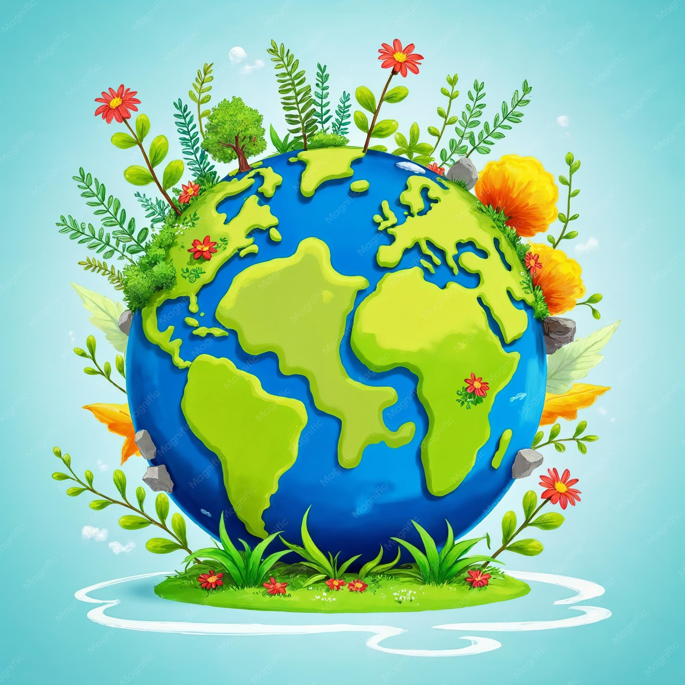

## A Language Is Not an Island
Borrow a word from biology for a moment. An *ecosystem* is not a collection of organisms; it is a web of relationships. The organisms matter, but what makes the system an ecosystem is everything happening *between* them: the soil that feeds the tree, the fungi threading through the roots, the water cycling through all of it. Remove the surrounding web and the organism is just a specimen in a jar. It survives, briefly, but it does not live.

A programming language is the same kind of thing. C is not a file called `gcc`. Rust is not a single binary you download. A language, as you actually *use* it, is a living arrangement of surrounding parts: the compiler that translates it, the build system that orchestrates the translation, the package manager that fetches what it depends on, the version control that remembers every version it has ever been, the formatter that settles the arguments nobody wants to have. The language sits at the center, but it is held there by a crew.

{fig-align="center" width=7in .rounded-28pt}

## The Support Crew
This section of the notebook is about that crew.

The other notebooks study languages: their grammar, their semantics, the design decisions baked into their syntax. This one studies the things that languages cannot live without and yet are not languages themselves. Git is the clearest example, and the reason this section exists. Git is not a language. You do not write programs in it. But it is one of the most consequential pieces of software ever built, and it earns a place beside the languages for exactly the reason they do: it was *designed*, deliberately and well, and its design is worth understanding.

That is the bar for admission here. Not "useful", though everything in this section is useful. The bar is **designed to last**. The members of this support crew share a particular kind of longevity: they solved a real problem so cleanly that they became part of the furniture of the craft, the assumptions you stop noticing because they are simply always there. Make has been building software since 1976. Git has eaten nearly the entire world of version control in under two decades. These are not accidents of popularity. They are the dividends of good design, and good design is what this notebook is about.

## What Lives Here
::: {.subheading}
And what makes something a candidate
:::

You will not find a rigid taxonomy. An ecosystem resists clean borders, and that is the point: the moment you draw a hard line around "tools" you have excluded the protocol, the format, the convention that turned out to matter just as much. So the membership is generous on purpose. A build tool belongs here. So might a wire format, a shell, a hashing scheme, a humble file format that refused to die. If it sits *beside* the languages rather than *being* one, if it was built thoughtfully, and if it has earned its permanence, it has a home in this section.

The languages get the spotlight. But no language ever shipped a line of working software alone. This is where we give the rest of the cast their due.
