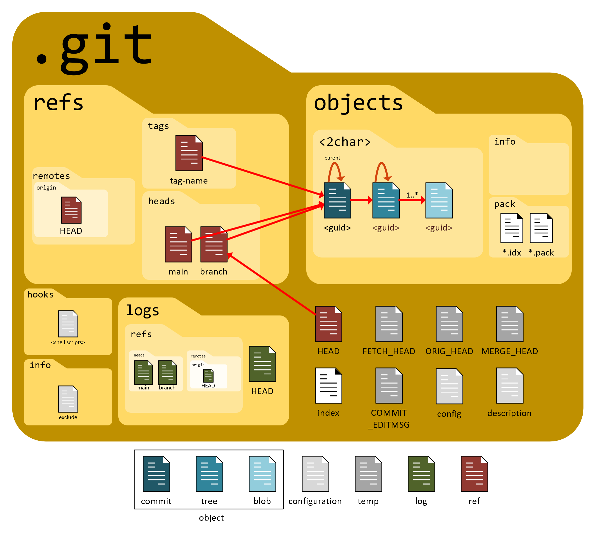

## Overview
{fig-alt="Git logo" width=2.25in style="float: left; padding: 0 1em"}

The name "Git" was coined by its creator, Linus Torvalds, "I'm an egotistical bastard, and I name all my projects after myself. First 'Linux', now 'git'". In British English slang, a "git" is an unpleasant, silly, or incompetent person.

This document bridges the gap between surface-level Git usage and a deeper understanding of Git's internal models. It serves as both an immediate command reference and an explanatory guide for complex operations including history tracking, branch synchronization, interactive rebasing, and submodule management.

::: {.explanation data-label="Peanut Butter in my Chocolate?"}
"What is Git doing in a notebook on languages? Hello? Is this thing on??" Frankly, I needed a place to park it and this notebook made sense in my mind:

1. I'll never create a version control notebook 'cuz for all intents and purposes there is only one version control system and it is Git.
2. Chances are very high that the files we create in these languages are going to be parked in Git.
3. Chances are the compilers and interpreters for the languages in this notebook are parked in Git.
4. I use Git like a gorilla, but I'm hoping I can expand my horizons with this document.
:::

An introductory section focused on Git's internal storage model is a great addition. Understanding how Git structures data under the hood makes commands like `checkout`, `reset`, and `submodules` feel much less abstract.

Here is a section you can drop directly into the top of your markdown file, right under the main title.

## The Anatomy of a Git Repository
::: {.subheading}
The Three Trees and the Object Database
:::

To understand how Git tracks changes, you must look past your visible project files. Git manages your project using three internal conceptual areas (often called the **Three Trees**) backed by a simple key-value object database inside the hidden `.git` folder.

### The Three Trees
{fig-align="center" width=8in}

Efficient Git usage relies on knowing which "tree" you are currently manipulating.

1. **The Working Directory (The Sandbox):** This is the actual file system on your computer where you modify files. These files are real, physical assets you open in your IDE.
2. **The Staging Area / Index (The Blueprint):** A single, binary file located at `.git/index`. It acts as a preparation area that calculates exactly what the next snapshot will look like. When you run `git add`, you are taking a snapshot of your files at that exact moment and staging them.
3. **The Commit History / HEAD (The Vault):** This is the permanent record. When you run `git commit`, Git takes the blueprint from the Staging Area and permanently writes it into the local database as a commit object. `HEAD` is simply a pointer showing which commit in the vault your Working Directory is currently reflecting.

| Action                    | Source Tree             | Target Tree       | Command                  |
|---------------------------|-------------------------|-------------------|--------------------------|
| **Stage Changes**         | Working Directory       | Staging Area      | `git add <file>`         |
| **Commit Changes**        | Staging Area            | Local Repository  | `git commit`             |
| **Unstage Changes**       | Local Repository / HEAD | Staging Area      | `git reset <file>`       |
| **Discard Local Changes** | Staging Area            | Working Directory | `git checkout -- <file>` |

### The Content-Addressable Storage
::: {.subheading}
The `.git/objects` Directory
:::

Git does not track file deltas (the differences between version A and version B). Instead, it acts as a content-addressable key-value store. When you stage or commit a file, Git compresses the content, hashes it using a cryptographic algorithm (SHA-1 or SHA-256), and stores it in `.git/objects`.

The resulting 40-character hexadecimal string acts as both the unique identifier and the exact folder path to that data. If the content of a file does not change, its hash does not change, meaning Git only stores a single copy of that file across your entire history, no matter how many commits reference it.

Inside `.git/objects`, Git breaks data down into four primary object types:

```text
.git/objects/
├── [First 2 chars of hash]/
│   └── [Remaining 38 chars of hash]  --> (A zipped Blob, Tree, or Commit)
```

#### 1. Blobs
::: {.subheading}
Binary Large Objects
:::

A **blob** stores raw file data. It contains only the text or data of a file, completely stripped of metadata. A blob does not know its own filename, its folder structure, or its modification date. It only knows its content.

#### 2. Trees
A **tree** object solves the mystery of the missing filenames. A tree represents a directory. It is a simple text manifest that maps the SHA-1 hashes of blobs back to their actual filenames, permissions, and directory locations. Trees can also point to other trees to represent nested subdirectories.

#### 3. Commits {#commit-objects}
A **commit** object is a small text file pointing to a specific top-level tree object (the snapshot of the project root at that moment). It contains metadata: the author, the committer, the timestamp, the commit log message, and a pointer to one or more **parent commits** (the hashes of the commits that came immediately before it). This chain of parent pointers forms your history graph.

#### 4. Annotated Tags
A tag is an explicit, unchanging pointer containing a commit hash, a tagger name, a message, and a timestamp, used to flag release points like `v1.0.0`.

### Putting It All Together
::: {.subheading}
The Commit Mechanism
:::

When you make a single commit changing one file in a subfolder:

1. Git writes a new **blob** for the modified file content.
2. Git writes a new **tree** for the subfolder to map the new blob to its filename.
3. Git writes a new top-level **tree** for the repository root to link to the updated subfolder tree. Unchanged folders continue to point to their existing, older tree objects.
4. Git writes a **commit object** pointing to the new root tree and listing the previous commit hash as its parent.
5. Git updates your current branch pointer (which is just a text file inside `.git/refs/heads/`) to point to the hash of this new commit object.

## Search & Investigation
Investigation in Git falls into two fundamentally different activities, and confusing them is the source of most frustration. The first is **searching a single snapshot**: "where, in the code as it exists *right now*, does this function live?" The second is **searching across history**: "*when*, across the thousands of snapshots in my object database, did this line appear, change, or vanish?" The working tree is a single point in time; history is the entire DAG of commits behind it. Different questions, different tools. The subsections below are ordered from the gentlest (walking the timeline) to the most surgical (binary-searching the graph for a regression).

### Basic Navigation & History
::: {.subheading}
Exploring the Timeline
:::

Everything here is built on a single command, `git log`, which is simply a walk over the parent pointers introduced earlier. Recall that each commit object stores a hash of its parent ([Commits](#commit-objects)); `git log` starts at `HEAD` and follows those pointers backwards, printing each commit it visits. That is the entire mechanism. Every flag below is just a filter applied to that walk: `--author` discards commits whose author field doesn't match, `--since` discards commits outside a time window, and `-- <file_path>` discards commits whose snapshot didn't touch that path. Because it is a graph walk and not a flat list, `--graph` can draw the branch and merge topology directly, and `--all` tells the walk to start from *every* branch tip rather than just your current `HEAD`.

| Objective                  | Command                            | Purpose / Context                                                               |
|:---------------------------|:-----------------------------------|:--------------------------------------------------------------------------------|
| **Visual History**         | `git log --oneline --graph --all`  | Displays a compact, visual representation of all branches, merges, and commits. |
| **Filter by Author**       | `git log --author="Name"`          | Restricts the history to commits made by a specific person.                     |
| **Filter by Date**         | `git log --since="2 weeks ago"`    | Restricts the history to a specific timeframe (e.g., `--since`, `--until`).     |
| **Filter by File**         | `git log -- <file_path>`           | Shows only the commits that modified a specific file or directory.              |
| **Search Commit Messages** | `git log --grep="fix memory leak"` | Filters the walk to commits whose *log message* matches the pattern.            |
| **Inspect a Commit**       | `git show <hash>`                  | Displays the log message and full diff of exactly what changed in that commit.  |

::: {.callout-note}
`--grep` searches the commit *message*, the human prose you wrote. This is a different axis entirely from `-S` and `-G` in the [Advanced Code Tracing](#advanced-code-tracing) table below, which search the *content of the diff* (the code itself). "Find the commit where someone mentioned the leak" versus "find the commit where the leaking line actually changed" are distinct questions, and Git gives you a distinct flag for each.
:::

### Searching the Working Tree
::: {.subheading}
`git grep` vs. the System `grep`
:::

This is the "single snapshot" half of investigation, and it is worth being explicit about why a dedicated tool exists. You could run the ordinary system `grep -r` over your project folder, but it has no idea what Git is tracking: it will descend into `node_modules`, dredge up build artifacts, and search files you have told Git to ignore. `git grep` searches only the contents Git knows about, which makes it both faster (it consults the index rather than stat-ing every file on disk) and cleaner (it honors `.gitignore`). Critically, it can also search any *past* snapshot without touching your working directory: by naming a commit or tag, you ask Git to decompress that historical tree and search it in place, then hand you the results while your checked-out files stay exactly as they are.

| Objective                  | Command                              | Purpose / Context                                                                         |
|:---------------------------|:-------------------------------------|:------------------------------------------------------------------------------------------|
| **Search Current Code**    | `git grep "pattern"`                 | Searches all tracked files in the working tree; respects `.gitignore`.                    |
| **Show Line Numbers**      | `git grep -n "pattern"`              | Prepends the line number to each match for direct navigation.                             |
| **Search a Past Snapshot** | `git grep "pattern" <commit_or_tag>` | Searches the content of any historical commit or tag without checking it out.             |
| **Count Matches per File** | `git grep -c "pattern"`              | Reports how many times the pattern appears in each file rather than the lines themselves. |

### Working with Tags
::: {.subheading}
Locating and Understanding Releases
:::

It is worth clearing up exactly where tags live, because it explains why their search commands behave the way they do. A tag is **not** part of any branch. Branches and tags are both just *refs*, named pointers to a commit hash, but they sit in different drawers: branches in `.git/refs/heads/`, tags in `.git/refs/tags/`. The difference is behavioral. A branch ref moves forward automatically every time you commit on it; a tag ref never moves on its own once created. So a tag isn't anchored to a branch at all, it is anchored directly to a single commit. That commit may happen to be reachable from several branches, or from none (if every branch that once contained it has since moved on), and the tag will sit there pointing at it regardless.

This is why `git tag` lists *every* tag in the repository rather than "the tags on this branch", the concept of "tags on a branch" doesn't exist. When you genuinely want the branch relationship, you have to ask the inverse question with `git branch --contains`: given this tagged commit, which branches have it somewhere in their ancestry?

| Objective                  | Command                            | Purpose / Context                                                                    |
|:---------------------------|:-----------------------------------|:-------------------------------------------------------------------------------------|
| **List All Tags**          | `git tag`                          | Outputs a list of all tags in the repository (tags are global, not per-branch).      |
| **Search Tags by Pattern** | `git tag -l "v2.0*"`               | Filters the tag list using wildcard patterns to find specific versions.              |
| **Inspect a Tag**          | `git show <tag_name>`              | Displays the tag's metadata (annotated message, tagger) and the commit it points to. |
| **Find Branches with Tag** | `git branch --contains <tag_name>` | Lists all branches that have this tag's commit in their ancestry line.               |

### Advanced Code Tracing {#advanced-code-tracing}
::: {.subheading}
Git as a Directed Acyclic Graph (DAG)
:::

This is the "across history" half of investigation, and it leans entirely on the structure built in [The Anatomy of a Git Repository](#the-anatomy-of-a-git-repository). Because Git stores full snapshots linked by parent pointers ([Commits](#commit-objects)) rather than a flat changelog, you are not searching a list, you are traversing a Directed Acyclic Graph: directed because parent pointers run one way (backwards in time), acyclic because a commit can never be its own ancestor. The tools below query that graph by *content transformation*. Rather than asking "what is in this commit", they ask "between a commit and its parent, did this string's count change, did this regex appear in the diff, did this specific line get rewritten?" That comparison against the parent is what lets you pinpoint the exact moment a piece of code came into being.

The two pickaxe variants are easy to confuse, so the distinction is worth stating plainly. `-S` is a *counting* search: it flags a commit only when the number of occurrences of your string differs from the parent, which answers "where was this added or removed?" `-G` is a *content* search: it flags any commit whose diff has an added or removed line matching your regex, even if the total count is unchanged, which answers "where was a line containing this touched at all?" Reach for `-S` to find an introduction or deletion; reach for `-G` to catch a modification that `-S` would miss because the line was edited rather than added.

| Objective                          | Command                                | Purpose / Context                                                                                                  |
|:-----------------------------------|:---------------------------------------|:-------------------------------------------------------------------------------------------------------------------|
| **Find String Addition/Removal**   | `git log -S "search_string" --oneline` | Locates commits where the absolute count of the string changed. (The "Pickaxe" search).                            |
| **Find String Regular Expression** | `git log -G "regex_pattern" -p`        | Locates commits where an added or removed diff line matches the pattern, even if the count is unchanged.           |
| **Track Line History Range**       | `git log -L <start>,<end>:<file_path>` | Traces the evolution of specific line ranges across time.                                                          |
| **Trace File Rename History**      | `git log --follow -- <file_path>`      | Ensures history tracking persists across file renames.                                                             |
| **Inspect Line Ancestry**          | `git blame -w -M <file_path>`          | Displays author and commit hash for each line, ignoring whitespace (`-w`) and moving lines within the file (`-M`). |
| **Blame Past a Noise Commit**      | `git blame <commit>^ -- <file_path>`   | Re-runs blame against the *parent* of a known formatting commit, skipping it to reveal the real author beneath.    |

### Hunting a Regression
::: {.subheading}
`git bisect`
:::

The tools above find *where code lives*; `git bisect` finds *which commit broke something*, and it is the most powerful investigation tool Git offers. The insight is that your history is a sorted sequence: somewhere along the chain of commits there is a transition from "working" to "broken", and you want the single commit where that flip happened. Checking every commit one by one is linear, but because the commits are ordered, you can binary-search them instead. Tell Git one commit that is known **good** and one that is known **bad**, and it checks out the commit halfway between them. You test it and report `good` or `bad`; Git discards the half that cannot contain the transition and bisects again. A history of a thousand commits collapses to roughly ten tests.

| Objective                | Command                                        | Purpose / Context                                                              |
|:-------------------------|:-----------------------------------------------|:-------------------------------------------------------------------------------|
| **Begin a Hunt**         | `git bisect start`                             | Enters bisect mode, ready to receive the boundary commits.                     |
| **Mark the Boundaries**  | `git bisect bad` <br> `git bisect good <hash>` | Declares the current commit broken and an older commit known to work.          |
| **Report a Test Result** | `git bisect good` / `git bisect bad`           | Reports the checked-out midpoint, prompting Git to narrow the range further.   |
| **Automate the Search**  | `git bisect run <test_command>`                | Runs a script at each step, using its exit code to mark commits automatically. |
| **End the Hunt**         | `git bisect reset`                             | Restores `HEAD` to where you started before the bisect began.                  |

### Recovering Lost Work
::: {.subheading}
`git reflog`
:::

Not all investigation is about other people's code; sometimes you need to investigate your own recent past, usually after a rebase or reset that seems to have eaten your commits. Here is the reassuring truth: those commits are almost never gone. When a branch ref moves off a commit, the commit object still sits in the database; it has merely become *unreachable*, with no ref pointing at it. The **reflog** is Git's private journal of everywhere `HEAD` and your branch tips have pointed, recorded every time they moved. It is purely local and never pushed. Because it remembers the hash a ref held *before* your destructive command, it gives you the address of the "lost" commit so you can point a branch back at it and bring it back to life.

| Objective                     | Command                         | Purpose / Context                                                                     |
|:------------------------------|:--------------------------------|:--------------------------------------------------------------------------------------|
| **View HEAD Movements**       | `git reflog`                    | Lists recent positions of `HEAD` with their hashes and the action that moved them.    |
| **Inspect a Lost Commit**     | `git show HEAD@{2}`             | Shows the commit `HEAD` pointed to two moves ago, using reflog's positional syntax.   |
| **Recover to a Prior State**  | `git reset --hard HEAD@{1}`     | Moves your branch back to where it was one action ago, undoing a bad reset or rebase. |
| **Rescue an Orphaned Commit** | `git branch rescue <lost_hash>` | Anchors a new branch to a commit found in the reflog, making it reachable again.      |

### Tutorial
::: {.subheading}
Tracking the Origins of Code
:::

When a standard `git blame` shows a generic "Refactor formatting" commit instead of the actual author of the logic, the file's ancestry must be traced backwards.

1. **Locate the line range** of interest in your file (e.g., lines 45 through 60 in `analysis.qmd`).
2. **Execute the line-log search** to filter the DAG down to only modifications affecting those lines:
	```bash
	git log -L 45,60:analysis.qmd --oneline
	```
3. **Identify the root commit** at the bottom of this generated log.
4. If the code was introduced from another file entirely, run a **pickaxe search** using a signature keyword or definition from that snippet across the whole history:
	```bash
	git log -S "void calculate_weights" -p --raw
	```

If `git blame` keeps stopping at the same formatting commit, blame its parent instead to step past the noise and find the commit that actually wrote the logic:

```bash
git blame <formatting_commit>^ -- analysis.qmd
```

## Managing Diverged Branches
::: {.subheading}
`merge` vs. `rebase`
:::

### The Concept
::: {.subheading}
Divergence Architecture
:::

Branches diverge when your local branch and its remote counterpart (or a base branch like `main`) both receive unique commits after their last common ancestor.

```
          B---C [feature] (Your Local Branch)
         /
    A---D---E [main] (Remote / Shared Branch)
```

To integrate changes from `main` into `feature`, you have two structural options:

- **Explicit Merge (`git merge`):** Creates a non-destructive, multi-parent merge commit (`F`). Preserves historical reality but introduces non-linear topology ("train tracks").
- **Rebase (`git rebase`):** Rewrites history by moving the entire sequence of your local commits (`B`, `C`) to the tip of the target branch (`E`). This creates new commits (`B'`, `C'`) with identical content but new hashes, yielding a perfectly linear history.

```
                B'---C' [feature] (Rewritten History)
               /
    A---D---E [main]
```

### Finding Where Two Branches Diverged
::: {.subheading}
The fork in the road
:::

Before you can integrate divergent branches, it helps to answer a prior question: *where did they split?* That commit, their most recent common ancestor (commit `A` in the diagrams above), is what `git merge-base` finds.

```bash
git merge-base main feature      # the commit where the two diverged
```

From there, two cousins answer "what's different?":

| Command | What it gives you |
|:--------|:------------------|
| `git merge-base A B` | The single best common ancestor: the fork in the road. |
| `git merge-base --all A B` | *All* common ancestors, for criss-crossed merge histories. |
| `git log --oneline A..B` | Commits on `B` but not `A` (everything after the fork, on B's side). |
| `git log --oneline --left-right A...B` | Both sides at once: `<` is unique to `A`, `>` unique to `B`. |

::: {.callout-note}
**Two dots vs. three.** `A..B` means "reachable from B but not A." `A...B` (symmetric difference) means "reachable from one but not both", and the **merge-base is exactly the point where the three-dot range stops.** That's why finding the fork and listing the divergence are the same idea viewed from two angles.
:::

### Reference & Commands
| Objective              | Command                                       | Structural Impact                                                                |
|:-----------------------|:----------------------------------------------|:---------------------------------------------------------------------------------|
| **Standard Merge**     | `git merge main`                              | Creates a merge commit; preserves chronological branch context.                  |
| **Linear Rebase**      | `git rebase main`                             | Replays local commits sequentially on top of target branch base.                 |
| **Abort Operations**   | `git merge --abort` <br> `git rebase --abort` | Halts execution and restores the index and working tree to pre-operation states. |
| **Conflict Discovery** | `git status`                                  | Lists unmerged paths requiring manual intervention.                              |

### Tutorial
::: {.subheading}
Resolving Divergence with Minimal Friction
:::

When your local branch cannot be pushed because the remote tracking branch has new work, use a rebase-driven alignment to avoid creating unnecessary merge loops.

1. **Fetch current upstream state** without shifting your HEAD pointer:
	```bash
	git fetch origin
	```
2. **Initiate the rebase** on top of the updated remote branch (e.g., `main`):
	```bash
	git rebase origin/main
	```
3. **Handle Conflicts Immediately:** If Git pauses due to conflicting edits, it will leave the markers (`<<<<<<<`, `=======`, `>>>>>>>`) directly in your source files.
	- Open the affected file.
	- The top block (between `HEAD` and `=======`) represents the upstream state from `main`.
	- The bottom block (between `=======` and your commit hash) represents your local changes.
	- Edit the file to unify the logic, removing all conflict markers.
4. **Stage and Progress:** Do *not* run a new commit command. Stage the resolved assets and instruct the rebase engine to proceed to your next commit:
	```bash
	git add path/to/resolved_file.qmd
	git rebase --continue
	```

## Interactive Rebasing
::: {.subheading}
`rebase -i`
:::

### The Concept
::: {.subheading}
History Sanitization
:::

Interactive rebasing provides precise control over local commits *before* sharing them with an upstream repository. It allows you to clean up erratic commit history ("fixed typo", "trying again", "actual fix") into clean, logical semantic units.

> **Absolute Rule:** Never interactively rebase commits that have already been pushed to a public or shared repository. Rewriting shared history invalidates the commit hashes of your collaborators, breaking their downstream trees.

### Reference & Commands
| Sub-Command / Action | Syntax in Instruction Sheet | Functional Mechanics                                                                       |
|:---------------------|:----------------------------|:-------------------------------------------------------------------------------------------|
| **pick**             | `pick <hash> <message>`     | Retains the commit exactly as it is.                                                       |
| **reword**           | `reword <hash> <message>`   | Retains the commit content but opens an editor to rewrite the log message.                 |
| **edit**             | `edit <hash> <message>`     | Halts execution at this commit to allow modification of file contents.                     |
| **squash**           | `squash <hash> <message>`   | Melds the commit content into the *previous* commit, combining log messages.               |
| **fixup**            | `fixup <hash> <message>`    | Melds the commit content into the *previous* commit, discarding this commit's log message. |
| **drop**             | `drop <hash> <message>`     | Removes the commit entirely from the branch history.                                       |

### Tutorial
::: {.subheading}
Cleaning Up Your Local Commits
:::

Assume you have made 4 commits locally, but the middle two are intermediate fixes that clutter the project log.

1. **Launch the interactive editor** targeting the last 4 commits on your current branch:
	```bash
	git rebase -i HEAD~4
	```
2. **Analyze the instruction list:** An editor window will open showing your commits chronologically from top to bottom (the reverse of `git log`).
	```text
	pick a1b2c3d Initial data ingestion script
	pick e5f6g7h Fix broken file path handling
	pick i9j0k1l Typo correction in headers
	pick m3n4o5p Complete visualization pipeline
	```
3. **Modify the operations:** Change the instructions to consolidate the intermediate commits into the primary ingestion script.
	```text
	pick a1b2c3d Initial data ingestion script
	fixup e5f6g7h Fix broken file path handling
	fixup i9j0k1l Typo correction in headers
	pick m3n4o5p Complete visualization pipeline
	```
4. **Save and Close** the editor. Git will sequentially apply `a1b2c3d`, merge the structural changes of the next two commits directly into it without changing its intent, and then apply `m3n4o5p`. Your history is now condensed into two pristine commits.

## Git Submodules
### The Concept
::: {.subheading}
Pointers to External Repositories
:::

A Git submodule is a fully independent Git repository embedded within a subdirectory of a parent ("superproject") repository. Crucially, the parent repository does not track the file contents of the submodule. Instead, it tracks exactly two things:

1. The **submodule path** and its source URL (recorded in a `.gitmodules` file).
2. A **gitlink entry**: a specific, fixed commit hash pointing to the exact state of the submodule repository.

### Reference & Commands
| Objective                          | Command                                   | Scope                                                                                        |
|:-----------------------------------|:------------------------------------------|:---------------------------------------------------------------------------------------------|
| **Clone Parent with Submodules**   | `git clone --recurse-submodules <url>`    | Clones the superproject and automatically checks out all internal submodules.                |
| **Initialize Existing Submodules** | `git submodule update --init --recursive` | Configures and fetches data for submodules if cloned without the recursive flag.             |
| **Check Submodule Status**         | `git submodule status`                    | Displays current active hashes of submodules; a leading `-` indicates uninitialized state.   |
| **Pull Submodule Changes**         | `git submodule update --remote --merge`   | Fetches the newest modifications from the remote tracking branch specified in `.gitmodules`. |

### Tutorial
::: {.subheading}
Resolving Out-of-Sync Submodules
:::

A common point of failure occurs when a collaborator updates a submodule reference on a remote branch, and your local workspace falls out of sync after a pull, resulting in modified dirty working directories.

1. **Pull the latest parent commits:**
	```bash
	git pull origin main
	```
2. Running `git status` may show the submodule directory as modified or untracked because your local pointer has moved in history, but the physical files in that directory haven't shifted yet.
3. **Synchronize the physical files** to match the precise commit hash expected by the parent project:
	```bash
	git submodule update --init --recursive
	```
4. **Making edits inside a submodule:** If you need to make changes to the submodule library itself:
	- Change into the submodule directory: `cd path/to/submodule`.
	- Check out an active branch (submodules default to a "detached HEAD" state): `git checkout main`.
	- Stage, commit, and push your changes *within* the submodule repository first.
	- Return to the parent repository (`cd ..`) and commit the new submodule pointer change so the superproject links to your new work.

## Emergency Recovery Options
### The Concept
::: {.subheading}
The Safety Net (`git reflog`)
:::

Git almost never deletes anything that has been committed. Even when you rewrite history, delete a branch, or perform a destructive rebase, the old commits remain dangling in your database for a grace period (typically 30–90 days). The **Reference Log** (`reflog`) records every single movement of the `HEAD` pointer on your local machine.

### Reference & Commands
| Objective                      | Command                         | Context                                                                                              |
|:-------------------------------|:--------------------------------|:-----------------------------------------------------------------------------------------------------|
| **View Local Pointer History** | `git reflog`                    | Chronological list of every action that shifted your local HEAD pointer.                             |
| **Restore a Specific State**   | `git reset --hard HEAD@{index}` | Destructively forces working directory, staging area, and branch pointer to a specific reflog state. |
| **Undo Last Local Commit**     | `git reset --soft HEAD~1`       | Uncommits the last change, preserving your modifications safely in your staging area.                |
| **Wipe Untracked Files**       | `git clean -fd`                 | Forcefully removes untracked files (`-f`) and directories (`-d`) from the workspace.                 |

### Tutorial
::: {.subheading}
Recovering from a Destructive Rebase
:::

If you run a rebase that goes completely wrong, corrupts your code, or deletes crucial commits, you can use the reflog to time-travel back to the moment before the rebase started.

1. **Query the local reference log:**
	```bash
	git reflog
	```
2. **Analyze the output log** from top to bottom (most recent actions are at the top):
	```text
	7a8b9c0 HEAD@{0}: rebase (continue): Finished rebase onto origin/main
	3d4e5f6 HEAD@{1}: rebase (step): Applied commit "Fixed typo"
	1a2b3c4 HEAD@{2}: rebase (start): checkout origin/main
	987f65e HEAD@{3}: commit: Ready for production architecture
	```
3. **Locate the entry** right before the rebase mechanics began. In this case, `HEAD@{3}` represents your pristine local state before the rebase started.
4. **Hard-reset your branch** back to that safe coordinate:
	```bash
	git reset --hard HEAD@{3}
	```

Your working directory and commit history are now restored exactly as they existed before the operation.
