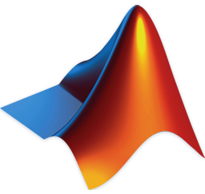
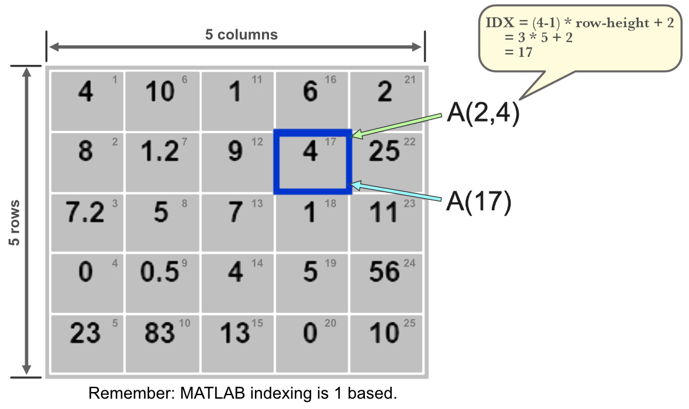
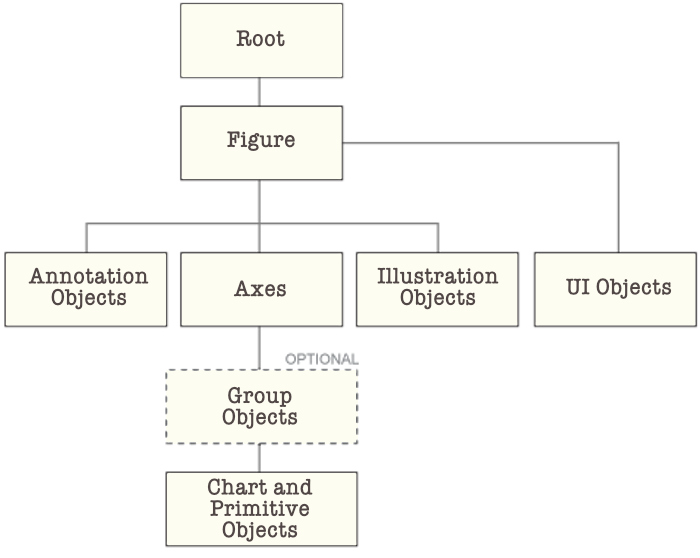
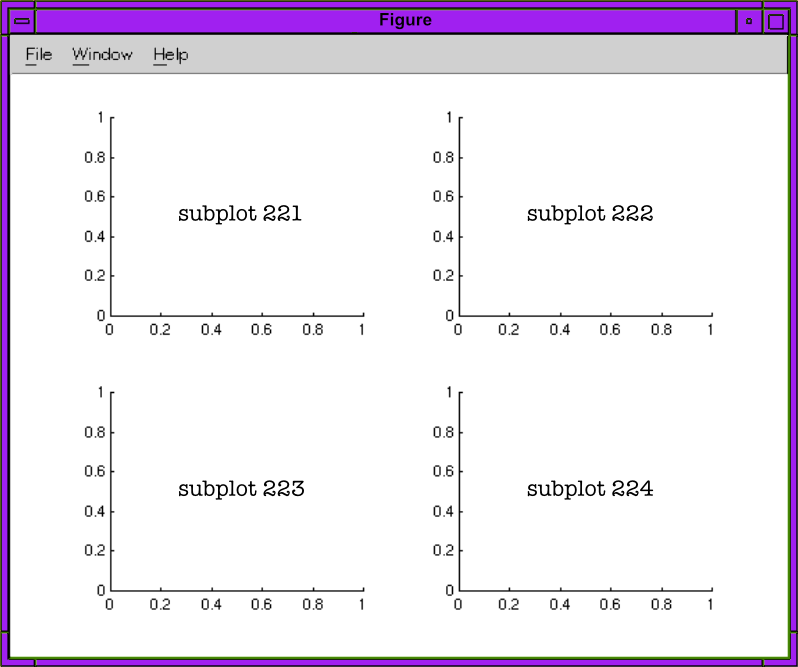

## Overview
[Documentation](https://www.mathworks.com/help/index.html){target="_blank" rel="noopener noreferrer"}

{fig-alt="MATLAB logo" width=2.1in style="float: left; padding-right: 1.5em"}

MATLAB (Matrix Laboratory), owned by MathWorks, Inc., is a proprietary multi-paradigm programming language and numeric computing environment developed by MathWorks. It is widely used for engineering and scientific applications such as data analysis, signal and image processing, control systems, and robotics, integrating computation, visualization, and programming in a user-friendly environment.

MATLAB is primarily an interpreted language, but it incorporates a Just-In-Time (JIT) compiler to enhance performance. MATLAB can be run outside its IDE. Users can compile MATLAB applications into standalone executables using the MATLAB Compiler. These compiled applications can then be executed on computers that do not have a full MATLAB installation, provided the MATLAB Runtime is installed.

## Code
::: {.see-more}
- [Documentation](https://www.mathworks.com/help/matlab/getting-started-with-matlab.html){target="_blank" rel="noopener noreferrer"}
- [Help](https://www.mathworks.com/help/matlab/learn_matlab/help.html){target="_blank" rel="noopener noreferrer"}
:::

### Line Termination
Who would have guessed that the Terminator 🤖 is a semicolon. Semicolons are optional but important. They control output display.

#### The Rule
- **With semicolon (`;`):** Suppresses output to command window.
- **Without semicolon:** Displays the result.

::: {.example}
```matlab
x = [1, 2, 3]         % Displays: x = [1 2 3]
y = [1, 2, 3];        % Suppresses output (silent)

disp('Hello')         % Still displays "Hello" (disp always shows output)
disp('Hello');        % Also displays "Hello" (disp ignores semicolons)
```
:::

#### Best Practice
Our feeling is just use them. If you want to write something to `stdout` then explicitly write it using one of the [output](#console) methods.

#### Lean Machine
- Use semicolons for assignments and calculations (keeps workspace clean)
- Functions like `disp()`, `plot()`, `subplot()` don't need them since they don't return values to display

### Line Continuation
The line continuation [operator](https://www.mathworks.com/help/releases/R2025b/matlab/ref/ellipsis.html){target="_blank" rel="noopener noreferrer"} is `...`.

::: {.example}
```matlab
vname = "name";
value = 10;
sprintf(["The current value " + ...
    "of %s is %d"],vname,value)
```
:::

### Comments
Comments are made with the percent character `%`.

```matlab
% single line comment

%{
  A comment block for writing your dissertation
%}
```

### Help
MATLAB has built-in help 🎉. There are a few ways to tap into it: [`help`](#help-command), [`doc`](#doc-command), [examples](#openexample-function) and `docsearch`. The last fella (`docsearch`) opens a tab in your default browser.

```matlab
% opens the same page as `doc` (https://www.mathworks.com/help/releases/R2025b/index.html)
docsearch

% opens a dynamic page with search results
docsearch plotting
```

#### `help` Command
`help` is a command: `help <name>`. You can ask for help for functions, methods, classes, toolboxes, variables (?), topics and namespaces. Topics are a curious bunch. They all appear to have a folder like structure: `<topic>/help`. I imagine type topics are dynamic and dependent upon what is installed on your machine. The topics that `help help` lists on my machine are:

- `dsp/help`
- `fdesign.nyquist/help`
- `fspecs.hbmin/help`
- `fdesign.decimator/help`
- `dom/help`
- `re/help`
- `xml_transform/help`
- `xml_xpath/help`
- `ppt/help`
- `xml/help`

```matlab
% function help
help plot

% variable help
c = 2
help c
% >> c is a variable of type double

% class help
help double
```

#### `doc` Command
`doc` is pretty special. Especially if you don't like search Mathwork's website, 'cuz `doc <name>` opens *name's* documentation in a new tab in your system web browser. `doc` will pull up MATLAB's [index page](https://www.mathworks.com/help/releases/R2025b/index.html){target="_blank" rel="noopener noreferrer"}.

```matlab
% Open MATLAB's index page
doc

% Open MATLAB's plot documentation
doc plot
```

#### `openExample` Function
`openExample` opens a MathWorks example. It will download the specified example into a subfolder of the current running release Examples folder and then opens it.

```matlab
% open the Create 2-D Line Plot example that is part of the MATLAB graphics documentation.
openExample("graphics/Create2DLinePlotsExample")

% open the parabola.m supporting file. If parabola.m is included in multiple
% examples, openExample selects one of the examples to download.
%{
  A supporting file can be any supporting file included in a MathWorks example.
  Specifying a folder, project file, the main example file, or a supporting file
  in a subfolder is not supported. If supportingFile does not include an extension,
  openExample looks for files with a .m, .mlx, or .slx extension.
%}
openExample("parabola.m")
```

## Variables
### Types
MATLAB offers a rich set of data types which are called *classes*. To find a variable's class, use `class(<variable>)`

- `single`, `double`: floating point numbers. `double` is the default type.
- `int8`, `int16`, `int32`, `int64`: signed integer types.
- `uint8`, `uint16`, `uint32`, `uint64`: unsigned integer types.
- `char`: For single characters.
- `string`: For text.
- `logical`: For true/false values.
- `cell`: Arrays that can hold different data types.
- `struct`: Structures with named fields.

### Declaration and Definition
Variables are case sensitive and can be up to 63 characters in length. They must start with a letter: `[a-zA-Z][a-zA-X0-9_]{0,62}`. Variables are created with assignment. There is no need to declare a type.

```matlab
% Numeric variable
my_num = 10.5;

% Character variable
my_char = 'a';

% String variable
my_string = "Hello, World!";

% Logical variable
my_logical = true;

% Cell array
my_cell = {1, 'two', [3, 4]};

% Structure
my_struct.name = "John";
my_struct.age = 30;

class(my_struct)
% >> ans = 'struct'
```

### Scope Rules
- **Local:** Variables defined in a function are local to that function.
- **Global:** Variables can be declared as global to be accessed across functions.

```matlab
function my_func()
  local_var = 10; % Local variable
  global global_var;
  global_var = 20; % Global variable
end
```

### Reserved Variables
| Variable    | Description                              |
|-------------|------------------------------------------|
| `pi`        | Value of $\pi$                           |
| `eps`       | Smallest incremental number              |
| `inf`       | Infinity ($\infty$)                      |
| `NaN`       | Not a number, e.g. $0/0$                 |
| `i` and `j` | i = j = square root of -1 ($\sqrt{-1}$)  |
| `realmin`   | The smallest usable positive real number |
| `realmax`   | The largest usable positive real number  |

## Operators
We are throwing in operations (functional) that are topping Dick Clark's charts.

### Arithmetic
::: {.see-more}
[Documentation](https://www.mathworks.com/help/releases/R2025b/matlab/arithmetic-operators.html){target="_blank" rel="noopener noreferrer"}
:::

| Operator   | Description                 | Example       |
|------------|-----------------------------|---------------|
| `+`        | Addition                    | `a + b`       |
| `-`        | Subtraction                 | `a - b`       |
| `*`        | Matrix Multiplication       | `A * B`       |
| `.*`       | Element-wise Multiplication | `A .* B`      |
| `/`        | Matrix Right Division       | `A / B`       |
| `./`       | Element-wise Right Division | `A ./ B`      |
| `\`        | Matrix Left Division        | `A \ B`       |
| `.\`       | Element-wise Left Division  | `A .\ B`      |
| `^`        | Matrix Power                | `A ^ 2`       |
| `.^`       | Element-wise Power          | `A .^ 2`      |
| `.'`       | Transpose Vector or Matrix  | `[1 2 3 4].'` |
| `sum()`    | Sum Array Elements          | `sum(1:5)`    |
| `cumsum()` | Cumulative Sum              | `cumsum(1:5)` |

### Relational
::: {.see-more}
[Documentation](https://www.mathworks.com/help/releases/R2025b/matlab/relational-operators.html){target="_blank" rel="noopener noreferrer"}
:::

| Operator     | Description                  | Example                        |
|--------------|------------------------------|--------------------------------|
| `==`         | Equal to                     | `a == b`                       |
| `~=`         | Not Equal to                 | `a ~= b`                       |
| `>`          | Greater than                 | `a > b`                        |
| `<`          | Less than                    | `a < b`                        |
| `>=`         | Greater than or equal to     | `a >= b`                       |
| `<=`         | Less than or equal to        | `a <= b`                       |
| `isequal()`  | Determine array equality     | `isequal(1:4, 1:4)`            |
| `isequaln()` | Treats `NaN` values as equal | `isequaln([1, NaN], [1, NaN])` |

### Logical
::: {.see-more}
[Documentation](https://www.mathworks.com/help/releases/R2025b/matlab/logical-operations.html){target="_blank" rel="noopener noreferrer"}
:::

| Operator  | Description                        | Example                        |
|-----------|------------------------------------|--------------------------------|
| `&`       | Find Logical AND                   | `[true false] & [true; false]` |
| `&&`      | Logical AND with short-circuiting  | `a && b`                       |
| `|`       | Find Logical OR                    | `[true false] | [true; false]` |
| `||`      | Logical OR with short-circuiting   | `a || b`                       |
| `~`       | Logical NOT                        | `~a`                           |
| `true`    | Logical 1                          | `true == 1`                    |
| `false`   | Logical 0                          | `false == 0`                   |
| `logical` | Convert numeric values to logicals | `logical([1 0 1 0])`)          |
| `all`     | All array elements are nonzero     | `all([1 2 4])`                 |
| `any`     | Any array elements are nonzero     | `any([0 1 3])`                 |

### Special Characters
::: {.see-more}
[Documentation](https://www.mathworks.com/help/releases/R2025b/matlab/special-characters.html){target="_blank" rel="noopener noreferrer"}
:::

| Operator | Description                                                                                                                        | Example                                   |
|----------|------------------------------------------------------------------------------------------------------------------------------------|-------------------------------------------|
| `%`      | Code commments and conversion specifier                                                                                            | `% comment`, `sprintf("%d", 2)`           |
| `%{ %}`  | Block commments                                                                                                                    | ``                           |
| `:`      | [Colon Operator](#colon-operator)                                                                                                  | `1:10`                                    |
| `@`      | Create anonymous functions, function handles, call superclass methods                                                              | `@(x,y) x.^2 + y.^2`                      |
| `!`      | Operating system command                                                                                                           | `!rmdir example`                          |
| `()`     | Command grouping, indexing                                                                                                         | `(5.*(4+8))`, `1:5(1)`                    |
| `{}`     | Cell array creation, [table indexing](https://www.mathworks.com/help/releases/R2025b/matlab/ref/curlybraces.html){target="_blank" rel="noopener noreferrer"} | `{[1 2], rand(8)*4, "string"}`            |
| `[]`     | Array creation/concatenation, element deletion,...                                                                                 | `[1 2]`, `[1:3 [3 6 9]]`, `[1:3](2) = []` |

### Colon Operator
The colon operator (`:`) is used to create vectors, specify ranges, and index arrays. It is shorthand for the `colon()` function. It's format is as follows:

- `[<from>:<to>]`: `from` and `to` may be integers or floating point. `to` is inclusive.
- `[<from>:<increment>:<to>`]: `increment` is the delta between each number generated, but if `increment` does not cleanly divide `to-from` then the last delta will be less than `increment`.

#### Creating Sequences
```matlab
% Create vector from 1 to 10
v1 = 1:10;

% Create vector with specified step
v2 = 1:2:10;  % [1, 3, 5, 7, 9]

% Create decreasing sequence
v3 = 10:-1:1;

% Using with floating point
v4 = 0:0.1:1;  % [0, 0.1, 0.2, ..., 1.0]
```

#### Array Indexing
```matlab
A = [1, 2, 3, 4, 5];
A(2:4)        % Extract elements 2 through 4
A(:)          % All elements as column vector
A(1:2:end)    % Every other element
```

## Strings
::: {.see-more}
[Documentation](https://www.mathworks.com/help/releases/R2025b/matlab/characters-and-strings.html){target="_blank" rel="noopener noreferrer"}
:::

#### String Basics
```matlab
% String creation
s1 = "Hello";           % String (preferred)
s2 = 'Hello';           % Character array

% String concatenation
s3 = s1 + " World";     % "Hello World"
s4 = [s1, " ", "World"]; % "Hello World"

% Character array concatenation
c1 = ['Hello', ' ', 'World'];
```

#### Common Operations
```matlab
% Length
len = strlength("Hello");  % 5

% Substring extraction
sub = extractBetween("Hello World", 1, 5);  % "Hello"

% Find and replace
new_str = replace("Hello World", "World", "MATLAB");

% Case conversion
upper_str = upper("hello");   % "HELLO"
lower_str = lower("HELLO");   % "hello"

% String comparison
isequal("Hello", "Hello")    % true
strcmp("Hello", "World")     % false

% String splitting
parts = split("Hello,World", ",");  % ["Hello"; "World"]

% String joining
joined = join(["Hello", "World"], " ");  % "Hello World"

% String formatting
formatted = sprintf("Value: %.2f", 3.14159);  % "Value: 3.14"
```

## Arrays
::: {.see-more}
- [Documentation](https://www.mathworks.com/help/releases/R2025b/matlab/matrices-and-arrays.html){target="_blank" rel="noopener noreferrer"}
- Categorical Array [Documentation](https://www.mathworks.com/help/releases/R2025b/matlab/categorical-arrays.html){target="_blank" rel="noopener noreferrer"}
- Cell Array [Documentation](https://www.mathworks.com/help/releases/R2025b/matlab/cell-arrays.html){target="_blank" rel="noopener noreferrer"}
:::

Arrays are special forms of matrices that contain 1 row or 1 column.

### Creating Arrays
::: {.callout-tip title="Element Delimiters"}
Both commas and spaces are legitimate element delimiters in Matlab. `a1` and `a2` are the same array in the following example.

```matlab
a1 = [1 2 3 4];
a2 = [1, 2, 3, 4];
```
:::

#### Direct Initialization
```matlab
% Row vector
row = [1, 2, 3, 4];

% Column vector
col = [1; 2; 3; 4];

% Matrix
M = [1, 2, 3; 4, 5, 6];
```

#### The [colon](#colon-operator) Operator
```matlab
% Create vector from 1 to 10
v1 = 1:10;

% Create vector with specified step
v2 = 1:2:10;  % [1, 3, 5, 7, 9]

% Create decreasing sequence
v3 = 10:-1:1;

% Using with floating point
v4 = 0:0.1:1;  % [0, 0.1, 0.2, ..., 1.0]
```

#### Special Array Functions
```matlab
% Zeros array
Z = zeros(3, 4);        % 3x4 matrix of zeros

% Ones array
O = ones(2, 5);         % 2x5 matrix of ones

% Identity matrix
I = eye(4);             % 4x4 identity matrix

% Linearly spaced vector
L = linspace(0, 10, 50); % 50 points from 0 to 10

% Logarithmically spaced vector
Lg = logspace(0, 3, 20); % 20 points from 10^0 to 10^3

% Random arrays
R = rand(3, 3);          % 3x3 uniform random [0,1]
Rn = randn(3, 3);        % 3x3 normal distribution

% Array filled with specific value
F = 5 * ones(2, 3);      % 2x3 array filled with 5
```

#### Concatenating Arrays
```matlab
a = [1, 2, 3, 4]
b = [2, 4, 6, 8]
% Unlike python, MATLAB appends the elements and does not create an
% array of two arrays.
c = [a, b]

% Pad left
a_pl = [zeros(1, 4), a]

% Pad right
a_pr = [a, zeros(1, 4)]
```

### Indexing Arrays
MATLAB uses 1-based indexing.

#### Basic Vector Indexing
```matlab
v = [10, 20, 30, 40, 50];

% Single element
first = v(1);     % 10 (first element)
third = v(3);     % 30
last = v(end);    % 50 (end keyword)

% Multiple elements
subset = v(2:4);  % [20, 30, 40]

% Non-contiguous elements
vals = v([1, 3, 5]);  % [10, 30, 50]

% Every other element
every_other = v(1:2:end);  % [10, 30, 50]
```

#### Logical Indexing
```matlab
v = [10, 20, 30, 40, 50];

% Find elements greater than 25
greater = v(v > 25);  % [30, 40, 50]

% Modify elements that meet condition
v(v < 30) = 0;  % [0, 0, 30, 40, 50]

% Find indices
idx = find(v > 25);  % [3, 4, 5]
```

#### Modifying Arrays
```matlab
v = [10, 20, 30, 40, 50];

% Set single element
v(3) = 100;  % [10, 20, 100, 40, 50]

% Set multiple elements
v(1:2) = [5, 15];  % [5, 15, 100, 40, 50]

% Append element
v(end+1) = 60;  % [5, 15, 100, 40, 50, 60]

% Delete element (using empty array)
v(3) = [];  % [5, 15, 40, 50, 60]
```

#### 2D Array Indexing
`A(:,n)`, `A(m,:)`, `A(:)`, and `A(j:k)` are common indexing expressions for a matrix `A` that contain a colon. When you use a colon as a subscript in an indexing expression, such as `A(:,n)`, it acts as shorthand to include all subscripts in a particular array dimension. It is also common to create a vector with a colon for the purposes of indexing, such as `A(j:k)`. Some indexing expressions combine both uses of the colon, as in `A(:,j:k)`.

Common indexing expressions that contain a colon are:

- `A(:,n)`: is the nth column of matrix A.
- `A(m,:)`: is the mth row of matrix A.
- `A(:,:,p)`: is the pth page of three-dimensional array A.
- `A(:)`: reshapes all elements of A into a single column vector. This has no effect if A is already a column vector.
- `A(:,:)`: reshapes all elements of A into a two-dimensional matrix. This has no effect if A is already a matrix or vector.
- `A(j:k)`: uses the vector j:k to index into A. If A is a vector, then A(j:k) has the same orientation as A. If A is a matrix, thenA(j:k) is a row vector.
- `A(:,j:k)`: includes all subscripts in the first dimension but uses the vector j:k to index in the second dimension. This returns a matrix with columns [A(:,j), A(:,j+1), ..., A(:,k)].

```matlab
A = [1, 2, 3; 4, 5, 6; 7, 8, 9];

% Single element (row, column)
val = A(2, 3);  % 6

% Row or column
row2 = A(2, :);   % [4, 5, 6]
col3 = A(:, 3);   % [3; 6; 9]

% Submatrix
sub = A(1:2, 2:3);  % [2, 3; 5, 6]

% Linear indexing (column-major)
val = A(5);  % 5 (counts: 1,4,7,2,5,...)
```

#### `end`
`end` is MATLAB's keyword for "the last index" of an array. It's super handy for array slicing:

```matlab
x = [1, 2, 3, 4, 5];

x(end)      % Returns 5 (last element)
x(end-1)    % Returns 4 (second to last)
x(1:end-2)  % Returns [1, 2, 3] (all but last 2)
x(3:end)    % Returns [3, 4, 5] (from 3rd to last)
```

Because he is physically footloose and fancy free, there are some rules about where `end` may be used. Really only one rule: he must be inside indexing parentheses `()` or brackets `{}`.

## Matrices
::: {.see-more}
[Documentation](https://www.mathworks.com/help/releases/R2025b/matlab/matrices-and-arrays.html){target="_blank" rel="noopener noreferrer"}
:::

Matrices are everything in MATLAB. A scalar is a single valued matrix. A vector is a matrix with a single row or column. Matrices are badasses. They remind me of R and how most everything is a vector. Mathworks has taken it to another level.

{width=8in}

### Defining Matrices
Matrices are defined using square brackets with specific syntax:

- Commas or spaces separate elements in a row
- Semicolons separate rows
- For 3D+ matrices, use `cat()` or indexing

#### 2D Matrices
```matlab
% 2x3 matrix
A = [1, 2, 3; 4, 5, 6];

% Equivalent using spaces
B = [1 2 3; 4 5 6];

% Row vector (1x4)
row = [1, 2, 3, 4];

% Column vector (4x1)
col = [1; 2; 3; 4];
```

#### 3D Matrices
```matlab
% Method 1: Direct indexing
M = zeros(2, 3, 4);  % 2x3x4 matrix of zeros
M(1, 1, 1) = 5;      % Set individual element

% Method 2: Using cat() to concatenate along 3rd dimension
A = [1, 2; 3, 4];
B = [5, 6; 7, 8];
M3D = cat(3, A, B);  % 2x2x2 matrix

% Access 3rd dimension
first_slice = M3D(:, :, 1);   % A
second_slice = M3D(:, :, 2);  % B
```

#### Higher Dimensions
```matlab
% 4D matrix
M4D = zeros(2, 3, 4, 5);  % 2x3x4x5 matrix

% Concatenate along 4th dimension
M4D = cat(4, M3D, M3D);
```

#### Matrix Operations
```matlab
A = [1, 2; 3, 4];
B = [5, 6; 7, 8];

% Matrix addition
C = A + B;  % [6, 8; 10, 12]

% Matrix multiplication (linear algebra)
D = A * B;  % [19, 22; 43, 50]

% Element-wise multiplication
E = A .* B;  % [5, 12; 21, 32]

% Transpose
A_T = A';  % [1, 3; 2, 4]
```

### Indexing Matrices
{width=8in}

#### Basic Indexing
```matlab
A = [10, 20, 30; 40, 50, 60; 70, 80, 90];

% Single element (row, column)
val = A(2, 3);  % 60

% Entire row
row2 = A(2, :);  % [40, 50, 60]

% Entire column
col3 = A(:, 3);  % [30; 60; 90]

% Multiple rows
rows = A(1:2, :);  % [10, 20, 30; 40, 50, 60]

% Multiple columns
cols = A(:, 2:3);  % [20, 30; 50, 60; 80, 90]
```

#### Advanced Indexing
```matlab
% Specific elements
subset = A([1, 3], [1, 3]);  % [10, 30; 70, 90]

% Linear indexing (column-major order)
val = A(5);  % 50 (counts down columns: 10,40,70,20,50,...)

% End keyword
last = A(end, end);    % 90
second_last = A(end-1, end);  % 60

% Logical indexing
A(A > 50)  % [60, 70, 80, 90]
A(A > 50) = 0;  % Set elements > 50 to 0
```

#### 3D Indexing
```matlab
M = cat(3, [1, 2; 3, 4], [5, 6; 7, 8]);

% Element at (row, col, page)
val = M(2, 1, 2);  % 7

% Entire page
page1 = M(:, :, 1);  % [1, 2; 3, 4]

% All pages, specific element
values = M(1, 1, :);  % [1; 5]
```

## Random Numbers
::: {.see-more}
[Documentation](https://www.mathworks.com/help/matlab/random-number-generation.html){target="_blank" rel="noopener noreferrer"}
:::

| Function                   | Description                                 | Example                   |
|----------------------------|---------------------------------------------|---------------------------|
| `rand()`                   | Uniformly distributed scalar in (0, 1)      | `r = rand()`              |
| `rand(n)`                  | n-by-n matrix of uniform random values      | `A = rand(5)`             |
| `rand(sz1,...,szN)`        | Array of size sz1-by-...-by-szN             | `B = rand(3, 4, 2)`       |
| `rand(sz)`                 | Array of size specified by vector sz        | `C = rand([2, 3, 4])`     |
| `randn()`                  | Normally distributed scalar (mean 0, std 1) | `r = randn()`             |
| `randn(n)`                 | n-by-n matrix of normal random values       | `A = randn(5)`            |
| `randn(sz1,...,szN)`       | Array of size sz1-by-...-by-szN             | `B = randn(3, 4, 2)`      |
| `randn(sz)`                | Array of size specified by vector sz        | `C = randn([2, 3, 4])`    |
| `randi(imax)`              | Random integer scalar from 1 to imax        | `r = randi(10)`           |
| `randi(imax, n)`           | n-by-n matrix of random integers            | `A = randi(100, 5)`       |
| `randi(imax, sz1,...,szN)` | Array of random integers                    | `B = randi(50, 3, 4, 2)`  |
| `randi(imax, sz)`          | Array of size specified by vector sz        | `C = randi(20, [2, 3])`   |
| `randi([imin imax], ...)`  | Random integers in range [imin, imax]       | `D = randi([5 15], 3, 3)` |
| `randperm(n)`              | Random permutation of integers 1:n          | `p = randperm(10)`        |
| `randperm(n, k)`           | k unique random integers from 1:n           | `p = randperm(100, 5)`    |

## Complex Numbers
::: {.see-more}
[Documentation](https://www.mathworks.com/help/matlab/complex-numbers.html){target="_blank" rel="noopener noreferrer"}
:::

MATLAB has native support for complex numbers using `i` or `j` as the imaginary unit.

### Creating Complex Numbers
```matlab
% Direct notation
z1 = 3 + 4i;          % Using i
z2 = 3 + 4j;          % Using j (equivalent)

% Using complex() function
z3 = complex(3, 4);   % complex(real, imag)

% From magnitude and phase
r = 5;                % Magnitude
theta = 0.9273;       % Phase in radians
z4 = r * exp(1i * theta);
```

### Key Functions
| Function    | Description                                         | Example                  |
|-------------|-----------------------------------------------------|--------------------------|
| `real()`    | Extract real part                                   | `real(3+4i)` → `3`       |
| `imag()`    | Extract imaginary part                              | `imag(3+4i)` → `4`       |
| `abs()`     | Magnitude (modulus)                                 | `abs(3+4i)` → `5`        |
| `angle()`   | Phase angle in radians                              | `angle(3+4i)` → `0.9273` |
| `conj()`    | [Complex conjugate](glossary.qmd#complex-conjugate) | `conj(3+4i)` → `3-4i`    |
| `complex()` | Create complex number                               | `complex(3,4)` → `3+4i`  |
| `isreal()`  | Check if real                                       | `isreal(3+4i)` → `false` |

### Conversion Between Forms
```matlab
% Rectangular to polar
z = 3 + 4i;
magnitude = abs(z);      % 5
phase = angle(z);        % 0.9273 radians

% Polar to rectangular
r = 5;
theta = deg2rad(53.13);  % Convert degrees to radians
z = r * exp(1i * theta); % 3+4i
```

### Operations
```matlab
% Arithmetic operations work naturally
z1 = 3 + 4i;
z2 = 1 - 2i;

sum = z1 + z2;           % 4+2i
diff = z1 - z2;          % 2+6i
prod = z1 * z2;          % 11-2i
quot = z1 / z2;          % -1+2i

% Power
z_squared = z1^2;        % -7+24i

% Complex conjugate multiplication
z_mag_squared = z1 * conj(z1);  % 25 (always real)
```

## Conditionals
::: {.see-more}
[Documentation](https://www.mathworks.com/help/releases/R2025b/matlab/control-flow.html){target="_blank" rel="noopener noreferrer"}
:::

```matlab
r = rand();
if r < 0.5
    disp('You are little')
elseif r < 0.75
    disp('You are medium')
else
    disp('You are big')
end
```

```matlab
n = input('Enter a number: ');
switch n
    case -1
        disp('You are negative big')
    case 0
        disp('You are zero big')
    case 1
        disp('You are one big')
    otherwise
        disp('Boo-hoo, there is no you')
end
```

## Loops
::: {.see-more}
[Documentation](https://www.mathworks.com/help/releases/R2025b/matlab/control-flow.html){target="_blank" rel="noopener noreferrer"}
:::

```matlab
for v = 1:10
  disp(v);
end
```

```matlab
n = 5;
f = n;
while n > 1
    n = n-1;
    f = f*n;
end
```

## Iteration
::: {.see-more}
- [Documentation](https://www.mathworks.com/help/matlab/ref/for.html){target="_blank" rel="noopener noreferrer"}
- [Functional Programming](#functional-programming)
:::

#### Iterating Arrays
```matlab
my_array = [1, 2, 3, 4, 5];
for i = 1:length(my_array)
  disp(my_array(i));
end
```

#### Iterating Maps
```matlab
my_map = containers.Map({'a', 'b', 'c'}, {1, 2, 3});
keys = my_map.keys;
for i = 1:length(keys)
  key = keys{i};
  value = my_map(key);
  fprintf('Key: %s, Value: %d\n', key, value);
end
```

## Output
### Console
```matlab
disp('Hello, World!');
fprintf('My name is %s and I am %d years old.\n', 'John', 30);
```

::: {.callout-tip title="LaTeX?"}
`disp` cannot directly render LaTeX expressions. It doesn't support LaTex. However, you may generate mathy strings. The `latex` function can convert symbolic expressions into an expression comprised of ASCII characters. It looks like an equation you might find in a text editor. Which makes me wonder, even if `disp` could convert LaTeX syntax to LaTeX expressions, could the console display them? I guess that depends on the console. The MATLAB Command Window cannot. Back to equations formatted in ASCII, use the `latex` function:

```matlab
eq = 'sqrt(abs(sin(x.^2)))'
ltx = latex(eq);
disp(ltx);
```

:::: {.stdout}
abs(sin(x^2))^(1/2)
::::

You *can*, however, display LaTeX in text elements within plot figures, titles, labels, and legends. When creating text objects in plots, you can set the Interpreter property to 'latex'.

```matlab
x = 0:0.1:2*pi;
y = sin(x);
plot(x, y);
title('$\sin(x)$', 'Interpreter', 'latex');
xlabel('$x$', 'Interpreter', 'latex');
ylabel('$\sin(x)$', 'Interpreter', 'latex');
```
:::

## Plotting
::: {.see-more}
[Documentation](https://www.mathworks.com/help/releases/R2025b/matlab/graphics.html){target="_blank" rel="noopener noreferrer"}
:::

{width=5in}

### Figure Management
- [`figure()`](https://www.mathworks.com/help/matlab/ref/figure.html?s_tid=srchtitle_support_results_1_figure){target="_blank" rel="noopener noreferrer"}
- [`saveas()`](https://www.mathworks.com/help/matlab/ref/saveas.html){target="_blank" rel="noopener noreferrer"}

I moved this to the top because in my mind `figure` is similar to Matplotlib's figure and figures are central to the way Matplotlib manages plots. I am finding it hard to get a good breakdown of figures in MATLAB. Mathway's documentation is long and terse at the same time.  Maybe we'll come back to this someday when we understand what role figures play in the life of a plot. For now, we'll share what was so freely shared with us.

A `figure` is a container for graphics or apps. Use the Figure object to modify the appearance and behavior of a figure after you create it. There are several ways to create a Figure object:

- Create a figure configured for graphics and data exploration tasks by using the `figure` function. Many graphics functions create such a figure automatically.
- Create a figure configured for app building by using the `uifigure` function. App Designer creates such a figure automatically.

It appears to me that whether you start with a figure or not, you get a parent figure. Our little graphic up there 👆 semi-confirms it. It makes sense for a number of reasons: is the layout brains for subplots, contains the super-title, it could have an animation engine, and more stuff like that. Nonetheless, he's a low man on Mathway's documentation totem pole. Poor fella needs some love.

The way you create a figure affects the default property values of the Figure object.

```matlab
% Creates a new figure window using default property values.
% The resulting figure is the current figure.
figure;

% finds a figure in which the Number property is equal to n, and makes it the
% current figure. If no figure exists with that property value, MATLAB creates
% a new figure and sets its Number property to n.
figure(1);

% Create a figure with the specified name property
f = figure(Name="Measured Data");

% returns the Figure object. Use f to query or modify properties of the figure
% after it is created.
f = figure;

% gcf returns the current figure handle. If a figure does not exist, then gcf
% creates a figure and returns its handle. You can use the figure handle to
% query and modify figure properties.
f = gcf;

% Clear current figure
clf;

% Close figure
close;          % Close current figure
close all;      % Close all figures
close(1);       % Close figure 1

% Save figure
saveas(gcf, 'myplot.png');       % PNG format
saveas(gcf, 'myplot.fig');       % MATLAB figure format
print('myplot', '-dpdf');        % PDF format
```

Some handy figure functions:

- `gcf`: get current figure. \[[documentation](https://www.mathworks.com/help/matlab/ref/gcf.html){target="_blank" rel="noopener noreferrer"}\]
- `clf`: deletes all children of the current figure that have visible handles. \[[documentation](https://www.mathworks.com/help/matlab/ref/clf.html){target="_blank" rel="noopener noreferrer"}\]
- `clf(fig)`: deletes all children of the specified figure that have visible handles. \[[documentation](https://www.mathworks.com/help/matlab/ref/clf.html){target="_blank" rel="noopener noreferrer"}\]
- `gca`: returns the current axes in the current figure. \[[documentation](https://www.mathworks.com/help/matlab/ref/gca.html){target="_blank" rel="noopener noreferrer"}\]
- `shg`: makes the current figure visible and places it in front of all other figures on the screen. Identical to using the command `figure(gcf)`. \[[documentation](https://www.mathworks.com/help/matlab/ref/shg.html){target="_blank" rel="noopener noreferrer"}\]
- `saveas(fig, filename[, format])`: creates the file using the specified file format, `formattype`. \[[documentation](https://www.mathworks.com/help/matlab/ref/saveas.html){target="_blank" rel="noopener noreferrer"}\]
	- `fig`: figure name or handle.
	- `filename`: if you do not specify a file extension in the file name, for example, 'myplot', then the standard extension corresponding to the specified format automatically appends to the file name. If you specify a file extension, it does not have to match the format. `saveas` uses `formattype` for the format, but saves the file with the specified extension.
	- `format`: 'fig'|'m'|'mfig'|image file format|vector graphics file format.
		- 'fig': saves the figure as a MATLAB figure file with the .fig extension. To open figures saved with the .fig extension, use the `openfig` function.
		- 'm'|'mfig': saves the figure as a MATLAB figure file and additionally create a MATLAB file that opens the figure. To open the figure, run the MATLAB file.
		- image file format: 'jpeg'|'png'|'tiff' (compressed)|'tiffn' (not compressed)|'meta'
		- vector graphics file format: 'pdf'|'eps'|'epsc'|'eps2'|'meta'|'svg'
- `print()`: todo: document it

### Basic 2D Plotting
::: {.callout-important title="Function Modes"}
In MATLAB, many functions (especially those related to plotting in the Control System Toolbox) are designed to have dual behavior based on the function signature used:

#### Data Mode
When you specify output arguments, the function runs its calculation and returns the results, suppressing the plot.

```matlab
% Two output arguments [p, z] are requested.
[p, z] = pzmap(n, d);
% NO PLOT IS DRAWN.
```

#### Plotting Mode
When you call a dual mode'd function without specifying any output arguments, it defaults to drawing the plot.Matlab

```matlab
% No output arguments requested
pzmap(n, d);
% The plot is generated directly on the current axes.
```

In this syntax, `pzmap` performs the calculation and automatically calls the internal plotting functions (plot or similar) to visualize the results on the current figure (or creates a new one if none exists). If `nargout` is zero, it executes the plotting code path.
:::

#### Simple Plot
```matlab
x = 0:0.1:2*pi;
y = sin(x);
plot(x, y);
title('Sine Wave');
xlabel('x-axis');
ylabel('y-axis');
```

#### Multiple Plots
```matlab
x = 0:0.1:2*pi;
y1 = sin(x);
y2 = cos(x);

% Multiple plots on same figure
plot(x, y1, x, y2);
legend('sin(x)', 'cos(x)');

% Or using hold
plot(x, y1);
hold on;
plot(x, y2);
hold off;
```

### Plot Customization
#### Line Styles and Colors
```matlab
x = 0:0.1:2*pi;

% Color, marker, line style
plot(x, sin(x), 'r--');   % Red dashed line
plot(x, cos(x), 'bo-');   % Blue circles with solid line
plot(x, tan(x), 'g:');    % Green dotted line

% LineWidth and MarkerSize
plot(x, sin(x), 'LineWidth', 2, 'MarkerSize', 8);
```

#### Common Line Specifiers
- Colors: `r` (red), `g` (green), `b` (blue), `k` (black), `c` (cyan), `m` (magenta), `y` (yellow)
- Line styles: `-` (solid), `--` (dashed), `:` (dotted), `-.` (dash-dot)
- Markers: `o` (circle), `+` (plus), `*` (asterisk), `.` (point), `x` (cross), `s` (square), `d` (diamond)

### Axes Control
#### Setting Axis Limits
```matlab
plot(x, sin(x));

% Set x and y limits
xlim([0, 2*pi]);      % x-axis from 0 to 2π
ylim([-1.5, 1.5]);    % y-axis from -1.5 to 1.5

% Or use axis
axis([0, 2*pi, -1.5, 1.5]);  % [xmin, xmax, ymin, ymax]
```

#### Axis Properties
```matlab
% Equal aspect ratio
axis equal;

% Square axis
axis square;

% Tight axis (no padding)
axis tight;

% Automatic axis
axis auto;

% Logarithmic scales
semilogx(x, y);  % Log scale on x-axis
semilogy(x, y);  % Log scale on y-axis
loglog(x, y);    % Log scale on both axes
```

### Grid and Coordinates
#### Grid
```matlab
plot(x, sin(x));
grid on;          % Show grid
grid off;         % Hide grid
grid minor;       % Show minor grid lines
```

#### Coordinate Display
```matlab
% Data cursor tool (interactive)
datacursomode on;

% Add text annotation at specific coordinates
text(pi, 0, 'Zero crossing', 'FontSize', 12);

% Add arrow annotation
annotation('arrow', [0.3, 0.5], [0.5, 0.7]);
```

### Multiple Subplots
{width=6in}

```matlab
% Create 2x2 grid of subplots
subplot(2, 2, 1);  % Top-left
plot(x, sin(x));
title('sin(x)');

subplot(2, 2, 2);  % Top-right
plot(x, cos(x));
title('cos(x)');

subplot(2, 2, 3);  % Bottom-left
plot(x, tan(x));
title('tan(x)');
ylim([-5, 5]);

subplot(2, 2, 4);  % Bottom-right
plot(x, exp(-x/5));
title('exp(-x/5)');
```

### Other Plot Types
#### Scatter Plot
::: {.see-more}
[Documentation](https://www.mathworks.com/help/matlab/ref/scatter.html){target="_blank" rel="noopener noreferrer"}
:::

```matlab
x = randn(100, 1);
y = randn(100, 1);
scatter(x, y, 50, 'filled');  % Size 50, filled markers
title('Scatter Plot');
```

#### Bar Plot
::: {.see-more}
[Documentation](https://www.mathworks.com/help/matlab/ref/bar.html){target="_blank" rel="noopener noreferrer"}
:::

```matlab
categories = [1, 2, 3, 4, 5];
values = [23, 45, 12, 67, 34];
bar(categories, values);
xlabel('Category');
ylabel('Value');
```

#### Histogram
::: {.see-more}
[Documentation](https://www.mathworks.com/help/matlab/ref/matlab.graphics.chart.primitive.histogram.html){target="_blank" rel="noopener noreferrer"}
:::

```matlab
data = randn(1000, 1);
histogram(data, 30);  % 30 bins
title('Normal Distribution');
xlabel('Value');
ylabel('Frequency');
```

#### Contour Plot
::: {.see-more}
[Documentation](https://www.mathworks.com/help/matlab/ref/contour.html){target="_blank" rel="noopener noreferrer"}
:::

```matlab
[X, Y] = meshgrid(-2:0.1:2, -2:0.1:2);
Z = X.^2 + Y.^2;
contour(X, Y, Z, 20);  % 20 contour levels
colorbar;
title('Contour Plot');
```

#### Surface Plot
::: {.see-more}
[Documentation](https://www.mathworks.com/help/matlab/ref/meshgrid.html){target="_blank" rel="noopener noreferrer"}
:::

```matlab
[X, Y] = meshgrid(-2:0.1:2, -2:0.1:2);
Z = X.^2 + Y.^2;
surf(X, Y, Z);
xlabel('X');
ylabel('Y');
zlabel('Z');
title('Surface Plot');
colorbar;
```

#### Pole-Zero Map
::: {.see-more}
[Documentation](http://mathworks.com/help/control/ref/lti.pzmap.html){target="_blank" rel="noopener noreferrer"}
:::

```matlab
% X(s) = (s - 1) / (s^4 + 6s^3 + 12s^2 + 11s + 6)
n = [1 -1];
d = [1 6 12 11 6];
[p, z] = pzmap(n, d);
```

#### Impulse Plot
::: {.see-more}
[Documentation](https://www.mathworks.com/help/control/ref/dynamicsystem.impulse.html){target="_blank" rel="noopener noreferrer"}
:::

Impulse response plot of dynamic system; impulse response data.

```matlab
sys = tf(4,[1 2 10]);
impulse(sys)
```

### Saving and Printing
#### saveas
::: {.see-more}
[Documentation](https://www.mathworks.com/help/matlab/ref/saveas.html){target="_blank" rel="noopener noreferrer"}
:::

Save figure or Simulink block diagram using specified format. Uses default resolution (typically 150 DPI for images). Does not allow DPI specification.

```matlab
fig = figure;
plot(x, y);
title('My Plot');
saveas(fig, 'myplot.png');  % Save as PNG (default DPI)
saveas(fig, 'myplot.fig');  % Save as MATLAB figure
```

#### print
::: {.see-more}
[Documentation](https://www.mathworks.com/help/matlab/ref/print.html){target="_blank" rel="noopener noreferrer"}
:::

Print figure or save to specific file format with control over resolution. The `-r` flag specifies DPI (dots per inch).

```matlab
fig = figure;
plot(x, y);
title('High Resolution Plot');

% Save with specific DPI using -r flag
print(fig, 'myplot.png', '-dpng', '-r300');  % 300 DPI
print(fig, 'myplot.png', '-dpng', '-r150');  % 150 DPI
print(fig, 'myplot.pdf', '-dpdf', '-r600');  % 600 DPI PDF

% Higher DPI = larger file size but better quality for print
```

#### Setting Figure Size
Control figure dimensions before saving.

```matlab
fig = figure;
plot(x, y);

% Method 1: Set screen position [left, bottom, width, height] in pixels
fig.Position = [100, 100, 800, 600];  % 800x600 pixels
saveas(fig, 'myplot.png');

% Method 2: Set paper size for print output
fig.PaperUnits = 'inches';
fig.PaperPosition = [0, 0, 8, 6];  % 8in wide x 6in tall
print(fig, 'myplot.png', '-dpng', '-r300');

% Method 3: Maintain screen size in output
set(fig, 'PaperPositionMode', 'auto');
print(fig, 'myplot.png', '-dpng', '-r150');
```

## Functions
::: {.see-more}
[Documentation](https://www.mathworks.com/help/matlab/functions.html){target="_blank" rel="noopener noreferrer"}
:::

Input arguments are *passed by value*. Return arguments are a little more involved. MATLAB handles them differently than most languages:

- Output arguments declared in `[brackets]` in the function signature ARE the return values
- Assigning to these variables within the function body sets what gets returned
- No explicit `return` statement is needed—the function returns when it reaches `end`
- The `return` keyword exists only for early exit from a function

### Named Functions
#### Syntax
Functions that don't return a value.

```matlab
function = my_function(input_arg)
  % Function body
end
```

Functions that return a single value.

```matlab
function output_arg = my_function(input_arg1, input_arg2)
  % Function body
  output_arg = input_arg1 + input_arg2;
end
```

Functions that return multiple values.

```matlab
function [output_arg1, output_arg2] = my_function(input_arg1, input_arg2)
  % Function body
  output_arg1 = input_arg1 + input_arg2;
  output_arg2 = input_arg1 - input_arg2;
end
```

::: {.examples}
#### Multiple Return Values
```matlab
function [sum_val, diff_val] = sum_and_diff(a, b)
  sum_val = a + b;      % Assignment sets return value
  diff_val = a - b;     % Assignment sets return value
end  % Implicitly returns both sum_val and diff_val

[s, d] = sum_and_diff(10, 5);
disp(s); % Displays 15
disp(d); % Displays 5
```

#### Early Exit with Return
```matlab
function result = check_positive(x)
  if x < 0
    result = 0;
    return;  % Exit function early
  end
  result = x^2;  % Only executes if x >= 0
end
```
:::

### Handles and Anonymous Functions
The `@` operator creates function handles, which are references to functions that can be passed as arguments or stored in variables.

#### Function Handles
```matlab
% Create handle to existing function
f = @sin;
result = f(pi/2);  % Same as sin(pi/2) = 1

% Pass function as argument
function apply_twice(func, x)
  result = func(func(x));
end

result = apply_twice(@sqrt, 16);  % sqrt(sqrt(16)) = 2
```

#### Anonymous Functions
Anonymous functions are inline functions defined with `@` that don't require a separate file.

```matlab
% Single argument
square = @(x) x^2;
result = square(5);  % 25

% Multiple arguments
add = @(x, y) x + y;
result = add(3, 4);  % 7

% Multiple operations
quadratic = @(a, b, c, x) a*x^2 + b*x + c;
y = quadratic(1, -2, 1, 3);  % 1*3^2 - 2*3 + 1 = 4

% Capture variables from workspace
offset = 10;
add_offset = @(x) x + offset;
result = add_offset(5);  % 15
```

#### Common Uses
```matlab
% With arrayfun for element-wise operations
data = [1, 2, 3, 4];
squared = arrayfun(@(x) x^2, data);  % [1, 4, 9, 16]

% With integral for numerical integration
area = integral(@(x) x^2, 0, 1);  % Integrate x^2 from 0 to 1

% With fzero for root finding
f = @(x) x^2 - 4;
root = fzero(f, 1);  % Find root near 1 (result: 2)

% With optimization functions
f = @(x) (x - 3)^2;
minimum = fminbnd(f, 0, 5);  % Find minimum between 0 and 5 (result: 3)
```

## Functional Programming
::: {.see-more}
[Documentation](https://www.mathworks.com/help/matlab/elementary-math.html){target="_blank" rel="noopener noreferrer"}
:::

MATLAB supports functional programming patterns through several built-in functions.

#### Map Operations
```matlab
% Apply function to each array element
squared = arrayfun(@(x) x^2, [1, 2, 3, 4]);  % [1, 4, 9, 16]

% Apply function to each cell
lengths = cellfun(@length, {'hello', 'world'});  % [5, 5]

% Apply function to struct fields
data.a = 10; data.b = 20;
result = structfun(@(x) x * 2, data);  % [20; 40]

% Note: Vectorization is often simpler
squared = [1, 2, 3, 4].^2;  % Preferred in MATLAB
```

#### Reduction Operations
```matlab
% Traditional reductions
total = sum([1, 2, 3, 4]);      % 10
product = prod([1, 2, 3, 4]);   % 24
maximum = max([1, 2, 3, 4]);    % 4
minimum = min([1, 2, 3, 4]);    % 1

% Logical reductions
all_true = all([true, true, false]);   % false
any_true = any([true, false, false]);  % true

% Modern reduce (R2024b+)
total = reduce([1, 2, 3, 4], @plus);    % 10
product = reduce([1, 2, 3, 4], @times); % 24
```

#### Filtering
```matlab
% Logical indexing (preferred)
A = [1, 2, 3, 4, 5];
filtered = A(A > 2);  % [3, 4, 5]

% With custom condition
even = A(mod(A, 2) == 0);  % [2, 4]
```

#### Anonymous Functions
```matlab
% Define anonymous function
add_ten = @(x) x + 10;
result = add_ten(5);  % 15

% Multiple arguments
multiply = @(x, y) x * y;
result = multiply(3, 4);  % 12

% Use with functional operators
results = arrayfun(@(x) x + 10, [1, 2, 3]);  % [11, 12, 13]
```

## Classes
::: {.see-more}
[Documentation](https://www.mathworks.com/help/matlab/object-oriented-programming.html){target="_blank" rel="noopener noreferrer"}
:::

MATLAB supports object-oriented programming with classes.

### Basic Class Definition
```matlab
classdef MyClass
    properties
        Value
        Name
    end

    methods
        % Constructor
        function obj = MyClass(val, name)
            obj.Value = val;
            obj.Name = name;
        end

        % Method
        function result = double_value(obj)
            result = obj.Value * 2;
        end

        % Display method
        function disp(obj)
            fprintf('MyClass: %s = %d\n', obj.Name, obj.Value);
        end
    end
end
```

### Using Classes
```matlab
% Create object
obj = MyClass(10, "Example");

% Access properties
val = obj.Value;  % 10

% Call methods
result = obj.double_value();  % 20

% Display object
disp(obj);  % MyClass: Example = 10
```

### Inheritance
```matlab
classdef DerivedClass < MyClass
    properties
        Extra
    end

    methods
        function obj = DerivedClass(val, name, extra)
            obj@MyClass(val, name);  % Call superclass constructor
            obj.Extra = extra;
        end
    end
end
```

## Toolboxes
MATLAB toolboxes are collections of specialized functions that extend MATLAB's capabilities for specific tasks. Examples include the Signal Processing Toolbox, Control System Toolbox, and Deep Learning Toolbox.

#### Community Support
- **MATLAB Central:** A forum for users to ask and answer questions.
- **File Exchange:** A repository of user-contributed code.
